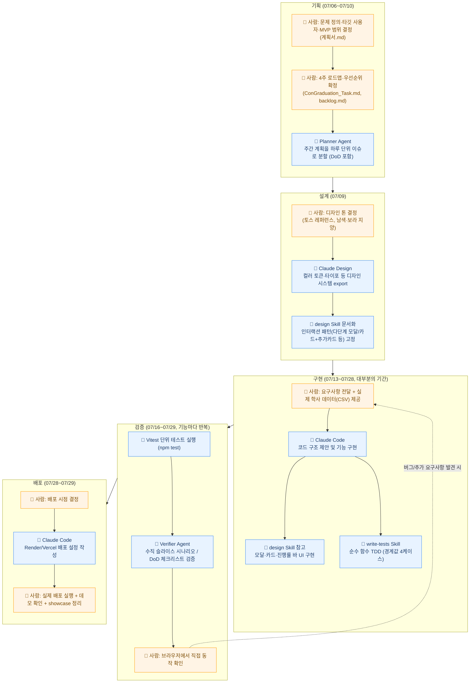

# ConGraduation 4주 Agent 협업 워크플로우 정리

---

## 1. 나만의 워크플로우

#### A. 기능 개발 워크플로우 (가장 많이 반복됨)

수강 바구니(`3dd4d1b`~`793ff82`), 트랙 선택 모달(`ebda8d0`~`2f58317`), 시뮬레이션(`0f4e75c`~`b419cc8`),
챗봇(`97c1812`~`a3c7935`) 등 거의 모든 `feat:` 커밋 묶음에서 같은 순서가 나타남.

| 항목 | 내용 |
|---|---|
| **입력** | 사용자가 전달한 요구사항(또는 backlog.md·ConGraduation_Task.md의 주차별 DoD), 기존 코드 상태, `design` / `write-tests` skill |
| **작업 순서** | 1. 요구사항 확인 → 2. 관련 코드·데이터 흐름 파악(Grep/Read로 기존 구조 확인) → 3. 구현(Claude Code — UI는 `design` skill 규칙 적용, 계산/판정 로직은 순수 함수로 분리) → 4. 순수 함수는 `write-tests` skill 절차대로 경계값 4케이스(미충족/경계값-1/정확히충족/초과이수) + 엣지케이스 테스트 작성 → `npm test` → 5. API 기능은 `verify-*.js` 스크립트 또는 verifier agent로 시나리오 검증 → 6. 브라우저에서 사용자가 직접 동작 확인 → 7. Conventional Commits 형식(`feat:`/`fix:`/`refactor:`/`test:`/`docs:`/`chore:`)으로 커밋 |
| **확인 기준** | ESLint 통과, `npm test` 전체 통과, verifier 체크리스트 ✅, 브라우저 수동 확인 완료 |
| **결과물** | 동작하는 기능 코드 + 테스트 파일(`*.test.js`) + 커밋 1개 |

#### B. 버그 수정 워크플로우

`2b0d118`(majorData 중복 키), `1d8409a`(태깅 버그), `eec65a6`, `76dc4e6`, `2f58317`(Supabase RLS),
`a3c7935`(챗봇 페이스 질문 오류) 등 `fix:` 커밋 다수에서 반복.

| 항목 | 내용 |
|---|---|
| **입력** | 사용자가 재현한 오류 증상 설명 (예: "챗봇이 학기당 페이스 질문에 현재 학점만 답함") |
| **작업 순서** | 1. 증상 재현 조건 파악 → 2. 코드 추적으로 원인을 file:line 단위로 특정 → 3. 수정 → 4. 회귀 테스트(`npm test`) 또는 verifier로 재검증 → 5. `fix:` 커밋 |
| **확인 기준** | 원인이 파일:라인 단위로 특정됨, 동일 시나리오 재현 안 됨, 기존 테스트 안 깨짐 |
| **결과물** | fix 커밋 + (필요 시) 회귀 테스트 추가 |

### 1-2. 문제가 생겼을 때 다시 확인할 단계

이 프로젝트는 이미 `verifier` agent에 이 프로토콜이 문서화되어 있어, 그대로 재사용:

- **A. API/서버 로직**: 서버가 켜져 있는지 확인(`curl http://localhost:4000/`) → 안 켜져 있으면 `node src/app.js` → `verify-*.js` 스크립트 실행(`verify-basket.js`가 템플릿) → ✅/❌ 확인. 배포 검증이 요청된 경우엔 Render 실제 주소(Vercel의 `VITE_API_URL` 값)로도 동일하게 재확인한다 (로컬만 통과하고 배포본은 환경변수 누락·CORS로 깨지는 경우가 있음)
- **B. 순수 계산/판정 함수**: "될 것 같다"로 넘기지 않고 `node -e` 또는 `npx vitest run <파일>`로 직접 실행 → 실패 시 경계값 케이스(미충족/-1/정확히충족/초과) 하나씩 재확인
- **C. 화면에서만 확인되는 기능**: state·조건문·데이터 흐름을 file:line 단위로 추적 → 코드 추적만으로 확정 안 되면 "🔍 수동 확인 필요"로 표시하고 사용자에게 정확히 어디를 눌러 무엇을 봐야 하는지 안내
- **공통 원칙**: 문서(backlog.md 등)와 실제 코드가 다르면 항상 실제 코드/실행 결과를 우선한다

---

## 2. Agent 협업 과정 시각화

기획 → 설계 → 구현 → 검증 → 배포 단계별로 실제 사용한 도구와, 사람이 결정한 것/AI가 수행한 것을 구분했습니다.

- 🙋 (주황): 사람이 직접 결정하거나 수행한 항목 — 문제 정의, 우선순위, 실데이터 제공, 디자인 톤 지정, 브라우저 최종 확인, 배포 실행
- 🤖 (파랑): AI(Claude Code/Agent/Skill)가 수행한 항목 — 이슈 분할, 디자인 시스템 적용, 코드 구현, 테스트 작성·실행, 시나리오 검증, 배포 설정 작성
- 검증 단계 이후 점선 화살표는 실제로 버그 수정(`fix:`) 커밋이 구현 단계로 되돌아가는 흐름이 반복됐음을 반영 (예: 대시보드 완성 후 `eec65a6`, `76dc4e6` 등 버그 수정이 이어짐)
