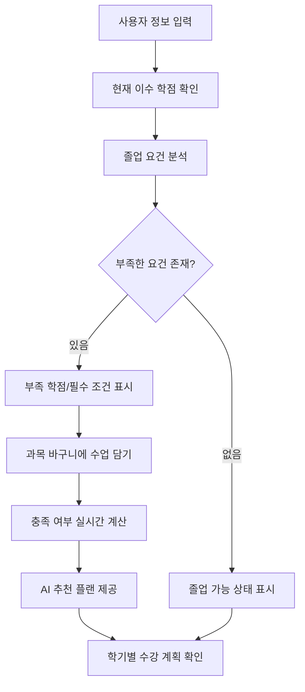
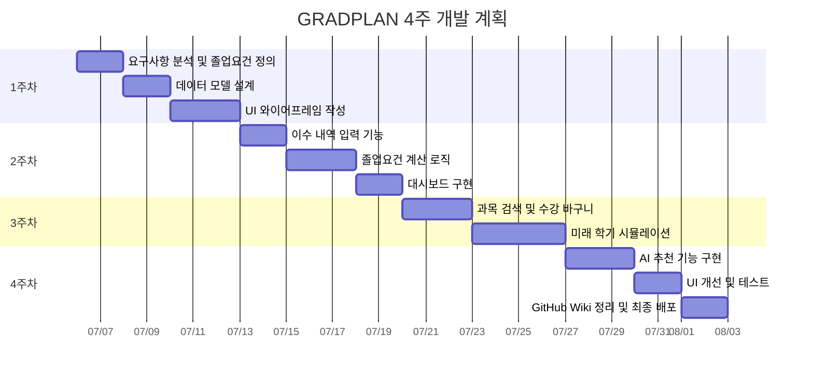

> 이 문서의 개발 일정(섹션 6)은 초기 계획입니다.
> 최신 일정은 ConGraduation_Task.md를 따릅니다.
# AI 기반 졸업 플래너 기획서

## 1. 문제 정의

우리 과(컴퓨터학부 글로벌SW융합전공) 학생들은 졸업 요건이 까다롭다.
단순히 총 이수학점만 확인하는 수준이 아니라 전공 및 교양 영역별 이수, 다중전공, 창업교과목, 현장실습, 해외대학 인정학점, 종합설계교과목 이수 여부 등 다양한 조건이 복합적으로 얽혀 있다.
현재 학생들은 수강신청에 앞서 학사 공지, 졸업요건표, 수강신청 내역, 성적표 등을 직접 비교해야 하며, 이 과정에서 다음과 같은 문제가 발생한다.

1. 졸업요건을 해석하기 어렵다.
2. 어떤 요건이 충족되었고 부족한지 한눈에 파악하기 어렵다.
3. 수강 예정 과목이 졸업요건에 어떻게 반영되는지 알기 어렵다.
4. 미래 학기 계획을 세워도 졸업 가능 여부를 즉시 확인하기 어렵다.
5. 졸업 직전에 부족 학점이나 필수 과목 미이수 사실을 발견할 위험이 있다.

따라서 **학생이 자신의 이수 현황과 미래 계획을 바탕으로 졸업 가능성을 쉽게 확인하고, AI의 도움을 받아 합리적인 수강 계획을 세울 수 있는 서비스**가 필요하다.

---

## 2. 타깃 사용자

### 주요 사용자

**복잡한 졸업요건**을 가진 대학교 학부 재학생

### 세부 사용자 유형

1. 졸업요건을 처음 확인하는 1, 2학년 학생
2. **복수전공, 부전공, 다중전공**을 이수 중인 학생
3. 졸업을 앞두고 부족 학점을 점검해야 하는 3, 4학년 학생
4. 현장실습, 해외대학 인정학점, 창업교과목 등 **특수한 세부 학점**을 보유한 학생
5. 다음 학기 수강신청 전에 **다양한 시간표를 시뮬레이션**하고 싶은 학생

---

## 3. 사용자 시나리오

| 시나리오 | 사용자 행동 | 시스템 동작 | 결과 |
|----------|------------|------------|------|
| 졸업요건 확인 | 이수 과목 입력 | 졸업요건 분석 | 부족/충족 항목 표시 |
| 수강계획 수립 | 과목 바구니 담기 | 학점 계산 + AI 추천 | 최적 수강계획 생성 |
| 미래 시뮬레이션 | 미래 학기 입력 | 졸업 가능 여부 계산 | 졸업 전략 제시 |

---

## 4. 핵심 기능

## Workflow

| 기능 | 설명 | 핵심 요소 |
|------|------|----------|
| **4.1 졸업요건 충족 현황 대시보드** | 현재 이수 내역을 분석하여 졸업요건 충족 상태를 시각화 | 총 이수학점, 전공·교양 충족 여부, 다중전공, 창업교과목, 현장실습, 해외학점, 종합설계 |
| **4.2 과목 수강 바구니** | 수강 예정 과목을 담아 졸업요건 반영 결과를 미리 확인 | 과목 검색, 추가·삭제, 인정 영역 표시, 충족 결과 미리보기 |
| **4.3 부족한 학점 자동 계산** | 졸업요건과 현재 이수 현황을 비교하여 부족한 조건을 계산 | 부족 학점, 부족 영역, 미이수 과목 자동 계산 |
| **4.4 AI 기반 수강 계획 추천** | 현재 상태와 졸업요건을 기반으로 AI가 최적의 수강 계획 제안 | 부족 요건, 남은 학기, 선수과목, 개설 여부, 관심 분야 반영 |
| **4.5 미래 학기 계획 시뮬레이션** | 여러 학기의 수강 계획을 입력하여 졸업 가능 여부 예측 | 학기별 계획, 누적 학점 계산, 졸업 가능 여부, 대안 추천 |

---

## 5. MVP 범위

초기 MVP에서는 모든 졸업요건을 완벽하게 자동화하기보다, 핵심적인 졸업 판단 흐름을 검증하는 데 집중한다.

### 포함 범위

- 본교 컴퓨터학부 단일 전공 기준 졸업요건 입력
- 사용자의 이수 과목 수동 입력
- 졸업요건 충족 현황 대시보드
- 전공, 교양, 총 학점 부족분 계산
- 과목 수강 바구니
- 미래 학기 계획 시뮬레이션
- 간단한 AI 기반 수강 추천

### 제외 범위

- 학사 시스템 자동 연동
- 모든 학과 및 모든 입학 연도 지원
- 복잡한 예외 규정 완전 자동 처리
- 실시간 수강신청 시스템 연동
- 과목 개설 여부 자동 크롤링
- 성적표 PDF 자동 분석

---

## 6. 4주 개발 계획

---

## 7. Agent 활용 계획

AI Agent를 활용하여 **수강 계획 추천** 및 **사용자 질의응답**을 지원한다

### 7.2 수강 계획 추천 Agent

역할:

- 부족한 졸업요건을 기반으로 추천 과목을 제안한다.
- 남은 학기 수를 고려해 학기별 수강 계획을 생성한다.
- 과도한 학점 부담이 생기지 않도록 조정한다.

활용 예시:

- “2학기 안에 졸업하려면 어떤 과목을 들어야 해?”
- “전공 선택 학점을 채우기 위한 추천 과목을 알려줘.”

### 7.3 시뮬레이션 Agent

역할:

- 사용자가 입력한 미래 학기 계획을 분석한다.
- 계획대로 수강했을 때 졸업 가능 여부를 판단한다.
- 문제가 있을 경우 대안을 제안한다.

활용 예시:

- “이 계획대로 들으면 졸업 가능해?”
- “다음 학기에 15학점만 들어도 졸업할 수 있어?”

---

## 8. 기대 효과

### 사용자 측면

- 졸업 가능 여부를 빠르게 확인할 수 있다.
- 부족한 학점과 과목을 명확히 파악할 수 있다.
- 수강신청 전에 더 안정적인 계획을 세울 수 있다.
- 졸업 직전 요건 미충족으로 인한 위험을 줄일 수 있다.
- 복잡한 졸업요건을 쉽게 이해할 수 있다.

### 학교 및 학과 측면

- 졸업요건 관련 반복 상담 부담을 줄일 수 있다.
- 학생들의 졸업 계획 수립을 체계적으로 지원할 수 있다.
- 졸업요건 안내의 접근성을 높일 수 있다.
- **데이터 기반 학사 지원 서비스**로 확장할 수 있다.

### 서비스 확장 측면

- 다른 학과의 졸업요건으로 확장 가능하다.
- 복수전공, 부전공, 교직 이수 등 복잡한 요건으로 확장 가능하다.
- 학사 시스템 연동을 통해 자동화 수준을 높일 수 있다.
- AI 기반 학업 상담 서비스로 발전할 수 있다.

## 9. 프로토타입 결과

[🔗**프로토타입**](https://github.com/zlnzzaro/hub/blob/N049_%EA%B9%80%EC%9C%A0%EC%A7%84/docs/GRADPLAN_Prototype.html)
