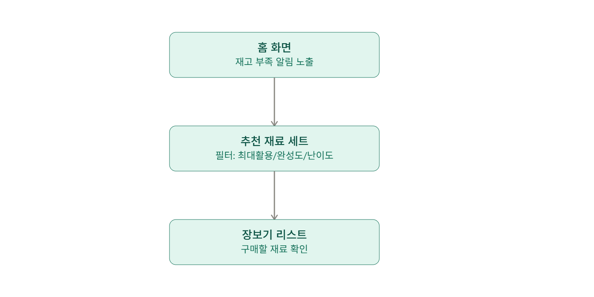
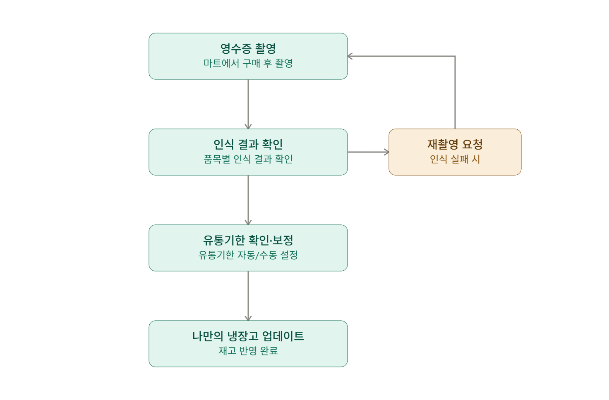
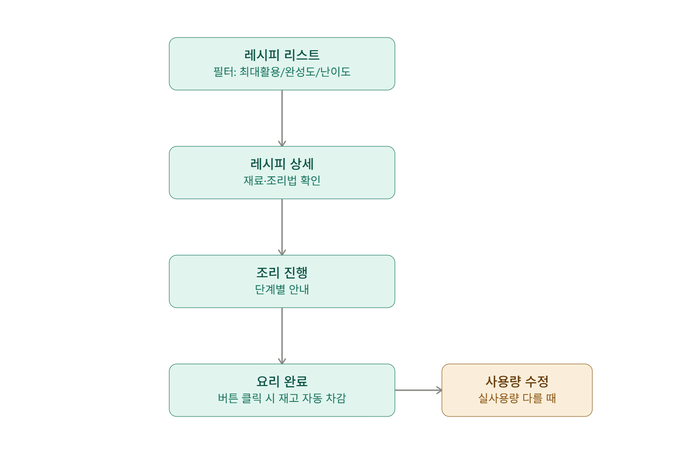

# 자취생 냉장고 레시피 앱 기획서

## 페르소나

- **이름**: 김상진
- **나이**: 23살
- **소속**: 대학교 2학년 재학중 (군복학)
- **취미**: 게임(롤)

**겪는 문제점**: 자취를 시작하였는데, 요리와 담을 쌓고 살아왔던 터라 집안일은 물론 식사도 제대로 갖추지 못하고 라면이나 간장계란밥 정도의 식사만 갖추고 있음. 몇 주간 식사를 제대로 하지 못해 어느 순간부터 배달을 하거나 외식을 하는 경우가 잦아졌고, 알바를 하고 있음에도 지출을 따라가지 못하고 있는 상태. 또한 요리를 하자니 어떤 식자재를 사야 하는지, 야채값의 평균 가격대도 잘 모르고 있기에 마트에 가면 무엇을 사야 할지 막상 막막해져서 라면이나 밀키트 정도만 사고 집으로 돌아감.

## 문제 정의

- 자취하는 대학생이, 요리 초보라 어떤 재료로 어떤 요리를 할 수 있는지 몰라 입문이 어려움.
  - → 쉬운 요리 추천하는 리스트 제작 (초보자 / 중급자 / 상급자별로)
- 평균적인 채소값에 대한 지식이 전무하기에 일일이 가격 비교를 위해 인터넷 검색에 불편함을 느끼고 있음.
  - → 매일마다 인터넷에서 채소값 가져와서 비교.
- 어떤 요리를 먹고 싶은데 이후 남은 재료들을 소진하기에 막막하고, 그 재료를 활용한 다른 요리를 만들려면 다시 다른 재료를 사야 하는 불편함에 채소 사는 것에 대한 걱정이 있음.
  - → 최소한의 재료 구매로 최대한 다양한 요리를 만들 수 있는 조합을 추천. / 냉장고에 채소가 남아있다면 이 채소를 사용해서 추가 구매 리스트 적용.
- 냉장고에 어떤 재료들이 정확히 있는지 기억해내기 어려움.
  - → 휴대폰으로 내 냉장고 내의 식자재를 한눈에 볼 수 있게 해줌 / 부족하면 더 사는 것을 추천하기도 하고, 영수증을 찍으면 알아서 냉장고를 자동으로 채워줌.
- 결국 남는 재료는 1인 가구라 재료 소진 속도가 느려 유통기한을 놓치는 상황에서 불편을 겪는다.
  - → 신선식품 보관법 팁 정리 (나만의 냉장고 항목의 재료를 누르면 재료별 요리에서의 주요 역할 한줄 설명과 보관법 팁이 적혀있음.)

## 사용자 시나리오

1. 냉장고에 재료가 부족하여 장을 보러 간다.
2. 장보기 전, 앱에서 추천 재료 세트를 확인한다.
   - 필터: 재료 최대활용 / 100% 완성(완성도를 낮추면 핵심 재료를 제외한 재료들을 제외해서 필요한 재료 정리) / 난이도
3. 재료를 구매하고 영수증을 촬영해 "나만의 냉장고"에 재고를 등록한다.
   - 인식 실패 또는 일부 품목만 인식 시 재촬영 요청
   - 신선식품은 구매일 기준 재료별 평균 유통기한 자동 설정(계절별 상이), 가공식품은 사용자가 선택적으로 입력
4. 냉장고 재고 기반 레시피 리스트를 필터(재료 최대활용 / 100% 완성 가능 / 초보자 난이도)로 골라 요리를 선택한다.
5. 조리 후 레시피 하단 "요리 완료" 버튼을 누르면 레시피 기준으로 재고가 자동 차감된다.
   - 실제 사용량이 다르면 레시피 옆 "사용량 수정" 버튼으로 보정 가능
   - 재료 단위는 실생활 단위 사용 (예: 파 한단/반단, 양파 한쪽/반쪽/1·4쪽)

## 핵심 기능 (MVP, 4개)

> 필수성 기준(이게 없으면 서비스가 안 돌아가나) — 재고를 보고, 채우고, 활용하고, 다시 줄어드는 루프가 끊기지 않는 최소 단위.

1. **나만의 냉장고 (재고관리)** — 다른 모든 기능이 동작하는 기반. 실생활 단위 지원
2. **영수증 촬영 인식** — 냉장고에 재고를 채우는 유일한 입력 수단
3. **레시피 리스트 & 필터** — "재고로 뭘 해먹지"를 풀어주는 지점, 요리 초보 입문 문제의 핵심 해결책
4. **요리완료 재고차감** — 조리 후 냉장고로 재고가 다시 반영되는 연결고리

## 이후 확장 기능 (2차 우선순위)

- 추천 재료 세트 (장보기 전 단계)
- 레시피 상세 & 조리모드 (단계별 안내)
- 유통기한 임박 알림 (냉장고 리스트 내 빨간 글자 표시 + 푸시 알람)
- 일주일 식단 루틴 추천 (레시피 결과가 아예 없을 때 대체 화면)
- 식자재별 가격 실시간

## 화면 흐름

1. **장보기 준비**: 홈 화면(재고 부족 알림) → 추천 재료 세트(필터) → 장보기 리스트
2. **영수증 등록 → 재고 반영**: 영수증 촬영 → 인식 결과 확인(실패 시 재촬영) → 유통기한 확인·보정 → 나만의 냉장고 업데이트
3. **레시피 선택 → 조리 완료**: 레시피 리스트(필터) → 레시피 상세 → 조리 진행 → 식사 완료 버튼 → 재고 자동 차감

> 각 흐름의 다이어그램은 기획 대화에서 시각화 자료로 별도 확인

### 1. 장보기 준비 흐름



### 2. 영수증 등록 ~ 재고 반영

인식 실패 시 재촬영으로 돌아가는 분기 옆으로 표시.



### 3. 레시피 선택 ~ 조리 완료

요리 완료 후 실사용량이 다를 때 옆에서 수정하는 분기 함께 표시.



## 화면 목록 (IA)

```
홈
├─ 장보기 준비 [2차 확장]
│   ├─ 추천 재료 세트 (필터: 최대활용/100%완성/난이도)
│   └─ 장보기 리스트
├─ 나만의 냉장고 (재고관리) [MVP]
│   ├─ 영수증 촬영
│   ├─ 인식 결과 확인 / 재촬영
│   └─ 유통기한 확인·보정
├─ 레시피 [MVP + 확장 혼재]
│   ├─ 레시피 리스트 & 필터 [MVP]
│   ├─ 레시피 상세 & 조리모드 [2차 확장]
│   └─ 요리 완료 → 재고 자동 차감 [MVP]
└─ 기타 [2차 확장]
    ├─ 유통기한 임박 알림
    ├─ 일주일 식단 루틴 추천
    └─ 식자재별 가격 실시간
```

## 작업 분해

> 범례: `[x]` 완료 · `[/]` 부분 완료(mock 또는 골격 수준) · `[ ]` 미완
> 마지막 업데이트: 2026-07-10

### 1번 - 나만의 냉장고 (재고관리)

- [x] 재고 아이템 데이터 모델 설계 (재료명, 수량, 단위, 유통기한, 구매일)
  - `ingredients.js` 마스터(9종) + `initialFridge.js` 재고 상태 분리 완료
  - `store.js` `enrichFridgeItem()`이 두 소스를 합산해 API 응답 생성
- [x] 실생활 단위 지원 (파 한단/반단, 양파 한쪽/반쪽/1/4쪽 등) 입력 컴포넌트
  - `ingredients.js` `defaultUnitLabels` 배열로 재료별 단위 정의
  - `AddItem.jsx` 단위 칩 UI 구현 — 단, 현재 칩은 하드코딩(마스터 연동은 후속 과제)
- [x] 나만의 냉장고 화면 — 재고 목록 뷰
  - `Fridge.jsx`: 신선식품(임박/일반)/가공식품 섹션 분리 렌더링
  - `IngredientSheet.jsx`: 재료 상세 바텀시트(역할·보관팁·삭제)
- [x] 재고 수동 추가/수정/삭제 기능
  - 추가: `AddItem.jsx` → `POST /api/fridge`
  - 수정: `IngredientSheet.jsx` "수량·기한 수정" 버튼 (UI 골격, `PATCH /api/fridge/:id`)
  - 삭제: `IngredientSheet.jsx` "삭제" → `DELETE /api/fridge/:id`
- [x] 재고 부족 알림 로직 (홈 화면 노출)
  - `Home.jsx`: 유통기한 임박 재료 목록 + 건수 통계 표시
  - `ExpiryAlerts.jsx`: 임박 재료 전체 목록 + 관련 레시피 연결
  - ※ "재고 부족(수량 부족)" 알림은 현재 미구현 → 2차 확장 고려

### 2번 - 영수증 촬영 인식

- [x] 카메라 촬영 UI
  - `ReceiptCamera.jsx`: 뷰파인더 UI + 셔터 버튼 + 로딩 상태 처리
- [/] 영수증 OCR 연동 (품목명·수량 추출)
  - `POST /api/receipts` 엔드포인트 연결 완료
  - **현재는 하드코딩 데모 데이터 반환** — 실제 외부 OCR API(Naver Clova 등) 연동 필요
  - `receiptsController.js`에 "실제로는 여기서 외부 OCR API 호출" 주석 위치 확보
- [x] 인식 결과 확인 화면 (품목별 매칭 표시)
  - `ReceiptResult.jsx`: ✅/⚠️ 매칭 여부 + 신선/가공 뱃지 + 재촬영·반영 버튼
- [x] 인식 실패/일부 인식 시 재촬영 요청 플로우
  - `status: 'partial'`, `matched: false` 항목 처리
  - "📷 재촬영" 버튼 → `back()` → `ReceiptCamera`로 복귀
- [x] 신선식품 유통기한 자동 설정 (재료별·계절별 평균값 테이블)
  - `ingredients.js` `avgShelfLifeDays: { spring, summer, fall, winter }` 구현
  - `calcExpiryDate()` 헬퍼: 재료 ID + 구매일 → 계절 판단 → 유통기한 자동 계산
- [x] 가공식품 유통기한 수동 입력 UI
  - `ExpiryCheck.jsx`: 신선식품 자동 설정 + 가공식품 직접 입력 섹션 분리
- [x] 인식 결과 → 나만의 냉장고 재고 반영 로직
  - `POST /api/receipts/:id/confirm` → `store.js` `confirmReceipt()`
  - 기존 재료 수량 초기화 / 신규 재료(spam 포함) 마스터 기반 일반 생성

### 3번 - 레시피 리스트 & 필터

- [x] 레시피 데이터셋 구축 (필요재료, 난이도 태깅)
  - `recipes.js`: 9개 레시피 (초보 6, 중급 3), 재료·추가재료·조리스텝 포함
  - 각 재료에 `id`(마스터 연동) / `untracked`(양념류 추적 제외) 구분
- [x] 냉장고 재고 기반 매칭 알고리즘 (재료 최대활용 / 100% 완성 가능)
  - `fridgeLogic.js` `ingHave()` + `store.js` `listRecipes()`
  - `filter=all` (전체) / `filter=full` (바로 가능) / `filter=few` (적은 재료)
- [x] 난이도 필터 (초보자/중급자/상급자)
  - `level=beginner|mid|high` 쿼리 파라미터 + `store.js` 필터링 로직
- [x] 레시피 리스트 화면 UI
  - `RecipeList.jsx`: 필터 칩 + 레시피 카드 목록 + 재료 보유 현황 표시
  - 결과 없을 때 "일주일 식단 루틴" 유도 화면 포함

### 4번 - 요리완료 재고차감

- [x] 레시피별 재료 사용량 데이터 연결
  - `recipes.js` 각 레시피 `ingredients[].id` → `fridge_items` 매핑
  - `fridgeLogic.js` `buildDeductionState()`: 차감 미리보기 목록 계산
- [x] "요리 완료" 버튼 → 재고 자동 차감 로직
  - `CookDone.jsx` → `AppContext.jsx` `finishCooking()` → `POST /api/recipes/:id/cook-done`
  - `store.js` `cookDone()`: 다건 `fridge_items` 레벨 차감 (단일 트랜잭션)
- [x] "사용량 수정" 버튼 → 실사용량 보정 UI
  - `CookDone.jsx` ✏️ 수정 모드: `−/＋` 스텝퍼로 재료별 사용 레벨 조절
  - `AppContext.jsx` `adjustDeduction()` + `buildDeductionState()`
- [x] 차감 후 나만의 냉장고 재고 갱신 반영
  - `finishCooking()` 완료 후 `refreshFridge()` 호출 → `fridge` 상태 자동 갱신
---

## 개발할 TASK 순서

> 현재 파일 재분석 기준: 2026-07-10  
> 확인 범위: `frontend/src`, `backend/src`, `에이전트 실습 관련 자료 파일/기획자료/기획서.md`, `에이전트 실습 관련 자료 파일/기획자료/docs/api-design.md`  
> 현재 상태 요약: 프론트 빌드와 백엔드 문법 검사는 통과한다. MVP 주요 흐름은 구현되어 있으나, OCR/가격/DB/테스트/배포 안정화는 아직 데모 또는 인메모리 중심이다.

### TASK 0. 현재 코드 안정화와 문서 정리

- [x] 프론트 린트 경고 정리
  - `frontend/src/api/mockServer.js`의 미사용 import 제거
  - 검증 명령: `frontend`에서 `npm.cmd run lint`
- [ ] 깨져 보이는 한글 주석/문서 인코딩 점검
  - 대상: `CLAUDE.md`, `기획서.md`, `api-design.md`, 주요 JS 주석
  - 목표: 실제 앱 표시 문구와 개발 문서가 UTF-8 기준으로 정상 표시되는지 확인
  - 결과물: 깨진 문서/주석 복구 또는 별도 `docs/dev-tasks.md`로 정리
- [ ] 현재 API 계약표 최신화
  - 대상: `docs/api-design.md`
  - 반영할 내용: `/api/shopping/sets?match=&level=`, `/api/shopping/list?setId=`, `/api/fridge/alerts`, `/api/meal-plan/*`, `/api/prices`

### TASK 1. 테스트 기반 만들기

- [ ] 백엔드 테스트 러너 추가
  - 후보: Node 내장 `node:test` 또는 Vitest
  - 우선 테스트 대상: `store.js`의 `formatDday`, `calcExpiryDate`, `listRecipes`, `cookDone`, `confirmReceipt`
- [ ] API 통합 테스트 추가
  - 대상: Express `app.js`
  - 확인 항목: 상태 코드, 400/404 에러 응답, 냉장고 CRUD, 영수증 확정, 조리 완료 차감
- [ ] 프론트 핵심 흐름 스모크 테스트 추가
  - 대상 흐름: 홈 진입 → 냉장고 조회 → 레시피 상세 → 조리 완료 → 냉장고 갱신
  - 목표: 이후 기능 확장 시 MVP 루프가 깨지지 않게 보호

### TASK 2. 인메모리 저장소를 실제 DB 구조로 이전

- [ ] DB 스키마 확정
  - 기준: `api-design.md`의 `ingredients`, `fridge_items`, `recipes`, `recipe_ingredients`, `recipe_steps`, `receipts`, `receipt_items`
  - 추가 검토: `users` 또는 단일 사용자 모드 유지 여부
- [ ] Supabase/PostgreSQL 연결 계층 추가
  - 현재 `backend/src/store.js` 함수 이름은 유지
  - 내부 구현만 인메모리 객체에서 DB 쿼리로 교체
- [ ] 초기 시드 데이터 작성
  - 대상: `ingredients.js`, `initialFridge.js`, `recipes.js`, `mealPrices.js`
  - 목표: 앱 재시작 후에도 냉장고 상태와 영수증 반영 내역 유지
- [ ] 트랜잭션 처리
  - 대상: `confirmReceipt`, `cookDone`
  - 목표: 여러 재료 갱신 중 일부만 반영되는 상황 방지

### TASK 3. 영수증 OCR 실제 연동

- [ ] `POST /api/receipts`를 multipart 업로드로 변경
  - 현재: 고정 데모 데이터 반환
  - 변경: 이미지 파일 업로드 → OCR 요청 → 품목 후보 반환
- [ ] OCR 제공자 선택 및 어댑터 작성
  - 후보: Naver Clova OCR, Google Vision
  - 구현 방식: `backend/src/services/ocrService.js`로 분리
- [ ] OCR 텍스트와 재료 마스터 매칭 로직 개선
  - 대상: `ingredients.js`의 이름/별칭/카테고리
  - 기능: 오타, 단위, 브랜드명 제거 후 `matchedIngredientId` 추론
- [ ] 인식 실패/부분 인식 UX 보강
  - 현재: 실패 항목 표시와 재촬영 흐름 존재
  - 추가: 수동 매칭, 항목 삭제, 수량 수정

### TASK 4. 냉장고 입력/수정 UX 고도화

- [ ] 직접 추가 화면을 재료 마스터와 연결
  - 현재 과제: 단위 칩이 일부 하드코딩되어 있음
  - 목표: 선택한 재료의 `defaultUnitLabels`를 자동 표시
- [ ] 커스텀 재료 처리 정책 정리
  - 선택지: 임시 재료로 저장, 마스터 후보로 등록, 기존 재료 검색 우선
- [ ] 가공식품 유통기한/수량 입력 일관화
  - 대상: `AddItem.jsx`, `IngredientSheet.jsx`, `ExpiryCheck.jsx`
- [ ] 냉장고 부족 알림 추가
  - 현재: 유통기한 임박 중심
  - 추가: 자주 쓰는 기본 재료가 소진되었을 때 홈/냉장고에서 안내

### TASK 5. 추천 장보기 세트 고도화

- [ ] 추천 세트 계산 알고리즘 개선
  - 현재: `SHOPPING_SET_DEFS` 기반 고정 세트 + 냉장고 보유분 제외
  - 목표: 사용 가능한 레시피 조합을 동적으로 탐색
- [ ] 필터 의미 정교화
  - `maxVariety`: 최소 구매로 가능한 요리 수 최대화
  - `complete100`: 구매 후 100% 완성 가능한 요리만 구성
  - `level`: 초보/중급 난이도와 조리 시간까지 반영
- [ ] 장보기 목록 체크 상태 저장
  - 현재: 응답 생성 시 `checked: true`
  - 추가: 사용자가 체크한 상태 유지, 구매 완료 후 영수증/냉장고 반영과 연결
- [ ] 예상 비용 산정 근거 표시
  - 가격 데이터와 연결하여 “왜 이 금액인지” 설명 가능하게 구성

### TASK 6. 레시피/조리 흐름 품질 개선

- [ ] 레시피 데이터 확장
  - 목표: 초보 레시피 10개 이상, 중급 5개 이상
  - 각 레시피에 필수 재료, 선택 재료, 대체 재료, 조리 단계, 예상 비용 포함
- [ ] 대체 재료 추천
  - 예: 돼지고기 없을 때 스팸/두부/계란 기반 대체 레시피 제안
- [ ] 조리 완료 차감 검증 강화
  - 존재하지 않는 재료 id, 이미 소진된 재료, 가공식품 차감 정책 테스트
- [ ] 조리 모드 접근성 개선
  - 큰 버튼, 단계 진행 상태, 뒤로가기 시 현재 단계 유지 여부 검토

### TASK 7. 유통기한 알림 확장

- [ ] 홈 알림과 별도 알림 페이지의 기준 통일
  - 기준: D-0~D-2, 이미 지난 항목 D+ 표시
- [ ] 관련 레시피 추천 우선순위 개선
  - 임박 재료를 많이 쓰는 레시피, 부족 재료가 적은 레시피 우선
- [ ] 브라우저/모바일 알림 가능성 검토
  - 웹 푸시 또는 앱 내 알림 배너
  - 사용자 동의 흐름 필요

### TASK 8. 생필품/가격 정보 실제화

- [ ] 가격 데이터 출처 결정
  - 후보: 공공데이터, 마트 크롤링 불가 시 수동 업데이트 테이블
- [ ] `GET /api/prices`를 실제 데이터 소스로 분리
  - 현재: `store.js` 하드코딩
  - 변경: `price_snapshots` 또는 외부 API 캐시
- [ ] 가격 변동 표시 개선
  - 전일/전주 대비, 최저가/평균가, 구매 추천 여부
- [ ] 장보기 목록과 가격 정보 연결
  - 장보기 총액 계산이 실제 가격 테이블을 사용하도록 통합

### TASK 9. 배포/실행 파일 안정화

- [ ] 런처 실행 흐름 검증
  - 대상: `FridgeRecipeApp.exe`, `launcher/Program.cs`
  - 확인: Node.js 미설치, 포트 3001 사용 중, 빌드 실패, 서버 시작 실패 안내
- [ ] 프론트 정적 파일 제공 경로 검증
  - 대상: `backend/src/app.js`의 `express.static(frontend/dist)`
  - 확인: 새로고침, 잘못된 경로, API 404와 화면 404 구분
- [ ] 배포 패키지 구성
  - 포함: `backend`, `frontend/dist`, `node_modules` 포함 여부 정책, 실행 파일, 사용 안내
- [ ] 사용자용 실행 안내 문서 작성
  - 대상: `README.md` 또는 별도 `사용방법.md`
  - 내용: 더블클릭 실행, 창을 닫으면 서버 종료, 문제 해결

### TASK 10. 최종 점검과 발표/시연 준비

- [ ] 데모 시나리오 고정
  - 흐름: 냉장고 확인 → 장보기 추천 → 영수증 반영 → 레시피 선택 → 조리 완료 → 냉장고 차감
- [ ] 데모 데이터 리셋 기능 추가
  - 발표 전 항상 같은 상태로 시작할 수 있게 `/api/debug/reset` 또는 런처 옵션 제공
- [ ] 시연 중 오류 대비
  - OCR 실패 대체 데이터, API 연결 실패 메시지, 빌드된 정적 화면 백업
- [ ] 발표자료와 현재 앱 상태 동기화
  - 대상: `에이전트 실습 관련 자료 파일/발표자료`
  - 기능명, 화면명, 구현 범위가 실제 앱과 다르지 않게 정리

### 우선순위 요약

1. 테스트/문서/API 계약 정리
2. 실제 DB 이전
3. OCR 실제 연동
4. 냉장고 입력/수정 UX 보강
5. 추천 장보기 알고리즘 고도화
6. 레시피/조리 흐름 품질 개선
7. 유통기한 알림 확장
8. 가격 정보 실제화
9. 실행 파일/배포 안정화
10. 발표 시연 준비
