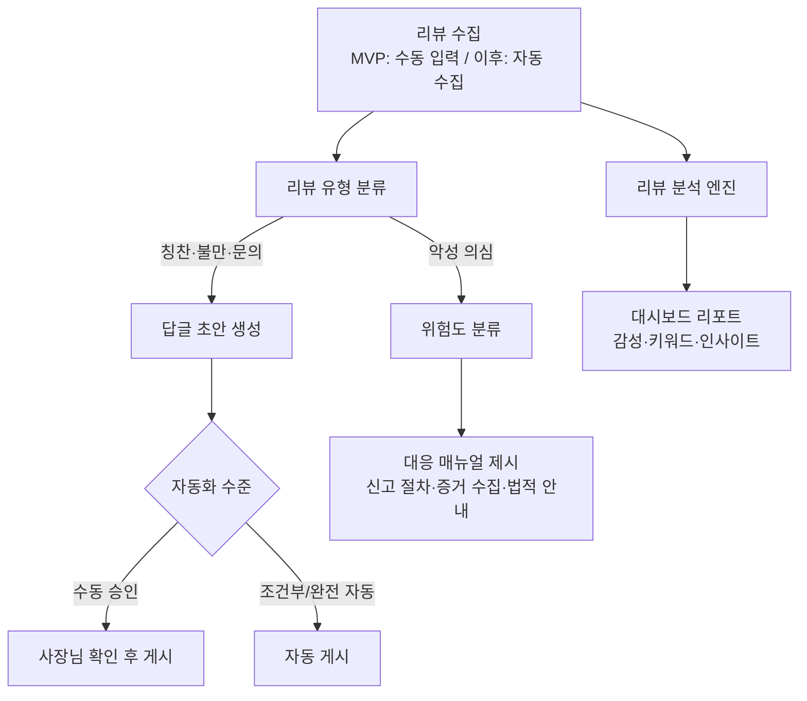

# 리뷰 관리 AI 에이전트 기획서 (초안)

> 소상공인을 위한 리뷰 자동 답글 · 분석 · 블랙컨슈머 대응 에이전트

---

## 1. 개요

### 1.1 문제 정의

- 소상공인(특히 배달 매장 사장님)은 매일 쏟아지는 리뷰에 일일이 답글을 달 시간이 부족하다.
- 리뷰는 매출에 직결되지만, 리뷰 데이터를 모아서 분석하고 개선점을 찾는 일은 사실상 불가능하다.
- 악성 리뷰·블랙컨슈머를 만났을 때 어떻게 대응해야 하는지(신고 절차, 법적 대응) 아는 사장님이 거의 없다.

### 1.2 목표

리뷰 답글 작성 → 리뷰 분석 → 악성 리뷰 대응까지, 리뷰 관리 전 과정을 대신해주는 AI 에이전트를 만든다.

### 1.3 타겟 사용자

- 1차: 배달의민족을 사용하는 외식업 소상공인
- 확장: 네이버 스마트플레이스, 쿠팡이츠, 요기요, 구글 리뷰 등 모든 리뷰 채널을 쓰는 소상공인

---

## 2. 핵심 기능

### 2.1 리뷰 답글 자동 생성

| 기능 | 설명 |
|---|---|
| 리뷰 유형 분류 | 칭찬 / 불만 / 문의 / 악성(블랙컨슈머 의심) 4가지로 자동 분류 |
| 매장 프로필(톤앤매너) | 사장님 말투, 인사말, 진행 중인 이벤트 등을 저장해 답글에 반영 |
| 유형별 답글 초안 생성 | 칭찬 → 감사 + 재방문 유도 / 불만 → 사과 + 개선 약속 / 문의 → 답변 / 악성 → 대응 매뉴얼 연계 |
| 자동화 수준 선택 | 게시 방식을 **사장님이 직접 선택** (아래 2.4 참고) |

### 2.2 리뷰 분석

| 기능 | 설명 |
|---|---|
| 감성 분석 | 긍정/부정/중립 비율과 기간별 추이 |
| 키워드·토픽 추출 | 맛 / 양 / 배달 / 포장 / 서비스 카테고리별, 메뉴별 언급 분석 |
| 기간별 리포트 | 주간·월간 요약 (별점 추이, 불만 급증 항목 등) |
| 개선 인사이트 | 예: "최근 2주간 '배달 지연' 관련 불만이 3배 증가했습니다" |

### 2.3 블랙컨슈머 대응

| 기능 | 설명 |
|---|---|
| 악성 리뷰 감지 | 욕설, 협박, 환불 강요, 허위 사실 등 패턴 감지 |
| 위험도 분류 | ① 단순 불만 → ② 정당한 클레임 → ③ 악성(갑질·협박·허위) 3단계 |
| 단계별 대응 매뉴얼 | 답글 작성 가이드 → 플랫폼 리뷰 신고/게시중단 요청 절차 → 증거 수집 체크리스트 → 법적 대응 안내 |
| 사례 아카이빙 | 대응 이력을 기록해 반복 악성 고객 추적 |

### 2.4 답글 자동화 수준 (사장님 선택)

사장님이 매장 설정에서 자동화 수준을 직접 선택한다.

| 수준 | 동작 |
|---|---|
| 수동 승인 | 에이전트는 초안까지만 작성, 사장님이 확인·수정 후 게시 |
| 조건부 자동 | 칭찬 등 안전한 유형은 자동 게시, 불만·악성은 승인 필요 |
| 완전 자동 | 모든 답글 자동 게시 (악성 리뷰는 예외적으로 항상 승인 필요) |

---

## 3. 서비스 흐름

1. **수집**: 리뷰가 에이전트로 들어온다 (MVP는 수동 입력, 이후 자동 수집).
2. **분류**: 리뷰 유형과 위험도를 자동 판별한다.
3. **대응**: 일반 리뷰는 답글 초안을 생성하고, 악성 리뷰는 대응 매뉴얼을 제시한다.
4. **게시**: 사장님이 설정한 자동화 수준에 따라 게시한다.
5. **분석**: 쌓인 리뷰를 분석해 대시보드에서 리포트와 인사이트를 제공한다.

---

## 4. 데이터 수집 전략

국내 리뷰 플랫폼은 공식 리뷰 API를 제공하지 않으므로 단계적으로 접근한다.

| 플랫폼 | 공식 API | 수집 방법 |
|---|---|---|
| 배달의민족 | ❌ | MVP: 수동 입력 → 이후: 스크래핑 API 중개 서비스(하이픈 등) 또는 자체 브라우저 자동화 |
| 쿠팡이츠 / 요기요 | ❌ | 배민과 동일한 방식으로 확장 |
| 네이버 스마트플레이스 | ❌ | 동일 |
| 구글 비즈니스 프로필 | ✅ | 공식 API로 리뷰 조회 + 답글 게시 가능 |

- 수집·게시 로직은 **플랫폼별 어댑터 모듈**로 분리해, 배민으로 시작하더라도 다른 채널 추가가 쉽도록 설계한다.
- 사장님 본인 계정으로 본인 매장 리뷰를 다루는 구조이므로 데이터 리스크는 상대적으로 낮다.

---

## 5. 인터페이스

- **웹 대시보드** (메인): 리뷰 목록, 답글 승인, 분석 리포트, 대응 매뉴얼을 한 화면에서 제공한다.
- **챗봇 알림** (추후): 신규 리뷰·악성 리뷰 발생 시 카카오톡/텔레그램 등 메신저로 푸시 알림을 보낸다.

---

## 6. 로드맵

| 단계 | 범위 |
|---|---|
| **Phase 1 (MVP)** | 리뷰 수동 입력 → 유형 분류 + 답글 초안 생성 + 기본 분석 + 블랙컨슈머 대응 매뉴얼, 웹 대시보드 |
| **Phase 2** | 배민 리뷰 자동 수집, 답글 게시 자동화(수준 선택), 정기 리포트, 챗봇 알림 |
| **Phase 3** | 네이버·쿠팡이츠·요기요·구글 등 멀티 플랫폼 확장 |

---

## 7. 리스크와 대응

| 리스크 | 대응 |
|---|---|
| 플랫폼 약관(스크래핑) 이슈 | MVP는 수동 입력으로 회피, 자동화 시 상용 중개 서비스 활용 검토 |
| 오답글 게시(브랜드 이미지 손상) | 자동화 수준을 사장님이 선택, 악성 리뷰는 항상 승인 필수 |
| 악성 리뷰 오탐(정당한 불만을 악성으로 분류) | 위험도 3단계 분류 + 최종 판단은 사장님이 수행 |
