# WeatherPilot 전체 아키텍처 — 화면 · 서버 · DB 데이터 흐름

날씨로 매출 하락을 예측해 마케팅 제안을 미리 만들고, 사장님은 검토·승인만 하는 구조.
**파랑 = 화면(React) · 주황 = 서버(Express) · 초록 = DB(Supabase) · 보라 = 외부 서비스**

```mermaid
%%{init: {"flowchart": {"nodeSpacing": 28, "rankSpacing": 42}}}%%
flowchart TB

  %% ================= 화면 =================
  subgraph FE["화면 · apps/web — React + Vite (Vercel)"]
    dash["① Dashboard<br/>오늘 날씨·진단·제안"]
    edit["② EditView<br/>문구·할인율 편집 + 법적 체크"]
    sent["③ SentView<br/>발송 결과·쿠폰 추적·SNS 복사"]
    client["api/client.ts<br/>fetch 래퍼 · MOCK_MODE"]
    dash --> edit --> sent
    dash -.-> client
    edit -.-> client
    sent -.-> client
  end

  %% ================= 서버 =================
  subgraph BE["서버 · apps/server — Express (Render)"]
    rweather["GET /weather/today"]
    rproposal["/proposal<br/>GET today · POST generate"]
    rcampaign["/campaigns/:id<br/>PATCH · send · tracking"]
    cron["크론 06:30 KST · 원설계<br/>하락 −20%↑만 발동 + 사장님 알림"]
    boot["서버 기동 잡 · 실운영 경로<br/>무료 플랜은 06:30에 절전 · 임계 없음"]
    pipe["agent 파이프라인<br/>날씨 앙상블 → 진단 → LLM"]
    quality["품질검사 — 생성 시<br/>가드레일 + 한국어 · 내부정보"]
    guard["가드레일 — 발송 시<br/>할인 ≤20% · 금지어"]
    legal["legal/filter — 서버 강제<br/>동의 · (광고) · 야간 차단"]
    rsales["/sales · /sales/csv<br/>일매출 입력 · CSV 업로드"]
    rredeem["POST /coupons/:code/redeem<br/>(매장 단말 모의)"]
  end

  %% ================= DB =================
  subgraph DB["DB · Supabase (PostgreSQL)"]
    stores[("stores<br/>매장·좌표·톤")]
    salesT[("daily_sales<br/>일매출+날씨")]
    campaigns[("campaigns<br/>제안·상태")]
    customers[("customers<br/>단골·동의")]
    coupons[("coupons<br/>코드·사용·주문액")]
  end

  %% ================= 외부 =================
  subgraph EXT["외부 서비스"]
    kma["기상청 단기예보"]
    owm["OpenWeatherMap"]
    groq["Groq LLM<br/>llama-3.3-70b"]
    solapi["Solapi 문자<br/>본인 번호만 실발송"]
    ig["Instagram Graph API<br/>본인 계정 게시 · 실패 시 복사 폴백"]
  end

  %% ---- 화면 → 서버 ----
  client -- "날씨" --> rweather
  client -- "제안 조회" --> rproposal
  client -- "승인·발송·추적 폴링" --> rcampaign

  %% ---- 서버 내부 ----
  rweather --> pipe
  rproposal --> pipe
  cron --> pipe
  boot --> pipe
  pipe -- "채택 판정" --> quality
  quality -. "위반 시 1회 재생성 → 재실패면 템플릿 폴백" .-> pipe
  rcampaign -. "발송 전 재검증(사람 편집물이라 더 느슨)" .-> guard
  rcampaign -- "광고 판정" --> legal

  %% ---- 서버 → DB ----
  pipe -- "매장 조회" --> stores
  pipe -- "매출 이력 → 진단" --> salesT
  pipe -- "draft 저장" --> campaigns
  rcampaign -- "상태·문구 갱신" --> campaigns
  legal -- "동의 단골 필터" --> customers
  rcampaign -- "쿠폰 발급 · 사용 집계" --> coupons
  rsales -- "일매출 upsert" --> salesT
  rredeem -- "사용·주문액 기록" --> coupons

  %% ---- 학습 고리 ----
  campaigns -. "발송한 날(status=sent)은 다음 진단의 기준선에서 제외" .-> pipe

  %% ---- 서버 → 외부 ----
  pipe -- "예보" --> kma
  pipe --> owm
  pipe -- "제안 생성" --> groq
  cron -- "사장님 알림" --> solapi
  rcampaign -- "(광고) 문자+쿠폰코드" --> solapi
  rcampaign -- "SNS 캡션 게시" --> ig

  %% ---- 배치 보정 (보이지 않는 링크) ----
  rproposal ~~~ rsales
  rcampaign ~~~ rredeem
  stores ~~~ kma
  salesT ~~~ owm
  campaigns ~~~ groq
  customers ~~~ solapi
  coupons ~~~ ig

  %% ---- 스타일 ----
  classDef fe fill:#dbeafe,stroke:#2563eb,color:#0f172a;
  classDef be fill:#fef3c7,stroke:#d97706,color:#1c1917;
  classDef db fill:#dcfce7,stroke:#16a34a,color:#052e16;
  classDef ext fill:#f3e8ff,stroke:#9333ea,color:#2e1065;
  class dash,edit,sent,client fe;
  class rweather,rproposal,rcampaign,rsales,rredeem,cron,boot,pipe,quality,guard,legal be;
  class stores,salesT,campaigns,customers,coupons db;
  class kma,owm,groq,solapi,ig ext;
```

## 데이터가 흐르는 5가지 경로

1. **자동 제안** — 트리거가 둘이다. **크론(06:30 KST)** 은 원설계로, `stores`·`daily_sales`를 읽어 진단하고 기상청+OpenWeatherMap 앙상블로 오늘 날씨를 예측한 뒤, 예상 하락이 −20% 이상일 때만 Groq로 제안을 생성해 `campaigns`에 draft 저장 + 사장님 알림 문자(Solapi, 키 없으면 dry-run)를 보낸다. 다만 무료 플랜(Render free)은 06:30에 서버가 절전이라 실제로는 못 돈다 — 그래서 **서버 기동 잡(`runBootProposalJob`)** 이 실운영 경로다. 켤 때마다 임계 판정 없이 제안을 만들고 문자는 보내지 않으며, 사장님이 손댄 캠페인(`draft` 아님)·날씨 무변화·소스 감소 세 경우엔 덮어쓰지 않는다.
2. **생성물 자기검사** — LLM 출력은 `checkProposalQuality`(가드레일 + 한국어 전용 + 내부정보 노출 금지)를 통과해야 채택된다. 위반이면 1회 재생성하고, 재실패 시 템플릿 폴백으로 내려간다 — 그래서 화면에는 **항상 유효한 제안**이 남는다.
3. **검토 → 발송** — 화면이 `GET /proposal/today`로 제안을 띄우고, 사장님이 문구·할인율을 수정(`PATCH`) 후 발송(`POST /send`). 서버가 가드레일 재검증 → 법적 필터(수신동의·(광고)·야간 차단) → 동의 단골 수만큼 쿠폰 발급 → Solapi로 문자 발송(실발송은 본인 번호 1건). `instagram` 채널이면 서버가 캡션을 만들어 Instagram Graph API로 **본인 계정 게시**를 시도하고, 토큰 미설정·실패 시 화면의 "문구 복사" 폴백으로 강등한다(타인 계정은 App Review가 필요해 모의). 참고로 `dangol`(단골 문자)이 채널에 없으면 광고 문자가 아니므로 법적 필터를 아예 타지 않는다.
4. **효과 추적 → 진단 되먹임** — 매장 단말(모의)이 `POST /coupons/:code/redeem`으로 쿠폰 사용을 기록하면, SentView가 `GET /tracking` 폴링으로 사용 인원·귀속 매출을 누적 집계해 표시. 그리고 발송한 날(`status='sent'`)은 다음 진단에서 **기준선에서 빠진다** — 캠페인 효과가 '평상시'에 섞이면 "비 오는 날 −22%"가 −19%로 흐려져 판정이 뒤집히기 때문. 이게 도식의 학습 고리다.
5. **매출 입력** — POS 연동 대신 `POST /sales`(수동)·`/sales/csv`(업로드)로 `daily_sales`를 채움 — 이게 진단의 원천 데이터.

> **MOCK_MODE**: `VITE_MOCK_MODE`가 `"false"`가 아니면 화면은 서버 호출 없이 `mocks/scenarios` 데이터로만 동작 (발표장 네트워크 보험). 실연동 시에만 위 화살표대로 흐른다.
