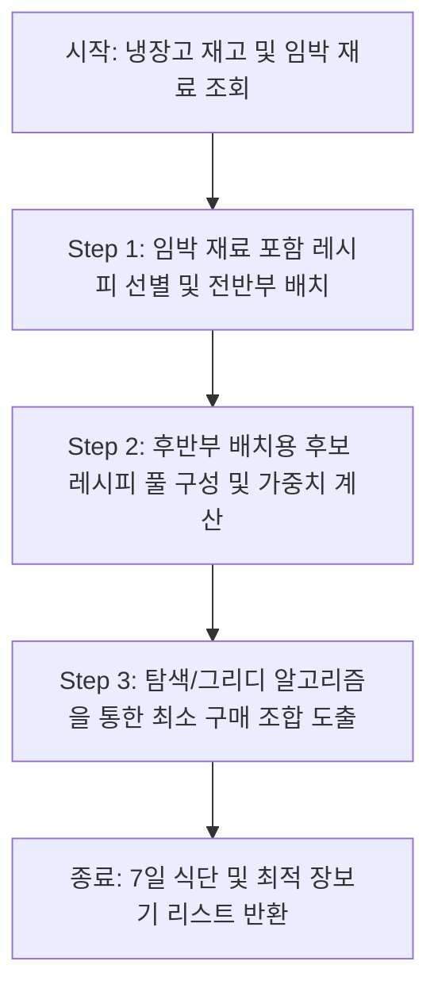

# 최소 추가 구매 식단 추천 알고리즘 설계안 📅

본 문서는 사용자의 냉장고 재고를 최대한 활용하고, 유통기한이 짧은 임박 재료를 최우선으로 소진하면서, **새로 구매해야 하는 재료의 '품목 종류(유니크 수)'를 최소화**하여 7일치 식단을 구성하는 알고리즘의 설계안입니다.

---

## 1. 알고리즘 설계의 배경 및 목표

기존 알고리즘은 단순히 각 요리별 재료 보유율(have/total %)이 높은 요리들을 추천하거나 랜덤 조합을 만들었습니다. 그러나 이는 다음과 같은 실생활의 비효율을 낳습니다:
- **개별 요리 보유율은 높지만**, 각각 다른 재료가 1개씩 부족하면 마트에서 7가지 품목을 사야 함.
- **개별 보유율은 조금 낮아도**, 부족한 재료가 '대파' 하나로 겹치면 마트에서 대파 1단만 사서 7일치 식단을 모두 해결 가능 (식자재 공유 효율 극대화).
- **유통기한 임박 재료**가 식단 후반부(토, 일요일)에 배치되면 조리 전 부패할 위험이 큼.

따라서 **"임박 재료 전반부 배치 + 추가 구매 종류 최소화"**를 골자로 하는 알고리즘을 재설계합니다.

---

## 2. 알고리즘 핵심 요구사항

1. **임박 재료 최우선 소진 (Imminent First)**
   - 냉장고 재고 중 유통기한이 `D-2` 이하로 남은 임박 재료가 들어간 레시피를 식단의 **월, 화, 수(전반부)**에 우선 강제 배치합니다.
2. **냉장고 재료 최대 이용 (Fridge Maximization)**
   - 이미 냉장고에 보유 중인 재료를 활용하는 레시피에 가산점을 부여합니다.
3. **추가 구매 품목 최소화 (Set Cover Optimization)**
   - 새로 구매해야 하는 재료들의 유니크한 종류 개수(예: 3종류 vs 7종류)를 세어, 가장 적은 종류만 사도 7일치 식단이 채워지는 조합을 찾습니다.

---

## 3. 알고리즘 동작 흐름 (3단계)

### Step 1. 임박 재료 기반 전반부 배치 (1~3일차)
- **대상**: 유통기한이 가장 짧은 재료들 (D-Day 오름차순 정렬)
- **동작**:
  1. 임박 재료들을 포함하는 레시피들을 DB에서 필터링합니다.
  2. 선별된 레시피들을 식단의 **1일차, 2일차, 3일차**에 배치합니다.
  3. 만약 임박 재료가 너무 많다면 임박 재료 포함 개수가 많은 레시피 순으로 우선 배치합니다.

### Step 2. 후보군 필터링 및 가중치 계산 (4~7일차)
- **동작**:
  - 남은 4~7일차(후반부)에 들어갈 후보 레시피 목록을 가져옵니다.
  - 각 레시피마다 다음 기준으로 가중치 점수를 부여합니다.
    - **가산점**: 냉장고에 이미 가지고 있는 재료가 많을수록 점수 증가
    - **감산점**: 조미료(`untracked`)를 제외하고 새로 구매해야 하는 재료 종류가 많을수록 점수 감소

### Step 3. 최소 종류 구매 조합 탐색 (Core Optimization)
7일치 식단(총 7개 요리)을 완성하기 위해 **상태 공간 탐색(Backtracking) 및 그리디(Greedy) 기법**을 혼합하여 최적의 조합을 찾습니다.

1. **상태 정의**:
   - 현재 선택된 레시피 세트 $R = \{r_1, r_2, \dots, r_7\}$
   - 이 세트를 완성하기 위해 필요한 총 추가 구매 재료 집합 $P = \bigcup \text{Missing}(r_i)$
2. **평가 함수 (Cost Function)**:
   - 최소화 타겟: $\text{Cost}(R) = |P| \times w_1 + \text{TotalCost}(P) \times w_2$
   - $|P|$: 새로 사야 하는 재료의 **유니크 품목 종류 수** (이 값이 작을수록 장보기 종류가 줄어듦)
   - $\text{TotalCost}(P)$: 실제 구매 비용의 총합
   - $w_1, w_2$: 가중치 ($w_1$을 매우 크게 설정하여 **종류 최소화**를 최우선으로 유도)
3. **최적 조합 탐색**:
   - Step 1에서 확정된 전반부 3일치 레시피를 고정합니다.
   - 남은 4개 슬롯에 들어갈 레시피 조합을 탐색합니다.
   - 탐색 중 새로 추가되는 재료 종류의 수($|P|$)가 현재까지 발견된 최소값보다 커지면 가지치기(Pruning)를 수행하여 탐색 속도를 최적화합니다.

---

## 4. 예시 시나리오를 통한 비교

### 상황
- **내 냉장고**: 돼지고기(임박), 대파(임박), 양파(여유), 김치(여유)
- **임박 재료**: 돼지고기, 대파 (빠르게 소진 필요)

### 기존 매칭 (비효율)
- **월**: 삼겹살 구이 (돼지고기 소진)
- **화**: 대파 전 (대파 소진)
- **수**: 감자 조림 (감자 새로 구매 필요 - 2,500원)
- **목**: 당근 정식 (당근 새로 구매 필요 - 1,800원)
- **금**: 애호박 찌개 (애호박 새로 구매 필요 - 1,980원)
- **토**: 버섯 전골 (버섯 새로 구매 필요 - 3,000원)
- **일**: 오이 무침 (오이 새로 구매 필요 - 1,200원)
- **결과**: 임박 재료는 소진했으나, 추가로 구매해야 하는 재료가 **5종류**나 됨 (총 추가 지출 10,480원).

### 새 알고리즘 적용 (최적화)
- **월**: 돼지고기 김치찌개 (임박 돼지고기, 대파 최우선 소진)
- **화**: 대파 제육볶음 (임박 돼지고기, 대파 최우선 소진)
- **수**: 양파 대파전 (임박 대파 소진 및 냉장고 양파 활용)
- **목**: 감자 양파국 (감자 새로 구매 필요 - 2,500원)
- **금**: 감자전 (목요일에 산 감자 공유 활용!)
- **토**: 매운 감자 조림 (목요일에 산 감자 공유 활용!)
- **일**: 양파 볶음밥 (냉장고 양파 활용)
- **결과**: 추가로 구매해야 하는 재료가 **오직 '감자' 1종류**로 압축됨 (총 추가 지출 2,500원). 식재료 공유(감자)를 극대화하여 품목 수를 획기적으로 감축.

---

## 5. 향후 구현 계획

1. `backend/src/logic/fridgeLogic.js` 혹은 `store.js`에 식단 조합 평가용 `evaluateWeeklyPlanCombination` 함수 구현
2. `buildWeeklyPlan` 백엔드 함수에 위 3단계 알고리즘 적용
3. 프론트엔드 일주일 식단 화면에서 추천 이유(예: "이번 주 구매 품목을 최소화하기 위해 '감자'를 공유하는 식단으로 구성했습니다")를 직관적인 설명 뱃지로 제공하도록 UI 업데이트
