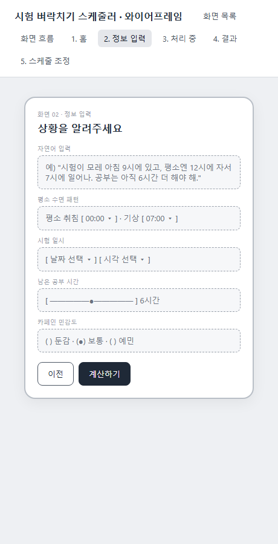
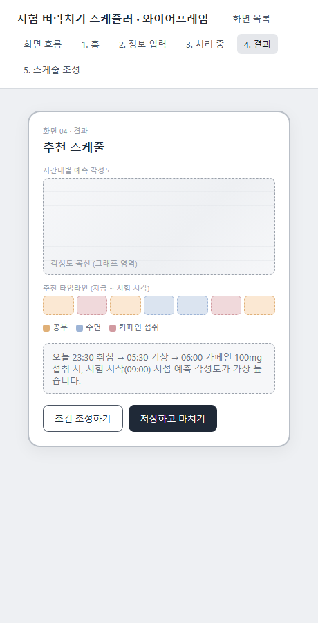

# 시험 벼락치기 스케줄러 — 기획서

> 검증된 수면과학 모델을 자연어로 활용해, 시험기간 대학생의 벼락치기 수면·카페인 스케줄을 최적화하는 도구

---

## 1. 문제정의

**상황**
시험기간이 되면 대학생 대부분은 벼락치기를 하게 되고, 이 과정에서 수면과 카페인 섭취를 순전히 감과 스트레스에 의존해서 조절한다. (스트레스로 매운 음식·결식 반복, 카페인 과다 섭취, 수면 부족 → 위염 발생, 정작 시험 당일엔 컨디션 저하로 죽만 먹는 경험)

**핵심 문제**
1. 학생들은 "언제 자고, 언제 일어나고, 카페인을 언제 얼마나 섭취해야 시험 시작 시각에 각성도가 최고가 되는지"에 대한 과학적 근거 없이 직관에만 의존하고 있다.
2. 그 결과 오히려 역효과(수면 부족 누적, 위장 장애, 시험 당일 컨디션 저하)가 발생한다.
3. 이건 일부 학생의 특수한 상황이 아니라, 시험이 있는 대학생이라면 학기마다 반복적으로 겪는 보편적이고 확실한 문제다.

**기존 해결책의 한계**
- 카페인 계산기 앱(LastSip, Caffly, caff.ai 등): "오늘 밤 잘 자기 위한" 목적이라, 마감에 맞춰 각성도를 끌어올리는 시나리오를 다루지 않음
- RISE 같은 생체리듬 앱: 장기적으로 좋은 수면 습관을 유지하는 게 목적이라, 시험이라는 단기 마감·필요 학습량을 입력받아 스케줄을 역산해주지 않음
- 즉, **"시험 날짜 + 남은 공부량"이라는 구체적 제약 조건을 입력하면 과학적으로 검증된 모델로 최적 스케줄을 계산해주는 도구는 존재하지 않는다.**

---

## 2. 사용자 시나리오

생명과학과 3학년 민지는 이틀 뒤 아침 9시에 시험이 있다. 아직 공부할 분량이 6시간쯤 남았고, 평소엔 밤 12시에 자서 아침 7시에 일어난다. 스트레스 때문에 이미 커피를 몇 잔 마셨는데, 오늘 밤은 언제 자야 할지, 카페인을 얼마나 더 마셔도 되는지 감이 안 잡힌다.

1. 앱을 열고 "시작하기"를 누른다.
2. 정보 입력 화면에서 자연어로 상황을 설명한다: *"시험이 모레 아침 9시에 있고, 평소엔 12시에 자서 7시에 일어나. 공부는 아직 6시간 더 해야 해."*
3. AI가 자연어에서 조건을 추출해 폼에 미리 채워주면, 카페인 민감도 등 세부 항목만 확인·수정하고 "계산하기"를 누른다.
4. 처리 중 화면에서 Two-Process Model + 카페인 상호작용 모델 계산이 진행된다.
5. 결과 화면에서 시간대별 예측 각성도 그래프와, "오늘 23:30 취침 → 05:30 기상 → 06:00 카페인 100mg" 같은 구체적 추천 스케줄을 확인한다.
6. 추천안이 본인 상황과 안 맞으면(예: 그 시간에 잘 수 없음) 스케줄 조정 화면에서 취침·기상·카페인 조건을 슬라이더로 직접 조정하고 재계산한다.
7. 최종 스케줄을 저장하고, 그대로 실행한다.

---

## 3. 핵심 기능

### 기능 1. 자연어 질의 → 파라미터 추출 → 검증된 계산 엔진
사용자의 자연어 설명에서 시험 일시, 평소 수면 패턴, 남은 공부 시간, 카페인 민감도를 추출한다. 계산은 AI가 임의로 만들어내지 않고, 아래 두 논문에 발표된 검증된 생물수학 모델을 그대로 구현해 사용한다.

- Borbély, A.A. (1982). *A Two Process Model of Sleep Regulation*. Human Neurobiology, 1, 195-204. — 수면압(Process S)과 일주기리듬(Process C)의 상호작용으로 각성도를 예측하는 원형 모델
- Vital-Lopez, F.G., Doty, T.J., & Reifman, J. (2024). *When to sleep and consume caffeine to boost alertness*. SLEEP, 47(10), zsae133. — 위 모델에 카페인의 아데노신 수용체 경쟁적 억제 효과를 결합해, 원하는 시각에 각성도를 최대화하는 수면·카페인 스케줄을 계산하는 통합 모델(UMP)

여러 후보 수면·카페인 스케줄을 이 모델에 대입해 비교하고, 시험 시작 시각의 예측 각성도가 가장 높은 조합을 추천한다.

### 기능 2. 그래프(시간축) + 시각화
시간대별 예측 각성도를 그래프로 표시하고, 추천 수면·공부·카페인 스케줄을 타임라인 형태로 함께 보여준다. 사용자가 스케줄 조정 화면에서 조건을 바꾸면 그래프와 타임라인이 즉시 갱신된다.

---

## 4. 화면 흐름

**화면 목록 (5개)**

| # | 화면 | 설명 |
|---|---|---|
| 1 | 홈 | 서비스 소개, 시작하기 |
| 2 | 정보 입력 | 자연어 입력 + 수면패턴·시험일시·공부시간·카페인 민감도 |
| 3 | 처리 중 | 계산 진행 상태 표시 |
| 4 | 결과 | 각성도 그래프 + 추천 스케줄 |
| 5 | 스케줄 조정 | 슬라이더로 조건 수동 조정 → 재계산 |

**흐름**: 홈 → 정보 입력 → 처리 중 → 결과 → (필요 시) 스케줄 조정 → 처리 중으로 되돌아가 재계산 → 결과 갱신

**화면 2. 정보 입력 (와이어프레임)**

**화면 4. 결과 (와이어프레임)**

전체 화면을 직접 클릭하며 확인하고 싶다면, 로컬에서 아래 주소로 실행 중인 프로토타입을 참고 (개발 서버 실행 중에만 접속 가능): `http://localhost:53730`
