# 백로그

> 남은 작업 전체를 한눈에 보기 위한 구조도. 요일별 실행 계획은 [개발_일정.md](./개발_일정.md), 화면·기능 단위 상세 체크리스트는 [spec.md](./spec.md) 참고.
> GitHub에서 이 파일을 열면 아래 다이어그램이 자동으로 렌더링된다 (Mermaid).

```mermaid
flowchart TD
  ROOT["시험 벼락치기 스케줄러<br/>남은 3주"]

  ROOT --> W2["2주차 · 계산 엔진"]
  ROOT --> W3["3주차 · 연동"]
  ROOT --> W4["4주차 · 마무리"]

  W2 --> W2A["Express 서버 스캐폴딩"]
  W2 --> W2B["Two-Process Model<br/>(Process S + Process C)"]
  W2 --> W2C["카페인 근사 모델<br/>(Hill/Michaelis-Menten)"]
  W2 --> W2D["안전 섭취 한도 로직"]
  W2 --> W2E["목표 각성 시각 역산<br/>(이동시간 반영)"]

  W3 --> W3A["다중 시험 통합 최적화<br/>(그리드 탐색)"]
  W3 --> W3B["Supabase 프로젝트<br/>+ 테이블 3종"]
  W3 --> W3C["POST /api/schedule/calculate"]
  W3 --> W3D["정보 입력 → 실제 API 연결"]
  W3 --> W3E["처리 중 → 실제 응답 대기"]
  W3 --> W3F["결과 화면 → 실제 데이터 렌더링"]
  W3 --> W3G["localStorage 저장/조회"]

  W4 --> W4A["스케줄 조정 → 재계산 연동"]
  W4 --> W4B["조정 대상 날짜 선택 UI"]
  W4 --> W4C["공통 컴포넌트 정리<br/>(Chart/ProgressTrack/Legend 등)"]
  W4 --> W4D["자연어 보조 입력 (선택)"]
  W4 --> W4E["엣지 케이스 테스트"]
  W4 --> W4F["반응형 점검"]
  W4 --> W4G["발표 자료·데모 준비"]

  DONE["1주차 완료분<br/>(참고용)"]
  DONE --> D1["기획서 v1→v2"]
  DONE --> D2["디자인 시스템 확정"]
  DONE --> D3["5개 화면 UI 구현<br/>(client/, mock 데이터)"]
  DONE --> D4["정보 입력 수정·삭제 UX"]

  classDef done fill:#f1e0c9,stroke:#9a5b28,color:#201409;
  class DONE,D1,D2,D3,D4 done;
```

---

## 구조 설명

- **1주차 완료분**(회색 박스)은 이미 끝난 부분 — 화면 UI는 5개 다 만들어져 있고 `client/`에 실제 코드로 존재한다. 다만 전부 mock 데이터라서 "화면은 있지만 진짜로 동작하지는 않는" 상태.
- **2주차**는 화면과 무관하게 순수 계산 로직만 만드는 구간이다. 서버·수학 공식·안전 한도 로직까지 이 안에서 끝낸다.
- **3주차**는 2주차에서 만든 로직을 다중 시험까지 확장하고, Supabase를 연결하고, 화면 3개(입력→처리중→결과)를 실제 데이터로 갈아끼우는 구간 — 여기가 끝나면 "제품으로서 한 바퀴 도는" 최소 버전이 완성된다.
- **4주차**는 남은 화면(스케줄 조정) 연동 + 코드 정리 + 테스트 + 발표 준비.

우선순위·구체적 작업 순서는 [개발_일정.md](./개발_일정.md)에 요일별로 정리되어 있다.
