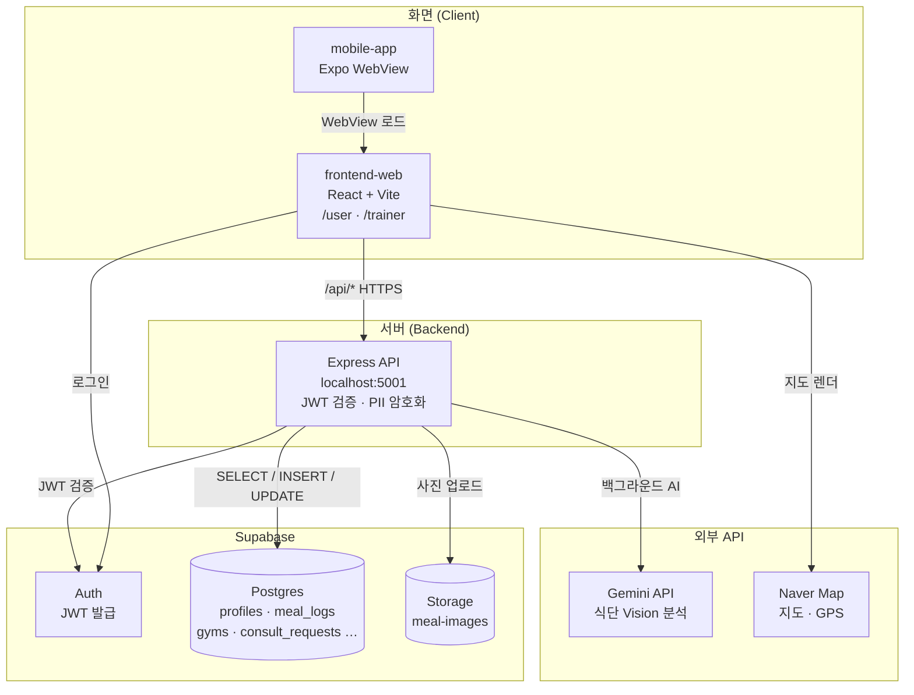
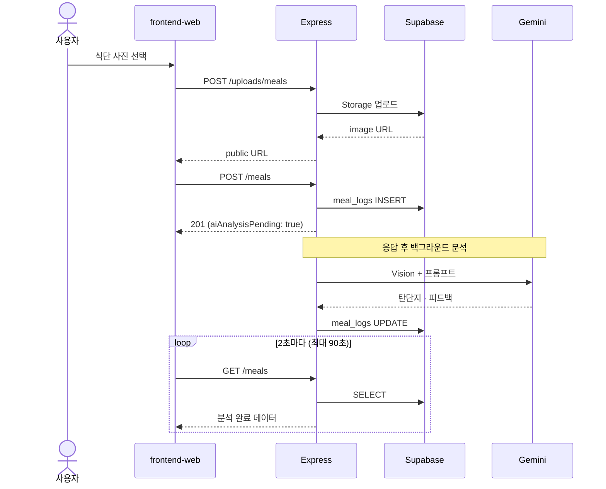
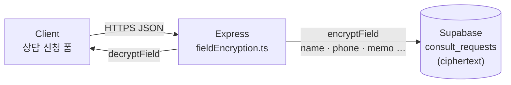
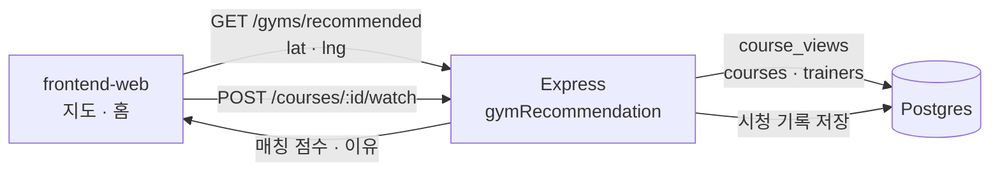

# FitCheck — Monorepo

피트니스 입문자와 골목 헬스장(소상공인)을 잇는 스마트 피트니스 플랫폼입니다.

> 프로젝트 기획·소개는 [루트 README](../README.md)를 참고하세요.

## 프로젝트 구조

```
fitcheck-project/
├── backend/         # Express API + Supabase
├── frontend-web/    # Vite + React (회원 / 트레이너)
└── mobile-app/      # Expo WebView (frontend-web 로드)
```

| 폴더 | 역할 | 문서 |
|------|------|------|
| [`backend/`](./backend/) | API 서버, DB 마이그레이션, PII 암호화 | [backend/README.md](./backend/README.md) |
| [`frontend-web/`](./frontend-web/) | 핵심 웹 UI | [frontend-web/README.md](./frontend-web/README.md) |
| [`mobile-app/`](./mobile-app/) | 하이브리드 앱 래퍼 | [mobile-app/README.md](./mobile-app/README.md) |

### frontend-web 내부

- `src/pages/user/` — 회원 모드 (모바일 비율)
- `src/pages/trainer/` — 트레이너 대시보드
- `src/features/` — 강좌 / 식단 / 지도 / 상담 등
- `src/services/` — API 클라이언트 (`api.ts`, `gymsApi.ts`, `consultRequestsApi.ts`)

## 아키텍처 & 데이터 흐름

화면(React), Express API, Supabase DB·Storage, 외부 API(Gemini·Naver Map)의 연결 구조입니다.

### 전체 구조



| 구간 | 설명 |
|------|------|
| Client → Express | Vite dev는 `/api`를 `localhost:5001`로 프록시 |
| Express → Postgres | 강좌·헬스장·식단·상담 등 CRUD |
| Express → Gemini | 식단 사진 분석 (저장 후 백그라운드) |
| Express → Storage | 식단 사진 업로드 → public URL → `meal_logs.image_url` |

### 식단 AI (비동기 저장)

사용자는 **1~2초 안에 저장 완료**를 체감하고, AI 결과는 타임라인에서 **2초 폴링**으로 갱신됩니다.



### 상담 PII (AES-256-GCM)

상담 신청의 이름·연락처·메모만 **앱 레벨 필드 암호화**합니다. 식단·프로필 등은 JWT 인증 + DB 접근 통제로 보호합니다.



→ 상세: [backend/README.md — 상담 신청 개인정보 암호화](./backend/README.md#상담-신청-개인정보-암호화)

### 헬스장 매칭

PT 강좌 시청 기록(`course_views`)과 GPS 위치를 Express에서 **규칙 기반 점수**로 계산합니다. (Gemini 미사용)



## 빠른 시작

### 1. Backend

```bash
cd fitcheck-project/backend
npm install
cp .env.example .env   # Supabase, 암호화 키 등 설정
npm run db:migrate     # 최초 1회
npm run dev
```

→ http://localhost:5001

### 2. Frontend Web

```bash
cd fitcheck-project/frontend-web
npm install
cp .env.example .env.local   # 필요 시 (Naver Map Client ID 등)
npm run dev
```

→ http://localhost:5173  
Vite dev 서버는 `/api`를 `localhost:5001`로 프록시합니다.

- 회원: `/user`
- 트레이너: `/trainer`

### 3. Mobile App (선택)

```bash
cd fitcheck-project/mobile-app
npm install
npm start
```

`EXPO_PUBLIC_WEB_APP_URL`을 frontend-web 주소로 맞춥니다 (실기기는 LAN IP).

## 요구 사항

- Node.js 18+
- Supabase 프로젝트 (backend `.env`)
- mobile-app: Expo Go 또는 시뮬레이터

## 보안

상담 신청 개인정보(이름·연락처·메모 등)는 백엔드에서 **AES-256-GCM**으로 암호화해 Supabase에 저장합니다.

→ 상세: [backend/README.md — 상담 신청 개인정보 암호화](./backend/README.md#상담-신청-개인정보-암호화)
