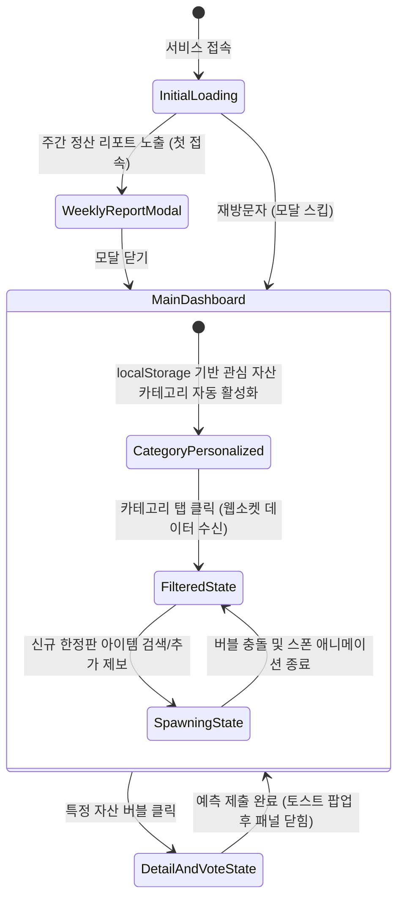

# 🎰 [기획서] 대안 자산 가격 예측 및 트렌드 시각화 플랫폼

> [!TIP]
> **실제 작동하는 프로토타입 실행**: 로컬 프로토타입 (index.html)을 클릭하여 구현 결과를 즉시 시뮬레이션할 수 있습니다.

한정판 스니커즈, 포켓몬 카드, 스트릿 의류 등 대안 자산(Alternative Assets) 리셀 시장의 미래 가격을 예측하고, 집단지성의 데이터와 예측 정확도 랭킹을 직관적인 버블 차트로 시각화한 **'Zero-Thinking 예측 마켓 대시보드'** 기획안입니다.

---

## 1. 문제 정의 (Problem Definition)

### 1.1. 대안 자산(리셀) 시장 진입의 어려움

* **"돈은 없지만 관심은 많음"**: 20대 대학생 및 취준생들 사이에서 한정판 스니커즈, 포켓몬 카드 재테크(리셀)에 대한 관심은 폭발적이지만, 수십~수백만 원에 달하는 실제 자본금이 부족해 직접 투자 흐름을 경험하기 어렵습니다.
* **"언제 사고팔아야 할지 모름"**: 리셀 가격은 변동성이 극심하여 입문자가 현재 가격이 고점인지 저점인지, 향후 트렌드가 어떻게 변할지 맥락을 파악하기 어렵습니다.

### 1.2. 정보의 파편화와 피로도

* 네이버 크림(KREAM), 솔드아웃, 해외 StockX, 솔서치 등 플랫폼별로 거래 가격이 흩어져 있고, 스니커즈 커뮤니티의 수많은 찌라시 속에서 '진짜 유망한 아이템'을 필터링하는 데 피로감을 느낍니다.

### 1.3. 기존 트렌드 데이터의 지루함

* 딱딱한 꺾은선 그래프와 텍스트로만 이루어진 기존 시세 분석 툴은 일반 유저들이 직관적으로 재미를 느끼며 정보를 습득하기에 불친절합니다.

### 1.4. 해결하려는 핵심 가치 (Value Proposition)

* **Gamification 기반 리셀 입문**: 단 1원의 리스크(투자금) 없이 무료 가상 포인트를 통해 한정판 자산의 미래 가격을 예측하며 리셀 시장의 흐름을 게임처럼 체득합니다.
* **집단지성 기반 가격 예측 인덱스**: 유저들의 예측 데이터를 모아 "이 아이템은 다음 주에 오를 것인가, 떨어질 것인가"에 대한 대중의 심리를 3초 만에 시각적으로 파악할 수 있는 트렌드 나침반을 제공합니다.

---

## 2. 사용자 시나리오 (User Scenarios)

### 시나리오 A: 스니커테크 입문 대학생 (민우, 25세)

> **"실제 돈을 쓰긴 무섭지만, 요즘 어떤 신발이 오를지 내릴지 가볍게 의견을 던지고 대중의 예상가를 보고 싶어."**

1. 민우는 매주 월요일 아침 DropCast 앱에 접속합니다.
2. 앱은 민우의 이전 방문 패턴을 기억하여 별도 클릭 없이 **[스니커즈 👟]** 카테고리를 자동으로 활성화합니다.
3. 화면 중앙에서 강하게 진동하며 붉은빛을 띠는 `#1 Travis Scott Jordan` 버블을 발견합니다. 버블이 크고 붉다는 것은 많은 유저가 '상승'을 예측하고 있으며 대중 예측 가격이 높게 형성되어 있다는 뜻입니다.
4. 버블을 클릭하자 우측 패널에 KREAM의 최근 시세 요약과 함께 **[대중 예측가: 820,000원]** 정보와 **[▲ 오를까] / [▼ 내릴까]** 투표창이 나타납니다.
5. 민우는 커뮤니티 반응을 고려해 `[▲ 오를까]` 버튼을 누릅니다. 별도의 복잡한 가격 계산 없이 단 3초 만에 예측에 참여 완료합니다.

### 시나리오 B: 포켓몬 카드 수집가 (지은, 23세)

> **"내가 가진 카드가 다음 주에 오를지 내릴지 궁금해. 다른 사람들은 어떻게 보고 있을까?"**

1. 수집가 지은은 최근 구한 카드의 트렌드를 보기 위해 **[TCG/토이 🃏]** 카테고리를 필터링합니다.
2. 검색창 하단 추천 키워드 영역에 평소 관심 있어 하던 `#피카츄 마스터볼 미러`, `#리자몽 SAR` 태그가 자동으로 추천 노출되어 있습니다.
3. 지은은 추천 태그를 클릭해 즉시 검색창에 입력하고 대시보드에 추가합니다.
4. 추가와 동시에 화면 한 구석에서 "피카츄 마스터볼" 버블이 팽창하며 새롭게 생성되고, 기존 버블들과 탄성 넘치게 충돌하며 배치됩니다.
5. 지은은 다른 유저들의 상승/하락 투표 비율을 통해 대중의 관심과 기대 심리를 직관적인 지표로 확인합니다.

---

## 3. 핵심 기능

### 3.1. 실시간 대안 자산 트렌드 버블 대시보드

* **카테고리 필터링**: `스니커즈`, `스트릿 의류`, `TCG/토이(포켓몬카드 등)`, `한정판 테크/레고` 등 서브컬처 자산별 필터 제공.
* **버블의 시각적 메타포 (Zero-Thinking 데이터화)**:
  - **버블의 크기**: 실제 리셀 시장에서의 언급량 및 거래 트래픽 규모.
  - **버블의 색상/진동**: 유저들의 상승/하락 투표 심리 비율 (상승 예측이 압도적이면 **붉은색/빠른 진동**, 하락 예측이 많으면 **푸른색/은은한 흔들림**).
* **대중 예측 가격 (Consensus Price) 노출**: 버블 내부 혹은 세부 분석 패널에 유저들의 방향성 투표를 바탕으로 연산된 실시간 대중 합의 예상 가격을 띄워 시인성 강화.

### 3.2. 초간단 1주일 단위 '예측 마켓(Prediction Market)' 및 자동 정산

* **방향성 예측 투표 시스템 (MVP)**: 복잡한 금액 입력 없이 **[▲ 오를까]** / **[▼ 내릴까]** 단 2개의 버튼으로 가볍게 예측 참여.
* **집단지성 가격 연산 엔진**: 유저들의 상승/하락 투표 비율 + 상품의 출시 정가 + 과거 프리미엄 가중치를 결합하여 가상의 "대중 합의 가격"을 도출.
* **자동 정산 배칭**:
  - 백엔드(`Express + Node-cron`)에서 매주 일요일 밤 11시 59분에 실제 리셀 사이트의 종가 데이터를 크롤링(`Puppeteer`)하여 덤프.
  - 유저들이 선택한 방향성(상승/하락)과 실제 종가의 변동 방향을 비교하여 맞춘 유저들에게 **'예측 성공 스코어'**를 적립.
* **실시간 랭킹 보드 및 보상**: 매주 탑 랭커를 선정하여 대시보드 상단 전광판에 노출하고 리워드 지급.

### 3.3. 로드맵 (Future Scope - Phase 2)

* **상세 예측 기능**: 롱/숏 방향성 투표 외에 구체적인 예상 금액(인풋/슬라이더)을 입력하는 상세 예측 기능 추가.
* **가상 모의 리셀 투자 (Portfolio Game)**: 가상 자산 예산을 지급하여 아이템을 매수/매도하며 신발장을 채우는 시뮬레이션 게임 도입.

---

## 4. 화면 UI 구조 및 레이아웃

### 4.1. 화면 레이아웃 와이어프레임 (ASCII Structure)

```text
+-----------------------------------------------------------------------------------+
|  DROPCAST  [ 전체 | 스니커즈 👟 | 스트릿 의류 👕 | TCG/토이 🃏 | 한정판 레고 🧱 ]     |
+-----------------------------------------------------------------------------------+
|  [📢 주간 랭킹] 1위: @민우 (정확도 99.4%) / 이번 주 리워드: 네이버페이 5만원 권       |
+-----------------------------------------------------------------------------------+
|                                                                                   |
|                         (🔴 트래비스 스캇 조던)                                      |
|             (🔵 슈프림 후드)                               (🔴 리자몽 SAR)        |
|                                                                                   |
|                       (🔴 미스치프 아톰부츠)     (🔵 팰리스 자켓)                   |
|                                                                                   |
+-----------------------------------------------------------------------------------+
|  [예측 참여 패널]                            |  [세부 분석 패널]                     |
|  🔮 '트래비스 스캇 조던' 다음주 가격 예측       |  📈 KREAM 실제 시세 추이 (6개월)       |
|  현재가: 1,250,000원                         |  ~~~~~~~~~~~~~~~~~~~~~~~~~~~~~~~~~  |
|                                             |  📊 대중 예상가: 1,320,000원          |
|    [ ▲ 오를까 (84%) ]   [ ▼ 내릴까 (16%) ]   |  💬 대중 심리: 84%가 상승 예측 중 (🔥) |
+-----------------------------------------------------------------------------------+

```

---

## 5. 화면별 상세 동작 시나리오 (Screen States)

### Scene 1: 초기 진입 상태 (주간 정산 브리핑 팝업)

* **화면 상태**: 첫 진입 시 배경 대시보드가 어둡게 블러 처리되며, 파스텔 톤의 글래스모피즘이 가미된 테마의 주간 정산 및 웰컴 모달이 부드럽게 스케일 업(Scale Up)하며 로드됩니다.
* **시각 정보**:
1. **지난주 예측 결과 브리핑**: "지난주 민우님이 예측하신 조던 운동화는 정확도 98%를 기록하여 전체 12위를 달성했습니다!" 메시지 노출.
2. **핵심 KPI 지표 카드**: 이번 주 누적 예측 참여자 수, 현재 가장 뜨거운(예측이 몰리는) 핫 라이징 아이템 카드가 증감 뱃지와 함께 노출.


* **인터랙션**: '오늘 하루 이 창을 다시 열지 않기' 혹은 '예측 마켓 입장' 버튼을 클릭하면 `localStorage`에 상태가 보관되며 모달이 페이드 아웃되고 메인 대시보드가 활성화됩니다.

### Scene 2: 홈 피드 탐색 상태 (자산 카테고리별 물리 정렬)

* **화면 상태**: 사용자가 상단 헤더에서 카테고리 탭(예: `TCG/토이 🃏`)을 클릭하면 화면 상태가 전이됩니다.
* **시각 정보**: 화면 중앙에 포켓몬 카드, 유희왕 카드 등 관련 버블들만 조밀하게 뭉쳐 둥둥 떠다니며, 다른 카테고리의 버블들은 크기가 `0`으로 축소되어 감춰집니다. 상승 심리가 높은 버블은 붉은 빛을 내며 미세하게 위아래로 진동합니다.
* **인터랙션**: 사용자가 다른 탭을 누르면 웹소켓(`Socket.io`)을 통해 새로운 카테고리의 대중 예측 데이터 배열을 수신하고, 기존 버블들이 사방으로 흩어졌다가 새로운 버블들이 화면 중심으로 모여드는 탄성 반동(Spring physics) 물리 애니메이션이 발생합니다.

### Scene 3: 상세 정보 및 예측 상태 (버블 클릭 우측 패널 활성화)

* **화면 상태**: 특정 자산 버블(예: `트래비스 스캇 조던`)을 클릭하면 해당 버블 테두리에 하얀색 포커스 링과 펄스 이펙트 오버레이가 적용됩니다.
* **시각 정보**: 우측/하단의 **세부 분석 및 예측 참여 패널**이 활성화됩니다. 실제 시세 변동 추이 그래프(SVG Sparkline)가 로드되고, 그 밑으로 대중들의 실시간 예측 비율(예: 상승 84% vs 하락 16%)이 게이지 바 형태로 시각화됩니다.
* **인터랙션**: 유저가 슬라이더 바를 조절해 다음 주 예상 가격을 선택하고 `[예측제출]` 버튼을 누르면, 백엔드로 데이터가 전송되며 데이터베이스에 유저의 이번 주 예측 레코드가 안전하게 인서트(Insert)됩니다. 제출 완료 시 "제출 완료! 주말 종가를 기대하세요!" 토스트 메시지가 노출됩니다.

### Scene 4: 신규 아이템 실시간 제보/추가 상태 (스폰 물리 연출)

* **화면 상태**: 사용자가 검색창에 아직 등록되지 않은 새로운 한정판 키워드(예: `리자몽 SAR 포켓몬카드`)를 검색하여 추가 요청을 보낼 때 발생합니다.
* **시각 정보**: 화면 중앙 영역에서 크기가 `0`인 버블이 순간적으로 생성되어 타겟 크기까지 0.3초간 팽창(Scale up)하며 스폰됩니다.
* **인터랙션**: 새롭게 추가된 버블은 기존에 배치되어 있던 버블들과 충돌(Collision Force)하며 통통 튕기는 연출을 보여주며, 실시간으로 다른 유저들의 대시보드 화면에도 해당 버블이 동시에 생성되는 웹소켓 브로드캐스팅이 일어납니다.

---

## 6. 화면 상태 전이 다이어그램 (State Transition Diagram)



---
