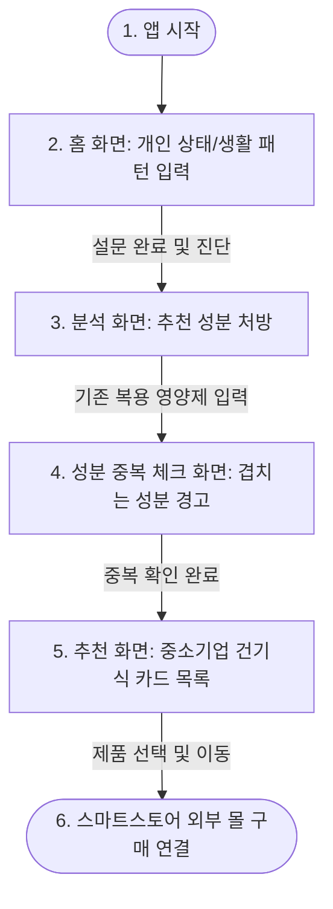

# 기획서

## 프로토타입

핵심 기능의 화면 흐름을 순수 HTML/CSS로 클릭해볼 수 있게 만들었습니다. [`hub/prototype/0-start.html`](prototype/0-start.html)을 브라우저로 열면 시작 화면부터 스마트스토어 이동 화면까지 실제로 눌러보며 확인할 수 있습니다.

---

## 문제 정의

건강 상태에 맞는 식품 정보 부재와 영양제 오남용으로 **부작용 위험에 노출된 소비자**가, 자신에게 꼭 필요한 건강기능식품 성분을 분석받아 이를 안전하고 정직하게 가공/제조하는 **소상공인·중소기업의 기능성 제품과 신뢰성 있게 연결되지 못하는 문제**.

---

## 사용자 시나리오

소비자가 목적을 이루는 과정을 화면 및 동작 중심으로 순서대로 기술합니다.

1. **[홈 화면] 진단 시작**
    - 소비자는 현재 피로, 소화불량, 수면 장애 등 본인의 대표적인 **불편 증상 및 생활 패턴**을 체크하고 진단 버튼을 누른다.
2. **[성분 분석 화면] 맞춤 성분 제안**
    - AI 에이전트가 분석을 거쳐 소비자에게 가장 시급한 **기능성 원료 성분**(예: 안토시아닌, 밀크씨슬 추출물 등)을 처방하여 보여준다.
    - 소비자는 이어서 **현재 복용 중인 영양제**를 검색하거나 성분 함량을 입력한다.
3. **[성분 중복 체크 화면] 영양 중복 확인**
    - 에이전트가 기존 복용제와 추천 성분의 이름이 겹치는지 확인하여 **중복되는 성분을 경고 배지**로 보여준다.
4. **[SME 제품 추천 화면] 객관적 비교 및 추천**
    - 에이전트가 대기업 브랜드 알약 대신, 추천된 기능성 원료를 안심하고 섭취할 수 있도록 우수한 **중소기업/소상공인의 건강기능식품 목록**을 성분/가격 비교 카드 형태로 나열한다.
5. **[상세/스토어 연결] 구매 페이지 이동**
    - 소비자는 마음에 드는 중소기업 제품의 상세 검증 데이터(HACCP, 시험성적서 등)를 확인한 후, **[스마트스토어로 이동]** 버튼을 눌러 실제 구매를 완료한다.

---

## 핵심 기능 (2개)

과도한 기능 탑재를 방지하고 서비스 본질에 집중하기 위해 핵심 기능 2개로 압축합니다.

1. **기능 A: 개인 상태 맞춤형 기능성 성분 분석 및 중소기업 건기식 추천**
    - **필수성**: 몸 상태(설문)에 맞는 성분 처방 및 가공 제품 매칭이라는 본질적 기능.
    - **구현**: 신체 증상 기반 기능성 원료 매핑 알고리즘 + 우수 중소기업 건강기능식품 DB 필터링 노출.
2. **기능 B: 복용 영양제 성분 중복 체크**
    - **적합성**: 중복 섭취를 미리 알려주어 오남용을 예방한다는 안전성 가치 제공.
    - **구현**: 큐레이션한 성분 리스트를 기준으로, 추천 성분과 기존 복용 성분의 이름이 겹치는지 확인해 경고 배지로 표시.

---

## 화면 흐름

---

## 화면 목록 (IA)

| # | 화면명 | 목적 | 주요 구성요소 |
|---|--------|------|----------------|
| 1 | 홈 화면 | 증상/생활 패턴 입력 시작점 | 증상 체크리스트, 생활 패턴 선택, [진단 시작] 버튼 |
| 2 | 성분 분석 화면 | 맞춤 성분 제안 + 복용 중 영양제 파악 | 추천 성분 태그, 복용 영양제 검색/선택, [다음] 버튼 |
| 3 | 성분 중복 체크 화면 | 중복 성분 경고 | 경고 배지, 겹치는 성분 목록, [다음] 버튼 |
| 4 | SME 제품 추천 화면 | 중소기업 제품 비교/추천 | 제품 카드 목록(이미지, 성분/가격 비교, 업체명) |
| 5 | 상세 화면 | 제품 신뢰 정보 확인 + 구매 연결 | 인증 정보(HACCP, 시험성적서), [스마트스토어로 이동] 버튼 |

---

## 와이어프레임 (러프)

### 1. 홈 화면
- 상단 타이틀
- 증상 체크리스트 (피로 · 소화불량 · 수면 장애 등)
- 생활 패턴 선택
- 하단 [진단 시작] 버튼

### 2. 성분 분석 화면
- 상단 타이틀
- 추천 성분 태그 목록
- 복용 중인 영양제 검색/선택 영역
- 하단 [다음] 버튼

### 3. 성분 중복 체크 화면
- 상단 타이틀
- 중복 성분 경고 배지
- 겹치는 성분 리스트
- 하단 [다음] 버튼

### 4. SME 제품 추천 화면
- 상단 타이틀
- 제품 카드 목록 (이미지 + 성분/가격 비교 + 업체명), 스크롤형

### 5. 상세 화면
- 상단 제품 이미지
- 인증 정보 (HACCP, 시험성적서 등)
- 하단 [스마트스토어로 이동] 버튼