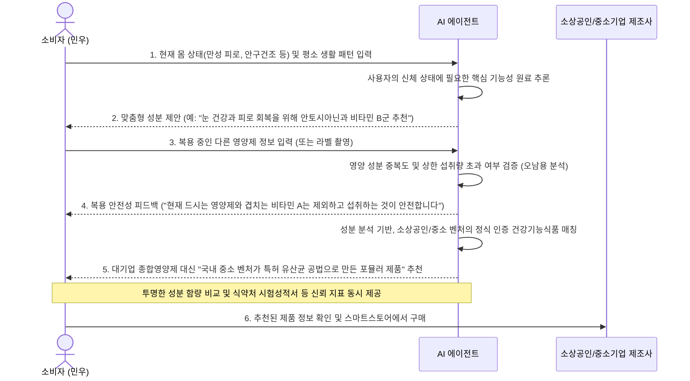

# 서비스 기획안: (가칭) 개인 맞춤형 건강식품 연계 에이전트
> **소비자의 상태에 맞는 기능성 식품을 안전하게 추천하고, 우수한 기술력을 가진 소상공인/중소기업의 건강기능식품을 연계하는 AI 에이전트**

---

## 1. 문제 발견 (Problem Discovery)
*   **현상**: 건강과 면역에 대한 관심이 급증하며 기능성 식품/영양제 시장이 가파르게 성장하고 있습니다.
*   **소비자 관찰 (Pain Points)**:
    *   **정보 과부하와 선택의 어려움**: SNS나 블로그에 건강에 좋다는 광고가 넘쳐나지만, 정작 나의 현재 몸 상태에 어떤 성분이 필요한지, 어떤 제품을 골라야 하는지 정확히 알기 어렵습니다.
    *   **오남용 및 부작용 위험**: 여러 개의 건강식품을 중복 섭취하면서 특정 성분을 과다 복용하여 부작용을 겪거나, 현재 복용 중인 약물과의 상호작용 위험성을 잘 모른 채 섭취하는 경우가 많습니다.
*   **소상공인/중소기업 관찰 (Pain Points)**:
    *   **마케팅 채널 및 인지도 부족**: 우수한 기술력을 가진 로컬 바이오 벤처, 중소 건강기능식품 제조사, 친환경 기능성 가공식품 제조 스타트업들은 대형 제약사나 수입 브랜드의 거대 마케팅 공세에 밀려 정작 이 제품이 필요한 소비자들과 연결될 기회가 부족합니다.

---

## 2. 문제 정의 (Problem Definition)
> "나에게 맞는 건강 정보와 기능성 식품이 무엇인지 몰라 **영양제 오남용 및 선택 장애를 겪는 소비자**가, 자신의 몸 상태에 적합한 식품을 추천받아 이를 정직하게 제조하는 **로컬 소상공인/중소기업의 가공 기능성 식품과 연결되지 못하고 있다.**"

---

## 3. 사용자·시나리오 (User Scenario)
*   **페르소나**: 만성 피로와 눈 건조증에 시달려 자신에게 맞는 건강식품을 찾고 있는 20대 대학생 **김민우**

### 서비스 이용 시나리오 흐름

---

## 4. 핵심 기능 도출 (Core Features)
1.  **개인 상태 맞춤형 기능성 식품 추천 엔진 (State-based Recommendation)**
    *   사용자의 주요 건강 고민(피로, 소화, 수면 등)과 라이프스타일을 기반으로 식약처 인증 기능성 원료 및 성분 추천.
2.  **영양 안전 검증 및 과다복용 방지 체커 (Safety Audit)**
    *   기존에 복용 중인 영양제/약물 성분을 분석하여 일일 권장량 및 상한 섭취량 초과 위험을 실시간 경고 및 조절.
3.  **투명한 데이터 기반 소상공인/중소기업 건강기능식품 매칭 (Verified SME Matching)**
    *   추천된 성분을 고함량 함유한 소상공인, 중소 바이오 벤처, 기능성 표시 식품 스타트업의 제품 매칭.
    *   광고라는 오해를 불식시키기 위해 대형 브랜드 제품과 성분/가격을 객관적으로 비교하는 뷰 및 식약처 정식 인증 데이터 제공.
4.  **SME 구매 커넥터 (Purchase Connector)**
    *   추천된 중소기업 제품의 상세 정보 제공 및 온라인 판매처(네이버 스마트스토어 등) 연동.

---

## 5. 우선순위·MVP (Minimum Viable Product)
초기 한정된 개발 기간 동안 기획의 핵심 가치를 증명하기 위한 3가지 MVP 기능입니다.

### [우선순위 1] 개인 상태 맞춤형 기능성 식품 추천 기능 (State Recommendation)
*   **이유**: 소비자가 가장 원하는 '내 몸 상태에 맞는 건강식품 찾기'라는 본질적인 가치를 제공함.
*   **구현**: 간단한 건강 설문(증상, 생활 습관)을 통해 부족하거나 필요한 성분을 분석하고 맞춤 식품을 매칭해 주는 핵심 로직.

### [우선순위 2] 성분 중복 및 과다복용 간이 진단기 (Safety Audit)
*   **이유**: 추천에 이어 안전한 섭취까지 책임지는 안전장치를 마련하여 서비스 신뢰도를 제고함.
*   **구현**: 사용자가 기존 복용 성분을 선택하면 상한 섭취량 초과 여부를 노란색/빨간색 경고 등으로 보여주는 시각화 대시보드.

### [우선순위 3] 중소기업/소상공인 건강기능식품 데이터 매칭 (SME Value)
*   **이유**: 대기업 위주의 건강식품 시장에서 기술력 있는 중소기업을 조명하여 상생 비즈니스 모델 완성.
*   **구현**: 추천된 성분(예: 안토시아닌, 홍삼 사포닌 등)을 포함하는 중소 브랜드 건강기능식품 DB를 설계하고 추천 화면에 표시.
