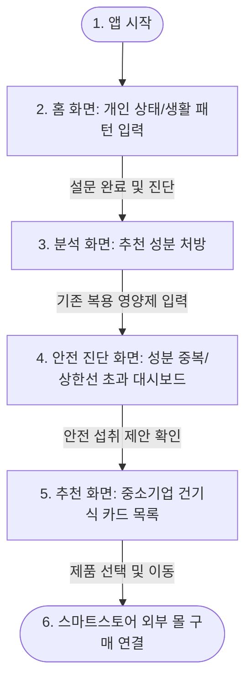

# 기획서

## 문제 정의

건강 상태에 맞는 식품 정보 부재와 영양제 오남용으로 **부작용 위험에 노출된 소비자**가, 자신에게 꼭 필요한 건강기능식품 성분을 분석받아 이를 안전하고 정직하게 가공/제조하는 **소상공인·중소기업의 기능성 제품과 신뢰성 있게 연결되지 못하는 문제**.

---

## 사용자 시나리오

소비자가 목적을 이루는 과정을 화면 및 동작 중심으로 순서대로 기술합니다.

1. **[홈 화면] 진단 시작**
    - 소비자는 현재 피로, 소화불량, 수면 장애 등 본인의 대표적인 **불편 증상 및 생활 패턴**을 체크하고 진단 버튼을 누른다.
2. **[성분 분석 화면] 맞춤 성분 제안**
    - AI 에이전트가 분석을 거쳐 소비자에게 가장 시급한 **기능성 원료 성분**(예: 안토시아닌, 밀크씨슬 추출물 등)을 처방하여 보여준다.
    - 소비자는 이어서 **현재 복용 중인 영양제**를 검색하거나 성분 함량을 입력한다.
3. **[안전 진단 화면] 영양 중복/과다 체크**
    - 에이전트가 기존 복용제와 추천 성분의 중복 여부 및 식약처 고시 일일 상한 섭취량 초과 여부를 계산하여 대시보드로 시각화한다.
    - 복용 약물과의 상호작용 등 **주의 성분을 빨간색/노란색 경고**로 확인한다.
4. **[SME 제품 추천 화면] 객관적 비교 및 추천**
    - 에이전트가 대기업 브랜드 알약 대신, 추천된 기능성 원료를 안심하고 섭취할 수 있도록 우수한 **중소기업/소상공인의 건강기능식품 목록**을 성분/가격 비교 카드 형태로 나열한다.
5. **[상세/스토어 연결] 구매 페이지 이동**
    - 소비자는 마음에 드는 중소기업 제품의 상세 검증 데이터(HACCP, 시험성적서 등)를 확인한 후, **[스마트스토어로 이동]** 버튼을 눌러 실제 구매를 완료한다.

---

## 핵심 기능 (2개)

과도한 기능 탑재를 방지하고 서비스 본질에 집중하기 위해 핵심 기능 2개로 압축합니다.

1. **기능 A: 개인 상태 맞춤형 기능성 성분 분석 및 중소기업 건기식 추천**
    - **필수성**: 몸 상태(설문)에 맞는 성분 처방 및 가공 제품 매칭이라는 본질적 기능.
    - **구현**: 신체 증상 기반 기능성 원료 매핑 알고리즘 + 우수 중소기업 건강기능식품 DB 필터링 노출.
2. **기능 B: 복용 영양제 성분 중복 및 과다복용(안전성) 진단 대시보드**
    - **적합성**: 오남용 방지 및 약물 부작용 예방이라는 안전성 가치 제공.
    - **구현**: 식약처 영양소 권장량/상한량 데이터를 바탕으로 한 성분 총합 초과 분석 및 시각 차트(대시보드) 제공.

---

## 화면 흐름

