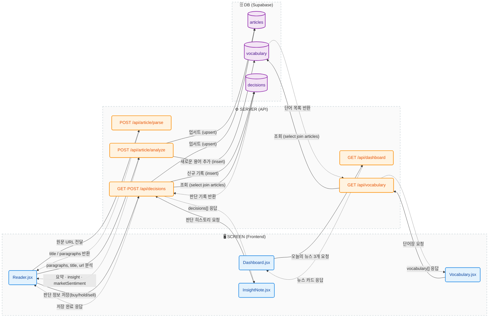

# Articles — 화면 → 서버 → DB 데이터 흐름

코드 근거: `client/src/pages/*.jsx`, `client/src/api/*.js`, `server/src/routes/*.js`,
`server/src/services/*.js`, `supabase/migrations/20260717000000_init_schema.sql`.

4개 MVP 화면(Dashboard/Reader/InsightNote/Vocabulary)의 핵심 CRUD 경로만 담았다.
실선(`-->`)은 요청/쓰기, 점선(`-.->`)은 응답/읽기 방향이다. 인증(Login/Sidebar),
외부 API 세부 호출(CNBC RSS/Claude/원문 스크래핑), 완독 로깅(`article_reads`)은
생략했다.

## 흐름 요약: 화면별 순서

### 1. Dashboard 진입

1. `Dashboard.jsx`가 마운트되며 서버에 `GET /api/dashboard` 요청을 보낸다.
2. 서버는 (내부적으로 RSS/Claude를 거쳐) 오늘의 핵심 뉴스 3건을 뉴스 카드 형태로 응답한다.
3. 이 흐름은 DB를 전혀 거치지 않는다 — 응답을 그대로 화면에 렌더링한다.

### 2. Reader 진입 → 원문 파싱

4. 사용자가 뉴스 카드를 클릭해 `Reader.jsx`로 이동하면, `Reader.jsx`가 원문 URL을 담아 서버에 `POST /api/article/parse`를 요청한다.
5. 서버는 원문을 스크래핑해 `title`/`paragraphs`를 응답하고, `Reader.jsx`는 이를 화면에 렌더링한다.

### 3. AI 분석

6. 파싱이 성공하면 곧바로 `Reader.jsx`가 `paragraphs`, `title`, `url`을 담아 `POST /api/article/analyze`를 요청한다.
7. 서버는 이 시점에 `articles` 테이블에 `upsert`(url 기준 최신 title로 갱신)를 수행한다.
8. 이어서 분석 결과로 뽑힌 핵심 용어를 `vocabulary` 테이블에 `insert`한다(단어장 자동 적재).
9. 마지막으로 요약(summaryBullets)·insight·marketSentiment를 `Reader.jsx`에 응답한다 — 화면은 요약만 바로 보여주고 insight/marketSentiment는 state에만 보관(블라인드 처리)한다.

### 4. 투자 판단 저장

10. 사용자가 판단 버튼을 눌러 바텀시트를 열고 닫으면(확정 시점), `Reader.jsx`가 `POST /api/decisions`로 판단(buy/hold/sell)과 분석 결과를 함께 저장 요청한다.
11. 서버는 다시 `articles`에 `upsert`한 뒤, `decisions` 테이블에 `insert`한다.
12. 저장 완료 응답을 받으면 `Reader.jsx`가 토스트로 저장 완료를 알린다.

### 5. InsightNote (판단 히스토리 조회)

13. `InsightNote.jsx`가 마운트되며 `GET /api/decisions`를 요청한다.
14. 서버는 `decisions`를 `articles`와 join(select)해서 제목/URL을 복원한 뒤,
15. 판단 기록 목록(`decisions[]`)을 응답하면 화면이 히스토리 카드로 렌더링한다.

### 6. Vocabulary (단어장 조회)

16. `Vocabulary.jsx`가 마운트되며 `GET /api/vocabulary`를 요청한다.
17. 서버는 `vocabulary`를 `articles`와 join(select)해서 용어가 나온 기사 제목/URL을 복원한 뒤,
18. 단어 목록(`vocabulary[]`)을 응답하면 화면이 최신순 카드로 렌더링한다.

**핵심 요지**: ①Dashboard(DB 없음) → ②Reader parse(DB 없음) → ③Reader analyze(`articles` upsert + `vocabulary` insert) → ④decisions 저장(`articles` upsert + `decisions` insert) → ⑤⑥InsightNote/Vocabulary는 각각 `decisions`/`vocabulary`를 `articles`와 join해 읽기만 하는 순서다.

## 불확실하거나 확인이 필요한 부분

- **`vocabulary` insert**는 로그인 사용자(`req.userId` 존재)일 때만 일어나며, 실패해도 `analyze` 응답 자체는 정상 반환된다(에러를 삼킴) — 다이어그램상 화살표가 "항상 성공"을 의미하지 않는다.
- **`articles` 테이블의 `source`/`source_initial`/`published_at` 컬럼**은 스키마에는 있지만 `ensureArticle`이 `title`/`url`만 upsert하므로 실제로는 채워지지 않는다.
