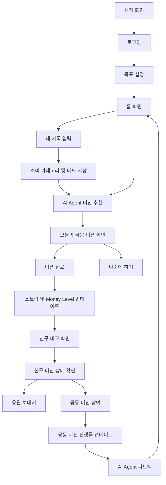

# MoneyMate Planning

## 문제 정의

기존 가계부 서비스는 소비 기록, 자동 분류, 카드/계좌 연동, 소비 분석 등 다양한 기능을 제공하지만, 많은 사용자가 장기간 꾸준히 사용하지 않는다.

그 이유는 기능 부족보다 지속 사용 동기의 부족에 가깝다. 사용자는 돈을 기록하기 위해 매일 앱을 열기보다, 부담 없이 수행할 수 있는 작은 금융 행동과 친구와의 상호작용이 있을 때 더 자주 서비스에 접속할 가능성이 있다.

다만 금융 습관을 만들기 위해서는 사용자가 자신의 소비 행동을 최소한으로 돌아볼 수 있는 개인 기록 공간도 필요하다. 따라서 본 프로젝트는 단순한 AI 가계부가 아니라, **나만 보는 간단한 가계부 기록**과 **친구와 함께하는 금융 미션**을 결합한 AI Agent 기반 웹 MVP를 구현하는 것을 목표로 한다.

## 사용자 시나리오

1. 사용자는 웹 서비스에 접속해 로그인하고 자신의 금융 목표를 설정한다.
2. 사용자는 오늘의 소비 행동을 간단히 기록한다.
3. 서비스는 사용자의 목표, 최근 기록, 미션 수행 상태를 바탕으로 오늘의 금융 미션을 추천한다.
4. 사용자는 오늘의 미션을 완료하거나 나중에 수행하도록 선택한다.
5. 미션 완료 여부에 따라 스트릭, Money Level, 목표 진행률이 업데이트된다.
6. 사용자는 친구 한 명과 오늘의 미션 상태, 스트릭, 공동 미션 진행률을 비교한다.
7. 친구에게 응원을 보내거나 함께 공동 미션을 수행한다.
8. AI Agent는 사용자의 기록과 친구의 참여 상태를 바탕으로 다음 미션과 피드백을 제공한다.

## 핵심 기능 (2개)

- **나만 보는 간단한 소비 기록 기반 AI 미션 추천**  
  사용자는 오늘의 소비 행동을 카테고리와 메모 중심으로 가볍게 기록한다. 서비스는 이 기록과 목표, 이전 미션 수행 여부, 스트릭 상태를 바탕으로 오늘 수행할 수 있는 작은 금융 습관 미션을 추천한다.  
  예를 들어 `카페는 한 번만`, `소비 전 30초 생각하기`, `배달 대신 집밥 먹기` 같은 행동 중심 미션을 제공한다.

- **친구와 함께하는 금융 습관 비교 및 공동 미션**  
  실제 소비 금액, 계좌, 카드 내역은 공유하지 않고, 미션 완료 여부, 스트릭, 목표 진행률, Money Level만 친구와 비교한다.  
  사용자는 친구와 함께 공동 미션을 수행하고, 서로 응원하며 금융 습관을 지속할 동기를 얻는다.

## 주요 기능

- 회원가입 및 로그인
- 목표 설정
- 오늘의 소비 기록
- 소비 카테고리 선택
- 선택적 금액 입력
- 개인 소비 메모
- 오늘의 금융 미션 추천
- 미션 완료 / 나중에 하기
- 개인 스트릭 관리
- Money Level / Money Score
- 친구 추가
- 친구 1명과 습관 비교
- 공동 미션 진행률
- 응원 보내기
- AI Agent 피드백

## 내 가계부 기록 범위

MVP의 가계부 기능은 전체 소비를 정교하게 관리하는 기능이 아니라, 금융 미션과 습관 형성을 돕는 개인 기록 공간으로 제한한다.

사용자가 기록하는 정보:

- 소비 카테고리: 카페, 배달, 쇼핑, 교통, 식비, 기타
- 소비 메모
- 선택적 금액
- 오늘 미션과 관련 있는 소비인지 여부
- 하루 회고

친구에게 공유하지 않는 정보:

- 실제 소비 금액
- 소비 메모
- 결제처
- 계좌 정보
- 카드 사용 내역
- 자산 규모

친구에게 공유하는 정보:

- 오늘의 미션 완료 여부
- 스트릭
- 공동 미션 진행률
- 목표 진행률
- Money Level
- 응원/반응

## MVP에서 제외하는 기능

- 계좌 연동
- 카드 연동
- 실제 결제 내역 자동 수집
- OCR 영수증 인식
- 자동 소비 분류
- 금융상품 추천
- 정교한 소비 예측
- 모바일 앱 출시
- 실시간 채팅
- 친구와 금액 비교
- 자산 규모 비교

## 화면 흐름

## 핵심 화면

- **홈 화면**  
  오늘의 미션, 내 스트릭, Money Level, 목표 진행률을 요약해서 보여준다.

- **내 기록 화면**  
  사용자가 오늘의 소비 행동을 간단히 기록한다. 금액 입력은 선택 사항이며, 카테고리와 메모 중심으로 부담을 낮춘다.

- **오늘의 미션 화면**  
  AI Agent가 추천한 오늘의 금융 미션과 추천 이유를 보여준다.

- **친구 비교 화면**  
  친구 한 명과 미션 완료 여부, 스트릭, Money Level, 공동 미션 진행률을 비교한다. 실제 금액은 보여주지 않는다.

- **공동 미션 화면**  
  친구와 함께 진행 중인 미션과 완료 상태를 보여준다.

## AI Agent 역할

본 프로젝트의 AI Agent는 단순 챗봇이 아니라, 사용자의 금융 습관 상태를 관찰하고 다음 행동을 추천하는 역할을 한다.

- 사용자의 목표 확인
- 오늘의 소비 기록 확인
- 최근 소비 카테고리 패턴 확인
- 이전 미션 수행 여부 확인
- 스트릭 상태 확인
- 친구의 미션 참여 상태 확인
- 오늘의 미션 추천
- 실패 시 부담이 낮은 회복 미션 추천
- 미션 완료 후 긍정 피드백 제공
- 공동 미션 추천

MVP에서는 운영 비용과 안정성을 고려해 Rule Engine 기반으로 구현하고, 필요 시 일부 피드백 문구 생성에만 LLM을 활용한다.

## AI Agent 예시 규칙

- 최근 카페 기록이 많으면 `카페는 한 번만` 미션을 추천한다.
- 최근 배달 기록이 많으면 `배달 대신 집밥 먹기` 미션을 추천한다.
- 스트릭이 끊겼다면 쉬운 회복 미션을 추천한다.
- 친구가 오늘 미션을 먼저 완료했다면 함께 끝낼 수 있는 가벼운 미션을 추천한다.
- 사용자가 연속으로 미션을 성공하면 난이도를 조금 높인다.

## 핵심 차별점

기존 가계부 서비스는 사용자의 소비 내역을 기록하고 분석하는 데 집중한다.

반면 본 서비스는 사용자가 매일 작은 금융 행동을 수행하도록 돕고, 친구와 함께 지속할 수 있는 환경을 제공한다.

또한 소비 기록은 개인에게만 보이도록 하고, 친구에게는 민감하지 않은 습관 정보만 공유한다.

즉, 본 프로젝트는 `돈을 기록하는 서비스`가 아니라 `돈 습관을 만드는 서비스`를 지향한다.

## 기대 효과

- 사용자는 가계부 작성 부담 없이 금융 습관을 시작할 수 있다.
- 간단한 소비 기록을 통해 자신의 행동을 돌아볼 수 있다.
- 친구와 함께 미션을 수행하며 지속 사용 동기를 얻을 수 있다.
- 실제 금액을 공유하지 않아 심리적 부담과 개인정보 노출 위험을 줄일 수 있다.
- AI Agent를 통해 사용자 상태에 맞는 미션과 피드백을 받을 수 있다.
- 4주 내 구현 가능한 웹 MVP로 핵심 사용자 경험을 보여줄 수 있다.
