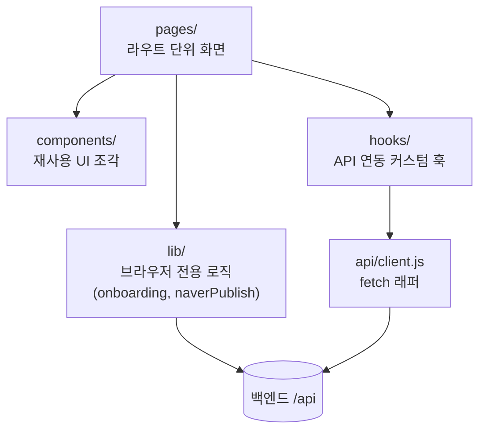
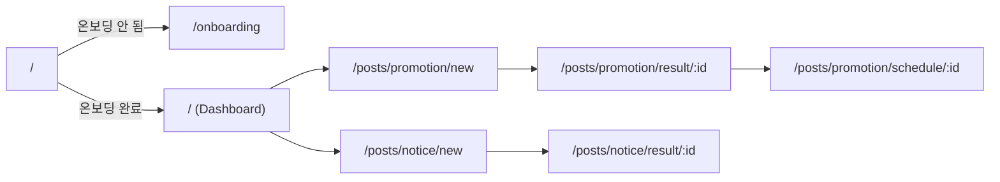

# 프론트엔드 아키텍처 (my-app)

전체 시스템 그림은 [docs/architecture.md](../docs/architecture.md), 기능 정의는 [PROJECT.md](PROJECT.md), 화면 구조/디자인은 [WIREFRAME.md](WIREFRAME.md)/[DESIGN.md](DESIGN.md) 참고. 스택/실행 방법은 [CLAUDE.md](CLAUDE.md)에 정리되어 있어 여기서는 반복하지 않는다.

## 레이어 구조



- **pages/**: `App.jsx`의 라우트와 1:1 대응. 데이터 페칭(훅 호출), 로딩/에러 상태 분기, 하위 컴포넌트 조합을 담당한다.
- **components/**: 특정 화면 이름을 딴 하위 폴더(`brand-onboarding/`, `interview/`, `post-result/`, `schedule-publish/` 등)로 나뉘어, 그 화면에서만 쓰는 조각을 모은다. 여러 화면에서 공유하는 것만 최상위(`Card.jsx`, `TopBar.jsx` 등)에 둔다.
- **hooks/**: 화면이 아니라 API 리소스 단위로 이름 붙인다(`useBrandProfile`, `useBriefing`, `usePosts` 등). 서버 상태만 다루고, UI 상태는 각 컴포넌트/페이지의 `useState`로 둔다.
- **lib/**: React에 묶이지 않는 순수 브라우저 로직. `onboarding.js`(localStorage 플래그), `naverPublish.js`(클립보드/새 탭 발행) 등.
- **api/client.js**: 유일한 fetch 진입점. `VITE_API_BASE_URL`을 읽고, 공통 에러 포맷(`{ error: { code, message } }`)을 파싱해 `Error`로 던진다.

## 라우팅



`RequireOnboarding`(`App.jsx`)이 `/` 접근 시 `isOnboardingComplete()`(localStorage `alrijang:onboardingComplete`)를 확인해 미완료면 `/onboarding`으로 리다이렉트한다. 이 플래그는 서버 상태(`BrandProfile` 존재 여부)와 별개의 클라이언트 전용 게이트라, 서버에 프로필이 없으면 `Dashboard`가 자체적으로 `brandProfileError.code === "BRAND_PROFILE_NOT_FOUND"`를 감지해 다시 `/onboarding`으로 보낸다(이중 안전장치).

## 데이터 페칭 패턴

모든 GET 리소스 훅은 `useApiResource(path)` 하나를 감싸는 얇은 래퍼다([useApiResource.js](src/hooks/useApiResource.js)):

```js
export function useBriefing() {
  return useApiResource("/briefing/today");
}
```

`useApiResource`는 `{ data, isLoading, error, refetch }`를 반환하며, 언마운트/경로 변경 시 이전 요청 결과를 무시하는 cancellation 플래그를 내장한다. 새 리소스를 추가할 때는 전역 상태 관리 라이브러리 없이 이 패턴을 그대로 따른다 — 서버가 유일한 source of truth이고, 클라이언트는 캐싱하지 않는다.

`Dashboard.jsx`처럼 여러 리소스가 필요한 페이지는 훅을 여러 번 호출하고, 개별 `error`를 순서대로 병합해 하나의 에러 화면으로 처리한다(가장 먼저 걸리는 에러 기준).

POST/PATCH/DELETE처럼 사용자 액션으로 트리거되는 변경은 훅이 아니라 페이지/컴포넌트에서 `apiClient`를 직접 호출하고, 성공 시 관련 훅의 `refetch()`를 부른다(예: 게시글 삭제 후 `refetchPosts()`).

## 클라이언트 전용 상태

| 상태 | 저장 위치 | 용도 |
| --- | --- | --- |
| 온보딩 완료 여부 | `localStorage` (`alrijang:onboardingComplete`) | 라우트 가드 |
| 온보딩 1단계 입력값 | `sessionStorage` | 네이버 로그인 풀 리다이렉트 왕복 중 값 보존 |
| 그 외 모든 데이터 | 서버 (Supabase) | 프론트는 캐시하지 않고 매번 재조회 |

## 네이버 반자동 발행 (lib/naverPublish.js)

네이버 블로그 포스팅 공식 API가 없어 서버가 대신 발행할 수 없다. 대신 프론트가 다음을 수행한다:

1. `publishToNaver(text)` — 제목+본문을 클립보드에 텍스트로 복사하고 `blog.naver.com/GoBlogWrite.naver`를 새 탭으로 연다.
2. `copyImageToClipboard(file)` — 사진은 텍스트와 별도로, PNG로 변환한 뒤 `ClipboardItem`으로 복사한다(base64 인라인 이미지는 네이버 에디터가 거부해서 실제 파일 복사 방식을 택함 — 상세 이유는 코드 주석 참고).

이 로직은 `SchedulePublish`(홍보글)와 `NoticeResult`(공지) 양쪽에서 공유한다. 발행 자체는 사용자가 새 탭에서 직접 하고, 이후 "게시 확인하기"로 서버의 `detect-published` 휴리스틱을 거쳐 사용자가 최종 확인한다.

## 디자인 시스템 연계

새 컴포넌트를 만들기 전에는 `design-system` 스킬이 [WIREFRAME.md](WIREFRAME.md)(레이아웃/구조)와 [DESIGN.md](DESIGN.md)(색상/타이포/spacing/radius 토큰)를 참고하도록 되어 있다. `src/index.css`의 Tailwind `@theme`는 DESIGN.md 토큰을 그대로 반영한 것이라, 임의로 색/간격 값을 하드코딩하지 않고 이 토큰을 통해서만 스타일링한다.
