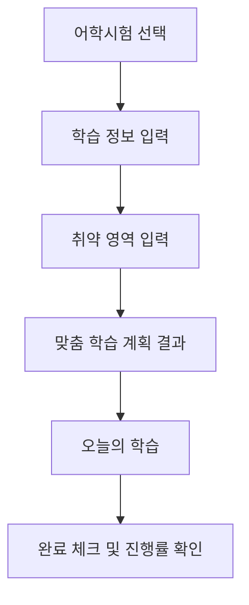

# TOEFL 학습 계획 Agent 기획서

## 1. 서비스 개요

TOEFL을 준비하는 대학생이 현재 실력, 목표 점수, 시험일까지 남은 기간, 하루 공부 가능 시간과 취약 영역을 입력하면 매일 실천할 수 있는 학습 계획을 제공하는 서비스이다. TOEFL 점수는 2026년 1월 21일 이후 적용된 iBT 신점수 체계인 1~6점, 0.5점 단위를 기본으로 한다.

초기에는 TOEFL을 중심으로 구현하고, 이후 TOEIC, OPIc, TOEIC Speaking 등 다른 어학시험으로 확장한다.

## 2. 문제 정의

대학생들은 교환학생, 유학, 해외 대학원 진학 등을 위해 TOEFL 시험을 준비한다. 하지만 TOEFL은 Reading, Listening, Speaking, Writing 영역을 모두 공부해야 하므로, 자신의 현재 실력과 취약 영역을 고려하여 무엇부터 얼마나 공부해야 하는지 결정하기 어렵다.

인터넷에는 다양한 공부 방법과 학습 자료가 있지만, 자신의 목표 점수와 시험일까지 남은 기간에 맞는 정보를 골라 계획으로 만드는 데 많은 시간이 필요하다. 특히 시험을 처음 준비하는 학생은 매일 어떤 영역을 얼마 동안 공부해야 하는지 알기 어렵고, 계획을 세우더라도 구체적인 오늘의 할 일이 없어 꾸준히 실천하지 못하는 경우가 많다.

따라서 사용자의 현재 점수, 목표 점수, 시험일까지 남은 기간, 하루 공부 가능 시간과 취약 영역을 바탕으로 매일 실천할 수 있는 TOEFL 학습 계획을 제공하는 서비스가 필요하다.

## 3. 핵심 사용자

이 서비스의 핵심 사용자는 **TOEFL을 처음 준비하거나, 시험일까지 남은 기간이 짧아 구체적인 학습 계획이 필요한 대학생**이다.

핵심 사용자는 다음과 같은 특징을 가진다.

- 교환학생, 유학, 해외 대학원 진학 등을 위해 TOEFL 점수가 필요하다.
- TOEFL 시험 유형과 영역별 공부 방법을 충분히 알지 못한다.
- 현재 점수와 목표 점수의 차이는 알지만, 어떤 영역을 우선 공부해야 하는지 판단하기 어렵다.
- 학교 수업이나 다른 일정 때문에 하루 공부 시간이 제한적이다.
- 인터넷에서 많은 정보를 찾지만, 자신에게 맞는 계획으로 정리하는 데 어려움을 느낀다.
- 계획은 세우지만 오늘 해야 할 일이 구체적이지 않아 실천이 미뤄지는 경우가 많다.

### 대표 사용자 예시

대학생 A는 교환학생 지원을 위해 6주 뒤 TOEFL 시험을 준비하고 있다. TOEFL iBT 신점수 체계 기준 현재 전체 점수는 3점이고 목표 전체 점수는 5점이지만, 학교 수업과 과제를 병행해야 해 하루에 공부할 수 있는 시간은 2시간뿐이다. Listening과 Speaking이 특히 어렵지만, 네 영역의 학습 시간을 어떻게 배분하고 매일 무엇을 공부해야 하는지 몰라 계획을 세우는 데 어려움을 겪고 있다.

## 4. 사용자가 겪는 불편

- TOEFL을 처음 준비할 때 Reading, Listening, Speaking, Writing 중 무엇부터 공부해야 할지 알기 어렵다.
- 현재 점수와 목표 점수의 차이는 알지만, 목표 달성을 위해 하루에 어느 정도 공부해야 하는지 판단하기 어렵다.
- 인터넷에 공부법과 자료가 많아도 자신의 시험일까지 남은 기간과 취약 영역에 맞는 정보를 직접 골라야 한다.
- 학교 수업과 과제를 병행해야 하므로, 매일 동일한 시간을 공부하기 어렵고 현실적인 계획을 세우기 힘들다.
- 취약 영역에 얼마나 많은 시간을 배분하고, 다른 영역은 어느 정도 유지해야 하는지 결정하기 어렵다.
- 계획을 세워도 ‘Listening 공부하기’처럼 막연하여, 실제로 어떤 문제를 몇 개 풀어야 하는지 알기 어렵다.
- 계획을 제대로 실천하고 있는지, 시험일까지 목표 진도에 도달할 수 있는지 확인하기 어렵다.

## 5. 해결 방법

사용자가 준비할 어학시험을 선택하고 현재 점수, 목표 점수, 시험일, 하루 공부 가능 시간, 취약 영역을 입력하면 Agent가 사용자의 상황을 분석하여 개인별 TOEFL 학습 계획을 생성한다.

Agent는 목표 점수와 시험일까지 남은 기간을 고려해 전체 학습량을 나누고, 취약한 영역에는 더 많은 학습 시간을 배분한다. 이후 사용자가 매일 바로 실천할 수 있도록 학습 내용을 구체적인 단위로 제공한다.

예를 들어 단순히 ‘Listening 공부하기’라고 안내하는 것이 아니라 다음과 같이 구체적으로 제시한다.

- Listening 대화 문제 10개 풀기
- 틀린 문제 다시 듣기
- 모르는 표현 5개 정리하기
- Speaking 문장 10개 따라 말하기
- 예상 학습 시간 30분

사용자는 매일 제공되는 학습 항목을 확인하고, 완료한 항목을 체크할 수 있다. MVP에서는 완료 여부에 따라 오늘의 진행률을 표시하고, 미완료 학습의 자동 재배분은 향후 기능으로 분리한다.

### 서비스 해결 과정

1. 사용자가 어학시험 종류를 선택한다. MVP에서는 TOEFL만 선택 가능하고, 다른 시험은 준비 중으로 표시한다.
2. 사용자가 현재 전체 점수, Reading·Listening·Speaking·Writing의 영역별 점수와 목표 전체 점수를 입력한다.
3. 시험일과 하루 공부 가능 시간을 입력한다.
4. Reading, Listening, Speaking, Writing 중 취약 영역을 선택한다.
5. Agent가 목표 점수와 남은 기간을 규칙 기반으로 분석한다.
6. 영역별 학습 시간과 우선순위를 정한다.
7. 오늘 해야 할 구체적인 학습 항목을 제공한다.
8. 사용자가 완료 여부를 체크하고 오늘의 진행률을 확인한다.

### 핵심 해결 가치

사용자가 공부 계획을 직접 고민하는 시간을 줄이고, 목표 점수를 위해 오늘 무엇을 얼마나 공부해야 하는지 바로 알 수 있도록 한다.

## 6. 사용자 시나리오

1. 대학생 A는 6주 뒤 TOEFL 시험을 준비하기 위해 서비스를 실행한다.
2. 어학시험 선택 화면에서 TOEFL을 선택한다. TOEIC, OPIc, TOEIC Speaking은 준비 중으로 표시되어 선택할 수 없다.
3. TOEFL iBT 신점수 체계 기준 현재 전체 점수와 Reading, Listening, Speaking, Writing의 영역별 점수를 1~6점, 0.5점 단위로 입력한다.
4. 목표 전체 점수와 시험 날짜를 입력한다.
5. 하루에 공부할 수 있는 시간을 입력한다.
6. 특히 어렵다고 느끼는 영역과 구체적인 어려움을 선택하거나 작성한다.
   - 취약 영역: Listening, Speaking
   - 구체적인 어려움: 듣다가 한 부분을 놓치면 이후 내용도 이해하기 어렵고, Speaking에서는 바로 문장을 만들어 말하기 어렵다.

7. Agent는 입력한 정보를 바탕으로 다음 내용을 규칙 기반으로 분석한다.
   - 현재 점수와 목표 점수의 차이
   - 시험일까지 남은 기간
   - 하루 공부 가능 시간
   - 영역별 점수 차이
   - 사용자가 선택한 취약 영역

8. Agent는 우선 학습 영역, 영역별 학습 시간 비율, 이번 주의 간단한 학습 방향을 생성한다.
9. 사용자는 오늘의 학습 화면에서 구체적인 할 일을 확인한다.
   - Listening 대화 문제 10개 풀기
   - 틀린 문제 다시 듣기
   - 모르는 표현 5개 정리하기
   - Speaking 문장 10개 따라 말하기
   - Speaking 질문 2개에 직접 답변하기

10. 사용자는 공부를 마친 항목을 완료 처리한다.
11. 서비스는 완료한 항목과 남은 항목을 바탕으로 오늘의 진행률을 보여준다.
12. 사용자는 시험일까지 매일 오늘의 학습을 확인하고 계획을 따라 공부한다.

## 7. 핵심 기능

### 1. 사용자 학습 정보 입력

사용자가 개인 학습 계획을 만들기 위해 다음 정보를 입력한다.

- 준비하는 어학시험 종류
- 현재 전체 점수: 1~6점, 0.5점 단위
- Reading, Listening, Speaking, Writing 영역별 현재 점수: 1~6점, 0.5점 단위
- 목표 전체 점수: 1~6점, 0.5점 단위
- TOEFL 시험 날짜
- 하루 공부 가능 시간
- 특히 어렵다고 느끼는 영역
- 영역별로 겪고 있는 구체적인 어려움

MVP에서는 TOEFL만 실제 지원하고, TOEIC, OPIc, TOEIC Speaking은 준비 중으로 표시한다.

TOEFL 전체 점수는 네 영역 점수의 합산이 아니라 평균으로 해석한다. 서비스에서 영역별 점수를 바탕으로 전체 점수를 참고할 때는 Reading, Listening, Speaking, Writing 점수의 평균을 사용하고, 필요한 경우 가장 가까운 0.5점 단위로 반올림한다.

### 2. 취약 영역 분석

MVP의 Agent는 실제 AI가 아니라 사전에 정의한 규칙 기반 로직으로 동작한다. 영역별 점수와 사용자가 직접 선택한 어려움을 함께 분석하여 우선적으로 공부해야 할 영역을 정한다.

예를 들어 Listening 점수가 낮고 사용자가 듣기에서 자주 내용을 놓친다고 입력하면, Listening을 우선 학습 영역으로 설정한다.

### 3. 영역별 학습 시간 배분

Agent는 다음 정보를 고려하여 Reading, Listening, Speaking, Writing의 학습 시간을 배분한다.

- 현재 점수와 목표 점수의 차이
- 시험일까지 남은 기간
- 하루 공부 가능 시간
- 영역별 현재 점수
- 사용자가 선택한 취약 영역

취약 영역에는 상대적으로 더 많은 시간을 배분하되, 다른 영역의 학습도 유지할 수 있도록 계획한다.

### 4. 학습 계획 생성

MVP에서는 우선 학습 영역, 영역별 권장 학습 비중, 이번 주의 간단한 학습 목표, 시험일까지의 학습 방향을 생성한다.

향후에는 시험일까지의 전체 학습 기간을 주 단위로 나누어 더 상세한 학습 계획을 생성한다.

주간 계획에는 다음 내용을 보여줄 수 있다.

- 주차별 학습 목표
- 집중해야 할 영역
- 영역별 학습 시간
- 해당 주에 완료해야 할 학습량
- 주간 점검 또는 모의시험 일정

### 5. 오늘의 구체적인 학습 항목 제공

사용자가 계획을 바로 실천할 수 있도록 오늘 해야 할 공부를 구체적으로 제공한다.

예시:

- Listening 대화 문제 10개 풀기
- 틀린 문제 3회 다시 듣기
- 모르는 표현 5개 정리하기
- Speaking 문장 10개 따라 말하기
- Speaking 질문 2개에 답변하고 녹음하기

각 학습 항목에는 예상 소요 시간을 함께 표시한다.

### 6. 학습 완료 체크 및 진행률 표시

사용자는 완료한 학습 항목을 체크할 수 있다.

서비스는 다음 정보를 보여준다.

- 오늘 완료한 학습 항목
- 남은 학습 항목
- 오늘의 학습 진행률
- 이번 주 학습 진행률
- 시험일까지 남은 기간

### 7. 미완료 학습 반영 및 계획 조정

이 기능은 MVP 필수 범위가 아니라 향후 기능이다. 사용자가 계획한 학습을 완료하지 못한 경우, Agent는 미완료 학습의 중요도와 남은 기간을 고려하여 이후 일정에 다시 배분한다.

단순히 모든 미완료 학습을 다음 날로 옮기는 것이 아니라 다음 내용을 고려한다.

- 시험일까지 남은 기간
- 해당 학습의 중요도
- 다음 날 공부 가능 시간
- 사용자의 취약 영역
- 이미 예정된 학습량

### 8. 계획 생성 근거 안내

사용자가 계획을 이해하고 신뢰할 수 있도록, Agent가 학습 계획을 만든 이유를 간단히 설명한다. MVP에서는 시간이 남으면 구현하고, 향후 AI 기능에서는 더 중요한 개인화 설명 기능으로 확장한다.

예시:
> Listening 점수가 다른 영역보다 낮고 사용자가 듣기 이해에 어려움을 느끼고 있어, 이번 주에는 전체 학습시간의 35%를 Listening에 배분했습니다.

### 핵심 기능 흐름

어학시험 선택  
→ 사용자 정보 입력  
→ 취약 영역 분석  
→ 영역별 시간 배분  
→ 학습 계획 생성  
→ 오늘의 학습 제공  
→ 완료 여부 확인

## 8. MVP 범위

### MVP 목표

사용자가 자신의 TOEFL 학습 정보를 입력하면, 취약 영역이 반영된 학습 계획과 오늘의 구체적인 할 일을 확인하고 완료 여부를 기록할 수 있는 프로토타입을 구현한다.

초기 프로토타입에서는 실제 AI API나 서버를 연결하지 않고, 사용자가 입력한 정보와 미리 정의한 규칙을 이용하여 학습 계획을 생성한다.

MVP에서는 2026년 1월 21일 이후 적용된 TOEFL iBT의 1~6점 점수 체계를 기본 입력 방식으로 사용한다.

공식 성적표에는 전환 기간 동안 비교 가능한 0~120점 전체 점수도 함께 제공되며, 사용자가 지원 기관의 요구 기준을 이해하는 데 참고할 수 있다.

다만 초기 MVP의 입력 화면에서는 구현 범위와 사용 흐름을 단순하게 유지하기 위해 1~6점 체계만 지원한다.

향후에는 사용자가 기존 0~120점 점수를 입력하거나 두 점수 체계를 함께 확인할 수 있도록 확장한다.

- 전체 점수와 영역별 점수는 1~6점 범위에서 0.5점 단위로 입력한다.
- 전체 점수는 Reading, Listening, Speaking, Writing 네 영역 점수의 평균으로 해석한다.
- 평균값을 계산해야 할 때는 가장 가까운 0.5점 단위로 반올림한다.

오늘 제작할 순수 HTML·CSS 프로토타입은 MVP의 실제 동작 로직을 구현하는 것이 아니라 화면 흐름과 정보 구조를 보여주는 정적 시안이다. 따라서 실제 점수 분석, 시험일까지 남은 날짜 계산, 영역별 시간 배분, 학습 항목 생성, 완료 체크에 따른 진행률 계산은 구현하지 않고, 샘플 입력값과 샘플 결과 화면으로 표현한다.

### 반드시 구현할 기능

#### 1. 학습 정보 입력

사용자는 다음 정보를 입력할 수 있다.

- 준비하는 어학시험 종류
- 현재 전체 점수: 1~6점, 0.5점 단위
- Reading, Listening, Speaking, Writing 영역별 현재 점수: 1~6점, 0.5점 단위
- 목표 전체 점수: 1~6점, 0.5점 단위
- TOEFL 시험 날짜
- 하루 공부 가능 시간
- 취약 영역
- 구체적으로 어려운 점

준비하는 어학시험 종류는 TOEFL, TOEIC, OPIc, TOEIC Speaking을 보여주되, MVP에서는 TOEFL만 선택 가능하다. 다른 시험은 준비 중으로 표시한다.

#### 2. 입력 정보 요약

사용자가 입력한 내용을 결과 화면에서 다시 확인할 수 있다.

- 현재 점수와 목표 점수
- 시험일까지 남은 기간
- 하루 공부 가능 시간
- 선택한 취약 영역

#### 3. 간단한 취약 영역 분석

영역별 점수와 사용자가 선택한 취약 영역을 기준으로 우선 학습 영역을 정한다.

예시:

- Listening 점수가 가장 낮으면 Listening 학습 비중을 높인다.
- 사용자가 Speaking을 취약 영역으로 선택하면 Speaking 학습 항목을 추가한다.
- 시험일까지 남은 기간이 짧으면 핵심 유형과 실전 문제 중심으로 계획한다.

규칙 기반 MVP의 기본 원칙은 다음과 같다.

- 영역별 점수가 낮은 영역에 우선순위를 부여한다.
- 사용자가 취약 영역으로 선택한 영역에 추가 우선순위를 부여한다.
- 취약 영역의 학습 비중을 높이되, 다른 영역도 최소 학습 항목을 유지한다.
- 오늘의 학습 항목 총 시간은 사용자가 입력한 하루 공부 가능 시간을 넘지 않는다.

#### 4. 학습 계획 결과 제공

사용자에게 다음 내용을 보여준다.

- 우선적으로 공부해야 할 영역
- 영역별 권장 학습 비중
- 이번 주 학습 목표
- 시험일까지의 간단한 학습 방향

#### 5. 오늘의 구체적인 할 일 제공

사용자가 바로 공부를 시작할 수 있도록 학습 항목과 예상 시간을 보여준다.

예시:

- Listening 대화 문제 10개 풀기 — 30분
- 틀린 문제 다시 듣기 — 20분
- Speaking 문장 10개 따라 말하기 — 20분
- Reading 지문 1개 풀기 — 30분

오늘의 학습시간 합계는 사용자가 입력한 하루 공부 가능 시간을 넘지 않도록 구성한다.

MVP는 실제 문제나 학습 자료를 직접 제공하지 않는다. 오늘의 학습 항목은 사용자가 보유한 교재, 문제집, 강의 또는 온라인 자료를 활용해 수행할 과제로 제안한다.

#### 6. 학습 완료 체크

사용자는 완료한 학습 항목을 체크할 수 있다.

완료 상태에 따라 다음 정보를 표시한다.

- 완료한 항목 수
- 남은 항목 수
- 오늘의 진행률
- 오늘의 전체 학습 항목 완료 여부

### 시간이 남으면 구현할 기능

- 미완료 학습을 다음 날의 계획 후보로 표시
- 완료 결과에 따라 다음 학습 추천 문구 변경
- 주간 학습 계획 화면
- 영역별 학습 비중 그래프
- 계획을 생성한 이유 안내
- 입력한 내용을 수정하고 계획 다시 생성
- 브라우저를 닫아도 기록이 남도록 저장
- 기존 0~120점 기준의 비교용 전체 점수 표시

### 이번 MVP에서 제외할 기능

다음 기능은 초기 프로토타입에서 구현하지 않고 이후 버전에서 개발한다.

- 로그인과 회원가입
- 실제 TOEFL 성적표 연동
- 실제 AI API를 이용한 계획 생성
- 데이터베이스와 서버 구축
- 음성 녹음 및 Speaking 자동 평가
- Writing 답안 자동 첨삭
- 문제와 학습 자료 직접 제공
- 문자, 이메일, 앱 알림
- 친구와 학습 계획 공유
- 장기간의 정교한 성적 예측
- 모든 미완료 학습의 자동 재배분
- TOEIC, OPIc 등 다른 시험 지원

### MVP 완료 기준

다음 흐름을 사용자가 처음부터 끝까지 직접 실행할 수 있으면 MVP가 완성된 것으로 본다.

1. 사용자가 어학시험 선택 화면에서 TOEFL을 선택한다.
2. 사용자가 자신의 TOEFL 정보를 1~6점, 0.5점 단위로 입력한다.
3. 취약 영역을 선택한다.
4. 학습 계획 생성 버튼을 누른다.
5. 자신의 입력 정보와 추천 학습 방향을 확인한다.
6. 오늘 해야 할 구체적인 학습 항목을 확인한다.
7. 완료한 학습을 체크한다.
8. 체크 결과에 따라 진행률이 변경되는 것을 확인한다.

## 9. 화면 구성

### 전체 화면 흐름

시작 및 서비스 소개  
→ 어학시험 종류 선택  
→ 학습 정보 입력  
→ 취약 영역 입력  
→ 맞춤 학습 계획 결과  
→ 오늘의 학습 및 완료 체크

### 전체 화면 흐름도



### 화면 와이어프레임

아래 와이어프레임은 순수 HTML·CSS 정적 프로토타입을 위한 시각화 자료이다. 실제 점수 분석, 날짜 계산, 시간 배분, 진행률 계산은 작동하지 않으며, 점수, 학습 비중, 진행률은 샘플 결과로 표시한다.

#### 1. 어학시험 선택 화면

```text
+--------------------------------------------------+
| 어떤 시험을 준비하고 있나요?                    |
+--------------------------------------------------+
| [ TOEFL ] 선택 가능                              |
| [ TOEIC ] 준비 중                                |
| [ OPIc ] 준비 중                                 |
| [ TOEIC Speaking ] 준비 중                       |
|                                                  |
|                         [다음]                   |
+--------------------------------------------------+
```

TOEFL 카드만 선택 가능한 상태로 표시한다.  
TOEIC, OPIc, TOEIC Speaking은 ‘준비 중’으로 표시하고 선택 동작이 없는 정적 카드로 표현한다.  
사용자가 [다음] 버튼을 누르면 학습 정보 입력 화면으로 이동하는 흐름을 보여준다.

#### 2. 학습 정보 입력 화면

```text
+--------------------------------------------------+
| 학습 정보 입력                                   |
+--------------------------------------------------+
| 현재 전체 점수: [ 3.0 ]  샘플 입력              |
| 목표 전체 점수: [ 5.0 ]  샘플 입력              |
| Reading:  [ 3.5 ]                                |
| Listening:[ 2.5 ]                                |
| Speaking: [ 2.5 ]                                |
| Writing:  [ 3.0 ]                                |
| 시험 날짜: [ 2026-09-01 ] 샘플 입력             |
| 하루 공부 가능 시간: [ 2시간 ] 샘플 입력        |
|                                                  |
| [이전]                              [다음]       |
+--------------------------------------------------+
```

입력값은 1~6점, 0.5점 단위의 샘플 값으로 보여준다.  
오늘 프로토타입에서는 날짜 계산이나 점수 검증을 실제로 수행하지 않는다.  
사용자가 [다음] 버튼을 누르면 취약 영역 입력 화면으로 이동하는 흐름을 보여준다.

#### 3. 취약 영역 입력 화면

```text
+--------------------------------------------------+
| 취약 영역 입력                                   |
+--------------------------------------------------+
| 취약 영역 선택                                  |
| [ ] Reading   [x] Listening                     |
| [x] Speaking  [ ] Writing                       |
|                                                  |
| 구체적인 어려움                                 |
| [듣다가 한 부분을 놓치면 이후 내용도 어렵다]    |
| [Speaking에서 바로 문장을 만들기 어렵다]        |
|                                                  |
| [이전]                    [학습 계획 만들기]     |
+--------------------------------------------------+
```

취약 영역과 어려움은 샘플 선택값으로 표시한다.  
오늘 프로토타입에서는 선택값을 바탕으로 실제 분석을 수행하지 않는다.  
사용자가 [학습 계획 만들기] 버튼을 누르면 샘플 맞춤 학습 계획 결과 화면으로 이동하는 흐름을 보여준다.

#### 4. 맞춤 학습 계획 결과 화면

```text
+--------------------------------------------------+
| 맞춤 학습 계획 결과                              |
+--------------------------------------------------+
| 입력 요약                                        |
| - 시험: TOEFL                                    |
| - 현재 전체 점수: 3.0점 샘플                    |
| - 목표 전체 점수: 5.0점 샘플                    |
| - 취약 영역: Listening, Speaking 샘플           |
|                                                  |
| 샘플 추천 결과                                  |
| - 우선 학습 영역: Listening                     |
| - 영역별 학습 비중: L 40% / S 30% / R 15% / W 15% |
| - 이번 주 목표: 듣기 감각 회복과 말하기 연습    |
|                                                  |
| [입력 정보 수정]              [오늘의 학습 확인] |
+--------------------------------------------------+
```

점수, 우선 학습 영역, 학습 비중은 모두 샘플 결과로 표시한다.  
오늘 프로토타입에서는 실제 점수 분석이나 시간 배분 로직을 구현하지 않는다.  
사용자가 [오늘의 학습 확인] 버튼을 누르면 오늘의 학습 화면으로 이동하는 흐름을 보여준다.

#### 5. 오늘의 학습 화면

```text
+--------------------------------------------------+
| 오늘의 학습                                      |
+--------------------------------------------------+
| 샘플 오늘의 총 학습시간: 2시간                  |
| 샘플 진행률: 40%                                 |
|                                                  |
| [x] Listening 대화 문제 10개 풀기 - 30분 샘플   |
| [x] 틀린 문제 다시 듣기 - 20분 샘플             |
| [ ] Speaking 문장 10개 따라 말하기 - 20분 샘플  |
| [ ] Speaking 질문 2개 답변하기 - 20분 샘플      |
| [ ] Reading 지문 1개 풀기 - 30분 샘플           |
|                                                  |
| [학습 계획으로 돌아가기]     [계획 다시 만들기] |
+--------------------------------------------------+
```

학습 항목, 완료 상태, 진행률은 샘플 결과로 표시한다.  
오늘 프로토타입에서는 체크 여부에 따라 진행률을 실제로 계산하지 않는다.  
사용자가 [계획 다시 만들기] 버튼을 누르면 어학시험 선택 또는 학습 정보 입력 화면으로 돌아가는 흐름을 보여준다.

---

### 화면 1. 시작 화면

#### 목적

사용자에게 서비스가 어떤 도움을 제공하는지 간단히 소개하고, 학습 계획 생성을 시작하도록 안내한다.

#### 화면에 들어갈 내용

- 서비스 이름
- 한 줄 소개
- 서비스의 핵심 기능 안내
- 학습 계획 만들기 버튼

#### 문구 예시

> 목표 점수까지 무엇을 공부해야 할지 막막한가요?  
> 현재 실력과 남은 기간을 입력하면 오늘부터 실천할 수 있는 TOEFL 학습 계획을 만들어드립니다.

#### 주요 버튼

- 학습 계획 만들기

---

### 화면 2. 어학시험 종류 선택 화면

#### 목적

사용자가 학습 계획을 만들고 싶은 어학시험을 선택한다.

초기 MVP에서는 TOEFL만 지원하지만, 이후 다른 어학시험으로 확장할 수 있는 서비스 구조를 보여준다.

#### 선택 가능한 시험

- TOEFL: 선택 가능
- TOEIC: 준비 중
- OPIc: 준비 중
- TOEIC Speaking: 준비 중

#### 화면 문구 예시

> 어떤 시험을 준비하고 있나요?  
> 선택 가능한 시험을 고르면 시험 유형에 맞는 학습 계획을 만들어드립니다.

#### 주요 기능

- TOEFL 카드를 클릭하면 선택 상태가 표시된다.
- 지원하지 않는 시험에는 ‘준비 중’ 표시를 보여준다.
- 시험을 선택하지 않으면 다음 단계로 이동할 수 없다.
- 선택한 시험 정보는 이후 학습 계획 결과에도 표시한다.

#### 주요 버튼

- 이전
- 다음

---

### 화면 3. 학습 정보 입력 화면

#### 목적

사용자의 현재 실력, 목표와 학습 가능 조건을 입력받는다.

#### 입력 항목

- 현재 전체 점수: 1~6점, 0.5점 단위
- Reading 현재 점수: 1~6점, 0.5점 단위
- Listening 현재 점수: 1~6점, 0.5점 단위
- Speaking 현재 점수: 1~6점, 0.5점 단위
- Writing 현재 점수: 1~6점, 0.5점 단위
- 목표 전체 점수: 1~6점, 0.5점 단위
- TOEFL 시험 날짜
- 하루 공부 가능 시간

#### 주요 기능

- 필수 입력값 확인
- 시험일까지 남은 기간 계산
- 이전 및 다음 화면 이동

#### 주요 버튼

- 이전
- 다음

---

### 화면 4. 취약 영역 입력 화면

#### 목적

영역별 점수만으로 알기 어려운 사용자의 실제 어려움을 확인한다.

#### 선택 항목

- Reading
- Listening
- Speaking
- Writing

취약 영역은 여러 개 선택할 수 있다.

#### 구체적인 어려움 예시

- 긴 지문을 읽을 때 핵심 내용을 놓친다.
- 듣다가 한 부분을 놓치면 이후 내용을 이해하기 어렵다.
- 질문을 듣고 바로 영어 문장을 만들기 어렵다.
- 문장 구조와 표현을 자연스럽게 작성하기 어렵다.

#### 직접 입력 항목

- 공부하면서 특히 어려운 점
- 원하는 공부 방식 또는 고려할 사항

#### 주요 버튼

- 이전
- 학습 계획 만들기

---

### 화면 5. 맞춤 학습 계획 결과 화면

#### 목적

사용자가 입력한 내용을 요약하고, 우선 학습 영역과 전체 학습 방향을 보여준다.

#### 입력 정보 요약

- 현재 전체 점수
- 목표 전체 점수
- 시험일까지 남은 기간
- 하루 공부 가능 시간
- 선택한 취약 영역

#### 추천 결과

- 가장 우선적으로 공부해야 할 영역
- 영역별 권장 학습 비중
- 이번 주 핵심 목표
- 시험일까지의 단계별 학습 방향
- 계획을 이렇게 만든 간단한 이유(시간이 남으면 표시)

#### 결과 예시

> Listening 점수가 다른 영역보다 낮고, 듣는 중 일부 내용을 놓치면 이후 내용도 이해하기 어렵다고 입력했습니다. 따라서 이번 주에는 전체 학습시간 중 Listening 비중을 가장 높게 배분했습니다.

#### 주요 버튼

- 입력 정보 수정
- 오늘의 학습 확인

---

### 화면 6. 오늘의 학습 화면

#### 목적

사용자가 고민하지 않고 바로 공부를 시작할 수 있도록 오늘의 구체적인 할 일을 보여준다.

#### 오늘의 학습 항목 예시

- Listening 대화 문제 10개 풀기 — 30분
- 틀린 문제 다시 듣기 — 20분
- 모르는 표현 5개 정리하기 — 10분
- Speaking 문장 10개 따라 말하기 — 20분
- Speaking 질문 2개에 답변하기 — 20분
- Reading 지문 1개 풀기 — 20분

#### 화면에 표시할 정보

- 오늘의 총 학습시간
- 완료한 항목 수
- 남은 항목 수
- 오늘의 진행률
- 시험일까지 남은 날짜

#### 주요 기능

- 학습 항목별 완료 체크
- 완료 상태에 따른 진행률 변경
- 모든 항목 완료 시 완료 메시지 표시

#### 완료 메시지 예시

> 오늘의 학습을 모두 완료했습니다.  
> 취약 영역을 집중적으로 학습하면서도 다른 영역의 감각을 유지할 수 있도록 계획했습니다.

#### 주요 버튼

- 학습 계획으로 돌아가기
- 계획 다시 만들기

---

### 화면 구현 우선순위

#### 반드시 구현할 화면

1. 어학시험 종류 선택 화면
2. 학습 정보 입력 화면
3. 취약 영역 입력 화면
4. 맞춤 학습 계획 결과 화면
5. 오늘의 학습 화면

#### 시간이 남으면 구현할 화면

- 별도의 시작 화면
- 주간 계획 상세 화면
- 영역별 학습 비중 그래프
- 학습 기록 화면

### 화면 구성 원칙

- 사용자가 현재 어느 단계에 있는지 알 수 있도록 진행 단계를 표시한다.
- 한 화면에 너무 많은 정보를 보여주지 않는다.
- 입력 항목과 버튼의 이름은 초보 사용자도 이해할 수 있게 작성한다.
- 모바일과 PC에서 모두 사용하기 편하도록 구성한다.
- 중요한 버튼은 화면 아래쪽에서 쉽게 찾을 수 있도록 배치한다.

## 10. 향후 확장 방향

초기 MVP에서는 TOEFL 학습 계획 생성과 오늘의 학습 관리 기능을 중심으로 구현한다. 이후 사용자 피드백과 서비스 사용 결과를 바탕으로 다음과 같이 확장한다.

### 1. 다른 어학시험 지원

TOEFL에서 사용한 학습 계획 생성 구조를 바탕으로 다음 시험을 추가한다.

- TOEIC
- OPIc
- TOEIC Speaking
- IELTS

시험마다 점수 체계, 영역, 문제 유형과 학습 방법이 다르므로 시험별 입력 항목과 학습 계획 생성 규칙을 별도로 구성한다.

### 2. 실제 AI 기반 학습 계획 생성

초기에는 미리 정의한 규칙과 샘플 데이터를 이용하지만, 이후에는 AI를 연결하여 사용자의 상황에 맞는 학습 계획을 더욱 구체적으로 생성한다.

AI는 다음 정보를 종합적으로 고려한다.

- 현재 전체 점수와 영역별 점수
- 목표 점수
- 시험일까지 남은 기간
- 하루 및 요일별 공부 가능 시간
- 취약 영역과 구체적인 어려움
- 학습 완료 기록
- 사용자가 선호하는 공부 방식

AI 연결 전까지는 규칙 기반 로직으로 학습 비중과 오늘의 학습 항목을 생성한다.

### 3. 기존 TOEFL 점수 체계 보조 표시

TOEFL iBT 신점수 체계는 1~6점 척도를 사용하지만, 공식 성적표에는 전환 기간 동안 비교 가능한 0~120점 전체 점수도 함께 제공된다.

향후에는 사용자가 기존 0~120점 점수를 입력하거나, 1~6점 점수와 0~120점 기준의 비교용 전체 점수를 함께 확인할 수 있도록 한다.

### 4. 학습 결과에 따른 계획 자동 조정

사용자가 계획한 학습을 완료하지 못하거나 특정 영역에서 계속 어려움을 겪는 경우, 이후 계획을 자동으로 조정한다.

예를 들어 Listening 학습 완료율이 낮거나 학습 후에도 어려움이 지속되면 다음 주 Listening 학습시간과 복습 항목을 늘릴 수 있다.

### 5. 요일별 학습 가능 시간 설정

현재 MVP에서는 하루 평균 공부 가능 시간을 입력하지만, 이후에는 요일마다 다른 학습 가능 시간을 설정할 수 있도록 한다.

예시:

- 월요일: 1시간
- 화요일: 2시간
- 수요일: 공부 불가능
- 주말: 3시간

이를 통해 대학생의 수업, 과제와 아르바이트 일정을 반영한 현실적인 학습 계획을 제공한다.

### 6. 모의시험 및 점수 변화 기록

사용자가 모의시험 점수와 영역별 학습 결과를 기록할 수 있도록 한다.

서비스는 다음 정보를 보여준다.

- 전체 점수 변화
- 영역별 점수 변화
- 목표 점수까지 남은 차이
- 학습시간과 점수 변화의 관계
- 추가 학습이 필요한 영역

### 7. Speaking 및 Writing 학습 지원

향후에는 단순히 학습 항목을 추천하는 것을 넘어 사용자의 답안을 직접 분석하는 기능을 추가한다.

- Speaking 답변 녹음
- 발음과 유창성 피드백
- 답변 구조와 내용 피드백
- Writing 답안 입력
- 문법과 표현 첨삭
- 답안 구조 개선 안내

### 8. 맞춤형 학습 자료 추천

사용자의 취약 영역과 현재 수준에 맞는 학습 자료를 추천한다.

- 문제 유형별 연습 자료
- 단어와 표현 목록
- 복습이 필요한 오답
- Speaking 연습 질문
- Writing 연습 주제
- 무료 강의와 공식 학습 자료

### 9. 학습 알림 및 동기부여

사용자가 계획을 잊지 않고 꾸준히 실천할 수 있도록 알림 기능을 제공한다.

- 오늘의 학습 시작 알림
- 미완료 학습 알림
- 시험일까지 남은 기간 안내
- 주간 목표 달성 안내
- 연속 학습일 표시

### 10. 사용자 계정 및 기록 저장

로그인 기능과 데이터베이스를 추가하여 사용자가 여러 기기에서도 자신의 학습 계획과 기록을 확인할 수 있도록 한다.

저장할 정보는 다음과 같다.

- 시험 및 목표 정보
- 생성된 학습 계획
- 일별 완료 기록
- 모의시험 점수
- 계획 변경 내역
- 영역별 학습시간

### 단계별 확장 계획

#### 1단계: 초기 MVP

- TOEFL 학습 정보 입력
- 취약 영역 분석
- 간단한 학습 계획 생성
- 오늘의 학습 제공
- 완료 체크 및 진행률 표시

#### 2단계: 개인화 강화

- 요일별 공부 가능 시간 입력
- 학습 기록 저장
- 미완료 학습 재배분
- 모의시험 점수 기록
- 학습 결과에 따른 계획 조정

#### 3단계: AI 기능 연결

- 실제 AI 기반 계획 생성
- 계획 생성 근거 설명
- Speaking 및 Writing 피드백
- 개인별 학습 자료 추천

#### 4단계: 지원 시험 확대

- TOEIC
- OPIc
- TOEIC Speaking
- IELTS

### 최종 목표

사용자가 시험 준비 방법을 직접 찾아보고 계획을 반복해서 수정하는 부담을 줄이고, 학습 결과에 따라 계획을 지속적으로 조정해주는 개인 맞춤형 어학시험 학습 Agent로 발전시키는 것을 목표로 한다.
