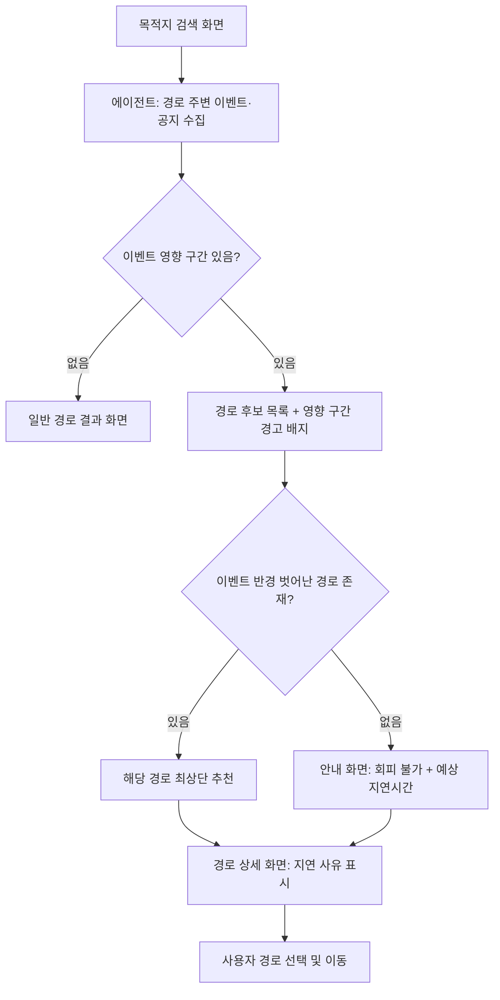

## 문제 정의
목적지 근처에서 열리는 축제 등 이벤트로 대중교통 노선이 변경되거나 도로가 통제될 때, 그 사실을 미리 알지 못하는 이용자가 이동 중 갑작스러운 지연과 불편을 겪는다.

## 사용자 시나리오
1. 사용자가 목적지(미용실)를 검색한다.
2. 에이전트가 경로 주변의 축제·행사 공지, 대중교통 노선 변경 정보를 실시간으로 수집한다.
3. 버스회사·지자체 공지에 등록된 노선 변경 정보(예: "대전 빵축제로 인한 612번 우회")를 반영해, 영향받는 구간에 경고를 표시한다.
4. 여러 경로 후보 중 이벤트 반경에서 가장 멀리 떨어진 경로를 우선 추천한다.
5. 모든 경로 후보가 이벤트 영향권일 경우, 회피가 어렵다는 사실과 예상 지연 시간을 함께 안내한다.
6. 사용자는 추천 경로와 경고 내용을 참고해 이동 방법을 최종 선택한다.

## 핵심 기능 (2개)
- **기능 A — 이벤트/공지 자동 수집 에이전트**: 스포츠 경기, 학교·지역 축제, 대중교통 노선 변경 공지 등을 여러 소스에서 주기적으로 크롤링·수집
- **기능 B — 이벤트 반경 기반 경로 재정렬 추천**: 기존 경로 후보 중 이벤트 반경에서 가장 먼 경로를 우선 추천 (새 라우팅 알고리즘 없이 기존 후보 재정렬로 처리)

## 화면 흐름

