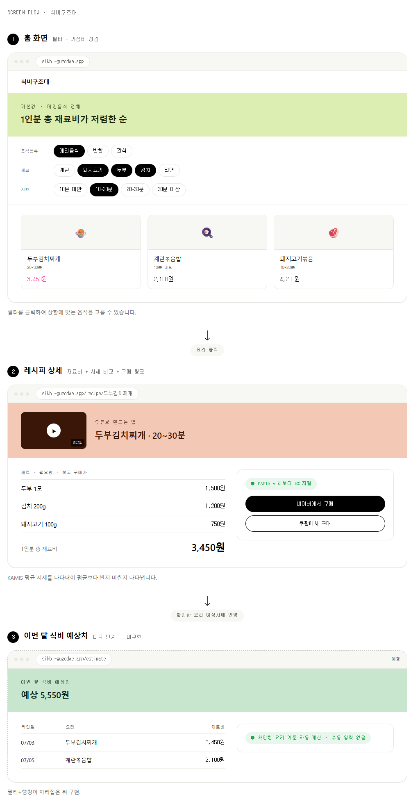

# 끼니픽 — 프로젝트 기획

> 똑똑하게 고르고, 맛있게 아끼는 한 끼

## 브랜드 · 캐릭터
- **서비스명**: 끼니픽 (기존 "식비구조대"에서 리브랜딩)
- **마스코트**: 기니피그 캐릭터 '기니' — 끼니픽의 가이드 역할. 돋보기로 재료를 살펴보고, 계산기를 두드리고, 절약에 성공하면 함께 기뻐하는 등 사용자의 감정 흐름(탐색 → 계산 → 발견 → 절약 성공)에 맞춰 다양한 표정·포즈로 등장
- **홈 화면 오프닝 연출**: 원룸(자취방) 공간 일러스트 안에 문이 열린 냉장고가 있고, 그 옆에 기니가 서서 열린 냉장고 안을 들여다보며 "어떤 재료가 있더라?" 하는 장면으로 시작. 이 장면이 곧 "지금 냉장고 재료를 골라줘"라는 유도 역할을 함
- **톤앤매너**: 귀엽고 친근한 일러스트 중심. 기존에 검토했던 Figma/Miro 스타일(`DESIGN.md`, `miro/DESIGN.md`)은 마스코트 방향과 안 맞아 재검토 필요 — 캐릭터 일러스트가 확정되는 대로 색상·타이포 톤을 마스코트에 맞춰 다시 정의할 예정
- **주의**: 캐릭터 디자인은 아직 확정이 아니라 계속 수정될 예정. 화면 목업에 넣을 때도 "최종본"이 아니라 방향성 참고로만 사용

## 문제 정의
- **누가**: 대학생·사회초년생 등 예산이 빠듯한 1인 가구
- **언제**: 월급·용돈이 빠듯한 시기
- **어디서**: 네이버·쿠팡 등 여러 쇼핑몰 앱을 오가며
- **무엇을**: 재료 핫딜이 뜰 때 사거나 식재료가 필요할때 다른 마켓과 가격을 비교해 구매한다. 
- **어떻게**: 개별 재료를 하나씩 따로 사다 보니, 요리 한 그릇의 총 재료비는 확인하지 못한 채 구매, 이 과정이 되게 병목이기 때문에  요리의 가성비를 먼저 계산하여 구매하는 것이 필요
- **왜**: 기존 가격비교 서비스가 상품 단위 최저가 비교에는 강하지만 "요리 단위 총 재료비"는 계산해주지 않아, 결국 예산보다 더 많은 돈을 쓰게 되는 문제가 해결되지 않고 있음

## 기존 서비스 분석 (참고할 점)
| 카테고리 | 예시 서비스 | 제공하는 것 | 부족한 것 |
|---|---|---|---|
| 가격비교 | 다나와, 네이버 가격비교 | 개별 상품 단위 최저가 비교는 매우 강력 | "요리 한 그릇" 단위 총 비용은 계산 안 해줌 |
| 레시피 | 만개의레시피 | 요리별 재료 목록·조리법 제공, 종류별/상황별/재료별/방법별 필터로 좁혀보는 UX | 실시간 가격·구매 링크 연동 없음 |
| 신선식품 커머스 | 마켓컬리, 쿠팡프레시 | 레시피 기반 재료 세트 판매(자사 상품) | 타 쇼핑몰 가격 비교 안 됨, 자사 상품만 유도 |

**따라 하면 좋을 점:**
- 다나와식 "쇼핑몰 목록 형태로 구매 링크 모아 보여주기" UI (실제 최저가 순위는 API 연동 전까지 표시 안 함)
- 마켓컬리식 "큰 상품 사진 + 굵고 큰 가격 강조" 카드 디자인
- 레시피 대표 사진은 유튜브 영상 썸네일을 사용하고, 상세 화면에서 그 영상으로 바로 연결 (만드는 법도 함께 보여줌)
- 만개의레시피식 "필터로 좁혀보기" UX — 다만 종류별/상황별/재료별/방법별을 그대로 따라 하지 않고, 우리 서비스 목적(가성비)에 맞게 **음식종류·시간·재료** 3가지로 재구성

**차별점(핵심 기회):** "요리 단위 가성비 랭킹 + 공공 시세 기반 자동 계산 + 실제 구매 링크"를 한 번에 묶어 제공하는 서비스가 없음 — 이 조합이 이 프로젝트의 핵심 가치.

## 사용자 시나리오
1. 앱을 열면 원룸 배경의 홈 화면이 나온다. 문이 열린 냉장고 옆에 기니가 서서 냉장고 안을 들여다보며 "어떤 재료가 있더라?" 하고 있고, 그 아래 대표 재료 체크리스트가 있다.
2. 사용자가 실제로 냉장고에 있는 식재료들을 고르면 저장된다.
3. 고른 재료가 들어가는 요리들이 1인분 총 재료비가 저렴한 순으로 같은 화면에 나타난다 (스크롤하면 계속 이어짐). 음식종류·시간 필터로 더 좁힐 수 있다.
4. 마음에 드는 요리를 클릭하면 재료 목록이 나오는데, 냉장고에 있다고 고른 재료는 "보유"로, 없는 재료는 "구매 필요"로 구분돼 있고 1인분 총 재료비도 함께 보인다.
5. "구매 필요" 재료를 클릭해 네이버쇼핑 구매 링크로 이동한다.
6. (다음 단계) 지금까지 확인한 요리들을 바탕으로 이번 달 식비 예상치를 확인한다.

## 핵심 기능 (2개)
- **기능 A: 냉장고 재료 선택 → 보유 재료 기반 저렴한 레시피 추천**
  - 홈 화면 자체가 "원룸 + 문 열린 냉장고 + 냉장고를 들여다보는 기니" 장면으로 시작. 이 장면 아래에 자취생이 자주 쓰는 대표 재료 10개 내외를 체크리스트로 보여주고, 사용자가 지금 냉장고에 있는 재료를 고르면 저장됨
  - 고른 재료가 들어가는 요리들을 1인분 총 재료비가 저렴한 순으로 같은 화면에 추천 리스트로 보여줌 (Top10처럼 개수를 제한하지 않고 스크롤하면 계속 이어짐)
  - 음식종류(메인음식/반찬/간식)·시간(10분 미만/10~20분/20~30분/30분 이상) 필터로 추천 리스트를 추가로 좁힐 수 있음
- **기능 B: 레시피 상세 — 보유/구매 필요 재료 구분 + 부족한 재료 구매 링크**
  - 재료 목록에서 냉장고에 있다고 고른 재료는 "보유"로 표시하고, 없는 재료는 "구매 필요"로 구분해서 보여줌 — 이미 있는 재료까지 다시 안 사도 되게 명확히 나눔
  - 요리별 1인분 총 재료비는 네이버/쿠팡에서 실제로 살 수 있는 가격(현재는 수동 참고가, 네이버는 검색 오픈API 연동으로 실시간화 진행 중, 쿠팡은 파트너스 승인 전까지 수동 유지) 기준으로 계산
  - 공공데이터포털(KAMIS) 평균 시세는 총 재료비 계산에 쓰지 않고, "지금 참고 구매가가 시세보다 싼지/비싼지" 비교하는 기준으로만 사용해 사용자가 사기 좋은 시점인지 판단하도록 도움
  - "구매 필요" 재료만 클릭하면 네이버 검색 링크로 연결 (쿠팡은 파트너스 승인 후 추가 예정)

**우선순위에서 미룬 기능:** 이번 달 식비 예상치 — 사용자가 확인한 요리들의 총 재료비를 브라우저에 누적해 이번 달 예상 식비를 보여주는 기능(수동 지출 입력 없음). 필터+랭킹 기능이 자리잡은 뒤 다음 단계로 진행 예정 (`checklist.md` 참고).

## 기술 스택
- 프론트엔드: React + Vite (기존 프로젝트 유지) + Tailwind CSS
- 백엔드: Vercel Serverless Functions (Node.js) — KAMIS API 키·네이버 Client ID/Secret을 서버 환경변수로 보관, 프론트에는 노출 안 함
- 데이터 저장: 이번 달 식비 예상치 계산에 쓰는 요리 확인 기록은 브라우저 localStorage (추후 로그인+DB로 교체 가능하도록 저장 로직을 별도 모듈로 분리)
- 가격 데이터: 요리 총 재료비 계산은 재료별 참고 구매가(현재는 수동 관리, 네이버쇼핑 검색 오픈API 연동을 우선 진행 중 — 승인 없이 바로 발급되는 개발자 API라 쿠팡보다 먼저 진행)를 사용. KAMIS 농산물유통정보 오픈API는 이 참고 구매가가 평균 시세보다 싼지 비싼지 비교하는 용도로만 사용 (농산물에만 적용, 고기·수산물·조미료 등은 시세 비교 대상 아님)
- 레시피 데이터: 직접 큐레이션한 요리를 JSON으로 관리하고, 필터에 쓸 음식종류·예상 조리시간·주재료 태그를 함께 저장. 대표 사진은 유튜브 영상 썸네일(`img.youtube.com`)을 사용하고 영상 링크로 연결
- 구매 연결: 네이버는 네이버쇼핑 검색 오픈API(승인 불필요, `/api/naver-search` 서버리스 함수로 프록시)로 실제 상품·가격 데이터 연동 진행. 쿠팡은 쿠팡파트너스 신청·승인 전까지 검색 결과 딥링크 방식 유지 (신청 자체는 뒤로 미룸)
- 배포: Vercel

## 화면 흐름
1. **홈 화면 (냉장고 씬)**: 상단은 원룸 배경 + 문 열린 냉장고 + 냉장고를 들여다보는 기니 일러스트, 그 아래 대표 재료 체크리스트, 그 아래 음식종류·시간 필터, 맨 아래 고른 재료가 들어가는 요리를 가격순으로 나열한 추천 리스트 (스크롤하면 계속 이어짐)
2. **레시피 상세 화면**: 재료 목록(이름·필요량·참고 구매가, 보유/구매 필요 구분) + 총 재료비 + 유튜브 만드는 법 링크 + "구매 필요" 재료의 네이버 구매 링크
3. **(다음 단계) 이번 달 식비 예상치 화면**: 이번 달 확인한 요리 목록 + 예상 총 식비

> 이 이미지는 리브랜딩 전(식비구조대 시절) 버전이라 냉장고 씬·기니 캐릭터·보유/구매 필요 구분이 반영돼 있지 않음 — 캐릭터 디자인이 정리되는 대로 다시 그려야 함

**핵심 기능 프로토타입:** [pyojung.github.io/hub/prototype/index.html](https://pyojung.github.io/hub/prototype/index.html) — 필터→랭킹→상세→구매 링크 흐름을 순수 HTML/CSS로 구현 (필터는 JS 없이 CSS `:has()`로 실제 동작, Chrome/Edge/Safari·Firefox 121+ 권장). GitHub Pages로 배포돼 있어 클릭하면 바로 동작하는 화면을 확인할 수 있음. (저장소 안에서는 [`prototype/index.html`](prototype/index.html) 경로)

## 데이터 흐름
1. 사용자가 홈 화면에서 냉장고 속 재료를 고르면 그 목록을 저장
2. 고른 재료가 하나 이상 들어가는 요리를 후보로 추림 (재료 매칭 기준은 추후 실제 사용성을 보고 조정 가능)
3. (하루 1회 배치, 예정) KAMIS API에서 농산물 평균 시세를 가져와 재료별 참고 구매가와 비교해 "시세보다 싼지/비싼지" 판단
4. 후보 요리들의 재료별 참고 구매가를 합산해 1인분 총 재료비를 계산하고, 저렴한 순으로 정렬 — 음식종류·시간 필터가 있으면 추가로 좁힘
5. 프론트엔드는 이 추천 리스트를 홈 화면에 표시하고, 재료 선택이나 필터를 바꾸면 다시 계산해 보여줌
6. 사용자가 요리를 클릭하면 재료 목록을 보여주되, 1번에서 고른 보유 재료는 "보유"로, 나머지는 "구매 필요"로 표시하고 "구매 필요" 재료에만 네이버 구매 링크를 붙임
7. (다음 단계) 사용자가 요리를 확인할 때마다 이번 달 식비 예상치에 반영해 localStorage에 저장

## 알려진 제약/리스크
- 캐릭터(기니) 일러스트와 브랜드 톤앤매너가 아직 확정 전이라 계속 바뀔 수 있음 — 화면 디자인을 캐릭터에 맞춰 다시 잡는 작업이 별도로 필요하고, 기존 `DESIGN.md`/`miro/DESIGN.md`(Figma·Miro 참고)와 프로토타입(`prototype/`)은 리브랜딩 전 스타일이라 나중에 다시 정리해야 함
- 서비스명이 "식비구조대"에서 "끼니픽"으로 바뀌면서 `README.md`·로고 이미지(`src/assets/logo-*.png`)·프로토타입 파일 제목 등 다른 문서·리소스는 아직 예전 이름 그대로라 별도로 맞춰야 함
- 네이버쇼핑 검색 오픈API는 검색 결과 상품·가격 데이터는 주지만 제휴 수수료가 붙는 구매 링크는 아님 (그건 네이버 커머스API 영역이라 승인 필요, 지금 범위 아님)
- 쿠팡은 쿠팡파트너스 미신청 상태라 재료별 참고 구매가·구매 링크가 검색 결과로 대체됨 (신청·승인 후 실시간 가격·제휴 링크로 교체 예정, 지금은 신청 자체를 미룸)
- KAMIS는 농산물 위주라 시세 비교 배지도 농산물 재료에만 적용되고, 고기·수산물·조미료·가공식품은 시세 비교를 제공하지 못함
- 레시피 데이터가 수동 큐레이션이라 초기 요리 가짓수가 적음
- 레시피 영상은 검색으로 고른 것이라 공식 제휴 채널이 아니며, 영상이 비공개/삭제되면 썸네일이 깨질 수 있음
- 요리별 "예상 조리시간"은 실측이 아니라 대략적인 추정치라 실제 조리 시간과 다를 수 있음
- 재료 필터가 대표 재료 10개 내외로 한정돼 있어, 목록에 없는 재료로는 필터링할 수 없음
