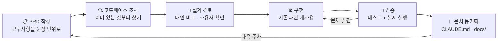

# Mealyze — 사진 한 장으로 끝내는 영양 관리

> **음식 사진 한 장 → 내 몸 기준 부족 영양소 진단 → 그걸 채울 메뉴·주변 식당 추천**
> 한국어 영양 관리 웹서비스 · Naver Connect / Boostcamp AI Agent Challenge

---

## 1. 왜 만들었나

### 문제

| 현실 | 결과 |
|---|---|
| 학교 급식·주변 식당엔 영양 정보가 **없다** | 뭘 먹었는지 계산 자체가 불가능 |
| 칼로리를 매번 손으로 검색·기록해야 한다 | 3일이면 포기한다 |
| "지금 내 몸에 뭐가 부족한지"는 더 모른다 | 칼로리만 알아봐야 행동으로 안 이어진다 |

### 차별점 — "칼로리 계산기"에서 멈추지 않는다

```
       일반 식단 앱                      Mealyze
    ┌──────────────┐              ┌──────────────┐
    │  사진 → 칼로리  │              │  사진 → 칼로리  │
    └──────────────┘              ├──────────────┤
         (여기서 끝)                │ + 내 몸 기준 진단 │  ← BMR/TDEE 개인 권장량
                                  ├──────────────┤
                                  │ + 부족 영양소 특정 │  ← 6대 영양소 3단계 판정
                                  ├──────────────┤
                                  │ + 보충 메뉴 추천  │
                                  ├──────────────┤
                                  │ + 주변 식당 추천  │  ← 거리 30% + 영양충족 70%
                                  └──────────────┘
                                        (행동까지 연결)
```

### 설계 원칙

- **게스트 우선** — 로그인은 선택. 앱을 열면 바로 촬영 화면. 모든 기능이 비로그인으로 동작한다.
- **수치의 출처를 숨기지 않는다** — 모든 영양 수치에 출처 배지(식약처DB / 레시피DB / 추정)를 붙인다.
- **AI를 믿되 검증한다** — AI는 "무엇을 얼마나"만 판단하고, 실제 수치는 공공 DB가 이긴다.

---

## 2. 서비스 구조 — 하단 탭 5개

| 탭 | 경로 | 역할 |
|---|---|---|
| **홈** | `/analyze` | 사진 촬영·분석, 영양성분표 스캔, 커스텀 조합 |
| **식단** | `/meals` | 오늘 섭취량 vs 권장량, 오늘의 점수, 부족 영양소 기반 추천 |
| **달력** | `/calendar` | 날짜별 영양 상태 3단계 색상, AI 식습관 분석 |
| **지도** | `/map` | 부족 영양소 보완 식당 추천 + 학식·급식 조회 |
| **MY** | `/profile` | 신체정보, 퀘스트·배지·리더보드, CSV 백업 |

---

## 3. AI 워크플로우 — 이 프로젝트를 만든 방법

### 3.1 전체 루프



### 3.2 AI에게 프로젝트를 "기억"시키는 3층 구조

```
┌─────────────────────────────────────────────────────────┐
│  CLAUDE.md  — 항상 로드되는 프로젝트 헌법                    │
│  아키텍처 결정과 "왜 이렇게 했는지"를 기록                     │
│  예) "framer-motion은 +41kB라 거부, CSS로 구현"            │
├─────────────────────────────────────────────────────────┤
│  .claude/skills/  — 작업 유형별 전문 지침                    │
│  · 테스트-작성  : TDD 순서, 파일 위치, 중복 함수 방지 규칙      │
│  · 기능-검증    : 구현자가 아닌 "의심하는 사람" 관점의 점검      │
├─────────────────────────────────────────────────────────┤
│  .claude/commands/  — 반복 호출하는 슬래시 명령                │
│  · /toss  : Toss 디자인 시스템 규칙 적용                     │
└─────────────────────────────────────────────────────────┘
```

### 3.3 실제로 효과가 컸던 규칙 4가지

> **① "코드를 읽고 판단한 것"과 "실행해서 확인한 것"을 구분한다**
> 실행 안 해봤으면 '통과'가 아니라 '확인 필요'로 적는다.
> → 실제 성과: FatSecret API 연동 시 코드는 완벽했지만 실제 호출에서
> `Invalid IP address` 에러를 발견 → 배포 전에 방향 전환

> **② 새로 만들기 전에 이미 있는지 먼저 검색한다**
> `formatNutrient`를 중복 생성했던 실패 경험을 스킬 1번 규칙으로 못 박음

> **③ 문제를 "못 찾은 것"과 "없는 것"은 다르다**
> 점검하지 못한 영역은 반드시 "점검 못 함"으로 남긴다

> **④ 없는 데이터는 지어내지 않는다**
> 네이버 API에 평점 필드가 없음을 확인 → 3차원 점수를 2차원으로 축소
> 레시피DB의 1인분 중량이 24.7%만 존재 → 나머지를 추정해 채우지 않고 `가정`으로 표시

### 3.4 주차별 진화

| 주차 | 핵심 과제 |
|---|---|
1,2 주차 목 데이터 기반 데모 디자인 및 ai 인식 시스템 구축
| 3주차 | 인증 전환(OAuth→ID/PW) · CSV 크로스플랫폼 · 광고 · 인터랙션 |
| 4주차 | 학식·급식 조회 · 직업 맞춤 추천 · AI 식습관 분석  한 판 통합 분석 · 100점 점수제 개편 · 식비 지도 |정밀 영양 산출 엔진 · 인분 조절 · 나트륨 상한형 판정 
 **통합 해석 엔진** — 분산된 매칭 로직 3벌을 하나로 통합 |

### 3.5 AI 협업에서 실제로 잡아낸 것들

| 발견 | 어떻게 발견했나 |
|---|---|
| `치킨` → `제육(돼지고기 수육)` 오매칭 | 실제 실행해 매칭 결과를 눈으로 확인 |
| `가자미쑥국` → `가자미구이` (칼로리 3배 오차) | 급식 경로 스모크 테스트 |
| 분석 최악 지연 **75초** | 순차 호출 횟수를 직접 세어봄 |
| 식당 메뉴 대부분이 DB 조회를 건너뜀 | 게이트 조건의 참조 테이블이 40개뿐임을 확인 |

---

## 4. 결과

| 지표 | 값 |
|---|---|
| 소스 파일 | **302개** (JS/JSX) |
| 테스트 | **792개** 통과 / 97개 파일 |
| 번들 크기 | 227 kB (gzip) |
| 분석 응답 | 최악 75초 → **1.7초** |
| 운영 비용 | 1인 1일 **≈ 26원** |
| 배포 형태 | 웹 + Android APK(Capacitor, 웹 배포 시 자동 갱신) |
