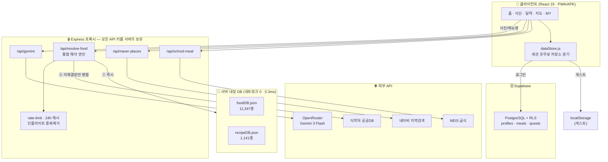
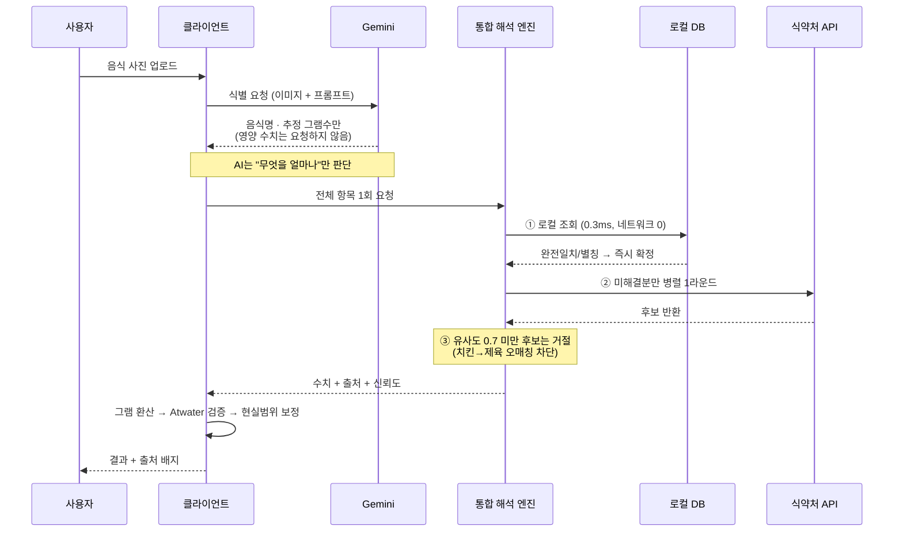

# Mealyze — 기술 스택 & 데이터 흐름

---

## 1. 기술 스택

| 계층 | 기술 | 선택 이유 |
|---|---|---|
| **프론트엔드** | React 19 · Vite 8 · React Router 6 | — |
| **스타일** | Vanilla CSS + 인라인 디자인 토큰 | Toss 디자인 시스템 규칙, CSS-in-JS 라이브러리 없음 |
| **애니메이션** | CSS `@keyframes` + View Transition API | framer-motion(+41 kB gzip) **실측 후 거부** — `transform`/`opacity`만 애니메이션 |
| **백엔드** | Express 5 (서버리스 모드 겸용) | 하나의 앱을 Render(상시)/Vercel(서버리스) 양쪽에 배포 |
| **DB · 인증** | Supabase (PostgreSQL + Auth + RLS) | Row Level Security로 "내 데이터만" 강제 |
| **AI** | OpenRouter → `google/gemini-3-flash-preview` | Gemini 직접 호출의 무료 한도(일 20회) 문제를 우회 |
| **모바일** | Capacitor 6 (Android WebView) | 웹을 배포하면 앱이 자동 갱신(server-URL 모드) |
| **테스트** | Vitest 4 · Testing Library · jsdom | 792개 테스트 |
| **린트** | oxlint | — |
| **캐시** | node-cache (24h) · express-rate-limit | 외부 API 비용·쿼터 방어 |

### 외부 데이터 소스

| 소스 | 용도 | 형태 |
|---|---|---|
| 식약처 **음식** 영양성분DB | 조리식 영양 수치 | 실시간 API + **로컬 스냅샷 11,347종** |
| 식약처 **가공식품** DB | 편의점·포장·프랜차이즈 | 실시간 API |
| 식품안전나라 **레시피DB** | 창작·조합형 메뉴 보완 | **전량 번들 1,141종** (런타임 API 호출 0) |
| NEIS 교육정보 개방포털 | 초·중·고 급식 식단 | 실시간 API |
| 네이버 지역검색 / 지도 | 주변 식당 후보·지도 | 실시간 API |

---

## 2. 시스템 데이터 흐름



### 사진 → 영양 수치 (핵심 플로우)



---

## 3. 음식 영양 분석 알고리즘

### 3.1 핵심 원칙 — AI와 공공 DB의 역할 분리

> **AI는 "무엇을·얼마나" 먹었는지만 판단하고, 실제 영양 수치는 공공 DB가 이긴다.**
> AI 추정치는 DB 매칭이 **전부** 실패했을 때만 쓰는 최종 폴백이다.

### 3.2 통합 해석 엔진 — 3단계

```
┌── ① 로컬 우선 (네트워크 0 · 0.3ms) ────────────────────────┐
│   식약처 음식DB 스냅샷 11,347종  +  레시피DB 1,141종         │
│   매칭: 정규화 → 완전일치 → 별칭 → 부분포함 → 편집거리         │
│                                                          │
│   exact / alias  → ✅ 즉시 확정                            │
│   partial/fuzzy  → ⏸️ 보류 (아직 채택하지 않음)              │
└──────────────────────────────────────────────────────────┘
                          ↓ 로컬이 못 잡은 것만
┌── ② 원격 병렬 1라운드 ─────────────────────────────────────┐
│   식약처 음식DB · 가공식품DB를 동시 호출                       │
│   (예전: 최대 7회 순차 → 최악 75초)                          │
│   서버측 데드라인 예산 초과 시 확보분으로 즉시 응답              │
└──────────────────────────────────────────────────────────┘
                          ↓
┌── ③ 유사도 검증 (오매칭 차단) ──────────────────────────────┐
│   비완전일치 후보는 이름 유사도 ≥ 0.7 을 통과해야만 채택         │
│   ❌ 치킨 → 제육(돼지고기 수육)   ❌ 파스타 → 토스트(식빵)      │
│   미달 시 → AI 추정치로 폴백                                 │
└──────────────────────────────────────────────────────────┘
```

**한국어 음식명 유사도** — 복합 음식명은 핵심어가 **뒤**에 온다는 점을 이용

| 관계 | 예시 | 점수 | 판정 |
|---|---|---|---|
| 완전일치 | 비빔밥 = 비빔밥 | 1.0 | ✅ |
| 접미 일치(수식어 변형) | 돌솥비빔**밥** ⊃ 비빔밥 | 0.7~1.0 | ✅ |
| 접두 일치(파생 음식) | **라면**땅 | ≤0.3 | ❌ |
| 중간 포함 | — | ≤0.4 | ❌ |

### 3.3 수치 환산 & 보정 파이프라인

```
DB 100g당 수치
   ↓  × (실제 섭취 g / 기준량)          scaleNutrients
   ↓
   ↓  DB에 없는 항목만 AI 값으로 채움    fillMissingNutrients
   ↓
   ↓  ▸ Atwater 물리 검증
   ↓    계산열량 = 탄×4 + 단×4 + 지×9
   ↓    |계산열량 − 기록열량| / 기록열량 > 20% 이면
   ↓    탄·단·지를 열량에 맞춰 비례 보정 (상호 비율은 유지)
   ↓
   ↓  ▸ 현실 범위 클램프
   ↓    하한의 50% 미만 → 하한으로 / 상한의 150% 초과 → 상한으로
   ↓    (짜장면 단백질 40g 같은 이상치 차단)
   ↓
최종 수치 + 출처 배지
```

### 3.4 개인 권장량 산출 (Mifflin-St Jeor)

```
BMR  = 10×체중(kg) + 6.25×키(cm) − 5×나이 + (남 +5 / 여 −161)
TDEE = BMR × 활동계수 (저 1.375 / 보통 1.55 / 고 1.725)

칼로리   = TDEE
탄수화물 = TDEE × 50% ÷ 4     단백질 = TDEE × 20% ÷ 4
지방     = TDEE × 30% ÷ 9     식이섬유 = 남 30g / 여 25g
나트륨   = 2,000mg  ← 상한형(초과를 막는 지표, "부족" 판정 대상 아님)

※ 6~18세는 IOM EER 회귀식 + KDRIs 기준으로 별도 분기
※ 당뇨 등록 시 탄수 −5%p → 단백질 +5%p
```

### 3.5 오늘의 점수 (100점)

| 항목 | 배점 | 채점 |
|---|---|---|
| 칼로리 적정성 | 40 | 목표의 90~110% 만점, 50%/150%에서 0점까지 선형 감점 |
| 단백질·탄수·지방 | 각 10 | 달성률 비례, 100%에서 만점 |
| 나트륨 | 30 | 한도 이내 만점, 초과분 비율만큼 감점 |

### 3.6 식당 추천 스코어링

```
총점 = 0.7 × 영양 충족도 + 0.3 × 거리 근접도

영양 충족도 = Σ min(1, 예상섭취[영양소] / 부족량[영양소]) / 부족영양소 개수
거리 근접도 = max(0, 1 − 거리 / 3,000m)
```
> 네이버 지역검색 API에 평점·리뷰 필드가 **없음을 확인**하여, 원래 구상한 3차원(영양+거리+평점)
> 대신 2차원으로 축소했다. 없는 데이터로 점수를 지어내지 않는다.

---

## 4. 성능 · 신뢰성 개선 실측

| 항목 | 이전 | 이후 |
|---|---|---|
| 음식 6개 분석 요청 수 | 54회 | **1회** |
| 분석 최악 지연 | ~75초 | **1.7초** (재조회 18ms) |
| 급식 트레이 분석 | — | **23ms** |
| 로컬 조회 속도 | 2.31ms | **0.32ms** |
| 레시피DB 커버리지 | 8경로 중 2개 | **전 경로** |
| 오매칭 차단 | 무검증 채택 | 유사도 검증 후 채택 |

**안정성 장치** — 서버측 데드라인 예산(초과 시 에러가 아니라 부분 결과로 응답) ·
인플라이트 중복 제거 · 네거티브 캐싱(60초) · IP당 rate limit · 지수 백오프 재시도
