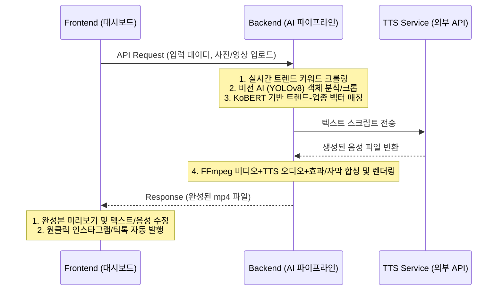

# [Feature] 소상공인 맞춤형 숏폼(릴스/쇼츠) 콘텐츠 자동 제작 대시보드 웹 서비스 구축

## 📌 배경 및 목적 (Background & Purpose)
- **시장 상황:** SNS(릴스/쇼츠/틱톡) 트렌드는 몇 주 단위로 급격하게 변하지만, 소상공인 사장님들은 본업(가게 운영, 요리, 접객 등)으로 인해 트렌드를 추적하고 영상을 기획·제작할 시간과 물리적 리소스가 절대적으로 부족합니다.
- **해결책:** 사장님이 최소한의 정보와 사진만 등록하면, 실시간 트렌드 키워드를 매칭하는 알고리즘과 AI 기반의 영상 자동화 파이프라인을 통해 플랫폼(릴스 등)에 최적화된 숏폼 콘텐츠를 자동으로 생성해주는 **통합 대시보드 웹 서비스**를 구축하고자 합니다.

## 🏗 시스템 아키텍처 및 워크플로우 (System Architecture)

### 🛠 기술 스택 (Tech Stack)
- **프론트엔드 (UI/UX):** React (대시보드 화면, 차트 렌더링, 드래그 앤 드롭 파일 업로드)
- **백엔드 (API & 파이프라인 제어):** Node.js + Express (데이터 처리, AI 파이프라인 순차 실행)
- **데이터베이스:** Supabase (PostgreSQL) (StoreInfo, GeneratedReels 테이블 관리)
- **AI & 미디어 파이프라인:** YOLOv8 (비전/크롭), KoBERT (트렌드/문맥 매칭), FFmpeg (영상/오디오 렌더링), TTS API (음성 합성)
- **데이터 수집:** 크롤링 스크립트 (틱톡/인스타그램 트렌드 수집)

## 🚶‍♂️ 프론트-백엔드 연동 사용자 시나리오 (User Journey)

### 🔹 [대시보드] Step 1: 목적별 소스 입력
사장님이 가입 후 업종과 위치를 등록하고, 다음 중 홍보하고 싶은 목적에 맞는 사진을 3~4장 툭 던지듯 업로드합니다.
- **[입력 데이터 종류 예시]**
  - **대표/시그니처 메뉴:** 가장 매출을 올리고 싶은 메인 상품 (예: 망고 빙수, 수제 버거 등)
  - **시즌/이벤트 상품:** 특정 시기에만 밀고 싶은 한정판 (예: 여름 한정 냉면, 기획 상품 등)
  - **매장 공간 및 인테리어:** 가게의 특색 있는 분위기나 포토존 (예: 테라스석, 레트로풍 소품 등)

### 🔹 [파이프라인] Step 2 & 3: AI 분석 및 자동 완성 (크루아상 예시)
- **객체 분석:** 사장님이 **"방금 구운 크루아상"** 사진을 툭 던지면 ➡️ 백엔드의 비전 AI(YOLOv8)가 크루아상 객체를 정확히 인식해 가장 먹음직스러운 구도로 크롭(Crop)합니다.
- **트렌드 매칭:** 동시에 KoBERT 알고리즘이 틱톡/인스타그램의 실시간 트렌드를 크롤링하여 현재 뜨고 있는 키워드(예: `#겉바속촉`, `#빵지순례`)와 문맥을 매칭합니다.
- **자막/효과 적용:** 숏폼에 최적화된 후킹성 자막과 TTS 음성 내레이션, 그리고 영상 효과(화면 전환 등)를 알아서 입혀 15초짜리 트렌디한 콘텐츠로 완성합니다(FFmpeg 렌더링).

### 🔹 [대시보드] Step 4: 결과 확인 및 발행
- 완성된 15초 영상과 함께 위치 기반 해시태그(`#진주카페`, `#가좌동맛집`)가 포함된 본문 텍스트가 화면에 노출됩니다. 사장님이 확인 후 `[릴스/틱톡으로 발행]` 버튼을 누르면 API를 통해 즉시 업로드됩니다.

## 📊 핵심 기술 및 마케팅 지표 분석
### ① 틱톡/인스타그램 전환율 및 목적지 CTR 분석
- 틱톡 광고 관리자 및 크리에이터 인사이트에서는 단순 조회나 좋아요와 같은 표면적 지표와, 실질적 행동인 **'목적지 클릭(프로필 링크 이동, 예약 페이지 클릭 등)'**을 구분합니다. 비즈니스 성과를 위해서는 이 '목적지 CTR' 확보가 핵심입니다.
- 상위 노출 및 고전환 영상의 공통점은 **초반 2~3초 내 강력한 후킹**과 명확한 가치 제안(CTA)입니다. 파이프라인에서 영상 초반부에 TTS 청각적 훅과 후킹성 자막을 입히고, 아웃트로에 행동 유도(예: "프로필 링크에서 예약하기")를 자동 삽입하여 소상공인의 실질적인 매출 전환을 유도합니다.

### ② KoBERT를 활용한 문맥 벡터화 (Vectorization)
- **기술 선택:** 단순 텍스트 매칭("빵" == "빵")을 넘어, "디저트"와 "달콤한 간식"처럼 유사한 문맥을 이해할 수 있는 한국어 특화 **KoBERT** 모델을 적용합니다. 
- **매칭 알고리즘:** 가게 고유 정보(업종, 시그니처 메뉴 등) 벡터와 실시간 크롤링된 트렌드 키워드 벡터 간의 코사인 유사도(Cosine Similarity)를 연산하여, 크루아상과 가장 잘 어울리는 트렌드 오디오/자막을 자동 매칭합니다.

## ✨ 주요 변경 사항 (Key Changes)
1. **대시보드 UI/UX 구현 (Frontend)**
   - 시그니처 메뉴, 공간 등 목적별 사진 업로드 폼 구현
   - 완성본 미리보기 및 원클릭 자동 발행(인스타그램, 틱톡) 기능
2. **AI 파이프라인 구축 및 고도화 (Backend)**
   - YOLOv8을 이용한 소스 이미지 내 주요 객체(예: 음식, 인테리어 요소) 분석 및 스마트 크롭
   - KoBERT 모델 도입으로 텍스트를 고차원 벡터화하여 실시간 트렌드 문맥 매칭
   - TTS 연동 및 FFmpeg 렌더링을 통한 후킹성 자막, 효과음, CTA 자동 합성

## 🛠 테스트 방법 (How to Test)
- [ ] 프론트엔드 대시보드에 '크루아상' 같은 시그니처 메뉴 사진을 업로드해 봅니다.
- [ ] YOLOv8이 해당 객체를 정상적으로 인식하고 크롭하는지 백엔드 로그를 확인합니다.
- [ ] KoBERT가 실시간 크롤링된 트렌드 키워드(예: #빵지순례)를 정확하게 매칭하여 스크립트와 자막을 생성하는지 확인합니다.
- [ ] 렌더링된 최종 `mp4` 파일 내에 TTS 음성, 매칭된 자막, 그리고 아웃트로 CTA가 자연스럽게 포함되었는지 검증합니다.

## 📝 리뷰어에게 (To Reviewers)
- YOLOv8의 객체 탐지율(특히 음식이나 공간의 애매한 경계)을 높이기 위해 프롬프트 튜닝이나 추가 학습(Fine-Tuning)이 필요할지에 대한 비전 AI 담당자분의 의견을 구합니다.
- 크롤러로 수집되는 실시간 트렌드 데이터가 불필요한 노이즈(스팸 태그 등)를 포함하지 않도록, 전처리 파이프라인 설계에 대한 서버팀의 리뷰 부탁드립니다.

## 🔗 관련 이슈 (Related Issues)
- Resolves: #[이슈 번호]
