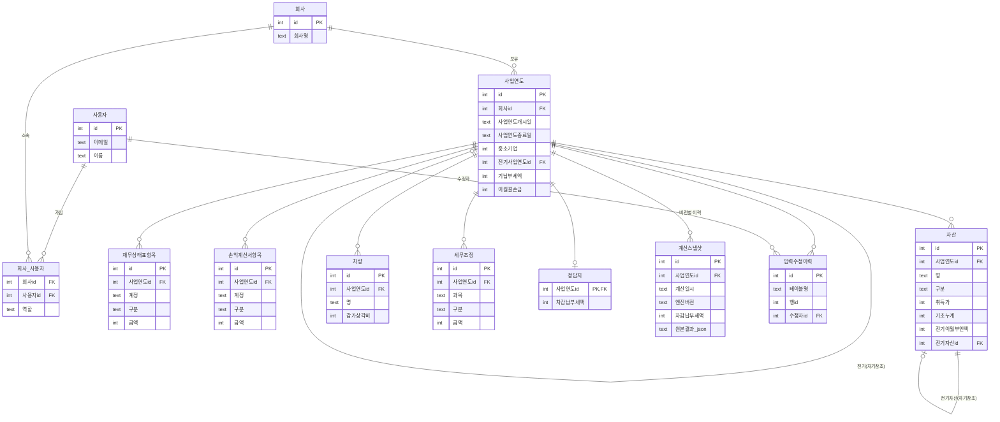

# DB 스키마 설계 — CSV → SQLite

> 관련 파일: `taxengine/db/schema.sql` (DDL), `notes/기술스택-결정.md` §3 (DB 종류·금액 타입 결정 — 이미 확정, 여기서 재검토하지 않음)
> 작성 배경: PLAN.md §9 항목 5. 2026-07-20 "타깃 사용자 = 소상공인, CSV 대신 프론트엔드 웹 입력" 결정에 따라 멀티테넌시(여러 회사·여러 사용자) 전제로 설계.
> 범위: DDL만. ORM 모델·마이그레이션 러너·실제 DB 연결 코드는 만들지 않음(요청 범위 밖).

---

## 0. 이 문서가 존중하는 기존 결정

`notes/기술스택-결정.md` §3에서 이미 정해진 것 — 여기서 다시 고르지 않는다:

- **DB는 SQLite.** PostgreSQL 등으로 바꾸지 않음.
- **금액은 원 단위 INTEGER.** SQLite는 `DECIMAL(10,2)`라고 선언해도 내부적으로 REAL(부동소수)로 저장할 수 있는 동적 타입 시스템이라, 컬럼 타입명을 절대 `NUMERIC`/`DECIMAL`/`REAL`로 쓰지 않고 전부 `INTEGER`로 선언한다. (`taxengine/money.py`가 Decimal로 계산한 뒤 `절사()`/`반올림()`으로 정수 확정하는 것과 대칭 — DB는 그 확정된 정수만 받는다.)
- **세율·상각률 등 법령 상수(`taxengine/domain/rates.py`)는 테이블화하지 않는다.** 법 개정 시 코드 리뷰가 필요한 값이라 사용자 데이터와 성격이 다르다는 기존 방침을 유지. 대신 "이 계산이 어느 시점 코드 기준으로 나왔나"는 `계산스냅샷.엔진버전`으로 기록한다 (§7).
- **FE 커스텀 UI는 "만들지 마라"였던 이전 결론이 2026-07-20 결정으로 뒤집혔다** (PLAN.md §7-F, §9). 이 스키마는 그 뒤집힌 결정(소상공인 대상 웹 입력 화면)을 전제로 한다 — CSV 폴더 1개 = 회사 1개라는 지금의 암묵 가정을 깨는 것이 이 작업의 핵심 요구사항이다.

---

## 1. 네이밍 컨벤션 — 왜 한글 테이블/컬럼명인가

`taxengine/loader.py`·`pipeline.py`·`carryover.py` 등 기존 엔진 코드는 변수명·딕셔너리 키·함수명을 전부 한글로 쓴다(`로드()`, `자산행()`, `회사["사업연도개시일"]` 등). DB 스키마도 같은 관례를 따라 테이블·컬럼명을 한글로 지었다.

이유: 나중에 "CSV 로더 대신 DB 리더를 만든다"는 마이그레이션을 할 때, DB 한 행을 읽어 만드는 딕셔너리가 지금 `로드()`가 반환하는 딕셔너리와 **키 이름이 그대로 같아진다.** 즉 `pipeline.py`·`engine/*.py`는 입력이 CSV에서 왔는지 DB에서 왔는지 몰라도 되게(어댑터 계층만 얇게) 만들 수 있다. SQLite는 UTF-8 식별자를 따옴표 없이도 받아들이므로 문법상 문제는 없다(`taxengine/db/schema.sql`을 실제 SQLite에 로드해 검증 완료 — 아래 §8).

---

## 2. ERD



---

## 3. 테이블별 설명 + CSV 필드 매핑

### 3.1 `사용자` / `회사` / `회사_사용자` — 멀티테넌시 뼈대

지금 CSV는 "폴더 하나 = 회사 하나"를 암묵 가정하고, `company.csv`에는 애초에 **회사 이름·식별자 필드 자체가 없다**(사업연도·중소기업 여부 같은 "이 사업연도의 프로필"만 있음). DB에서는 이걸 분리했다:

- `회사`가 진짜 법인 정체성(이름)을 갖고, 여러 `사업연도`를 소유한다.
- `사용자`는 로그인 주체. `회사_사용자`가 N:N을 잡아 "회사 하나를 여러 직원이 보거나, 사용자 하나가 여러 회사(세무사 사무소가 여러 소상공인 고객을 대리)"를 나중에 자연스럽게 지원한다.
- **인증/권한 로직은 만들지 않았다** — `회사_사용자.역할` 컬럼(`owner`/`editor`/`viewer`)만 자리를 잡아뒀다. 요청사항에 "과설계하지 말 것"이 명시돼 있어 RBAC 세분화·초대 플로우 등은 다루지 않음.

### 3.2 `사업연도` — `company.csv` 전체 (1 row = CSV 파일 1개)

| CSV (`company.csv` key) | DB 컬럼 | 비고 |
|---|---|---|
| `사업연도개시일` | `사업연도개시일` | `rates.py`의 세율 분기 기준 |
| `사업연도종료일` | `사업연도종료일` | |
| `중소기업` | `중소기업` | `true/false` → `0/1` |
| `부동산임대업주업` | `부동산임대업주업` | 소규모임대법인 판정용 |
| `상시근로자수` | `상시근로자수` | |
| `지배주주지분율` | `지배주주지분율_bp` | **basis point로 변환** (100.00% = 10000). §4 참고 |
| `기납부세액` | `기납부세액` | 원 단위 INTEGER |
| `이월결손금` | `이월결손금` | 원 단위 INTEGER. §5에서 이월 체인의 한쪽 축 |
| `공제감면세액` | `공제감면세액` | |
| `가산세` | `가산세` | |
| `기부금한도초과` | `기부금한도초과` | |
| `수입금액` | `수입금액` | NULL 허용 = 추진비 한도 자동계산 생략(하위호환 유지) |
| `기업업무추진비_증빙불비금액` | `기업업무추진비_증빙불비금액` | |
| (CSV에 없음) | `전기사업연도id` | `--prev` 플래그가 하던 일을 FK로 고정 — §5 |
| (CSV에 없음, 폴더 위치가 대신함) | `회사id` | 멀티테넌시로 새로 필요해진 필드 |

`UNIQUE (회사id, 사업연도종료일)` 제약으로 같은 회사에 같은 사업연도가 중복 입력되는 걸 막는다.

### 3.3 `재무상태표항목` / `손익계산서항목` — `balance_sheet.csv` / `income_statement.csv`

CSV 그대로 `계정, 구분, 금액` 세 컬럼을 옮겼다. **계정과목명을 마스터 테이블 FK로 정규화하지 않았다** — `data/계정과목-카탈로그.md`가 명시하듯 "계정과목명은 회사마다 다르고, 표준명과 뜻만 같으면 된다"는 자유 텍스트 관례라서 통제 어휘(FK)로 묶는 게 오히려 실사용을 방해한다(과설계). 단, `pipeline.py`가 `'기업업무추진비'`라는 정확한 문자열을 손익계산서에서 찾아 자동합산하므로 이건 **매직 스트링**이라는 점을 스키마 주석으로 남겨뒀다.

`구분`은 CHECK 제약으로 `검증()`(`taxengine/validate.py`)이 가정하는 값(`자산/자산차감/부채/자본`, `수익/비용`)만 허용해 DB 레벨에서 오타를 1차 차단한다.

### 3.4 `자산` — `assets.csv`

| CSV 컬럼 | DB 컬럼 |
|---|---|
| `명`, `구분`, `취득일`, `취득가`, `기초누계`, `회사계상액`, `방법`, `내용연수`, `전기이월부인액`, `업무용승용차` | 동일 컬럼명 (타입만 원 단위 INTEGER/DATE/BOOLEAN으로 확정) |
| (CSV에 없음, `연속성검증()`이 '명' 문자열로 대신 매칭하던 것) | `전기자산id` |

가장 중요한 설계 판단은 **이월값을 "저장"할지 "매번 계산"할지**다 — 요청사항이 명시적으로 트레이드오프를 요구했다. §5에서 자세히 다룬다.

### 3.5 `차량` — `cars.csv`

CSV 컬럼과 1:1. `업무사용비율`만 지분율과 같은 이유로 `업무사용비율_bp`(0~10000)로 저장한다.

### 3.6 `세무조정` — `adjustments.csv`

CSV의 `과목, 구분, 금액, 소득처분, 근거` 그대로. `구분`·`소득처분`은 CHECK로 문서(`계정과목-카탈로그.md`, `adjustments.csv` 헤더 주석)가 규정한 값만 허용.

### 3.7 `정답지` — `answer.csv`

`사업연도id`를 PK로 삼아 사업연도당 1행만 존재하게 강제(1:1). 값이 없는 항목은 CSV처럼 NULL로 두고, `cli/reproduce.py`처럼 "값 있는 항목만 대조"하는 로직은 애플리케이션 레이어에서 그대로 재사용 가능하다.

### 3.8 `계산스냅샷` — CSV에는 없던, DB라서 가능해진 결과 이력

`pipeline.py`의 `실행()`이 반환하는 결과 다발(별지3 세액, 시부인 결과, 정답 대조)을 **버전으로 쌓는다.** §6에서 설계 이유를 다룬다.

### 3.9 `입력수정이력` — 감사 추적

CSV 시절엔 "파일을 열어 값을 고치면 git diff로만 흔적이 남는" 방식이었다. DB로 오면 UI에서 직접 값을 고치므로, 무엇이 언제 어떻게 바뀌었는지 앱이 기록해줘야 git이 대신해주던 일을 잃지 않는다. §6에서 설계 이유를 다룬다.

---

## 4. 정수 변환 규칙 — 금액이 아닌 값도 부동소수를 피한다

`money.py`의 "돈은 원 단위 정수로"라는 규율은 **금액이 아닌 비율 필드**(지배주주지분율, 업무용승용차 업무사용비율)에도 같은 이유(부동소수 오차 차단)로 확장했다:

- `지분율_bp`, `업무사용비율_bp` 컬럼은 **1% = 100bp** 정수로 저장한다. 예: 100% → `10000`, 33.33% → `3333`.
- 애플리케이션 레이어에서 `bp / 100` = 퍼센트로 환산해 기존 엔진 함수(`money.원()`이 기대하는 정수/문자열)에 넘긴다.
- CSV의 정수 퍼센트(`100`, `50` 등)는 그대로 `× 100`만 하면 되므로 마이그레이션이 단순하다(§9).

---

## 5. 연도 간 이월 — "저장 vs 매번 계산" 트레이드오프

### 문제

`taxengine/carryover.py`는 이미 "전기 자산 + 전기 회사 → 당기 기초값(기초누계, 전기이월부인액)"을 계산하는 순수 함수(`자산이월()`)와, "그 계산값과 당기에 실제 입력된 값이 일치하는가"를 검증하는 `연속성검증()`을 갖고 있다. 즉 **기초누계·전기이월부인액·이월결손금은 이미 "입력값"이면서 동시에 "전기에서 유도 가능한 값"이라는 이중 성격**을 가진다.

### 검토한 두 가지 모델

**A. 파생값으로만 두고 매번 계산** — 자산 테이블에 기초누계·전기이월부인액 컬럼을 아예 없애고, 조회 시점에 항상 전기 자산 체인을 타고 올라가며 `자산이월()`을 재실행.

**B. 리터럴 입력으로 저장 + FK로 검증 가능하게** — 지금 CSV처럼 당해 연도 값을 그대로 저장하되, `전기자산id`(자산 테이블)·`전기사업연도id`(사업연도 테이블) FK로 "이 값이 어디서 이어지는지"를 명시해 검증 쿼리를 DB 레벨에서 짤 수 있게 한다.

### 결정: B (리터럴 입력 + FK 검증)

이유:

1. **종이 신고서와의 1:1 대응이 깨지면 안 된다.** 기초누계·전기이월부인액은 실제로 자본금과적립금조정명세서(을)에 **적힌 숫자**다. 세무사가 "이 값이 맞나"를 확인할 때 DB가 재계산한 값이 아니라 "그때 그렇게 입력됐다"는 사실 자체를 보여줘야 한다 — A안은 그 사실을 지워버린다.
2. **`carryover.py`가 이미 "둘 다 입력값으로 받고 불일치를 찾는다"는 설계다.** 두 해 책자가 우연이 아니라 실제로 연결되는지 검증하는 게 이 모듈의 존재 이유(`carryover.py` 모듈 docstring). DB 스키마가 이 설계 의도를 뒤집어 자동으로 덮어써 버리면, "입력 오류(연도 밀림·오타·이월 누락)"를 잡아내는 기능 자체가 사라진다.
3. **A안의 매번-재계산은 과거 신고서와 어긋날 위험이 있다**는 게 `기술스택-결정.md` §3의 기존 결론이기도 하다("매번 처음부터 재계산하면 과거 신고서와 어긋날 위험").

대신 B안의 약점(두 값이 따로 놀 수 있다는 것)은 FK(`전기자산id`)로 완화한다 — 이 FK가 있으면 다음 쿼리 하나로 `carryover.py`의 `연속성검증()`과 동일한 대조를 DB에서 재현할 수 있다:

```sql
-- 전기 자산이 함의하는 당기 기초누계 vs 당기에 실제 입력된 기초누계
SELECT 당기.id, 당기.명,
       (전기.기초누계 + 전기.회사계상액) AS 기대_기초누계,
       당기.기초누계 AS 입력_기초누계
FROM 자산 AS 당기
JOIN 자산 AS 전기 ON 당기.전기자산id = 전기.id
WHERE 당기.사업연도id = ?;
```

(단, 시부인 재계산 없이 "전기 회사계상액을 그대로 더한다"는 단순화는 실제로는 전기 상각범위액과의 시부인 결과가 필요하므로 완전한 검증은 애플리케이션 레이어에서 `carryover.py` 로직을 그대로 재사용해야 한다 — 이 쿼리는 "빠르게 걸러내는 1차 체크"용이다.)

이월결손금도 동일 패턴: `사업연도.전기사업연도id`로 전기 사업연도를 찾고, 그 사업연도의 최신 `계산스냅샷.각사업연도소득`·`이월결손금공제`로 `이월결손금이월()`과 같은 계산을 재현할 수 있다.

---

## 6. 감사 추적 설계

### 6.1 계산 결과: append-only 스냅샷 (버전)

CSV 시절엔 `python -m taxengine.cli.reproduce`를 실행할 때마다 화면에 찍고 끝이었다. DB에서는 **입력이 바뀔 때마다 새 `계산스냅샷` 행을 추가**한다(UPDATE로 덮어쓰지 않음). 이유:

- "이 세액이 그 시점 입력값으로 계산된 결과"라는 사실 자체가 세무 감사에서 의미를 가진다. 나중에 자산 하나를 고쳐 세액이 바뀌면, "이전엔 얼마였는데 왜 바뀌었나"를 스냅샷 이력으로 답할 수 있어야 한다.
- 시부인 결과·추진비 한도·차량 판정 같은 세부 산출값은 **입력에서 언제든 재계산 가능한 순수 파생값**이라 별도 정규화 테이블(예: `시부인결과`, `추진비판정` 등)을 만들지 않았다 — 그 대신 스냅샷을 찍는 시점의 `pipeline.py` 실행() 반환값 전체를 `원본결과_json`에 JSON으로 통째 보존한다. 정규화된 컬럼(과세표준·산출세액 등 별지3 핵심값)은 조회·집계 편의를 위해 스냅샷 테이블에도 뽑아뒀다 — "JSON은 감사용 원문, 정규화 컬럼은 조회용 캐시"라는 이중 저장이지만, 스냅샷은 append-only라 갱신 불일치 위험이 없다.
- `엔진버전` 컬럼으로 "어느 코드 버전(=어느 시점 법령 해석)으로 계산했나"를 남긴다. `rates.py`를 테이블화하지 않기로 한 결정(§0)의 대가를 이걸로 갚는다 — 나중에 `최저한세율()`의 100억 초과 구간처럼 "웹 검증 미완"인 로직이 수정되면, 과거 스냅샷은 그때 코드 기준이었다는 게 추적된다.

### 6.2 입력 수정: 범용 `입력수정이력` 로그

CSV 시절 "코드 리뷰 없이 값이 조용히 바뀌는" 문제를 git이 대신 잡아줬다. DB로 오면 그 안전망이 없어지므로, 최소한의 대체재로 **테이블명·행id·필드명·이전값·이후값·수정자·시각**을 남기는 범용 로그 하나를 뒀다.

각 입력 테이블(자산·재무상태표항목 등)마다 별도 이력 테이블이나 bitemporal 버전 컬럼(valid_from/valid_to)을 두는 방식도 검토했지만, 지금 단계에서는 과설계로 판단해 제외했다 — 요청사항의 "과설계하지 말 것"에 해당한다. 트리거가 필요해지면(예: 어떤 필드가 언제 살아있었는지 시점 조회가 잦아지면) 이 로그 테이블을 bitemporal 모델로 승격하는 건 나중 일로 미룬다.

---

## 7. 법령 상수는 여전히 코드에 — DB에는 "버전 흔적"만

요청사항대로 `rates.py`의 세율표·상각률표·기준내용연수·기업업무추진비 한도·업무용승용차 한도·이월결손금공제율·최저한세율은 테이블화하지 않았다. 대신:

- 법인세율은 이미 `사업연도개시일` 하나로 결정되므로(`법인세율(사업연도개시일)`), 사업연도 테이블에 그 날짜가 있는 것만으로 "당시 어느 세율표를 썼는지"는 재현 가능하다.
- 그 재현 함수 자체가 나중에 고쳐질 가능성(예: 최저한세 100억 초과 구간 확정 등)에 대비해 `계산스냅샷.엔진버전`을 남긴다(§6.1).

---

## 8. 검증

`taxengine/db/schema.sql`을 실제 SQLite(`sqlite3` Python 표준 라이브러리)에 로드해 문법 오류 없이 11개 도메인 테이블이 전부 생성되는 것을 확인했다: `사용자, 회사, 회사_사용자, 사업연도, 재무상태표항목, 손익계산서항목, 자산, 차량, 세무조정, 정답지, 계산스냅샷, 입력수정이력`.

---

## 9. CSV → DB 마이그레이션 경로

> **구현 완료 (2026-07-20 후속 세션)**: 아래 절차는 `taxengine/db/migrate.py`(로직) +
> `taxengine/cli/migrate.py`(CLI 래퍼)로 구현됐다. 사용법:
> `python -m taxengine.cli.migrate --company "회사명" 폴더1 [폴더2 ...]`
> (여러 사업연도를 오래된 순서로 넘기면 전기사업연도id·전기자산id가 자동 연결된다.
> 기존 회사에 다음 해를 나중에 이어붙이려면 `--company-id ID`. `--dry-run`으로 미리 확인 가능.)
> 검증: `tests/test_migrate.py`(14개 테스트) — 단일연도·2개년 이월 체인·분할 이관·dry-run·신규 DB
> 생성을 커버. ORM은 안 씀(§0 결정과 동일 이유 — sqlite3 표준 라이브러리로 충분).

이 문서가 원래 예상한 절차:

1. **회사 식별자를 새로 부여해야 한다** — CSV에는 회사명 필드가 없으므로(폴더 위치가 암묵적으로 회사를 대신함), 마이그레이션 스크립트는 "이 폴더들이 같은 회사다"라는 매핑을 외부에서 받아야 한다(지금은 사실상 회사가 1개뿐이라 CLI 인자 하나로 충분할 것).
2. `company.csv`(`parse_key_value`) → `사업연도` 1행. `지배주주지분율`은 `× 100`, `true/false`는 `0/1`로 변환.
3. `balance_sheet.csv`/`income_statement.csv`/`assets.csv`/`cars.csv`/`adjustments.csv`(`parse_file`) → 각각 대응 테이블에 행 단위 삽입. `assets.csv`는 같은 회사의 전기 사업연도가 이미 옮겨져 있다면 `명`이 일치하는 전기 자산 행을 찾아 `전기자산id`를 채운다(최초 이관 시엔 이름 매칭으로 시작하고, 이후 신규 입력부터는 UI가 명시적으로 "전기 자산 선택" UX로 FK를 받는 게 안전 — 이름 매칭은 `carryover.py`가 이미 겪는 한계와 동일).
4. `answer.csv` → `정답지` 1행(있는 경우만).

1~4번은 위에서 구현됐다(`migrate.py`). 아래는 아직 구현하지 않은 부분:

5. 🔲 옮긴 직후 `pipeline.py` 로직을 한 번 실행해 `계산스냅샷` 첫 행을 만들어두면, 이관 시점부터 감사 이력이 시작된다 — 별도 관심사라 이번엔 안 만듦(스냅샷 생성은 "이관"이 아니라 "최초 계산" 작업이라 경계를 분리해뒀다).
