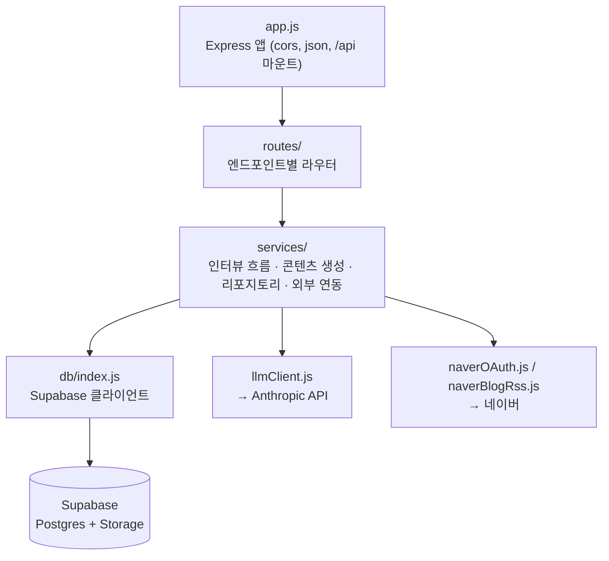
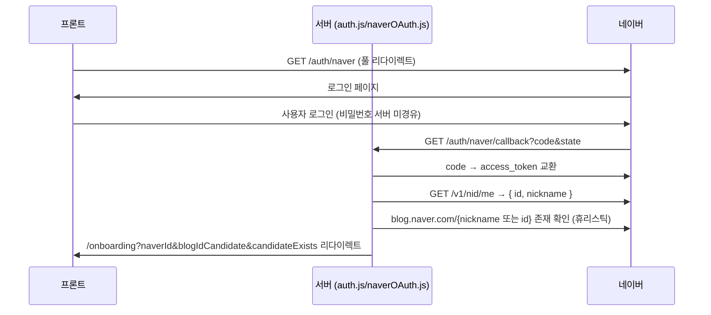

# 백엔드 아키텍처 (server)

전체 시스템 그림은 [docs/architecture.md](../docs/architecture.md), API 계약은 [docs/api-spec.md](../docs/api-spec.md). 실행 방법/마이그레이션 절차는 [README.md](README.md), 테스트 컨벤션은 [TESTING.md](TESTING.md)에 정리되어 있어 여기서는 반복하지 않는다.

## 레이어 구조



- **routes/**: HTTP 계층만 담당(요청 파싱, 상태 코드, `ApiError` 던지기). 비즈니스 로직은 두지 않고 services를 호출만 한다.
- **services/**: 세 가지 성격이 섞여 있다 — ① 인터뷰 흐름(`promotionInterviewFlow`, `noticeInterviewFlow`: 다음 질문 결정, DB 접근 없음) ② 콘텐츠/추천 생성(`postContent`, `brandProfileContent`, `briefingService`, `insightsService`, `scheduleSuggestion`: 규칙 기반 또는 LLM 호출) ③ 리포지토리(`postsRepo`, `brandProfileRepo`: Supabase CRUD, camelCase ↔ snake_case 변환) ④ 외부 연동(`naverOAuth`, `naverBlogRss`, `imageStorage`, `llmClient`).
- **db/index.js**: Supabase 클라이언트 초기화 지점 하나. `service_role key`를 쓰므로 RLS를 우회한다 — 이 키는 절대 프론트에 노출하지 않는다.
- **middleware/errorHandler.js**: `ApiError` 인스턴스는 `{ status, code, message }`를 그대로 JSON으로 변환하고, 그 외 예외는 500 `INTERNAL_ERROR`로 감싼다. 라우트 핸들러는 직접 `try/catch`하지 않고 `ApiError`를 던지기만 하면 된다.

## 요청 처리 흐름

1. `index.js`가 `.env` 로드 → `app.js`/`imageStorage.js` 동적 import(정적 import가 `loadEnvFile()`보다 먼저 평가되는 걸 막기 위함) → `ensureImageBucketExists()` → `app.listen()`.
2. `app.js`: `cors`(허용 origin은 `FRONTEND_ORIGIN`, 기본 `localhost:5173`) → `express.json()` → `/api`에 `routes/index.js` 마운트 → `notFoundHandler` → `errorHandler`.
3. `routes/index.js`가 도메인별 라우터(`posts`, `brandProfile`, `briefing`, `insights`, `blog`, `auth`, `health`)를 조합한다.

## 도메인별 흐름

### 브랜드 프로필 (2-1)

`routes/brandProfile.js` → `services/brandProfileInterviewFlow.js`(질문 순서 진행, DB 없음) → 인터뷰 완료 시 `services/brandProfileContent.js`가 답변을 Anthropic에 보내 `summary`/`keywords`를 생성 → `services/brandProfileRepo.js`가 Supabase `brand_profiles`에 저장. 단일 브랜드 가정이라 여러 행이 쌓여도 "가장 최근 1건"만 현재 프로필로 조회한다.

### 오늘의 AI 브리핑 (2-2)

`services/briefingService.js`: 계절(고정 규칙표) + 브랜드 업종 + Supabase의 실제 게시글 현황(`postsRepo.listPosts`)을 컨텍스트로 Anthropic에 `recommendedTopic`/`reason`만 생성 요청한다. `blogHealth`는 고정값(80/good), `seasonalTrend`/`industryTrend`/`expectedEffect`는 계절 규칙 기반 문구다 — 전체를 LLM화하지 않고 추천 문구만 LLM으로 대체한 상태.

### 블로그 연동 (2-3) — 네이버 OAuth + RSS

블로그 데이터 API가 폐지되어 "네이버 아이디로 로그인"만으로 `blogId`를 추정한다.



`services/naverBlogRss.js`는 `GET /blog/analysis`에서 RSS(`rss.blog.naver.com/{blogId}.xml`)를 정규식으로 파싱해 게시물 수/최근 게시일/게시 주기(pubDate 평균 간격)를 계산한다. 표준 XML 파서 없이 정규식만 쓰는 이유와, "존재하지 않는 블로그" 문구 기반 판별이 휴리스틱이라는 점은 코드 주석에 남겨두었다 — blogId 미확정이거나 RSS 조회 실패 시 `connected: false`를 반환한다.

### 홍보글/공지사항 작성 (2-4, 2-5)

`routes/posts.js`의 `/promotion/interview`, `/notice/interview`는 DB 없이 다음 질문만 계산한다. 실제 생성은 `services/postContent.js`가 담당하며, `purpose`(신메뉴/이벤트/일반) 또는 공지 유형별로 시스템 프롬프트를 나눠 Anthropic에 JSON 스키마 강제 출력으로 `title`/`content`/`seoKeywords`/`hashtags`를 요청한다. 인터뷰 답변(이벤트 기간, 메뉴명 등)은 생성에만 쓰고 버리지 않고, `postsRepo`가 `purpose`별 flat 컬럼(`menu_name`, `event_period_start` 등)으로 함께 저장한다.

이미지는 `services/imageStorage.js`가 Supabase Storage(`post-images`, public 버킷)에 업로드하고 public URL을 반환한다 — 사진 배치 추천처럼 비전 모델이 필요한 기능은 범위 밖.

### AI 검토 및 예약 발행 (2-6) — 반자동 발행

서버는 발행을 대신하지 않는다. 프론트가 클립보드+새 탭으로 사용자를 네이버 에디터로 보낸 뒤, 서버는 두 가지 확인용 엔드포인트만 제공한다:

- `GET /posts/:id/detect-published`: `naverBlogRss.findRecentMatchingPost`로 RSS에서 제목이 비슷하고 30분 이내 올라온 글을 찾는다.
- `GET /posts/:id/check-deleted`: `naverBlogRss.checkPostStillPublished`로 저장된 `publishedUrl`을 직접 요청해 404/410 또는 "삭제됨" 계열 문구가 있는지 확인한다.

둘 다 확정적 판별이 아닌 휴리스틱이라 응답을 그대로 상태 변경에 쓰지 않고, 프론트가 사용자 확인을 받은 뒤 `PATCH /posts/:id`로 최종 반영한다. `services/scheduleSuggestion.js`의 추천 발행 시간은 아직 LLM이 아니라 고정 규칙("다음 토요일 오전 11시")이다.

### AI 운영 인사이트 (2-7)

`services/insightsService.js`: `getHealthScore`는 Supabase의 실제 게시글로 게시 주기/콘텐츠 다양성/SEO 활용 점수를 계산하고, `seasonalContent`/`monthlyPlanCompletion`은 아직 고정값이다(실 블로그·통계 연동 전 임시). `getOpportunities`는 게시 공백/이벤트 콘텐츠 부재를 규칙으로 감지해 근거·예상효과 문구를 붙인다 — 이 서비스는 LLM을 호출하지 않는다.

## AI(Anthropic) 연동 패턴

모든 LLM 호출은 `services/llmClient.js`의 `generateJson({ system, user, schema, maxTokens })` 하나를 거친다.

```js
const response = await client.messages.create({
  model: "claude-sonnet-5",
  thinking: { type: "disabled" },
  system, messages: [{ role: "user", content: user }],
  output_config: { format: { type: "json_schema", schema } },
});
```

- `output_config.format`으로 JSON 스키마를 강제해 응답 파싱 실패(설명 문구 섞임)를 방지한다.
- 짧은 생성형 콘텐츠(홍보글/공지/브리핑 문구) 용도라 `thinking`은 끄고 속도를 우선한다.
- 각 서비스는 자신만의 `system` 프롬프트("사실만 쓰고 지어내지 않는다", 톤 지침 등)와 JSON 스키마를 정의해 `generateJson`에 전달하는 얇은 래퍼다 — 새 AI 기능을 추가할 때도 이 패턴을 따른다.

새로 LLM을 붙인 곳(`brandProfileContent`, `postContent`, `briefingService`)과 아직 규칙/고정값인 곳(`insightsService`, `scheduleSuggestion`)이 섞여 있다는 점은 `docs/architecture.md`의 제약사항에도 정리해 두었다.

## 데이터 모델

Supabase(Postgres) 테이블 2개, `server/migrations/*.sql`을 SQL Editor에서 순서대로 수동 실행해 만든다(자체 마이그레이션 러너 없음, 테이블 생성 후 `GRANT` 필요 — [README.md](README.md) 참고).

- **posts**: 홍보글/공지사항 공용. `type`(promotion/notice), `status`(draft/scheduled/published) 외에 `purpose`(new-menu/event/general)별 인터뷰 답변을 flat nullable 컬럼으로 구조화 저장.
- **brand_profiles**: 인터뷰 답변 + AI 생성 summary/keywords + 네이버 OAuth 결과(`naver_id`, `blog_id`, `blog_id_confirmed`). 단일 브랜드 가정이라 여러 행 중 최신 1건만 사용.

리포지토리(`postsRepo.js`, `brandProfileRepo.js`)가 camelCase(API/도메인) ↔ snake_case(DB 컬럼) 변환과 JSON 문자열 직렬화(배열/객체 컬럼)를 전담한다 — 이 경계 밖에서는 snake_case가 노출되지 않는다.

## 알려진 한계 (휴리스틱 목록)

아래는 전부 공식 API 부재로 인한 추정 로직이라, 호출부(프론트)가 항상 사용자 확인을 거치게 설계되어 있다.

| 위치 | 무엇을 추정하는가 |
| --- | --- |
| `naverOAuth.blogExists` | 닉네임/ID로 실제 블로그 존재 여부 (에러 문구 유무) |
| `naverBlogRss.findRecentMatchingPost` | 반자동 발행 후 "이 글이 방금 올린 글"인지 (제목 유사도 + 30분 창) |
| `naverBlogRss.checkPostStillPublished` | 게시글이 삭제됐는지 (상태 코드 + 페이지 문구) |

## 테스트

vitest + supertest, 소스 파일 옆에 `*.test.js`로 배치하며 mock 없이 실제 Supabase 프로젝트에 연결한다. 상세 컨벤션은 [TESTING.md](TESTING.md).
