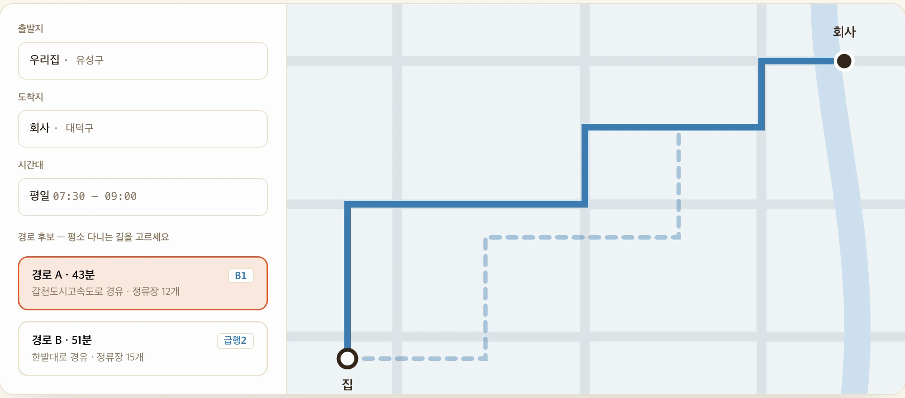
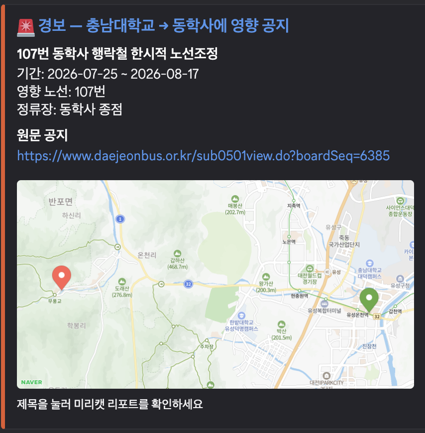
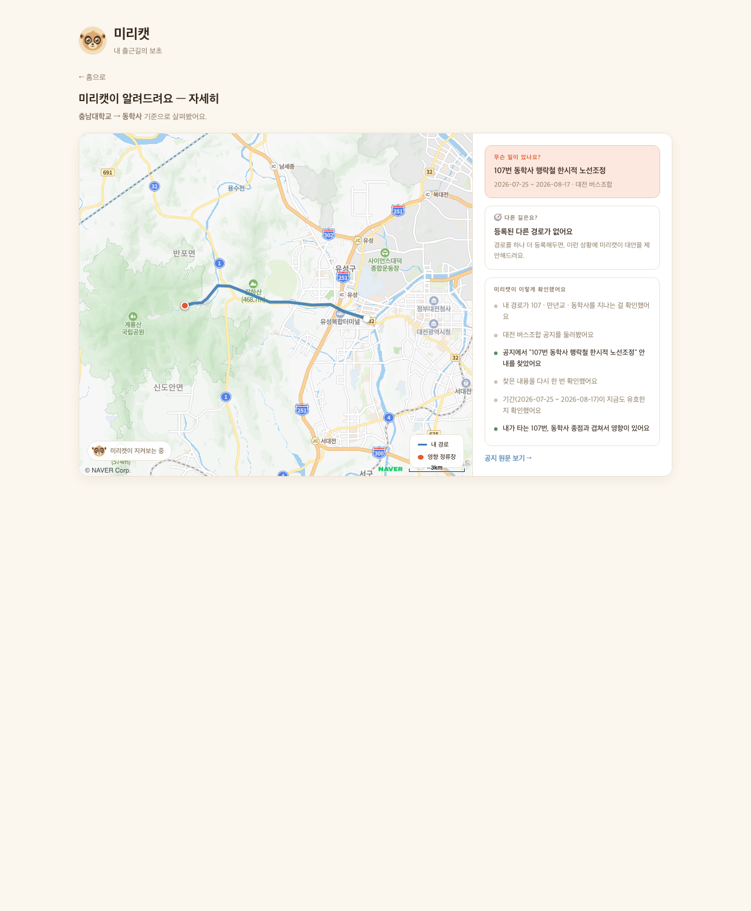

# 미리캣 — 내 출근길의 보초

> 매일 지자체·버스조합 게시판을 대신 확인해, 내 이동 경로에 영향을 주는 우회·통제 공지를
> 근거와 함께 알려주는 감시 에이전트입니다. 미어캣 무리가 보초를 세우듯, "내 출근길의 보초".

| | 링크 |
|---|---|
| 서비스 배포 | https://hub-pi-lime.vercel.app |
| 시연 영상 (4분 49초) | https://youtu.be/NLdvscvnPjY |
| 소스 코드 | https://github.com/connect-AIAgentChallenge-26-1/hub/tree/N157_%EC%A0%95%EC%9E%AC%ED%98%84 (제품 코드는 `miricat/`) |
| 프로젝트 소개 자료 | 이 문서 + [발표 슬라이드 9장](../miricat/docs/slides.html) · [A3 포스터 2장](../miricat/docs/posters.html) (HTML — 내려받아 브라우저로 열면 인쇄 규격으로 렌더링됩니다) |

- 개발: N157 정재현 · Naver AI Agent Challenge (2026.07)

## 문제

축제·공사·사고로 버스 우회나 도로 통제가 생기면 지자체·버스조합 게시판에 **공지가 한 번 올라오고 묻힙니다.**
공지가 올라온 시점과 실제로 이동하는 시점이 어긋나 있고, 확인할 게시판도 여러 곳에 흩어져 있어
사람이 매번 챙기기는 비현실적입니다.

→ **확인 주체를 사용자에서 에이전트로 넘깁니다 (Pull → Push).**

## 어떻게 동작하나

1. **경로 등록 (1회)** — 출발지·도착지·시간대를 입력하면 이용 노선·경유 정류장·경유 도로·좌표열을 가진 경로 객체로 저장합니다.
2. **매일 보고** — 에이전트가 관할 게시판을 대신 확인하고, 이상이 없어도 확인한 소스·시각과 함께 한 줄로 보고합니다. "이상 없음"도 검증 가능한 보고로 만듭니다.
3. **경보** — 내 경로에 영향을 주는 공지를 발견하면 원문 출처·대안 경로와 함께 디스코드로 경보를 보냅니다. 경보는 드물게, 그래서 한 통이 무겁습니다.

### 동작 화면

| 경로 등록 | 디스코드 경보 |
|---|---|
|  |  |

| 경보 리포트 (통제 구간 지도 + 우회 추천) | 보초 상태 |
|---|---|
|  |  |

## 원칙

- **예측하지 않습니다.** 이미 공지된 사실만 찾아서 경로 맥락과 결합해 전달합니다. 혼잡 예측 없음.
- 모든 경보에 원문 출처를 붙입니다.
- 이상 없는 날에도 확인한 소스·시각을 담아 한 줄 보고합니다 — 보초가 서 있다는 증거.

## 기술 구조

```
[등록 1회] 경로 API(ODsay·네이버지도) → 경로 객체 저장 (노선·정류장·도로·좌표열)

[매일] 크론(국내 NCP 서버) → LangGraph 조사 그래프 (Python 워커)
   Planner(관할 소스 결정) → Scout(게시판 수집 + Gemini 구조화 추출)
     ⇄ Verifier(추출 결과 ↔ 원문 대조, 실패 시 재추출 순환·재시도 상한)
     → Analyst(4단계 매칭: 노선→정류장→도로명→반경) → Reporter(보고/경보)
       │
   디스코드 웹훅 ──링크──▶ 웹(경로 등록 + 리포트)
```

- **감시 소스**: 전국 13개 게시판 (대전·세종·서울·경기·인천·부산·대구·울산·광주·창원·전주·제주 — 각 게시판의 세션·CSRF·내부 API를 개별 분석해 연결)
- **스택**: React(Vite) · Express · Supabase · LangGraph(Python 워커) · Gemini 구조화 출력(response_schema) · Langfuse 트레이싱 · 디스코드 웹훅
- **평가셋**: 실제 공지에 정답 라벨을 만들어, 프롬프트·모델을 바꿀 때마다 추출 정확도를 회귀 테스트
- **배포**: 프론트 Vercel · API Render · 워커는 국내(NCP) 서버 크론 — 도로 돌발상황 API(ITS)가 해외 IP를 차단해 국내 서버로 이관

## AI와 함께 개발한 방식

문제 정의와 절대 원칙(예측 금지, 매일 보고, 원문 출처), 핵심 기능은 제가 정했습니다.
LangGraph처럼 새로 배우는 개념은 원리를 먼저 익힌 뒤 직접 타이핑하며 구현했고,
이미 익힌 구조를 반복 적용하는 작업은 AI에게 맡겼습니다. AI가 만든 코드는 직접 실행·검증하며 수정했습니다.
개발 과정에서 계획 전용(miri-planner)·검증 전용(miri-verifier) 에이전트와,
학습 개발 루틴·감시 소스 추가 절차를 표준화한 Skill을 Claude Code로 함께 사용했습니다.

## 더 보기

- 기획서: [`miricat/docs/plan.md`](../miricat/docs/plan.md)
- 데모 시나리오 대본: [`miricat/docs/video-script.md`](../miricat/docs/video-script.md)
- 쇼케이스 카드 데이터: [`showcase.json`](./showcase.json)
