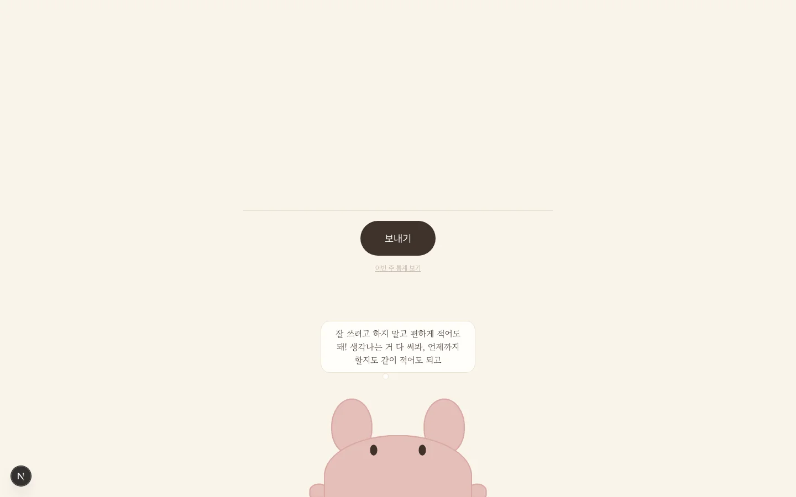
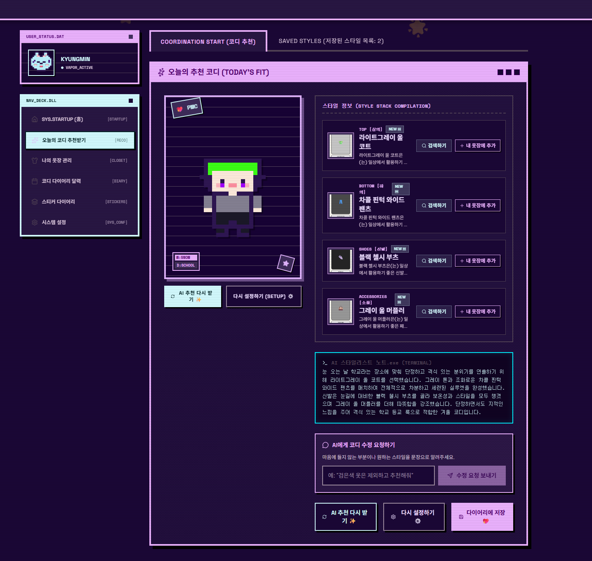
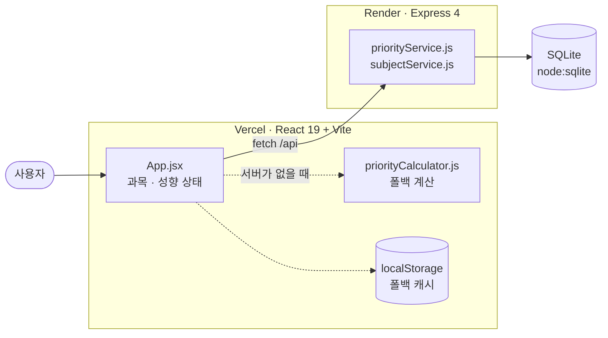

# 오늘 뭐부터 공부하지?

시험 기간에 과목별 우선순위를 계산해 **오늘 먼저 공부할 과목**을 추천하는 웹 서비스다.

| | 링크 |
|---|---|
| **서비스 배포** | https://what-first.vercel.app |
| **시연 영상** | https://youtu.be/rFA_218SjNY |
| **소스 코드** | https://github.com/connect-AIAgentChallenge-26-1/hub/tree/N074_%EB%B0%95%EA%B2%BD%ED%98%B8 |
| **프로젝트 소개 자료** | 이 문서 |

> API 서버(Render 무료 플랜)는 15분간 요청이 없으면 잠든다. 첫 요청이 50초쯤 걸려도 고장이 아니다.
> 서버가 응답하지 않으면 브라우저 저장소로 전환되고, **그 사실을 화면에 안내한다.**

---

## 1. 어떤 문제를 푸는가

여러 과목을 동시에 준비하는 대학생은 **어떤 과목부터 봐야 할지** 판단하기 어렵다.
그래서 제한된 시간을 감(感)으로 쓰게 되고, 정작 급한 과목을 놓친다.

이 서비스는 그 판단을 **입력값에 근거한 점수**로 바꾼다.
"왜 이 과목이 1위인지"를 문장으로 같이 보여줘서, 결과를 그냥 믿으라고 하지 않는다.

**대상 사용자** — 시험 기간에 여러 과목을 동시에 준비하는 대학생

---

## 2. 화면

### 1단계 · 과목 담기

과목명과 시험 날짜만 있으면 담긴다. 나머지는 다음 단계에서 채운다.
넓은 화면에서는 오른쪽에 순위판이 붙어, **입력하는 즉시 순위가 바뀌는 것**이 보인다.



### 3단계 · 결과

추천 과목과 점수, 그렇게 나온 이유, 오늘 쓸 수 있는 시간을 과목별로 나눈 배분표를 보여준다.
성향을 바꾸면 순위가 그 자리에서 다시 계산된다.



---

## 3. 핵심 기능

1. **과목 담기** — 과목명·시험 날짜만으로 시작하고, 이해도·난이도·공부 분량·학점·성적 반영 비율은 나중에 채운다.
2. **우선순위 계산** — 9개 요인을 0~100 점으로 환산해 성향별 가중치로 합산하고, 1위 과목을 추천한다.
3. **이유 설명** — 각 요인이 점수에 실제로 얼마나 기여했는지 계산해 "왜 높은지"를 문장으로 만든다.
4. **시간 배분** — 오늘 쓸 수 있는 시간을 점수 비율대로 과목에 나눠준다.
5. **정렬 · 필터 · 완료** — 점수순/D-day순 정렬, 이번 주 시험만 보기, 다 본 과목은 완료 처리(되돌리기 가능).

### 우선순위 성향

같은 입력이라도 기준이 다르면 순서가 달라진다. 그래서 성향을 사용자가 고른다.

| 성향 | 무엇을 가장 크게 보는가 |
|---|---|
| 균형 | 이해도·급함을 같은 비중으로 (각 0.16) |
| 난이도 중시 | 난이도 (0.20) |
| 임박도 중시 | 시험이 얼마나 가까운지 (0.28) |
| 학점 전략 | 성적 반영 비율 (0.22)과 학점 (0.16) |

### 모르는 항목은 점수에 끼워 넣지 않는다

이 프로젝트에서 가장 신경 쓴 규칙이다.

안 답한 항목을 중립값(4점, 40%)으로 채우면 **사용자가 하지 않은 대답이 한 표를 행사한다.**
그래서 모르는 요인은 합산에서 아예 빼고, 남은 요인의 가중치를 다시 나눠 합이 1이 되게 맞춘다.

```
점수 = Σ(아는 요인 점수 × 가중치) / Σ(아는 요인 가중치)
```

덕분에 아는 항목이 전부 100점짜리 답이면, 모르는 항목이 섞여 있어도 점수는 100이 된다.

자세한 계산식은 [`docs/data-model.md`](../docs/data-model.md) 에 있다.

---

## 4. 기술 구조



| 층 | 기술 | 비고 |
|---|---|---|
| 화면 | React 19, Vite 8, 순수 CSS + CSS 변수 | CSS 프레임워크 없음 |
| API | Express 4, cors, dotenv | `routes → controllers → services` 한 방향 |
| 저장 | SQLite (`node:sqlite`) | Node 22+ 내장이라 추가 패키지 없음 |
| 테스트 | `node:test` | 프론트 88개 · 서버 8개 (전부 통과) |
| 배포 | Vercel(FE) + Render(BE) | `VITE_API_BASE_URL` · `CORS_ORIGIN` 으로 분리 |

### 기술적으로 신경 쓴 것

- **서버가 없어도 돌아간다.** 계산 규칙을 클라이언트에도 두고, 서버가 응답하지 않으면 `localStorage` 로 전환한다.
  단, **폴백이 돌고 있다는 사실 자체를 화면에 표시한다.** 조용히 동작하면 사용자는 서버에 저장된 줄 안다.
- **판정 로직은 순수 함수로 빼고 테스트를 먼저 썼다.** 남은 날짜 구분, 학점 입력 검사, 완료 상태 판별 등.
- **CORS 를 성공 케이스만으로 확인하지 않았다.** 설정이 비어 있어도 허용 헤더는 붙기 때문에,
  엉뚱한 오리진으로 한 번 더 찔러 **헤더가 없는 것까지** 확인했다.
- **디자인 토큰만 쓴다.** 색·여백·글자 크기·모서리는 `index.css` 의 CSS 변수로만 쓰고 값을 직접 적지 않는다.

### 아직 남은 것 (숨기지 않는다)

- **계산 규칙이 두 곳에 있다.** `priorityCalculator.js`(폴백)와 `priorityService.js`(기준)가 같은 규칙을 각자 갖고 있어, 한쪽만 고치면 결과가 갈린다.
- **Render 무료 디스크는 재배포마다 초기화된다.** SQLite 파일이 같이 사라진다. Supabase 로 옮기는 것이 해결책이고, 두 항목은 사실상 하나의 작업이다.

---

## 5. AI 와 함께 만든 방식

**사람이 정한 것** — 만들 기능, 우선순위 기준, 척도의 의미, 화면에서 무엇을 먼저 보여줄지.
**AI 가 한 것** — 구현, 테스트 작성, 검증, 문서화.

저장소 전용 Skill 과 Agent 를 만들어 절차를 고정했다.

| 종류 | 이름 | 하는 일 |
|---|---|---|
| Skill | `write-test` | 판정 로직은 테스트를 먼저 쓰고(RED) 통과시키는 절차를 고정 |
| Agent | `feature-verifier` | 요구사항 대조 · 테스트 실행 · 경계 케이스로 독립 검증 |
| 기준 문서 | `design-skill.md` | 디자인 시스템과 검토 체크리스트 |

### "됐다"고 말할 수 있는 조건

4주간 실제로 겪은 실패에서 뽑은 네 가지다. 전부 한 번씩 당해봤다.

| 조건 | 겪은 일 |
|---|---|
| 고쳤다 ≠ 동작한다 | 화면만 바뀌고 저장은 안 됐다 |
| 통과했다 ≠ 의도대로 됐다 | 테스트가 전부 통과하면서 실제 개발 DB 를 오염시켰다 |
| 성공했다 ≠ 잠겼다 | CORS 는 설정이 비어 있어도 허용 헤더가 붙는다 |
| 안 보인다 ≠ 정상이다 | 서버를 껐는데 폴백 때문에 화면이 멀쩡했다 |

---

## 6. 더 읽을 문서

| 문서 | 내용 |
|---|---|
| [`README.md`](../README.md) | 문제 정의, 사용자 흐름, 시스템 구조도 |
| [`docs/my-workflow.md`](../docs/my-workflow.md) | 4주 최종 워크플로우 — 작업 순서와 확인 기준 |
| [`docs/agent-collaboration.md`](../docs/agent-collaboration.md) | 사람 결정과 AI 수행의 경계 |
| [`docs/data-model.md`](../docs/data-model.md) | 테이블 구조와 점수 계산식 |
| [`docs/deployment.md`](../docs/deployment.md) | Vercel · Render 배포 순서와 확인 결과 |
| [`design-skill.md`](../design-skill.md) | 디자인 원칙과 디자인 시스템 값 |
