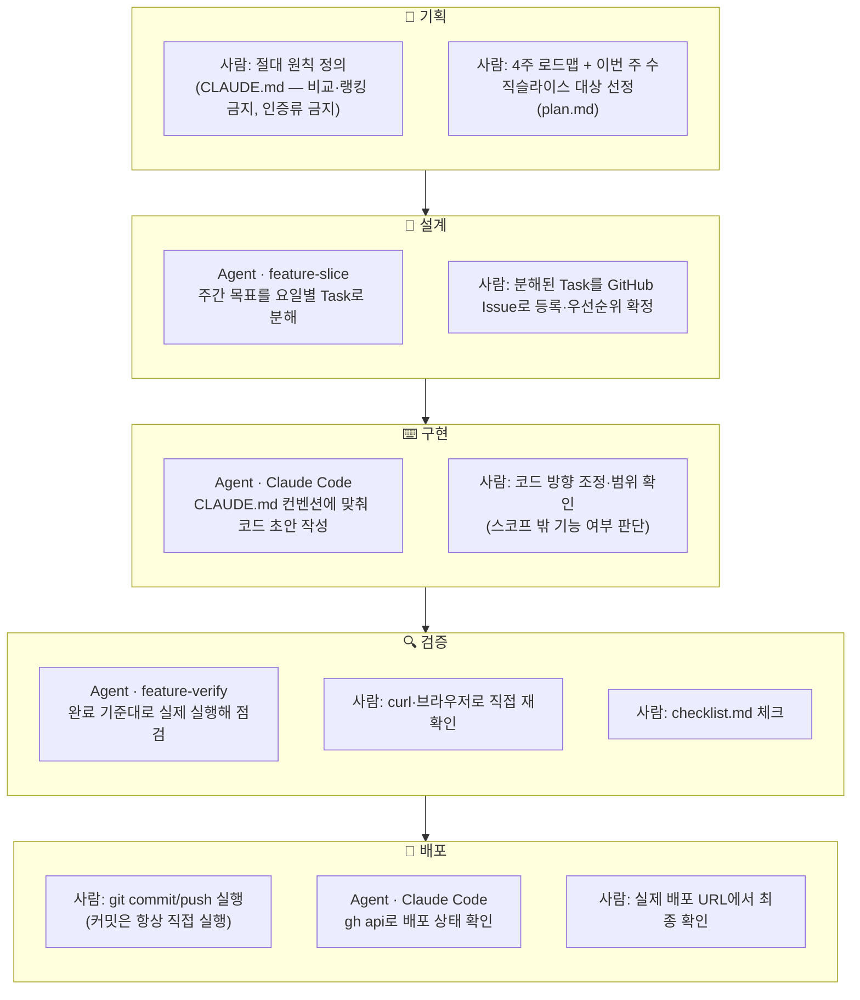

# Agent 협업 과정 시각화 — 챌린지로그

> 4주간 실제로 반복한 기획→설계→구현→검증→배포 흐름을 그대로 옮긴 것입니다.
> "사람:"은 제가 직접 결정/실행한 것, "Agent:"는 Claude Code(또는 서브에이전트)가 수행한 것입니다.

## 전체 흐름

## 단계별 요약

| 단계 | 사용한 도구 | 사람이 결정한 것 | AI가 수행한 것 |
|---|---|---|---|
| 기획 | `CLAUDE.md`, `plan.md` | MVP 범위, 절대 원칙(비교·인증류 금지), 4주 로드맵, 이번 주 대상 | 로드맵 문서 구조화 |
| 설계 | `feature-slice` Agent | Task 우선순위·Issue 등록 확정 | 요일별 작업 분해안 제시 |
| 구현 | Claude Code | 스코프·방향 최종 판단 | 코드 초안 작성 |
| 검증 | `feature-verify` Agent | 브라우저·curl로 최종 확인, checklist 체크 | 완료 기준 대비 자동 실행 검증 |
| 배포 | Claude Code + `gh` CLI | commit/push 실행, 배포 URL 최종 확인 | 배포 상태 조회, 로그 확인 |

## 실제 사례로 검증 — 이미지 URL 버그

이 흐름이 이상적인 그림만은 아니라는 걸 보여주는 실제 사례입니다.

1. **검증 단계에서 발견**: 배포 사이트 캘린더에서 사진이 안 뜨는 걸 제가 직접 브라우저로 확인 (콘솔에 `ERR_NAME_NOT_RESOLVED`)
2. **구현 단계로 되돌아감**: Claude Code가 콘솔 에러를 근거로 원인(외부 URL과 `BASE_URL`이 이어붙는 문제)을 코드에서 특정하고 `resolveImageUrl` 함수로 수정
3. **배포 단계**: 제가 직접 commit/push 실행 → Claude Code가 `gh api`로 Vercel 배포 완료 여부 확인
4. **재검증**: 제가 브라우저 강력 새로고침으로 최종 확인

→ 검증에서 발견한 문제가 구현으로 되돌아가는 **역방향 루프**가 실제로는 자주 발생했습니다. 위 다이어그램은 정방향 흐름만 그렸지만, 실제로는 검증 단계에서 막히면 구현으로 돌아가는 반복이 핵심이었습니다.

## 다이어그램에서 뺀 것 (실제 작업과 안 맞아서)

- AI 데일리 케어(Task 6), 알림(Task 7)은 아직 미구현이라 이 흐름을 아직 안 거쳤습니다. "5단계를 모두 거친 기능"은 인증·챌린지·기록·캘린더·친구 방까지입니다.
- Figma MCP를 통한 화면 설계는 월간 호출 한도로 중단되어 "설계" 단계에 넣지 않았습니다(Stitch로 대체).
