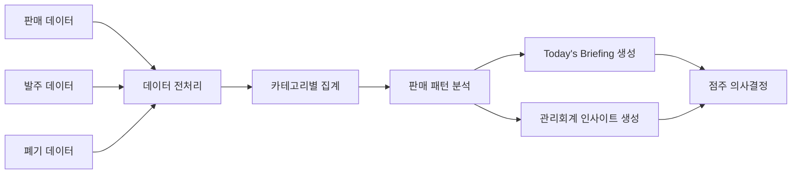

# SmartFF Agent

> **"AI가 발주를 대신하는 것이 아니라, 점주가 더 나은 발주 의사결정을 할 수 있도록 돕는다."**

GS25 FF(Fresh Food) 데이터를 분석하여 점주의 발주 의사결정을 지원하는 **AI Decision Support System(DSS)**

---

# Core Value

SmartFF Agent는 GS25 자동발주 시스템을 대체하는 서비스가 아니다.

GS25는 이미 자동발주 시스템을 통해 발주 수량을 제안하고 있으며,
점주는 이를 참고하여 최종 발주를 결정한다.

SmartFF는 새로운 발주 시스템을 만드는 것이 아니라,

판매 데이터와 폐기 데이터를 분석하여

점주가 **더 합리적인 의사결정을 내릴 수 있도록 지원하는 AI Decision Support System(DSS)** 을 목표로 한다.

AI는 발주를 대신하지 않는다.

AI는 데이터를 분석하고,
판매 패턴을 해석하며,
오늘 점주가 어떤 부분을 확인해야 하는지를 브리핑하는 역할을 수행한다.

---

# 1. 프로젝트 개요

## 프로젝트명

SmartFF Agent

## 한 줄 소개

GS25 FF 데이터를 분석하여
점주의 발주 의사결정을 지원하는 AI Agent

## 프로젝트 목표

SmartFF Agent는

판매 데이터,
발주 데이터,
폐기 데이터를 분석하여

점주에게

- 오늘의 발주 브리핑
- 판매 패턴 분석
- 관리회계적 인사이트

를 제공함으로써

최종 발주 의사결정을 지원하는 것을 목표로 한다.

---

# 2. 문제 정의

GS25는 FF 상품에 대해 자동발주 시스템을 운영하고 있다.

하지만 실제 점포에서는 자동발주 결과만으로 발주를 완료하지 않는다.

점주는

- 날씨
- 행사
- 상권
- 판매 경험

등을 고려하여

자동발주 이후에도 직접 발주량을 수정하고 최종 발주를 결정한다.

그러나

판매 데이터,
요일별 판매 패턴,
시간대별 판매 패턴,
폐기 데이터를 동시에 분석하기는 쉽지 않다.

결국 경험에 의존하여 의사결정을 내리는 경우가 많다.

SmartFF는 이러한 데이터를 통합 분석하여

점주가 더 나은 발주 의사결정을 내릴 수 있도록 지원하는 것을 목표로 한다.

---

# 3. GS25 자동발주와의 차별점

GS25 자동발주 시스템은
발주 수량을 계산하여 제안하는 기능에 집중되어 있다.

SmartFF는

발주 수량 자체보다

**왜 이러한 판단을 해야 하는지**

를 설명하는 데 초점을 맞춘다.

예를 들어

- 오늘 판매량이 증가할 가능성이 있는 이유
- 폐기 위험이 높은 카테고리
- 판매 기회를 놓칠 가능성이 있는 카테고리

등을 함께 제시하여

점주의 최종 의사결정을 지원한다.

---

# 4. 타겟 사용자

대표 사용자는 GS25 편의점 점주이다.

특히

- FF 상품 발주를 직접 관리하는 점주
- 자동발주 이후 추가 발주 여부를 판단하는 점주

를 주요 사용자로 설정한다.

---

# 5. 서비스 컨셉

SmartFF Agent는

자동발주 시스템을 대체하는 서비스가 아니라

점주의 최종 발주 의사결정을 지원하는

**Decision Support System(DSS)** 이다.

Python 기반 분석 로직이

판매 패턴을 분석하고

LLM은

그 결과를 자연어로 해석하여

점주에게 브리핑을 제공한다.

---

# 6. 핵심 기능 (MVP)

## 1. 데이터 업로드 및 누적 관리

사용자는

- 판매 데이터
- 폐기 데이터
- 발주 데이터

를 업로드할 수 있다.

새롭게 업로드된 데이터는 기존 데이터와 자동으로 누적 저장된다.

이를 통해 점포별 판매 패턴을 지속적으로 분석할 수 있다.

---

## 2. 판매 패턴 분석

업로드된 데이터를 기반으로

- 요일별 판매 패턴
- 시간대별 판매 패턴
- 카테고리별 판매 추세

를 분석한다.

분석 결과는 이후 AI 브리핑과 의사결정 지원의 근거로 활용된다.

---

## 3. Today's Briefing

AI는

오늘 점포에서 어떤 사항을 우선적으로 확인해야 하는지를

브리핑 형태로 제공한다.

예시

> 📅 오늘은 화요일입니다.
>
> 최근 3개월 데이터를 분석한 결과
>
> 화요일에는 도시락 판매량이 평균보다 높았습니다.
>
> 점심시간 판매가 집중되는 경향이 있으므로
> 도시락 발주 여부를 우선 확인하는 것을 권장합니다.

---

## 4. AI 추천 근거 제공

AI는 결과만 제시하는 것이 아니라

추천 이유를 자연어로 설명한다.

예시

> 최근 4주 동안
>
> 금요일 도시락 판매량이 지속적으로 증가하였습니다.
>
> 따라서 오늘은 도시락 발주 여부를 다시 확인하는 것이 좋습니다.

---

## 5. 관리회계 기반 의사결정 지원

SmartFF는

단순히 발주량을 제안하는 것이 아니라

발주 의사결정에 필요한 정보를 함께 제공한다.

예를 들어

- 폐기 위험
- 판매 기회 손실 가능성

등을 함께 제시하여

점주가 비용과 기회의 균형을 고려한 의사결정을 할 수 있도록 지원한다.

---

# 7. Data Lifecycle

SmartFF는

일회성 분석 서비스가 아니다.

사용자는 지속적으로 데이터를 업로드할 수 있으며

새로운 데이터는 기존 데이터와 자동으로 누적 저장된다.

데이터가 축적될수록

- 점포 특성
- 요일별 판매 패턴
- 시간대별 판매 패턴
- 장기 판매 추세

등을 반영하여

보다 현실적인 의사결정을 지원한다.

---

# 8. 데이터 처리 과정

---

# 9. 사용자 시나리오

1. 점주가 SmartFF Agent에 접속한다.
2. 판매·폐기·발주 데이터를 업로드한다.
3. 시스템이 데이터를 전처리하고 누적 저장한다.
4. 판매 패턴을 분석한다.
5. AI가 Today's Briefing을 생성한다.
6. 관리회계적 인사이트를 제공한다.
7. 점주는 이를 참고하여 최종 발주를 결정한다.

---

# 10. 화면 구성

## Home

- Today's Briefing
- 오늘 확인해야 할 카테고리
- 데이터 업로드 버튼

---

## 데이터 관리

- 판매 데이터 업로드
- 폐기 데이터 업로드
- 발주 데이터 업로드
- 최근 업로드 내역

---

## 분석 화면

- 요일별 판매 패턴
- 시간대별 판매 패턴
- 카테고리별 판매 추세
- AI 추천 이유
- 관리회계 인사이트

---

# 11. MVP 범위

## 포함

- 판매 데이터 업로드
- 폐기 데이터 업로드
- 발주 데이터 업로드
- 데이터 누적 저장
- 판매 패턴 분석
- Today's Briefing
- AI 추천 근거 생성
- 관리회계 인사이트

## 제외

- GS25 API 연동
- 자동발주 기능
- 실시간 POS 연동
- 실시간 재고 조회
- 발주 자동 실행
- 정확한 손익 계산
- What-if 시뮬레이션

---

# 12. MVP 성공 기준

다음 조건을 만족하면 MVP가 성공한 것으로 본다.

- 데이터를 업로드할 수 있다.
- 데이터가 누적 저장된다.
- 판매 패턴을 분석할 수 있다.
- AI가 Today's Briefing을 생성한다.
- AI가 추천 근거를 설명한다.
- 점주가 이를 참고하여 최종 발주를 결정할 수 있다.

---

# 13. 향후 발전 방향

- GS25 자동발주 결과와 비교 분석
- 계절성 분석
- 행사 일정 반영
- 날씨 데이터 연동
- 점포별 맞춤 추천
- 발주 시뮬레이션(What-if Analysis)
- 절감 효과 및 손익 추정

---

*Last Updated: 2026-07-07*
