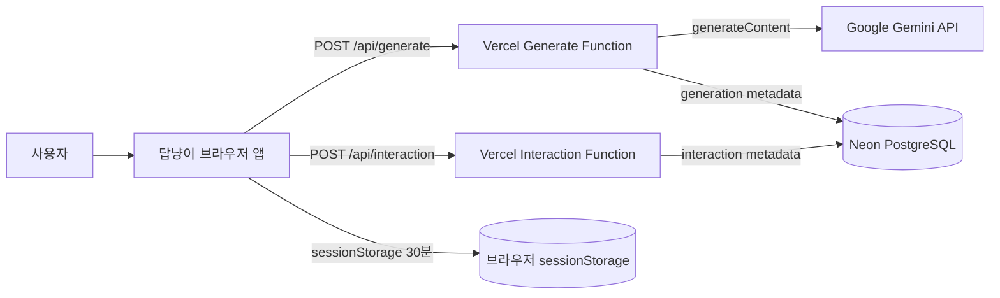
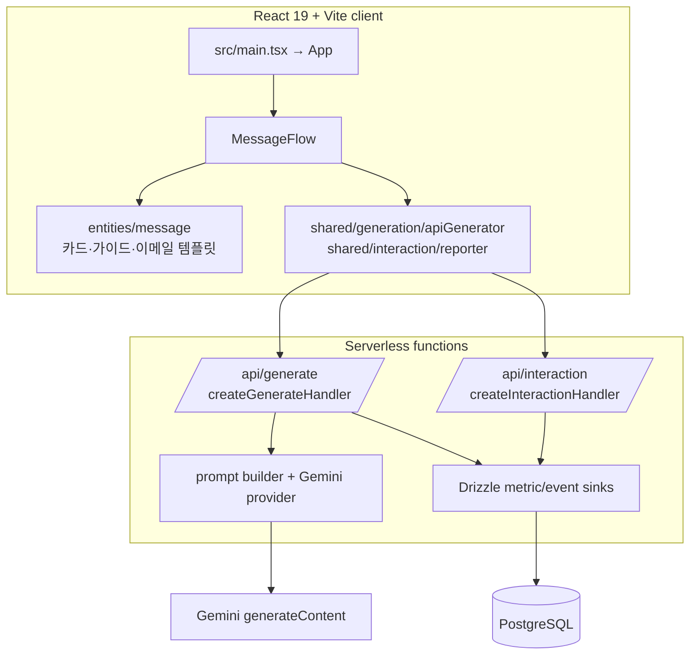
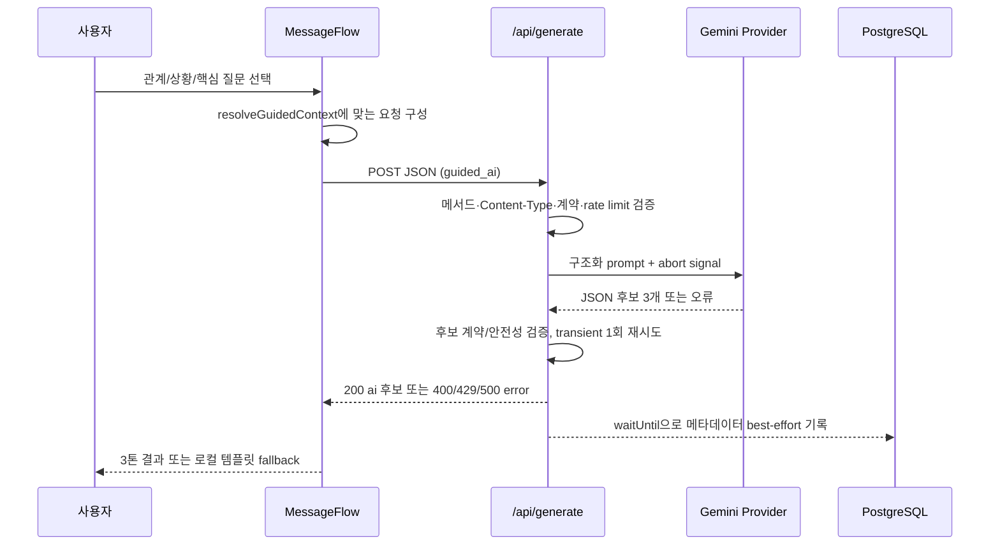
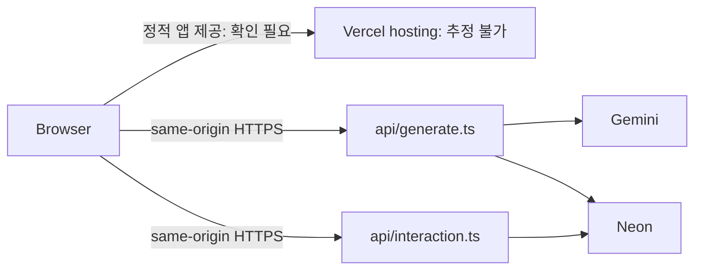

# 아키텍처 개요

마지막 업데이트: 2026-07-27

## 이 문서의 목적

답냥이의 브라우저·서버 함수·외부 서비스 경계와 대표 생성 흐름을 설명한다.

## 빠른 요약

카드/이메일 결과는 브라우저의 결정적 템플릿에서 생성한다. 가이드/직접 입력은 동일 출처의 `/api/generate`를 거쳐 Gemini로 전달되며, 실행·이벤트 메타데이터는 `DATABASE_URL`이 있을 때만 PostgreSQL에 best-effort로 기록한다.

## Context Diagram

## Component / Container Diagram

## 대표 요청 시퀀스: 가이드 AI 생성

## Runtime Topology

## 런타임 데이터 플로우

1. `MessageFlow`는 선택값과 입력을 검증해 `GenerationRequest`를 만들고 `generateWithApi`로 전송한다.
2. `createGenerateHandler`는 서버 계약을 다시 파싱하고 가이드 맥락을 서버 카탈로그로 해석한다.
3. Gemini provider는 prompt builder의 JSON schema와 system instruction을 사용한다.
4. 응답은 `createGenerationResponse('ai', ...)` 검증 후 반환된다. 실패 시 UI는 해당 흐름에서 템플릿 fallback을 시도한다.
5. DB에는 원문 메시지/상황 텍스트가 아닌 generation metric 또는 interaction event 행만 기록하는 매핑이 있다.

## 근거

- 클라이언트 분기: `src/pages/message-flow/MessageFlow.tsx`
- API handler: `api/_lib/generation/handler.ts`, `api/_lib/interaction/handler.ts`
- 외부 호출: `api/_lib/generation/geminiProvider.ts`
- DB sink: `api/_lib/db/generationMetricsSink.ts`, `api/_lib/db/interactionMetricsSink.ts`

## 주의사항/함정

in-memory rate limiter는 함수 인스턴스별 `Map`이므로 서버리스 인스턴스 간 전역 제한이 아니다.

## TODO/확인 필요

- 실제 호스팅 provider·리전·네트워크 정책 및 DB 연결 풀 설정은 저장소에서 확인할 수 없다.
