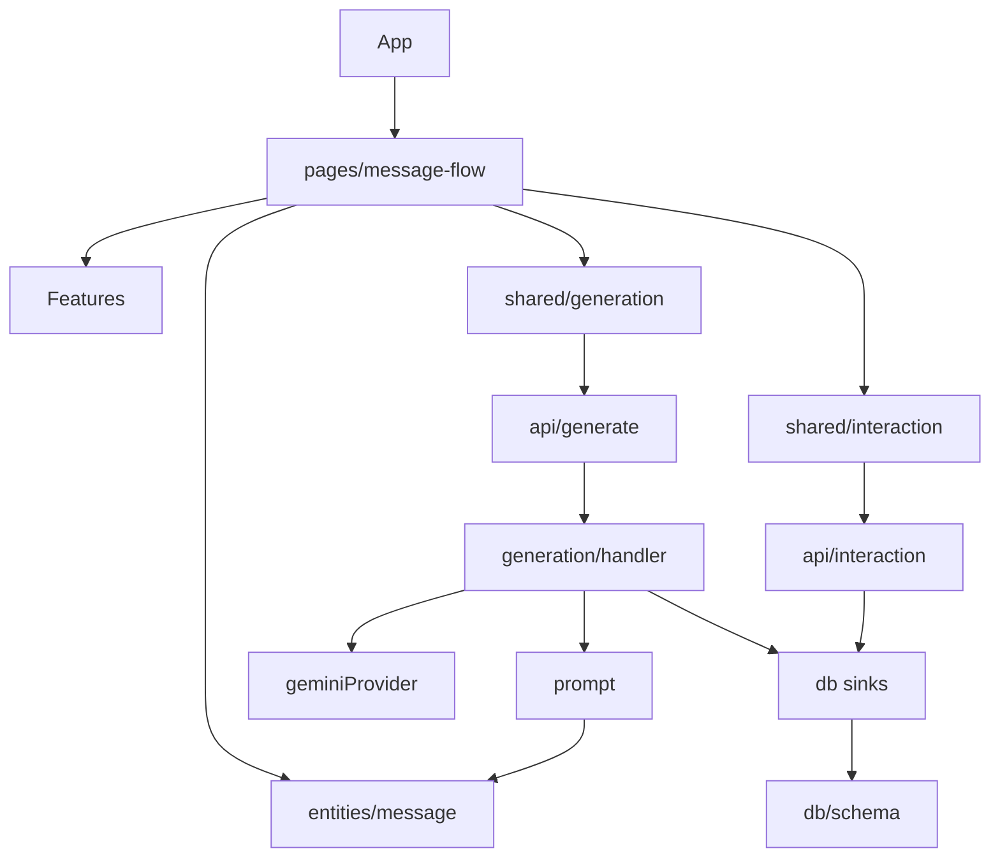

# 모듈

마지막 업데이트: 2026-07-27

## 이 문서의 목적

변경할 기능의 소유 경계, 핵심 API, 테스트 위치를 찾는다.

## 빠른 요약

UI orchestration은 `MessageFlow`, 도메인 규칙은 `entities/message`, 네트워크 계약은 `shared`, 신뢰 경계 이후는 `api/_lib`가 담당한다.

## 모듈 목록

|모듈|경로|책임|주요 클래스/함수|의존성|테스트 위치|
|---|---|---|---|---|---|
|앱 shell|`src/app/`|최상위 UI 조립|`App`, `Splash`|React, MessageFlow|`src/app/*.test.tsx`|
|메시지 흐름|`src/pages/message-flow/`|상태 전이·생성 경로·복원|`MessageFlow`, `generateFromGuided`, `generateFromManual`|features, entities, shared|간접: `src/app/App.test.tsx`|
|메시지 도메인|`src/entities/message/`|식별자·카드·템플릿·가이드 맥락|`templateCandidatesFor`, `resolveGuidedContext`|생성 산출물|동일 디렉터리 `*.test.ts`|
|UI feature|`src/features/`|선택/입력/결과/고양이 UI|`GuidedChat`, `ResultList`, `CatStage`|React, entities|`cat-stage/CatStage.test.tsx`|
|생성 공유 계약|`src/shared/generation/`|요청/응답 검증, fetch client, mock|`parseGenerationRequest`, `generateWithApi`|entities|동일 디렉터리 `*.test.ts`|
|이벤트 공유 계약|`src/shared/interaction/`|이벤트 검증·best-effort 전송|`parseInteractionEvent`, `reportInteraction`|entities|동일 디렉터리 `*.test.ts`|
|생성 서버|`api/_lib/generation/`|HTTP handler, provider, rate limit, metric|`createGenerateHandler`, `createGeminiGenerationProvider`|prompt, db|동일 디렉터리 `*.test.ts`|
|prompt/retrieval 서버|`api/_lib/prompt/`, `api/_lib/retrieval/`|prompt 구성, 검수 예시 선택/embedding|`buildPrompt`, `createReviewedExampleSelector`|entities, db|동일 디렉터리 `*.test.ts`|
|DB 서버|`api/_lib/db/`|Drizzle schema, repository, sink|`createDatabase`, `createDataRepositories`|Drizzle/Neon|동일 디렉터리 `*.test.ts`|
|운영 스크립트|`scripts/`|migration/template/retrieval/DB smoke|`db-smoke.ts`, `retrieval-ingest.ts`|api/_lib|일부 `*.test.ts`|

## 의존 그래프

## 근거

- public exports: 각 모듈의 `index.ts`
- 서버 조립: `api/generate.ts`, `api/interaction.ts`
- 테스트 파일: `rg --files '*test.*'` 결과의 각 모듈 경로

## 주의사항/함정

공유 생성 계약은 브라우저와 API가 함께 사용한다. UI 타입만 변경하고 `parseGenerationRequest`를 갱신하지 않으면 서버가 `400 invalid_request`를 반환한다.

## TODO/확인 필요

- 모듈별 코드 오너 및 리뷰 책임자는 저장소에서 확인 필요.
