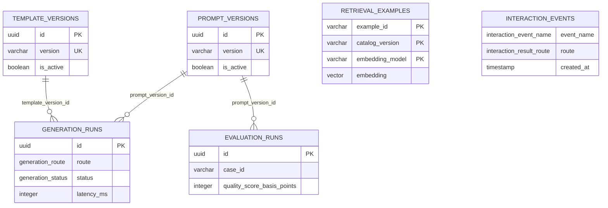

# 데이터 모델

마지막 업데이트: 2026-07-27

## 이 문서의 목적

PostgreSQL/Drizzle 스키마의 저장 대상, 관계, 인덱스 및 migration 절차를 설명한다.

## 빠른 요약

스키마는 메시지 원문이 아니라 prompt/template 버전, 생성 실행 메타데이터, 평가 실행, retrieval embedding, interaction 이벤트를 모델링한다.

## 주요 테이블

|테이블|용도|핵심 열|
|---|---|---|
|`prompt_versions`|prompt 배포 버전|`version`, `checksum`, `model`, `review_status`, `is_active`|
|`template_versions`|템플릿 배포 버전|`version`, `checksum`, `review_status`, `is_active`|
|`generation_runs`|AI/템플릿 생성 실행 메타데이터|`route`, `status`, `scenario_id`, `purpose_id`, `latency_ms`, version FK|
|`evaluation_runs`|모델/프롬프트 평가 결과|`case_id`, `model`, `prompt_version_id`, quality/cost/latency|
|`retrieval_examples`|검수 예시 embedding|복합 PK, `vector(1024)`, scenario/purpose/mode|
|`interaction_events`|UI 상호작용 메타데이터|`event_name`, `route`, `scenario_id`, `mode`, 선택적 situation/tone|

## 엔티티 관계

## migration / seed / 인덱스

- `drizzle.config.ts`는 schema `api/_lib/db/schema.ts`, output `drizzle/`, dialect `postgresql`을 사용한다.
- `npm run db:generate`, `npm run db:migrate`, `npm run db:check`가 `package.json`에 정의되어 있다.
- SQL migration은 `drizzle/*/migration.sql`에 있다. T30 기본 테이블은 `20260720021610_t30_data_layer`, interaction 이벤트는 `20260720074248_t36_interaction_events`에 추가됐다.
- `generation_runs`에는 created/status/prompt-version/scenario 기반 index가, `interaction_events`에는 created/route/scenario 기반 index가 있다.
- retrieval 검색은 `catalogVersion`, embedding 모델, `approved`, scenario/purpose/mode 필터 뒤 cosine distance 오름차순 2건을 조회한다 (`api/_lib/retrieval/repository.ts`).

## 근거

- 전체 선언/제약/인덱스: `api/_lib/db/schema.ts`
- DB URL 검증: `api/_lib/db/database.ts`
- row mapping: `api/_lib/db/repositories.ts`
- migration SQL: `drizzle/*/migration.sql`

## 주의사항/함정

`retrieval_examples.embedding`은 1024차원이고 non-zero check가 있다. 다른 차원의 모델로 바꾸면 schema/검증/ingestion 계약을 함께 변경해야 한다. 단일 active prompt/template은 partial unique index로 강제된다.

## TODO/확인 필요

- 실제 DB에 어떤 migration이 적용됐는지, 백업/보존/삭제 정책은 저장소만으로 확인할 수 없다.
