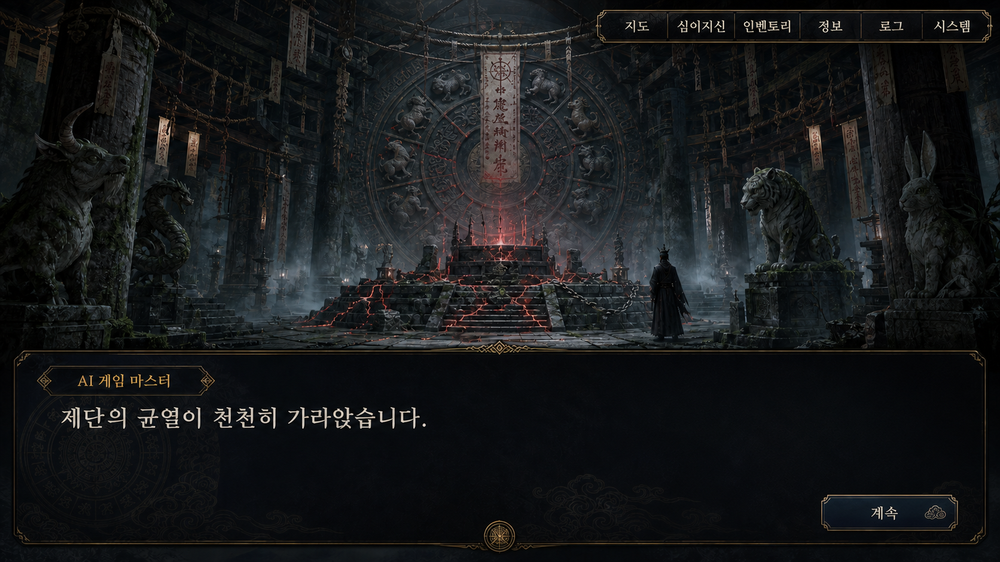
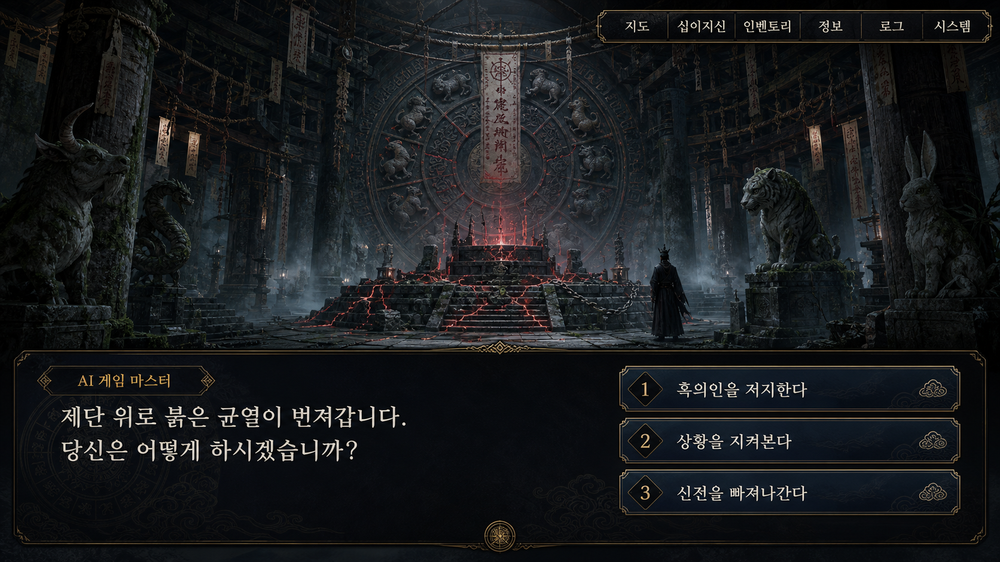
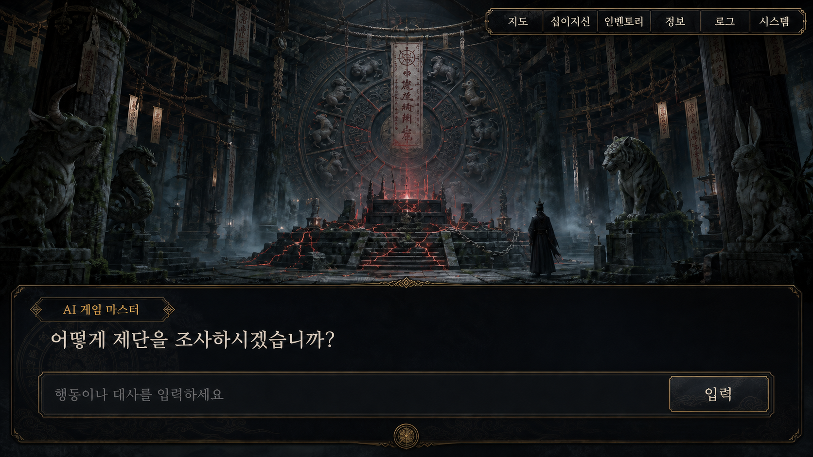
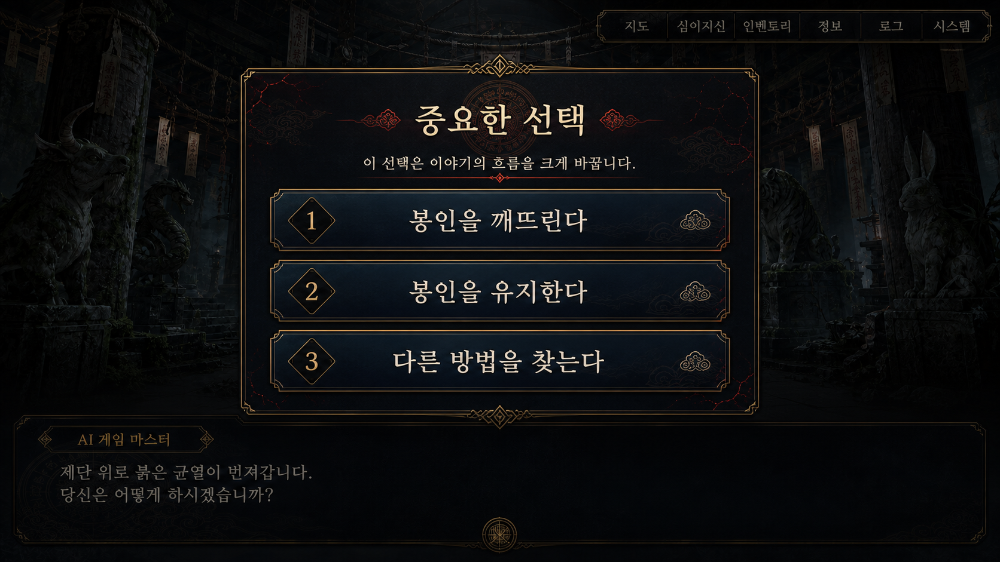

# Approval Queue

AI가 생성한 변경안과 신규 문서 초안을 검토하기 위한 공간이다.

- 프로젝트 ID: `chronicles-of-the-twelve-bonds`

## Pending

대기 중인 항목이 없다.

## Approved

승인 후 아직 적용되지 않은 항목이 없다.

## Needs Reconfirmation

적용 직전 원본 또는 영향 범위가 달라져 명시적 재확인이 필요한 항목이 없다.

## Applied

### APPR-20260716-004: 게임 개요·세계관·시나리오·시스템 문서 역할 분리

#### Metadata

- ID: APPR-20260716-004
- 프로젝트 ID: `chronicles-of-the-twelve-bonds`
- 상태: applied
- 생성일: 2026-07-16
- 요청자: 사용자
- 대상 문서 경로: 아래 Target Operations 전체
- 기준 Git 커밋: `1eb154794c2e25abe60e23c87628a9a3c2bef608`
- 비교 대상: 대상 작업 목록 전체
- 변경 타입: restructure
- 관련 workflow: `docs/workflows/document_change.md`의 `restructure_documents`, `docs/workflows/document_structure.md`

##### Target Operations

| 작업 | 대상 경로 | 비교 대상 | 작성 당시 SHA-256 | 적용 후 역할 |
|---|---|---|---|---|
| update | `workspace/projects/chronicles-of-the-twelve-bonds/design/game/game_design_overview.md` | 전체 문서 | `faf4933c4e412d39f6b8ddb1c537286de9c3beaa08be1743f3cde8b838d3bff3` | game_overview |
| update | `workspace/projects/chronicles-of-the-twelve-bonds/design/README.md` | 전체 문서 | `9bae7286cf879a8e510922670d697660650fec213ef26f08a485747841b4ef52` | document_index |
| create | `workspace/projects/chronicles-of-the-twelve-bonds/design/world/world_setting.md` | 신규 문서 제목·주제 | 없음 | world_setting |
| create | `workspace/projects/chronicles-of-the-twelve-bonds/design/narrative/main_scenario.md` | 신규 문서 제목·주제 | 없음 | scenario |
| create | `workspace/projects/chronicles-of-the-twelve-bonds/design/systems/core_gameplay_systems.md` | 신규 문서 제목·주제 | 없음 | system |

#### Proposal

현재 `game_design_overview.md`에 함께 들어 있는 세계관 정사, Phase별 시나리오,
지도·탐험·성장·전투·판정 상세를 역할별 canonical document로 분리한다.
개요서에는 게임 정체성, 핵심 경험, 상위 루프, 거시 진행과 목표 범위만 남기고
모든 확정 상세 문서로 이동하는 상대경로 링크를 제공한다. `design/README.md`도
현재 확정 문서 전체를 연결하는 색인으로 갱신한다.

#### Review Notes

- 위험도: medium
- 충돌 가능성: UI 입력 상태와 AI GM 런타임 책임은 기존 별도 문서가 계속 원본으로 소유한다. 새 문서가 이를 중복 확정하지 않도록 요약과 링크만 둔다.
- 누락 정보: 기존 문서의 Open Questions는 역할별 문서로 이동하며 미정값은 그대로 `TBD`로 유지한다.
- 작성 당시 원본 요약: 전체 게임 기획서 한 문서가 프로젝트 방향, 주인공·세계관, 초반 Phase, 탐험·성장·전투, 사흉 진행, 엔딩과 플레이 시간까지 함께 소유한다. `design/README.md`는 확정 문서 폴더라는 설명만 있고 문서 링크가 없다.
- 원자적 적용: 예. Target Operations 중 일부만 적용하지 않는다.

#### Draft

##### `design/game/game_design_overview.md` 갱신 초안

```markdown
# 전체 게임 기획서

## Metadata

- 프로젝트 ID: `chronicles-of-the-twelve-bonds`
- 문서 타입: game_overview
- 상태: confirmed
- 관련 문서: [세계관 설정](../world/world_setting.md), [메인 시나리오](../narrative/main_scenario.md), [핵심 게임 시스템](../systems/core_gameplay_systems.md), [플레이 UI](../ui/gameplay_ui.md), [AI GM 런타임 및 데이터 연동 규칙](../technical/ai_gm_runtime_rules.md)
- 마지막 변경: 2026-07-16

## Summary

- 한국·중국·일본의 문화와 신화 요소를 혼합한 가상세계를 배경으로 하는 PC용 1인 AI 게임 마스터 TRPG다.
- 플레이어는 십이지신을 해금·강화하고 장소의 이상 현상에서 사흉의 단서를 추리한다.
- 고정 선택지만으로 메인 시나리오를 진행할 수 있고 허용된 장면에서는 자연어 입력으로 역할극과 자유 행동을 추가한다.
- 탐험에서 수집한 정보와 숨겨진 카르마가 검은 옷의 습격자와 관련된 엔딩을 변화시킨다.
- 탐험을 적당히 포함한 평균 1회차 목표 플레이 시간은 약 2시간이다.

## Design Pillars

- `추리형 여정`: 사흉의 특징과 장소의 이상 현상을 비교해 목적지를 선택한다.
- `십이지신과의 인연`: 탐험과 사건으로 십이지신을 해금·강화하고 전투 편성을 구성한다.
- `선택 가능한 자유도`: 고정 선택지는 안전한 기본 진행 경로이며 자연어 입력은 장면별 선택 기능이다.
- `정보가 바꾸는 결말`: 탐험에서 얻은 정보와 숨겨진 카르마가 최종 정체 분기와 결말에 영향을 준다.
- `초보자 접근성`: 새로운 규칙은 처음 등장할 때 짧게 설명하고 고정 선택지만으로도 진행할 수 있게 한다.
- `AI GM의 역할`: 신비롭고 장엄한 동양 판타지 문체로 묘사하되 플레이어의 행동·대사를 대신 결정하거나 확정 규칙을 변경하지 않는다.

## High-Level Gameplay Loop

1. Unity가 이상 현상 설명이 붙은 장소 노드를 지도에 표시한다.
2. 플레이어가 사흉 특징과 장소 설명을 비교해 목적지를 선택한다.
3. AI 게임 마스터가 장면을 묘사하고 장면에 맞는 입력 방식을 제공한다.
4. Unity가 장면별로 확정된 규칙에 따라 선택·판정과 결과를 처리한다.
5. 보상·패널티, 아이템, 정보와 십이지신 해금·강화를 정산한다.
6. 정산 후 자동 저장하고 지도에서 다음 노드와 편성을 선택한다.

## Macro Progression

- 도입부에서 플레이어는 십이지신당의 봉인 붕괴를 목격하고 인연의 피리를 받아 혼돈과 싸우며 기본 전투를 학습한다.
- 혼돈 이후 남부 궁기, 동부 도올, 북부 도철을 추적하며 탐험과 요괴 사건으로 나머지 십이지신을 해금·강화한다.
- 사흉의 정수를 모으는 검은 옷의 습격자와 최종 전투를 진행하며, 수집 정보와 필수 서사 보유 여부에 따라 정체 분기가 열린다.
- 정체 분기 이후의 선택과 숨겨진 카르마에 따라 서로 다른 엔딩으로 이어진다.

## Target Scope

- 플랫폼: PC
- 엔진: Unity
- 플레이 형태: 1인 플레이와 AI 게임 마스터
- 평균 1회차 목표: 탐험을 적당히 포함해 약 2시간
- 메인 시나리오 위주 플레이는 2시간보다 짧고, 많은 탐험과 진엔딩 조건을 노리면 더 길어질 수 있다.
- 현재 제작 초점은 혼돈 튜토리얼 이후 처음 열리는 지도와 남부 권역의 궁기 여정이다.

## Document Map

- [세계관 설정](../world/world_setting.md): 세계 구조, 주인공 유형, 십이지신당, 사흉, 흑의인과 인연의 피리
- [메인 시나리오](../narrative/main_scenario.md): 오프닝 Phase, 혼돈 튜토리얼, 사흉 추적과 엔딩 분기
- [핵심 게임 시스템](../systems/core_gameplay_systems.md): 지도·탐험, 성장, 판정, 전투, 카르마·정보와 플레이 시간
- [플레이 UI](../ui/gameplay_ui.md): 장면 입력 모드, 지도, 로그, 보조 메뉴와 예시 목업
- [AI GM 런타임 및 데이터 연동 규칙](../technical/ai_gm_runtime_rules.md): Unity·AI GM·RAG·세션 상태의 책임과 데이터 계약

## Next Design Focus

1. 4방향 권역 구분
2. 남부 권역 지도
3. 궁기 단서와 탐험 노드
4. 뱀·말·양 해금·강화 사건
5. 실제 판정 장면별 규칙 확인

## Open Questions

- TBD: 전체 무대와 월드맵의 범위
- TBD: 메인 직행과 진엔딩 목표 플레이의 예상 시간 범위
- TBD: 전투·성장·카르마·정보 시스템의 최종 수치와 상세 규칙
- TBD: 고양이 핵심 서사의 전체 구성과 획득 장면

## Sources

- `workspace/projects/chronicles-of-the-twelve-bonds/ideas/temporary_ideas.md`의 `IDEA-20260714-001`
- `workspace/projects/chronicles-of-the-twelve-bonds/approvals/approval_queue.md`의 `APPR-20260716-004`
- 재구성 전 원본 SHA-256: `faf4933c4e412d39f6b8ddb1c537286de9c3beaa08be1743f3cde8b838d3bff3`
```

##### `design/world/world_setting.md` 생성 초안

```markdown
# 세계관 설정

## Metadata

- 프로젝트 ID: `chronicles-of-the-twelve-bonds`
- 문서 타입: world_setting
- 상태: confirmed
- 상위 개요서: [전체 게임 기획서](../game/game_design_overview.md)
- 관련 문서: [메인 시나리오](../narrative/main_scenario.md), [핵심 게임 시스템](../systems/core_gameplay_systems.md)
- 마지막 변경: 2026-07-16

## Summary

- 한국·중국·일본의 문화와 신화 요소를 혼합한 독립 가상세계다.
- 고대 선인들이 십이지신의 힘으로 사흉을 봉인했으나 흑의인의 금지된 주술로 봉인이 무너진다.
- 플레이어는 신령이 깃든 인연의 피리를 통해 십이지신의 힘을 빌린다.
- 검은 옷의 습격자의 정체와 목적은 후반부까지 숨겨지는 핵심 세계관 비밀이다.

## World Rules

- 특정 실존 국가를 그대로 재현하지 않고 한국·중국·일본의 문화·신화·시각 요소를 혼합한다.
- 십이지신은 사흉을 봉인하던 신성한 존재이며 각 방향의 사흉과 대응 관계를 가진다.
- 사흉은 혼돈, 궁기, 도올, 도철로 구성된다.
- 사흉의 힘은 정수 형태로 남을 수 있고 최종 갈등의 핵심 자원이 된다.
- 플레이 중 공개되는 세계관 정보와 숨겨진 진실은 공개 조건을 구분한다.

## Canon

### 플레이어 캐릭터

- 게임 시작 시 플레이어 캐릭터의 성별을 선택한다.
- 남성은 `방랑도사`로 시작한다.
  - 호탕하고 유쾌한 기본 어조를 사용한다.
  - 술 한 잔에 바람을 벗 삼아 유랑하던 중 묘한 기운에 이끌려 십이지신당의 문을 연다.
- 여성은 `수련무녀`로 시작한다.
  - 조신하고 신중한 기본 어조를 사용한다.
  - 영력 수련과 순례 중 대지를 흐르는 불길한 이치를 추적해 십이지신당에 도달한다.
- 두 유형의 차이는 오프닝 독백, 사당 진입 묘사와 대사 톤에만 적용한다.
- 능력치, 판정 규칙과 전투 성능은 동일하다.
- 기본 성격은 플레이어의 선택이나 자연어 행동을 제한하지 않는다.
- 기본 성격과 다른 행동도 허용하고 상황 반응이나 캐릭터 변화로 자연스럽게 묘사한다.

### 십이지신당

- 고대 선인들이 사흉을 봉인한 신성한 신전이다.
- 오랜 세월 인적이 끊겨 이끼와 먼지로 덮였고 스산하고 기괴한 기운이 감돈다.

### 흑의인

- 정체를 알 수 없는 검은 옷의 인물이다.
- 신당의 가장 깊은 제단에서 사흉의 봉인을 풀기 위한 금지된 주술을 거행한다.
- 혼돈, 궁기와 도철의 정수를 빼앗아 흡수한다.

### 혼돈

- 사흉 중 하나로 산처럼 거대하고 파괴력이 강하다.
- 지능이 낮고 움직임이 느리다.
- 발이 닿는 곳의 생명력을 빼앗고 자연을 검게 썩히는 `오염`을 퍼뜨린다.

### 피리 속 신령과 인연의 피리

- 신령은 `인연의 피리`에 깃든 신성한 존재이며 봉인 붕괴로 큰 타격을 입었다.
- 근엄하지만 간절한 목소리로 플레이어에게 도움을 요청하고 길을 안내한다.
- 인연의 피리는 십이지신의 힘을 빌려 현현시킬 수 있는 신물이다.
- 봉인이 깨질 때 손상되어 초반에는 원숭이, 닭, 개의 힘만 사용할 수 있다.
- 신령의 제안을 수락하면 플레이어 눈앞에 현현하고 수령 시 인벤토리에 추가된다.
- 이후 여정과 탐험을 통해 나머지 십이지신의 힘을 순차적으로 복구한다.

### 십이지신과 사흉의 방향 대응

| 방향 | 사흉 | 대응 십이지신 |
|---|---|---|
| 동방 | 도올 | 호랑이, 토끼, 용 |
| 서방 | 혼돈 | 원숭이, 닭, 개 |
| 남방 | 궁기 | 뱀, 말, 양 |
| 북방 | 도철 | 돼지, 쥐, 소 |

- 방향에 따른 실제 전투 보너스는 [핵심 게임 시스템](../systems/core_gameplay_systems.md)이 소유한다.

### 고양이의 숨겨진 진실

- 검은 옷의 습격자의 정체는 고양이다.
- 고양이는 쥐의 속임수로 십이지에 들지 못한 과거와 원한을 가진다.
- 고양이의 정체, 과거와 목적은 시작 시 공개하지 않고 정보 수집 조건을 충족한 후 공개한다.
- 구체적인 복선, 공개 시점과 엔딩 결과는 [메인 시나리오](../narrative/main_scenario.md)가 소유한다.

## Information Visibility

- 시작부터 공개: 플레이어의 출신 유형과 십이지신당에 도달한 이유
- 도입부 공개: 사흉의 봉인 붕괴, 피리 속 신령과 인연의 피리의 역할
- 여정 중 공개: 사흉별 특징, 십이지신 이야기와 획득 아이템 정보
- 조건부 공개: 고양이 핵심 서사와 흑의인의 정체
- 비공개 유지: 숨겨진 카르마 수치와 아직 충족하지 않은 엔딩 조건

## Gameplay / Production Notes

- 플레이 영향: 사흉 특징과 장소 이상 현상을 비교하는 추리, 십이지신 해금·강화와 정보 수집의 근거가 된다.
- 리소스 영향: 신당, 4방향 지역, 사흉·십이지신·요괴, 피리, 정수와 주요 아이템의 시각 자료가 필요하다.
- 구현 고려: 공개 조건을 충족한 설정만 AI GM 문맥과 정보 메뉴에 전달한다.
- QA 고려: 숨겨진 진실의 조기 노출, 방향 대응 불일치와 주인공 성별별 성능 차이를 방지한다.

## Open Questions

- TBD: 천계와 인간계 등 전체 무대의 범위
- TBD: 한·중·일 문화 요소의 구체적인 혼합 기준과 지역별 시각 차이
- TBD: 고양이가 사흉의 정수를 모으는 구체적인 목적
- TBD: 고양이 핵심 서사의 전체 내용과 개수

## Sources

- 재구성 전 `workspace/projects/chronicles-of-the-twelve-bonds/design/game/game_design_overview.md` SHA-256: `faf4933c4e412d39f6b8ddb1c537286de9c3beaa08be1743f3cde8b838d3bff3`
- `workspace/projects/chronicles-of-the-twelve-bonds/ideas/temporary_ideas.md`의 `IDEA-20260714-001`
- `workspace/projects/chronicles-of-the-twelve-bonds/approvals/approval_queue.md`의 `APPR-20260716-004`
```

##### `design/narrative/main_scenario.md` 생성 초안

```markdown
# 메인 시나리오

## Metadata

- 프로젝트 ID: `chronicles-of-the-twelve-bonds`
- 문서 타입: scenario
- 상태: confirmed
- 상위 개요서: [전체 게임 기획서](../game/game_design_overview.md)
- 관련 문서: [세계관 설정](../world/world_setting.md), [핵심 게임 시스템](../systems/core_gameplay_systems.md), [플레이 UI](../ui/gameplay_ui.md)
- 마지막 변경: 2026-07-16

## Summary

- 플레이어는 십이지신당의 봉인 붕괴를 목격하고 신령과 계약해 사흉을 추적한다.
- 혼돈 튜토리얼 이후 궁기, 도올, 도철을 차례로 상대하고 사흉의 정수를 모으는 흑의인과 최종 전투를 벌인다.
- 수집 정보로 흑의인의 정체를 밝혔는지와 숨겨진 카르마에 따라 결말이 달라진다.

## Opening Variants

- 남성 `방랑도사`와 여성 `수련무녀`는 오프닝 독백, 신당 진입 묘사와 기본 대사 톤만 다르다.
- 능력치, 판정, 전투 성능과 핵심 사건 결과는 동일하다.
- 기본 성격과 다른 플레이어 선택·자연어 행동도 허용한다.

## Prologue

### Phase 1: 신당 진입과 조우

- 오프닝부터 신령과의 계약까지는 `choice_only`를 기본으로 한다.
- 플레이어는 기이한 기운을 따라 신당의 가장 깊은 제단에 들어간다.
- 흑의인이 금지된 주술을 외우고 제단에 붉은 균열이 번지는 광경을 목격한다.
- 선택지는 다음 세 가지다.
  - 무기를 들고 흑의인을 저지한다.
  - 숨을 죽이고 상황을 지켜본다.
  - 불길한 직감을 따라 신전을 빠져나간다.

### Phase 2: 봉인의 파멸

- 저지를 시도하면 마지막 주문이 먼저 완성되어 실패한다.
- 지켜보면 방해받지 않은 의식이 완성되고 제단이 갈라진다.
- 도망치면 봉인 파괴의 충격파에 휩쓸려 정신을 잃는다.
- 모든 선택은 별도 보상·패널티 없이 봉인 파괴라는 같은 핵심 결과로 합류한다.
- 흑의인 저지를 시도한 경우에만 Phase 4에서 신령이 용기를 알아보고 처음부터 우호적으로 반응한다.

### Phase 3: 깨어난 재앙과 오염

- 흑의인은 사라지고 혼돈만 현장에 남으며 궁기, 도올, 도철은 도주한다.
- 혼돈의 발치에서 생명력을 빼앗는 검은 오염이 퍼진다.
- 플레이어는 혼돈에게 접근하거나 신당 밖으로 도망칠 수 있다.
- 도망치면 오염에 삼켜져 게임 오버가 되며 세션을 종료하거나 Phase 3 시작점으로 돌아간다.
- 혼돈에게 접근하면 Phase 4로 이어진다.

### Phase 4: 피리 속 신령과의 계약

- 모습을 드러내지 않은 신령의 목소리가 플레이어의 머릿속에 울린다.
- 신령은 혼돈의 정체, 다른 사흉의 도주와 십이지신이 지키던 봉인의 붕괴를 설명한다.
- 플레이어가 힘이 부족하다고 말하거나 거절하면 신령은 십이지의 편린을 다룰 권능과 인연의 피리를 제안한다.
- 손상된 피리로는 원숭이, 닭, 개만 사용할 수 있지만 혼돈을 상대하기에는 충분하다.
- 제안을 수락하는 순간 피리가 눈앞에 현현하며, 수령 후 혼돈 보스 전투로 전환된다.

## 혼돈 전투 튜토리얼

- 혼돈전에서 기본 판정과 전투 조작을 학습한다.
- 혼돈은 덩치가 크고 공격이 느려 회피하기 쉽고, 봉인에서 막 풀려나 체력이 낮다.
- 플레이어는 원숭이, 닭, 개의 힘을 사용한다.
- 혼돈 처치 시 `혼돈의 정수`가 떨어지지만 검은 옷의 습격자가 훔쳐 간다.
- 이후 나머지 사흉의 특성을 전달받고 추적 여정을 시작한다.
- 사흉 특징과 장소 이상 현상을 비교하는 법은 별도 튜토리얼로 설명하지 않고 실제 지도 선택과 결과를 통해 학습시킨다.

## 사흉 추적

### 궁기

- 혼돈 이후 처음 설계할 메인 여정이다.
- 남부 권역의 이상 현상과 단서를 따라 궁기를 추적한다.
- 궁기는 사망 직전 발악 패턴으로 플레이어에게 빈사급 피해를 준다.
- 전투 직후 검은 옷의 습격자가 `궁기의 정수`를 빼앗는다.

### 도올

- 도올 처치 후에는 습격자가 나타나지 않는다.
- 플레이어가 `도올의 정수`를 보유한다.
- 궁기와 도올을 모두 처치하면 도철로 가는 선택지가 열린다.

### 도철

- `도올의 정수`가 있어야 결계를 뚫고 진입할 수 있다.
- 도철 처치 후 정수를 회수하려는 순간 습격자가 다시 나타난다.
- 십이지신 1명을 지정해 정수를 두고 판정하지만 결과는 필패다.

## Final Battle and Endings

- 습격자는 빼앗은 혼돈, 궁기, 도철의 정수를 흡수해 플레이어와 싸운다.
- 기준 이상의 피해를 주면 누적 정보량과 필수 핵심 정보 보유 여부를 검사한다.

### 일반 분기

- 정보량이 기준 미만이거나 필수 핵심 정보가 없으면 정체 분기 없이 전투를 계속한다.
- 승리하면 모든 사흉의 정수를 회수하고 천계의 평화를 되찾는다.

### 고양이 정체 분기

- 정보량과 필수 핵심 정보 조건을 모두 충족하면 습격자가 고양이임을 알게 된다.
- 고양이는 쥐의 속임수로 십이지가 되지 못한 원한 때문에 복수하려 했다.
- 플레이어는 고양이의 편에 서거나 전투를 계속한다.

### 고양이의 편에 선다

- 플레이어가 보유한 `도올의 정수`를 고양이에게 넘긴다.
- 십이지와 싸워 승리하면 천계 멸망 엔딩으로 이어진다.

### 고양이와 전투를 계속한다

- 승리 후 `악은 악이다. 고양이를 처단한다`를 선택하면 천계는 평화를 되찾지만 플레이어는 이후에도 고양이를 떠올린다.
- `한 번 더 기회를 주자`를 선택하면 숨겨진 카르마에 따라 결과가 달라진다.
  - 기준 이상: 고양이가 플레이어를 따라와 속죄하고 마지막에는 십이지와 같은 신이 된다.
  - 기준 미만: 고양이는 자신을 용서하지 못하고 플레이어가 등을 돌린 사이 스스로 목숨을 끊는다.

## Gameplay / Production Notes

- 필요한 장면·전투: 성별별 오프닝 변형, Phase 1~4, 혼돈·궁기·도올·도철·최종 전투와 엔딩 장면이 필요하다.
- 필요한 리소스: 신당, 사흉, 흑의인, 피리, 정수, 지역과 엔딩별 일러스트가 필요하다.
- 시스템 의존성: 장면별 입력 모드, Check Config, Outcome, 정보 공개, 카르마와 정수 소유 상태를 사용한다.
- QA 고려: Phase 합류 결과, 정수 소유권, 정보 공개 조건, 필패 판정과 엔딩 조건을 검증한다.

## Open Questions

- TBD: 최초 자연어 입력 장면
- TBD: 궁기·도올·도철의 구체적인 단서와 장면 구성
- TBD: 고양이 정체를 암시하는 복선 배치
- TBD: 고양이 핵심 서사의 전체 내용, 개수와 획득 장면
- TBD: 도철전 필패 판정에서 십이지신을 지정하는 이유와 결과 차이

## Sources

- 재구성 전 `workspace/projects/chronicles-of-the-twelve-bonds/design/game/game_design_overview.md` SHA-256: `faf4933c4e412d39f6b8ddb1c537286de9c3beaa08be1743f3cde8b838d3bff3`
- `workspace/projects/chronicles-of-the-twelve-bonds/ideas/temporary_ideas.md`의 `IDEA-20260714-001`
- `workspace/projects/chronicles-of-the-twelve-bonds/approvals/approval_queue.md`의 `APPR-20260716-004`
```

##### `design/systems/core_gameplay_systems.md` 생성 초안

```markdown
# 핵심 게임 시스템

## Metadata

- 프로젝트 ID: `chronicles-of-the-twelve-bonds`
- 문서 타입: system
- 상태: confirmed
- 상위 개요서: [전체 게임 기획서](../game/game_design_overview.md)
- 관련 문서: [세계관 설정](../world/world_setting.md), [메인 시나리오](../narrative/main_scenario.md), [플레이 UI](../ui/gameplay_ui.md), [AI GM 런타임 및 데이터 연동 규칙](../technical/ai_gm_runtime_rules.md)
- 마지막 변경: 2026-07-16

## Summary

- 지도에서 이상 현상을 비교해 사흉 또는 탐험 장소를 선택한다.
- 탐험과 요괴 사건으로 십이지신을 해금·강화하고 아이템과 정보를 수집한다.
- 판정은 공통 계산식을 일괄 적용하지 않고 실제 장면별로 사용자 확인 후 설계한다.
- 전투는 십이지신 편성과 방향 대응 보너스를 중심으로 하는 1차안을 사용한다.

## Input Principles

- 주요 분기와 규칙 통제가 필요한 장면은 `choice_only`로 구성한다.
- NPC 대화, 조사와 자유 행동 중심 장면은 `choice_and_text` 또는 필요한 자연어 입력 모드로 구성한다.
- 입력 방식은 장소가 아니라 현재 장면을 기준으로 전환한다.
- 고정 선택지만 사용해도 메인 시나리오를 정상 진행할 수 있다.
- 새로운 규칙은 처음 등장할 때 짧게 설명하고 TRPG 용어는 도움말에서 다시 확인할 수 있게 한다.
- 플레이어가 진행 방법을 묻거나 오래 머뭇거리면 AI 게임 마스터가 현재 가능한 행동 예시를 제시한다.
- 세부 입력 상태와 표시 방식은 [플레이 UI](../ui/gameplay_ui.md)가 소유한다.

## Core Gameplay Loop

1. Unity가 서로 다른 이상 현상 설명이 붙은 장소 노드를 지도에 표시한다.
2. 플레이어가 알고 있는 사흉 특징과 장소 설명을 비교해 목적지를 선택한다.
3. AI 게임 마스터가 장면을 묘사하고 장면에 맞는 입력 방식을 제공한다.
4. 판정이 필요하면 해당 장면에 개별 설정한 규칙에 따라 판정한다.
5. 결과에 따라 보상·패널티를 적용하거나 요괴·사흉 전투로 전환한다.
6. 아이템, 십이지신 정보, 진엔딩 정보, 해금 또는 강화 보상을 정산한다.
7. 정산 후 자동 저장하고 지도 화면으로 돌아간다.
8. 지도에서 편성·강화와 인벤토리를 관리한 뒤 다음 노드를 고른다.

- 이 루프는 혼돈 튜토리얼 이후부터 최종 흑막 전투 전까지 반복한다.
- 별도의 정비 장면은 두지 않는다.

## Map and Journey

- 여정은 메인 시나리오용 `사흉 추적`과 성장·정보 수집용 `탐험`으로 구분한다.
- 두 유형은 내부 분류이며 지도에는 직접 표시하지 않는다.
- 각 노드에는 이상 현상과 분위기를 나타내는 단서 설명을 붙인다.
- 설명이 현재 사흉의 특징과 일치하면 사흉과 조우한다.
- 일치하지 않으면 설명에 대응하는 일반 탐험이나 요괴 사건으로 이어진다.
- 한 화면의 1차안은 사흉 장소 1개와 미완료 탐험 장소 최대 9개다.
- 사흉 장소는 조우할 때까지 유지한다.
- 탐험 장소는 한 번만 클리어할 수 있고 완료 후 노드와 보상 풀에서 제거한다.
- 탐험 후 남은 장소와 아직 등장하지 않은 탐험 장소를 이용해 지도를 갱신한다.
- 모든 탐험은 요괴 조우 여부와 관계없이 판정을 진행한다.

## Exploration and Zodiac Growth

- `혼란 조사`는 별도 유형이 아니라 탐험에 포함한다.
- 일부 탐험은 신기한 장소를 조사하는 비전투 장면이다.
  - 판정 성공: 보상 획득
  - 판정 실패: 패널티 적용
- 대부분의 탐험은 특정 십이지신과 관련된 요괴 사건이다.
- 요괴 사건에서는 십이지신 1명을 선택해 판정한다.
  - 성공: 전투 없이 또는 장면 규칙에 따라 보상 획득
  - 실패: 장면 규칙에 따라 패널티 또는 전투 발생
- 사건을 클리어하면 관련 십이지신이 잠겨 있을 때 해금하고 이미 해금된 경우 강화한다.
- 혼돈 이후 나머지 십이지신은 여정과 탐험을 통해 순차적으로 해금한다.
- 이미 해금된 십이지신도 반복이 아닌 별도 탐험 보상으로 강화할 수 있다.
- 일반 여정의 일부 지점에 통상 판정과 다른 특별한 진행 방식을 적용하는 방안은 검토 중이다.

## Check Design Principles

- 전투와 여정 전체에 하나의 판정 방식을 일괄 적용하지 않는다.
- 판정 장면을 추가할 때마다 목적과 상황에 맞는 방식을 별도로 정한다.
- 판정 주체, 사용할 능력치·자원, 주사위·계산 방식, 난이도, 보너스와 성공·실패 결과는 장면별로 사용자에게 확인한다.
- 확인되지 않은 값은 임의로 확정하지 않고 `TBD`로 둔다.
- Unity의 Check Config와 Outcome 연결 방식은 [AI GM 런타임 및 데이터 연동 규칙](../technical/ai_gm_runtime_rules.md)을 따른다.

## Combat First Draft

- 전투에 진입할 때 십이지신 12명 중 3명을 선택해 편성한다.
- 특정 십이지신 조합에는 시너지를 적용한다.
- 전투 중 십이지신을 교체할 수 있고 교체에는 한 턴을 소모한다.
- 편성된 십이지신은 체력을 공유한다.
- 십이지신별 원소 속성과 속성 상성은 채택 여부가 정해지지 않은 임시 아이디어다.

### Directional Match

- 사흉과 십이지신의 방향 대응 원본은 [세계관 설정](../world/world_setting.md)의 대응표를 따른다.
- 방향은 원소 속성과 별개이며 현재는 사흉전 보너스에 사용한다.
- 사흉과 방향이 일치하는 십이지신만 공격·방어 판정 보너스를 얻는다.
- 파티 전체에 적용하지 않으므로 일치하는 십이지신이 많을수록 편성 이점이 커진다.
- 능력치를 직접 올리지 않고 판정에 보정치를 더한다.
- 구체적인 주사위·수치 보정과 일반 여정 적용 여부는 아직 정하지 않았다.

## Karma

- 동물과 관련된 카르마 선택은 초반에 몰지 않고 전체 여정에 분산한다.
- 결과는 플레이어에게 공개하지 않는 카르마 수치로 누적하고 후반 엔딩에 사용한다.
- 기본 선택 유형은 `구한다`, `외면한다`, `조건을 건다`다.
  - 다친 새: 치료해 풀어주기 / 지나치기 / 보상이나 대가 요구하기
  - 굶주린 고양이: 먹이를 주고 보호하기 / 지나치기 / 정보와 먹이를 교환하기
  - 뒤집어진 거북이: 바로 돌려놓기 / 자연의 섭리라 여기기 / 다른 이에게 맡기거나 대가 요구하기
- `구한다`는 증가, `외면한다`는 감소, `조건을 건다`는 조건에 따라 증감한다.
- 구체적인 증감값과 엔딩 기준치는 아직 정하지 않았다.

## Items and Information

- 보상은 스테이터스 상승 아이템, 패널티는 스테이터스 하락 아이템으로 구성한다.
- 모든 획득 아이템 설명에는 십이지신 이야기와 정보가 포함된다.
- 보상·패널티 구분 없이 획득한 아이템의 정보를 진엔딩 누적 정보량에 포함한다.
- 일반 아이템 정보를 전부 모을 필요는 없고 정해진 누적 기준만 넘으면 된다.
- 수량 조건과 별도로 여러 개의 고양이 핵심 서사 조각을 배치한다.
- 진엔딩은 일반 정보 기준과 지정된 고양이 핵심 서사를 모두 충족해야 열린다.

## Target Playtime

- 오프닝과 혼돈 튜토리얼: 약 15분
- 궁기 여정·전투: 약 25분
- 도올 여정·전투: 약 25분
- 도철 여정·전투: 약 25분
- 최종 흑막 전투와 엔딩: 약 20분
- 지도 탐색, 편성·관리와 메뉴 이용 여유: 약 10분
- 각 사흉 구간에서는 평균 2개 정도의 탐험을 기준으로 한다.
- 모든 탐험 노드를 방문하도록 강제하지 않는다.

## Gameplay / Production Notes

- 플레이 영향: 선택지만으로 메인 진행이 가능하고 탐험·자연어 입력으로 성장과 역할극 범위를 확장한다.
- 리소스 영향: 지도 노드, 탐험·요괴 사건, 십이지신 성장, 아이템과 전투 콘텐츠가 필요하다.
- 구현 고려: 상태 변경은 Unity의 Scene, Check Config와 Outcome 데이터로 처리하고 AI는 확정 결과를 묘사한다.
- QA 고려: 노드 반복 보상, 판정 중복, 십이지신 해금·강화, 카르마 비공개와 정보 누적을 검증한다.

## Open Questions

- TBD: 월드맵의 형태, 지역 구성, 노드 배치와 전체 지도 디자인
- TBD: 사흉별 특징 단서와 장소 이상 현상의 구체적인 대응표
- TBD: 전체 탐험 노드 수와 완료 노드 처리 방식의 최종 조정
- TBD: 장면별 판정 주체, 능력치·자원, 계산 방식, 난이도와 결과
- TBD: 전투 편성, 활성 인원, 교체와 공용 체력을 포함한 최종 전투 구조
- TBD: 방향 일치 시 공격·방어 판정 보정 방식과 일반 여정 적용 여부
- TBD: 일반 여정 특수 지점의 별도 진행 방식
- TBD: 원소 속성과 속성 상성의 최종 사용 여부
- TBD: 십이지신 조합 시너지, 강화 효과와 최대 단계
- TBD: 카르마 증감값, 조건부 선택 기준과 엔딩 요구치
- TBD: 정보 아이템 총수량과 진엔딩 누적 기준

## Sources

- 재구성 전 `workspace/projects/chronicles-of-the-twelve-bonds/design/game/game_design_overview.md` SHA-256: `faf4933c4e412d39f6b8ddb1c537286de9c3beaa08be1743f3cde8b838d3bff3`
- `workspace/projects/chronicles-of-the-twelve-bonds/ideas/temporary_ideas.md`의 `IDEA-20260714-001`
- `workspace/projects/chronicles-of-the-twelve-bonds/approvals/approval_queue.md`의 `APPR-20260716-004`
```

##### `design/README.md` 갱신 초안

```markdown
# Confirmed Design Documents

프로젝트 ID: `chronicles-of-the-twelve-bonds`

이 폴더에는 승인된 확정 기획 문서만 둔다. 승인 큐를 거치지 않은 초안,
아이디어와 변경안은 저장하지 않는다.

## Document Map

- [전체 게임 기획서](game/game_design_overview.md)
- [세계관 설정](world/world_setting.md)
- [메인 시나리오](narrative/main_scenario.md)
- [핵심 게임 시스템](systems/core_gameplay_systems.md)
- [플레이 UI](ui/gameplay_ui.md)
- [AI GM 런타임 및 데이터 연동 규칙](technical/ai_gm_runtime_rules.md)

각 상세 사실은 역할에 맞는 문서 하나만 원본으로 소유한다. 전체 게임
기획서는 상세 내용을 반복하지 않고 핵심 요약과 이 문서들의 링크를 제공한다.
```

#### Decision History

##### Decision Entry

- 결정: approved
- 결정자: 사용자
- 결정일: 2026-07-16
- 이유: 사용자가 `APPR-20260716-004`를 명시적으로 승인했다.
- 결정 당시 Draft 요약: 전체 게임 기획서를 상위 개요서로 축소하고 세계관 설정, 메인 시나리오와 핵심 게임 시스템 문서를 생성하며 문서 색인과 상대경로 링크를 함께 갱신한다.

#### Reconfirmation

- 진입 사유: 승인 적용 전 Target Operations 전체의 원본과 신규 문서 역할을 재확인했다.
- 감지일: 2026-07-16
- 현재 원본 요약: `game_design_overview.md`와 `design/README.md`는 승인안 작성 당시 SHA-256을 유지했고 세 신규 경로와 같은 역할의 확정 문서는 존재하지 않았다.
- 비교 결과: 기준 Git 커밋, 두 기존 문서 SHA-256, 신규 문서 부재와 링크 영향 범위가 승인안과 모두 일치했다.
- 후속 상태: applied
- 재확인 결정자: 사용자
- 재확인 결정일: 2026-07-16
- 재확인 이유: 승인안의 다섯 Target Operations를 원자적으로 적용할 수 있는 상태임을 확인했다.

#### Links

- 관련 결정 로그: `DEC-20260716-005`
- 관련 버전 기록: `VER-20260716-004`
- 근거 파일: `AGENTS.md`, `docs/workflows/document_structure.md`, `docs/workflows/document_change.md`, `docs/templates/game_overview.md`, `docs/templates/world_setting.md`, `docs/templates/scenario.md`, `docs/templates/system.md`, `workspace/projects/chronicles-of-the-twelve-bonds/design/game/game_design_overview.md`
- 상위/대체 승인 항목:

### APPR-20260716-003: 장면 입력 모드·중요 선택 UI 확장

#### Metadata

- ID: APPR-20260716-003
- 프로젝트 ID: `chronicles-of-the-twelve-bonds`
- 상태: applied
- 생성일: 2026-07-16
- 요청자: 사용자
- 대상 문서 경로: `workspace/projects/chronicles-of-the-twelve-bonds/design/ui/gameplay_ui.md`, `workspace/projects/chronicles-of-the-twelve-bonds/design/technical/ai_gm_runtime_rules.md`
- 기준 Git 커밋: `1eb154794c2e25abe60e23c87628a9a3c2bef608`
- 비교 대상: `gameplay_ui.md` 전체 및 `ai_gm_runtime_rules.md`의 `에이전트 호출 조건`, `AI GM 응답 계약`, `신 데이터`
- 변경 타입: update
- 관련 workflow: `document_change > update_existing_document > propose_change`

#### Proposal

장면 진행 화면을 개별 문서로 나누지 않고 `gameplay_ui.md`에서 `narrative_only`, `choice_only`, `text_only`, `choice_and_text` 네 가지 입력 모드로 관리한다. 중요한 선택은 입력 모드와 별개인 `choice_presentation: emphasis`로 표시하여 화면 우측 하단이 아닌 중앙의 큰 선택 패널을 사용한다. 상황별 UI 목업 5종을 문서에 인라인으로 함께 표시한다.

#### Review Notes

- 위험도: 중간
- 충돌 가능성: 현재 확정 규칙은 `input_mode`를 `choice_only`, `choice_and_text`로만 제한하므로 UI 문서만 고치면 기술 계약과 충돌함. 같은 승인 범위에서 `ai_gm_runtime_rules.md`의 열거형·검증·의도 분석 호출 조건을 함께 갱신함
- 누락 정보: 최종 폰트·색상 토큰·안전 영역과 선택지 최대 개수는 기존 TBD로 유지
- 범위 영향: 시나리오 저작 단계에서 장면별 `input_mode`, `choice_presentation`과 고정 계속 결과를 지정해야 함. 게임 규칙·판정·보상·스토리 내용은 변경하지 않음
- 작성 당시 원본 요약: `gameplay_ui.md`는 하단 선택지와 자연어 입력창만 기술하고, `ai_gm_runtime_rules.md`는 `choice_only`, `choice_and_text` 두 모드만 허용함
- 원본 SHA-256: `gameplay_ui.md` `40b02a92f31e65c9a8a71a5978eb5356df254cbc0672b6e59208439131ebc528`, `ai_gm_runtime_rules.md` `92512ffe332383edfaae60c2f35343b0cd75dfce8110f029b578a66b8972bab3`
- 시각화 생성: `imagegen` 기본 내장 모드로 기존 확정 목업을 편집 기준으로 사용함. 목업은 배치·정보 위계 검토용이며 최종 아트·폰트·색상을 확정하지 않음
- 적용 전 재확인: 2026-07-16 기준 두 확정 문서의 SHA-256과 검토 이미지 5종이 승인안 작성 시점과 일치하고 영향 범위에 추가 변경이 없음

#### Draft

##### `gameplay_ui.md` 추가 초안

###### 장면 입력 모드

장면 진행 화면은 공통 레이아웃을 유지하고 `input_mode`에 따라 하단 상호작용 영역만 바꾼다.

| `input_mode` | 선택지 | 자연어 입력 | 진행 방식 |
|---|---:|---:|---|
| `narrative_only` | 없음 | 없음 | `계속` 버튼으로 등록된 고정 후속 결과 진행 |
| `choice_only` | 있음 | 없음 | 허용된 선택지 선택 |
| `text_only` | 없음 | 있음 | 자연어 입력 제출 |
| `choice_and_text` | 있음 | 있음 | 선택지 선택 또는 자연어 입력 제출 |

- `narrative_only`는 플레이어 행동을 대신 결정하는 모드가 아니라 묘사·대사를 확인한 뒤 고정된 다음 장면으로 넘어가는 모드다. 자동 진행하지 않고 `계속` 입력을 기다린다.
- `choice_only`는 일반 상태에서 화면 우측 하단에 선택지를 표시한다.
- `text_only`는 선택지 영역을 표시하지 않고 하단에 자연어 입력창과 제출 버튼을 넓게 표시한다.
- `choice_and_text`는 우측에 선택지를 표시하고 그 아래에 자연어 입력창을 구분해 표시한다.
- 장면 데이터 오류로 선택지가 0개가 된 `choice_only` 또는 `choice_and_text`를 `narrative_only`로 자동 대체하지 않는다. 검증 오류로 처리하고 이전 화면을 유지한다.

###### 선택지 표시 방식

- 장면 데이터의 `choice_presentation`은 `standard` 또는 `emphasis`를 사용하며 누락 시 `standard`다.
- `standard`는 일반 선택으로, 기존처럼 장면 문맥 옆의 화면 우측 하단에 선택지를 표시한다.
- `emphasis`는 시나리오 저작 단계에서 중요한 분기로 표시한 `choice_only` 장면에만 사용한다. AI GM이 중요도를 임의로 바꾸지 못한다.
- `emphasis` 상태에서는 장면 일러스트를 어둡게 유지하고, 화면 중앙에 큰 제목·안내 문구·선택지 패널을 표시한다. 하단의 기존 묘사·대사는 맥락 확인용 영역으로 억제해 유지한다.
- 중요 선택은 기본 선택, 카운트다운, 자동 확정과 자연어 입력을 사용하지 않는다. 플레이어가 선택하기 전까지 상태를 변경하지 않는다.
- 중요 선택 안내 문구는 실제 결과를 과장하지 않으며, 되돌릴 수 없는 선택에만 해당 경고를 표시한다.

###### 상황별 시각화

목업은 화면 배치와 정보 위계 검토용이며 최종 아트·폰트·색상을 확정하지 않는다.

1. `narrative_only`
   - 승인 검토용: `workspace/projects/chronicles-of-the-twelve-bonds/approvals/assets/gameplay_ui_state_narrative_only_v1.png`
   - 승인 후 경로: `workspace/projects/chronicles-of-the-twelve-bonds/design/assets/gameplay_ui_state_narrative_only_v1.png`



2. `choice_only` + `standard`
   - 현재 확정 에셋: `workspace/projects/chronicles-of-the-twelve-bonds/design/assets/gameplay_ui_mockup_1920x1080_v1.png`
   - 승인 검토용 사본: `workspace/projects/chronicles-of-the-twelve-bonds/approvals/assets/gameplay_ui_state_choice_only_v1.png`



3. `text_only`
   - 승인 검토용: `workspace/projects/chronicles-of-the-twelve-bonds/approvals/assets/gameplay_ui_state_text_only_v1.png`
   - 승인 후 경로: `workspace/projects/chronicles-of-the-twelve-bonds/design/assets/gameplay_ui_state_text_only_v1.png`



4. `choice_and_text`
   - 승인 검토용: `workspace/projects/chronicles-of-the-twelve-bonds/approvals/assets/gameplay_ui_state_choice_and_text_v1.png`
   - 승인 후 경로: `workspace/projects/chronicles-of-the-twelve-bonds/design/assets/gameplay_ui_state_choice_and_text_v1.png`


5. `choice_only` + `emphasis`
   - 승인 검토용: `workspace/projects/chronicles-of-the-twelve-bonds/approvals/assets/gameplay_ui_state_important_choice_v1.png`
   - 승인 후 경로: `workspace/projects/chronicles-of-the-twelve-bonds/design/assets/gameplay_ui_state_important_choice_v1.png`



`gameplay_ui.md`에 반영할 때는 승인 후 경로를 기준으로 각 이미지를 `../assets/<파일명>` 형태로 인라인 표시한다.

##### `ai_gm_runtime_rules.md` 변경 초안

- `GMResponse.input_mode`의 허용 값을 `narrative_only`, `choice_only`, `text_only`, `choice_and_text`로 확장한다.
- `narrative_only`와 `text_only`의 `choices`는 빈 목록이어야 한다. `choice_only`와 `choice_and_text`의 `choices`는 현재 장면에 허용된 항목을 1개 이상 가져야 한다.
- `text_only` 또는 `choice_and_text` 장면에서 자연어가 입력되면 의도 분석가를 호출한다.
- 신 데이터에 `choice_presentation`을 추가한다. 허용 값은 `standard`, `emphasis`며 누락 시 `standard`다.
- `choice_presentation: emphasis`는 `input_mode: choice_only`와 선택지 2개 이상인 장면에서만 유효하다. 중요도는 신 데이터의 확정 값이며 AI 응답이 변경할 수 없다.
- `narrative_only` 신은 플레이어가 `계속`을 누르면 적용할 등록 `continue_outcome_id`를 가져야 한다. Unity가 해당 ID와 후속 결과를 검증한 뒤 상태를 적용한다.
- Unity는 `input_mode`, `choices`, `allowed_actions`, `choice_presentation`, `continue_outcome_id`의 조합을 검증하고 유효하지 않으면 이전 화면과 게임 상태를 유지한다.

#### Decision History

##### Decision Entry

- 결정: 승인 및 적용
- 결정자: 사용자
- 결정일: 2026-07-16
- 이유: 현재 대화의 유일한 대기 항목인 `APPR-20260716-003`을 명시적으로 승인함
- 결정 당시 Draft 요약: 장면 입력 모드 4종, 중요 선택 중앙 강조 표시, 상황별 목업 5종과 런타임 검증 규칙

#### Reconfirmation

- 진입 사유: 승인 항목 적용 전 원본과 영향 범위 재확인
- 감지일: 2026-07-16
- 현재 원본 요약: `gameplay_ui.md`는 기본 장면 UI와 일반 선택 목업을 담고 `ai_gm_runtime_rules.md`는 `choice_only`, `choice_and_text` 두 모드만 허용함
- 비교 결과: 승인안 작성 시의 UI 문서 SHA-256 `40b02a92f31e65c9a8a71a5978eb5356df254cbc0672b6e59208439131ebc528`, 기술 문서 SHA-256 `92512ffe332383edfaae60c2f35343b0cd75dfce8110f029b578a66b8972bab3`와 적용 전 원본이 일치함. 검토 이미지 5종도 모두 존재하고 해시가 일치함
- 후속 상태: applied
- 재확인 결정자: 사용자
- 재확인 결정일: 2026-07-16
- 재확인 이유: 원본과 영향 범위 일치를 확인하고 초안을 승인함

#### Links

- 관련 결정 로그: `DEC-20260716-004`
- 관련 버전 기록: `VER-20260716-003`
- 근거 파일: `workspace/projects/chronicles-of-the-twelve-bonds/design/ui/gameplay_ui.md`, `workspace/projects/chronicles-of-the-twelve-bonds/design/technical/ai_gm_runtime_rules.md`, `workspace/projects/chronicles-of-the-twelve-bonds/design/assets/gameplay_ui_mockup_1920x1080_v1.png`, `workspace/projects/chronicles-of-the-twelve-bonds/approvals/assets/gameplay_ui_state_narrative_only_v1.png`, `workspace/projects/chronicles-of-the-twelve-bonds/approvals/assets/gameplay_ui_state_choice_only_v1.png`, `workspace/projects/chronicles-of-the-twelve-bonds/approvals/assets/gameplay_ui_state_text_only_v1.png`, `workspace/projects/chronicles-of-the-twelve-bonds/approvals/assets/gameplay_ui_state_choice_and_text_v1.png`, `workspace/projects/chronicles-of-the-twelve-bonds/approvals/assets/gameplay_ui_state_important_choice_v1.png`
- 상위/대체 승인 항목: 없음

---

### APPR-20260716-002: 플레이 UI 문서·예시 이미지 명칭 정정

#### Metadata

- ID: APPR-20260716-002
- 프로젝트 ID: `chronicles-of-the-twelve-bonds`
- 상태: applied
- 생성일: 2026-07-16
- 요청자: 사용자
- 대상 문서 경로: `workspace/projects/chronicles-of-the-twelve-bonds/design/ui/visual_novel_ui.md` → `workspace/projects/chronicles-of-the-twelve-bonds/design/ui/gameplay_ui.md`
- 관련 참조 문서: `project_brief.md`, `design/game/game_design_overview.md`, `design/technical/ai_gm_runtime_rules.md`, `ideas/temporary_ideas.md`
- 기준 Git 커밋: `1eb154794c2e25abe60e23c87628a9a3c2bef608`
- 비교 대상: UI 문서 전체, 확정 이미지 경로, 현재 사용 중인 관련 문서의 참조 경로와 UI 유형 표현
- 변경 타입: update
- 관련 workflow: `document_change > update_existing_document > propose_change`

#### Proposal

게임 장르가 비주얼 노벨로 오인되지 않도록 `비주얼 노벨 UI 기획서` 및 `visual_novel_ui.md`를 `플레이 UI 기획서` 및 `gameplay_ui.md`로 정정한다. 확정 에셋은 이미 `design/assets/` 안에 있는 것을 검증했으므로 새로 복사하지 않고 `gameplay_ui_mockup_1920x1080_v1.png`로 명칭을 정정한다. 확정 UI 이미지는 파일 링크만 제공하지 않고 `gameplay_ui.md`의 `예시 목업` 섹션에서 바로 확인할 수 있게 인라인으로 표시한다. 기존 `approvals/assets/` 사본은 승인 시점의 검토 자료로 보존한다.

#### Review Notes

- 위험도: 중간
- 충돌 가능성: 게임 규칙과 UI 구성은 변경하지 않아 기획 충돌은 없음. 다만 문서·에셋 경로가 바뀌므로 현재 사용 중인 참조를 함께 갱신해야 함
- 누락 정보: 없음. 단, 이미지는 파일명의 기준 캔버스 `1920×1080`과 달리 실제 `1672×941`이며 이번 명칭 정정에서 리샘플링하지 않음
- 작성 당시 원본 요약: 해당 문서는 동양 판타지 1인 AI GM TRPG의 장면 표시, 선택지·자연어 입력, 지도, 보조 메뉴와 일러스트 표시 규칙을 담고 있으며 제목과 파일명만 장르를 `비주얼 노벨`로 오인하게 할 여지가 있음
- 에셋 확인: `approvals/assets/visual_novel_ui_mockup_1920x1080_v1.png`와 `design/assets/visual_novel_ui_mockup_1920x1080_v1.png`의 SHA-256은 모두 `65327d2a1a8b5a7a1bcffa0c9baf88a708bdbf55aa67d19e7874589e13eae001`로 일치함
- 적용 전 재확인: 2026-07-16 기준 커밋 `1eb154794c2e25abe60e23c87628a9a3c2bef608`의 대상 문서·이미지·활성 참조가 현재 원본과 일치하고 승인 범위에 추가 변경이 없음

#### Draft

##### 확정 UI 문서

- 파일명: `design/ui/visual_novel_ui.md` → `design/ui/gameplay_ui.md`
- 문서 제목: `# 비주얼 노벨 UI 기획서` → `# 플레이 UI 기획서`
- 섹션 제목: `### 비주얼 노벨 장면 화면` → `### 장면 진행 화면`
- 장면 화면의 상단 일러스트, 하단 화자·본문·선택지·자연어 입력 규칙은 그대로 유지한다.
- `Metadata`의 마지막 변경일을 `2026-07-16`으로 갱신한다.
- `예시 목업`과 `Sources`의 확정 에셋 경로를 `workspace/projects/chronicles-of-the-twelve-bonds/design/assets/gameplay_ui_mockup_1920x1080_v1.png`로 갱신한다.
- `예시 목업` 섹션에 아래 Markdown 이미지를 삽입해 문서에서 목업을 바로 확인하게 한다.

```markdown

```

- 이후 이 문서에 확정 UI 예시 이미지를 추가하거나 교체할 때도 `예시 목업` 섹션에서 인라인으로 표시한다.

##### 확정 예시 이미지

- `design/assets/visual_novel_ui_mockup_1920x1080_v1.png` → `design/assets/gameplay_ui_mockup_1920x1080_v1.png`
- 이미지 내용은 변경하지 않는다.
- `approvals/assets/visual_novel_ui_mockup_1920x1080_v1.png`는 `APPR-20260715-001`의 승인 검토용 이력으로 유지한다.

##### 관련 문서 참조 및 용어

- `project_brief.md`의 UI 기준 경로를 `design/ui/gameplay_ui.md`로 갱신한다.
- `design/technical/ai_gm_runtime_rules.md`의 관련 문서 경로를 `design/ui/gameplay_ui.md`로 갱신한다.
- `design/game/game_design_overview.md`의 관련 문서 경로를 `design/ui/gameplay_ui.md`로 갱신한다.
- `design/game/game_design_overview.md`의 `기본 화면은 비주얼 노벨형이며`를 `기본 화면은 상단 일러스트와 하단 대화·선택 영역으로 구성하며`로 정정한다.
- `design/game/game_design_overview.md`의 `비주얼 노벨 화면, 지도, 로그, 보조 메뉴`를 `장면 진행 화면, 지도, 로그, 보조 메뉴`로 정정한다.
- `ideas/temporary_ideas.md`의 관련 확정 문서 경로만 `design/ui/gameplay_ui.md`로 갱신하고, 원안의 역사적 문구는 변경하지 않는다.
- 기존 `APPR-20260715-001`, `DEC-20260715-001`, `VER-20260715-001`의 제목과 이전 경로는 당시의 승인·결정·버전 이력으로 보존한다.

#### Decision History

##### Decision Entry

- 결정: 수정 요청 및 개정 후 검토 대기
- 결정자: 사용자
- 결정일: 2026-07-16
- 이유: 이후 UI 예시 이미지를 별도 파일로 찾지 않고 UI 문서에서 바로 확인할 수 있도록 인라인 표시를 추가하도록 요청함
- 결정 당시 Draft 요약: 플레이 UI 문서·확정 이미지 명칭 정정안에 `예시 목업` 섹션의 Markdown 이미지 표시 규칙을 추가함

##### Decision Entry

- 결정: 승인 및 적용
- 결정자: 사용자
- 결정일: 2026-07-16
- 이유: 현재 대화의 유일한 대기 항목인 `APPR-20260716-002`의 개정 초안을 명시적으로 승인함
- 결정 당시 Draft 요약: 플레이 UI 문서·이미지 명칭 정정, 활성 참조 갱신, UI 목업 인라인 표시

#### Reconfirmation

- 진입 사유: 승인 항목 적용 전 원본과 영향 범위 재확인
- 감지일: 2026-07-16
- 현재 원본 요약: `visual_novel_ui.md`는 장면 표시·지도·보조 메뉴 규칙과 `visual_novel_ui_mockup_1920x1080_v1.png` 경로를 담고 있고, 활성 참조 4개가 이전 문서 경로를 사용함
- 비교 결과: 기준 커밋과 현재 확정 원본이 일치함. 적용 전 UI 문서 SHA-256은 `e61f8661a7a5e6d4f8bf5178c17bce1fd86153b01028c52ae06dfc8c7949fcb2`, 확정 이미지 SHA-256은 `65327d2a1a8b5a7a1bcffa0c9baf88a708bdbf55aa67d19e7874589e13eae001`
- 후속 상태: applied
- 재확인 결정자: 사용자
- 재확인 결정일: 2026-07-16
- 재확인 이유: 원본과 영향 범위가 일치하는 것을 확인하고 개정된 초안을 승인함

#### Links

- 관련 결정 로그: `DEC-20260716-002`, `DEC-20260716-003`
- 관련 버전 기록: `VER-20260716-002`
- 근거 파일: `workspace/projects/chronicles-of-the-twelve-bonds/project_brief.md`, `workspace/projects/chronicles-of-the-twelve-bonds/design/ui/visual_novel_ui.md`, `workspace/projects/chronicles-of-the-twelve-bonds/design/assets/visual_novel_ui_mockup_1920x1080_v1.png`, `workspace/projects/chronicles-of-the-twelve-bonds/design/game/game_design_overview.md`, `workspace/projects/chronicles-of-the-twelve-bonds/design/technical/ai_gm_runtime_rules.md`, `workspace/projects/chronicles-of-the-twelve-bonds/ideas/temporary_ideas.md`, `workspace/projects/chronicles-of-the-twelve-bonds/approvals/assets/visual_novel_ui_mockup_1920x1080_v1.png`
- 상위/대체 승인 항목: `APPR-20260715-001`

---

### APPR-20260716-001: 게임마스터 다중 에이전트 흐름

#### Metadata

- ID: APPR-20260716-001
- 프로젝트 ID: `chronicles-of-the-twelve-bonds`
- 상태: applied
- 생성일: 2026-07-16
- 요청자: 사용자
- 대상 문서 경로: `workspace/projects/chronicles-of-the-twelve-bonds/design/technical/ai_gm_runtime_rules.md`
- 기준 Git 커밋: `09ad04a703ec23de1c5882d3b43f3777d5924523`
- 비교 대상: 섹션 `구성 요소별 책임`, `AI 문맥 구성 우선순위`, `AI GM 응답 계약`, `응답 검증 및 오류 처리`, `저장·불러오기와 문맥 복원`, `Open Questions`
- 변경 타입: update
- 관련 workflow: `document_change > update_existing_document > propose_change`

#### Proposal

플레이어에게는 대표 GM의 최종 응답 하나만 표시하되 내부에서 의도 분석가, 기억 검색가와 선택형 서술가를 필요할 때만 호출하는 다중 에이전트 흐름을 정의한다. Unity는 규칙, 판정, Outcome과 상태 변경의 단일 기준을 유지한다.

#### Review Notes

- 위험도: 중간
- 충돌 가능성: 기존 Unity 최종 권한과 단일 플레이어 응답 규칙을 유지하므로 직접 충돌은 없음. AI GM 하나에 묶여 있던 내부 책임을 분리하는 변경임
- 누락 정보: 실제 AI 공급자와 모델명, 세이브 직렬화 형식과 버전 마이그레이션은 후속 결정으로 유지
- 작성 당시 원본 요약: Unity가 상태·규칙을 통제하고 단일 AI GM이 묘사·대사·자연어 반응·일러스트 ID를 생성한다. 세션 상태와 현재 장면에 필요한 RAG로 AI 문맥을 구성하며, AI 응답은 Unity가 검증한다.
- 적용 전 재확인: 2026-07-16 기준 대상 문서가 기준 커밋 `09ad04a703ec23de1c5882d3b43f3777d5924523`과 일치하고 비교 대상 및 영향 범위에 추가 변경이 없음

#### Draft

##### 다중 에이전트 운영 원칙

- 플레이어와 대면하는 역할은 `대표 GM` 하나로 유지한다.
- 플레이어에게는 모든 내부 처리가 끝난 뒤 대표 GM이 작성한 최종 응답 한 건만 표시한다.
- 모든 에이전트는 호출마다 Unity가 전달한 문맥만 사용하는 무상태 구조로 실행한다.
- 정적 세계관 RAG 검색, 공개 조건 검사, 판정, Outcome 적용과 일러스트 ID 검증은 에이전트로 분리하지 않고 Unity 기능으로 유지한다.
- 모든 역할은 동일한 `fast_model` 설정을 사용하고 역할별 시스템 지시와 입·출력 계약을 다르게 적용한다.

##### 역할별 책임

| 역할 | 호출 조건 | 책임 | 금지 사항 |
|---|---|---|---|
| 대표 GM | 모든 장면 응답 | 확정된 Outcome, 허용된 RAG와 전문 결과를 종합해 최종 `GMResponse` 작성 | 판정·보상·분기·상태 임의 변경, 플레이어 행동 대신 확정 |
| 의도 분석가 | `choice_and_text` 장면에서 자연어가 입력됨 | 입력을 현재 장면의 허용 행동으로 구조화하고 명확도 반환 | 판정 실행, Outcome 선택, 신규 규칙·보상·분기 생성 |
| 기억 검색가 | 최근 3개 완료 장면보다 오래된 사건 참조가 필요함 | Unity 사건 기록에서 근거 ID가 있는 과거 사실만 검색 | 자체 기억 누적, 근거 없는 추론, 미공개 상태 노출 |
| 선택형 서술가 | 씬의 `narrative_tier` 값이 `cinematic` | Unity가 확정한 결과를 바탕으로 동양 판타지 문체, NPC 말투와 감정선 보강 | 상태·정보·분기·선택지 변경 |

##### 턴 처리 흐름

1. Unity가 `turn_id`, 현재 씬, 입력 모드, 허용 선택·행동, 공개 가능한 RAG, 세션 상태, 활성 사실과 최근 3개 완료 장면 요약으로 `TurnContext`를 구성한다.
2. 장면 진입과 고정 선택지 입력은 Unity가 직접 해석한다. 자연어 입력은 의도 분석가에게 전달한다.
3. 현재 씬에 `required_memory_refs`가 있거나, 입력에서 해석한 인물·사건의 마지막 관련 기록이 최근 3개 장면 밖에 있으면 기억 검색가를 호출한다. 의도 분석가와 기억 검색가의 필수 호출은 가능한 경우 병렬 실행한다.
4. Unity가 의도 분석 결과의 행동 ID, 대상 ID, 판정 연결과 현재 씬의 허용 범위를 검증한다.
5. 대표 GM은 필수 문맥만으로 과거 사실을 확정할 수 없을 때 턴당 한 번만 추가 기억 검색을 요청할 수 있다. 전문 에이전트가 다른 전문 에이전트를 재귀적으로 호출하지 않는다.
6. Unity가 선택 또는 검증된 의도를 처리하고 필요한 판정을 실행한 뒤 Outcome과 상태 변경을 먼저 확정한다.
7. `cinematic` 장면이면 확정된 Outcome과 공개 가능한 문맥만 서술가에게 전달한다. `standard` 장면은 서술가를 호출하지 않는다.
8. 대표 GM이 확정된 결과와 검증된 전문 결과를 사용해 최종 `GMResponse`를 작성한다.
9. Unity가 최종 응답을 검증한 뒤 플레이어에게 한 번만 표시한다. 판정과 보상·패널티 정산이 끝난 후 기억 기록과 자동 저장을 완료한다.

##### 자연어 허용 행동과 의도 분석

- `choice_and_text` 씬은 자연어로 연결할 수 있는 `allowed_actions`를 선택적으로 가진다.
- 각 허용 행동은 `action_id`, 표시용 설명, 선택적 `check_config_id`, 연결할 `outcome_id`를 가진다.
- 행동 ID는 `ACTION_` 접두사와 영문 대문자·언더스코어를 사용한다.
- 의도 분석가는 입력을 `registered_action`, `freeform_no_state_change`, `ambiguous`, `impossible` 중 하나로 분류한다.
- `registered_action`은 현재 씬에 실제 등록된 `action_id`를 반환해야 하며 Unity 검증을 통과한 경우에만 판정과 Outcome으로 연결한다.
- `freeform_no_state_change`는 세계관에 맞는 반응만 생성하고 기존 선택지를 다시 제시한다.
- `ambiguous`는 상태를 유지하고 짧게 되묻는다.
- `impossible`은 Unity가 현재 장면의 세계관·허용 범위와 대조한 뒤 기존 자연어 예외 규칙에 따라 처리한다.

##### 내부 에이전트 계약

`IntentAnalysis`는 다음 필드를 가진다.

- `schema_version`, `turn_id`
- `intent_class`: `registered_action`, `freeform_no_state_change`, `ambiguous`, `impossible`
- `normalized_action`: 플레이어 의도를 축약한 표현
- `target_ids`: 현재 문맥에 등록된 대상 ID 목록
- `matched_action_id`: `registered_action`일 때 현재 씬의 `action_id`
- `confidence`: `high`, `medium`, `low`

`MemoryRecall`은 다음 필드를 가진다.

- `schema_version`, `turn_id`, `query`
- `facts`: 각 항목이 `fact`, `event_id`, `scene_id`, `entity_ids`를 가지는 목록
- `not_found`: 근거를 찾지 못했는지 여부

`NarrativeDraft`는 다음 필드를 가진다.

- `schema_version`, `turn_id`, `speaker_id`, `text`
- `tone_tags`: 신비, 장엄, 긴장 등 등록된 연출 태그 목록
- `illustration_id`: 현재 장면에 공개·허용된 ID 중 하나

- 대표 GM의 최종 출력은 기존 `GMResponse` 계약을 유지한다.
- Unity는 모든 내부 계약의 스키마 버전, 필수 필드, ID, 열거형 값과 현재 씬의 허용 범위를 검증한다.

##### 세션 기억 저장과 검색

- Unity는 아이템, 정보, 카르마, 십이지신 성장, 노드, 사흉·정수 상태, NPC 약속·관계와 같은 유의미한 상태 변경을 `SessionEvent`로 기록한다.
- `SessionEvent`는 `event_id`, `turn_id`, `scene_id`, `event_type`, `actor_ids`, `summary`, `state_delta_refs`, `visibility`를 가진다.
- 장면 종료 시 `SceneMemory`를 생성한다. `SceneMemory`는 `scene_id`, `completed_at`, `summary`, `event_ids`, `entity_ids`, `visibility`를 가진다.
- 대표 GM에게는 현재 활성 사실과 가장 최근의 완료 장면 3개 `SceneMemory`를 기본 문맥으로 제공한다.
- 기억 검색가는 `visibility`와 현재 세션의 공개 조건을 통과한 기록만 사용한다.
- 불러오기 시 세이브에 저장된 `SessionEvent`, `SceneMemory`, 활성 사실과 현재 씬으로 새 문맥을 구성한다. 에이전트의 기존 대화 스레드는 복원 근거로 사용하지 않는다.

##### 전문 에이전트 실패 처리

- 의도 분석가가 시간 초과, 형식 오류 또는 `low` 명확도를 반환하면 상태를 바꾸지 않고 플레이어에게 입력을 확인한다.
- 기억 검색가가 실패하면 오래된 사실을 임의로 단정하지 않는다. 현재 진행에 불필요하면 계속하고 필수 사실이면 확인 응답을 표시한다.
- 서술가가 실패하면 대표 GM이 기본 동양 판타지 문체로 응답한다.
- 대표 GM의 최종 응답 형식이 틀리면 현재 규칙대로 한 번 자동 재요청하고 다시 실패하면 이전 화면과 `다시 시도`를 유지한다.
- 선택형 전문 호출은 남은 응답 시간 예산이 부족하면 생략할 수 있지만 의도 검증과 Unity 판정은 생략하지 않는다.

##### 성능과 내부 기록

- 대표 네트워크 환경의 p95 기준 목표 응답 시간은 `standard` 턴 4초 이하, `cinematic` 턴 8초 이하다.
- 전문 에이전트 호출 기록은 플레이어 로그와 분리한 개발 로그에만 저장한다.
- 개발 로그는 `turn_id`, 에이전트 역할, 처리 시간, 성공 여부, 오류 코드, 근거 ID, 스키마 버전과 최종 채택 여부만 기록한다.
- 프롬프트, 전문 에이전트 응답 원문, 미공개 카르마와 내부 추론 내용은 플레이어에게 노출하지 않는다.

##### QA 기준

- 선택지 전용 장면에서 의도 분석가가 호출되지 않는지 확인한다.
- 자연어 규칙 행동이 현재 씬의 `action_id`와 Check Config에만 연결되는지 확인한다.
- 규칙 없는 자유 행동과 불명확한 입력에서 상태·보상·자동 저장이 임의로 발생하지 않는지 확인한다.
- 최근 3개 장면과 그보다 오래된 사건이 각각 기본 문맥과 근거 검색으로 복원되는지 확인한다.
- 저장·불러오기 후 같은 `SessionEvent`, `SceneMemory`, 활성 사실과 공개 조건이 재구성되는지 확인한다.
- `cinematic` 장면에서만 서술가가 호출되고 실패 시 기본 문체로 대체되는지 확인한다.
- 전문 실패, 스포일러 차단, Outcome 중복 적용 방지, 최종 응답 1회 표시와 내부 로그 항목을 검증한다.
- 대표 네트워크 환경에서 `standard` 턴과 `cinematic` 턴의 p95 응답 시간을 측정한다.

##### Open Questions 변경

- `AI 로그 요약의 길이와 압축 기준`은 장면 종료 요약과 최근 3개 장면 유지 방식으로 확정하여 Open Questions에서 제거한다.
- `AI 공급자, 모델, 요청 제한과 비용 정책`은 실제 제품 선택 전까지 TBD로 유지하되 모든 역할은 공통 `fast_model` 설정을 사용한다.
- `네트워크 시간 초과·오프라인·서비스 장애 처리`와 `세이브 직렬화 형식과 버전 마이그레이션`은 TBD로 유지한다.

#### Decision History

##### Decision Entry

- 결정: 승인 및 적용
- 결정자: 사용자
- 결정일: 2026-07-16
- 이유: `APPR-20260716-001`의 게임마스터 다중 에이전트 흐름을 명시적으로 승인함
- 결정 당시 Draft 요약: 대표 GM, 의도 분석가, 기억 검색가, 선택형 서술가의 선택 호출 흐름과 세션 기억·실패·성능 규칙

#### Reconfirmation

- 진입 사유: 승인 항목 적용 직전 원본 재확인
- 감지일: 2026-07-16
- 현재 원본 요약: Unity가 규칙·상태의 단일 기준이고 AI GM이 묘사·대사·자연어 반응을 생성하며 Unity가 최종 JSON을 검증함
- 비교 결과: 기준 커밋과 현재 대상 문서가 일치함. 적용 전 SHA-256 `05776b6b17dfaddb46137ad1e2071d9bbb8f3d667af2a10e364d080b4a1dbbf6`
- 후속 상태: applied
- 재확인 결정자: 사용자
- 재확인 결정일: 2026-07-16
- 재확인 이유: 원본 및 영향 범위 일치를 확인하고 승인된 Draft를 적용함

#### Links

- 관련 결정 로그: `DEC-20260716-001`
- 관련 버전 기록: `VER-20260716-001`
- 근거 파일: `workspace/projects/chronicles-of-the-twelve-bonds/design/technical/ai_gm_runtime_rules.md`, `workspace/projects/chronicles-of-the-twelve-bonds/design/game/game_design_overview.md`, `workspace/projects/chronicles-of-the-twelve-bonds/design/ui/visual_novel_ui.md`
- 상위/대체 승인 항목: 없음

---

### APPR-20260715-001: 비주얼 노벨 UI 기획서 및 예시 목업

#### Metadata

- ID: APPR-20260715-001
- 프로젝트 ID: `chronicles-of-the-twelve-bonds`
- 상태: applied
- 생성일: 2026-07-15
- 요청자: 사용자
- 대상 문서 경로: `workspace/projects/chronicles-of-the-twelve-bonds/design/ui/visual_novel_ui.md`
- 기준 Git 커밋: `32cdfbadd792166066c9dccc268cb9b255d762d0`
- 비교 대상: 신규 문서 제목/주제 `비주얼 노벨 UI 기획서`
- 변경 타입: create
- 관련 workflow: `document_change > create_new_document > write_design_doc`

#### Proposal

`16:9`, `1920×1080`을 기준으로 비주얼 노벨 플레이 화면, 지도 화면, 보조 메뉴, 일러스트 ID 표시 규칙을 하나의 UI 기획서로 분리한다. 검토용 예시 목업은 `workspace/projects/chronicles-of-the-twelve-bonds/approvals/assets/visual_novel_ui_mockup_1920x1080_v1.png`에 연결한다.

#### Review Notes

- 위험도: 중간
- 충돌 가능성: 관련 확정 문서가 없어 직접 충돌은 없음
- 누락 정보: 월드맵 디자인, 실제 폰트·색상·안전 영역, 로그 세부 표시 형식은 TBD
- 작성 당시 원본 요약: 없음
- 적용 전 재확인: 2026-07-15 기준 동일 제목·역할의 확정 문서가 없고 기준 Git 커밋이 일치함

#### Draft

# 비주얼 노벨 UI 기획서

## Metadata

- 문서 타입: ui
- 상태: confirmed
- 관련 문서: `workspace/projects/chronicles-of-the-twelve-bonds/design/technical/ai_gm_runtime_rules.md`
- 마지막 변경: 2026-07-15

## Summary

- PC용 `16:9`, `1920×1080`을 기준 화면으로 사용한다.
- 장면은 상단 일러스트와 하단 대화·선택 영역으로 구성한다.
- 여정 목적지는 별도의 지도 화면에서 노드로 선택한다.
- 로그와 성장·수집·저장 기능은 보조 메뉴로 분리한다.

## Details

### 화면 기준

- 기준 해상도: `1920×1080`
- 기준 화면비: `16:9`
- 다른 16:9 PC 해상도에서는 Unity UI 스케일링으로 동일한 정보 위계와 배치를 유지한다.
- 화면 상단 약 70%는 장면 일러스트, 하단 약 30%는 화자·본문·입력 영역을 기본값으로 한다.

### 비주얼 노벨 장면 화면

- 상단에 AI 게임 마스터가 지정한 `illustration_id`의 일러스트를 표시한다.
- 하단에 화자명, 장면 묘사 또는 대사, 현재 선택지를 표시한다.
- `choice_only` 장면은 선택지만 표시한다.
- `choice_and_text` 장면은 선택지 아래에 자연어 입력창을 함께 표시한다.
- 자연어 입력창은 필요한 장면에서만 자연스럽게 나타나며 별도의 안내 팝업은 사용하지 않는다.
- 선택지와 자연어 입력은 플레이어가 응답하기 전까지 확정되지 않는다.

### 일러스트 표시 규칙

- AI는 등록된 `illustration_id`만 반환하고 Unity가 실제 에셋을 표시한다.
- 정확히 일치하는 인물 그림이 없으면 해당 캐릭터의 기본 일러스트를 사용한다.
- 화자가 없는 배경·상황 묘사에 맞는 그림이 없으면 현재 장소의 기본 일러스트를 사용한다.
- 장소 기본 일러스트를 표시할 때는 인물 일러스트를 표시하지 않는다.
- 공개 조건을 충족하지 않은 스포일러 일러스트는 선택 후보에 포함하지 않는다.

### 지도 화면

- 장면의 판정·보상·패널티 정산과 자동 저장이 끝나면 지도 화면으로 복귀한다.
- 한 화면에는 현재 추적 중인 사흉 장소 1개와 미완료 탐험 장소 최대 9개를 표시한다.
- 노드를 선택하면 장소명과 이상 현상 설명을 먼저 보여주고 이동 확인 후 장면에 진입한다.
- 노드가 사흉전인지 탐험·요괴 사건인지는 진입 전 직접 표시하지 않는다.
- 완료한 탐험 노드는 후보·보상 풀에서 제거한다. 사흉 노드는 조우할 때까지 유지한다.
- 지도에서 십이지신 편성·강화, 인벤토리와 기타 보조 메뉴에 접근한다.

### 로그 및 보조 메뉴

- `로그`: 묘사·대사, 선택·자연어 입력, 판정 결과, 획득·성장 기록을 확인한다.
- `십이지신`: 해금·강화 상태와 현재 편성을 확인하고 관리한다.
- `인벤토리`: 보상·패널티 아이템과 공개된 효과를 확인한다.
- `정보`: 수집한 십이지신 이야기와 공개된 고양이 서사를 확인한다.
- `시스템`: 자동 저장 1개, 수동 저장 3개, 불러오기와 설정을 제공한다.
- 숨겨진 카르마, 미공개 정보와 AI 내부 처리 내용은 표시하지 않는다.

### 오류 및 게임 오버 화면

- AI 응답 검증이 연속 실패하면 이전 화면을 유지하고 `다시 시도` 버튼을 표시한다.
- 형식 오류는 판정 실패, 패널티 또는 게임 오버로 취급하지 않는다.
- 게임 오버 화면에는 `최근 자동 저장 불러오기`, `수동 저장 선택`, `타이틀로 이동`을 표시한다.

### 예시 목업

- 승인 검토용: `workspace/projects/chronicles-of-the-twelve-bonds/approvals/assets/visual_novel_ui_mockup_1920x1080_v1.png`
- 승인 후 예정 경로: `workspace/projects/chronicles-of-the-twelve-bonds/design/assets/visual_novel_ui_mockup_1920x1080_v1.png`
- 목업은 화면 구성과 정보 위계 확인용이며 최종 아트·폰트·색상을 확정하지 않는다.

## Gameplay / Production Notes

- 플레이어 경험: 고정 선택지만으로도 진행할 수 있고, 허용 장면에서는 자연어 역할극을 추가로 사용할 수 있다.
- 자원 흐름: 일러스트와 UI는 게임 상태를 표시하며 판정·보상 값을 직접 변경하지 않는다.
- 구현 고려: Unity가 응답 데이터와 등록 ID를 검증한 뒤 화면을 갱신한다.
- QA 고려: 해상도별 스케일링, 긴 한국어 문장, 선택지 개수 변화, 미등록 일러스트와 로그 복귀를 확인한다.

## Open Questions

- TBD: 월드맵의 형태, 지역 구성과 시각적 혼합 기준
- TBD: 실제 사용 폰트, 색상 토큰과 UI 안전 영역
- TBD: 로그 검색·필터와 세부 표시 형식
- TBD: 최초 자연어 입력 장면

## Sources

- `workspace/projects/chronicles-of-the-twelve-bonds/ideas/temporary_ideas.md`의 `IDEA-20260714-001`
- `workspace/projects/chronicles-of-the-twelve-bonds/approvals/assets/visual_novel_ui_mockup_1920x1080_v1.png`

#### Decision History

##### Decision Entry

- 결정: 승인 및 적용
- 결정자: 사용자
- 결정일: 2026-07-15
- 이유: 지금까지 정한 내용을 모두 승인해 확정 문서에 추가하도록 명시함
- 결정 당시 Draft 요약: 1920×1080 비주얼 노벨 UI, 지도·로그·보조 메뉴와 일러스트 표시 규칙

#### Reconfirmation

- 진입 사유:
- 감지일:
- 현재 원본 요약:
- 비교 결과:
- 후속 상태:
- 재확인 결정자:
- 재확인 결정일:
- 재확인 이유:

#### Links

- 관련 결정 로그: `DEC-20260715-001`
- 관련 버전 기록: `VER-20260715-001`
- 근거 파일: `workspace/projects/chronicles-of-the-twelve-bonds/ideas/temporary_ideas.md`
- 상위/대체 승인 항목:

---

### APPR-20260715-002: AI GM 런타임 및 데이터 연동 규칙

#### Metadata

- ID: APPR-20260715-002
- 프로젝트 ID: `chronicles-of-the-twelve-bonds`
- 상태: applied
- 생성일: 2026-07-15
- 요청자: 사용자
- 대상 문서 경로: `workspace/projects/chronicles-of-the-twelve-bonds/design/technical/ai_gm_runtime_rules.md`
- 기준 Git 커밋: `32cdfbadd792166066c9dccc268cb9b255d762d0`
- 비교 대상: 신규 문서 제목/주제 `AI GM 런타임 및 데이터 연동 규칙`
- 변경 타입: create
- 관련 workflow: `document_change > create_new_document > write_design_doc`

#### Proposal

AI 게임 마스터, Unity, RAG와 세션 상태의 책임 경계를 개발자가 반복 확인할 수 있는 별도 기술 규칙 문서로 분리한다. 응답 JSON, 검증·재시도, 저장·복원, 자연어 예외 처리, 데이터 필드와 ID 규칙을 포함한다.

#### Review Notes

- 위험도: 높음
- 충돌 가능성: 관련 확정 문서가 없어 직접 충돌은 없음
- 누락 정보: AI 공급자·모델·호출 정책, 세이브 직렬화 형식, 네트워크 오류 정책, 전투·판정 세부 계산은 TBD
- 작성 당시 원본 요약: 없음
- 적용 전 재확인: 2026-07-15 기준 동일 제목·역할의 확정 문서가 없고 기준 Git 커밋이 일치함

#### Draft

# AI GM 런타임 및 데이터 연동 규칙

## Metadata

- 문서 타입: technical
- 상태: confirmed
- 관련 문서: `workspace/projects/chronicles-of-the-twelve-bonds/design/ui/visual_novel_ui.md`
- 마지막 변경: 2026-07-15

## Summary

- Unity를 게임 진행 상태와 규칙 판정의 단일 기준으로 사용한다.
- AI 게임 마스터는 승인된 정보 안에서 묘사·대사·자연어 반응과 일러스트 ID를 생성한다.
- 고정 설정은 RAG, 플레이 중 변하는 값은 Unity 세션 상태로 관리한다.
- AI가 고정 결과, 보상, 성장, 카르마와 엔딩 조건을 임의로 변경하지 못하게 한다.

## Details

### 구성 요소별 책임

| 구성 요소 | 책임 | 금지 사항 |
|---|---|---|
| Unity | 장면 전환, 허용 행동, 판정, Outcome, 상태 변경, 저장·불러오기, 응답 검증, 실제 일러스트 표시 | AI의 서술만 믿고 미검증 상태 변경 |
| AI GM | 감각적 장면 묘사, NPC 대사, 허용된 자연어 행동 반응, 지정 선택지 제시, `illustration_id` 선택 | 플레이어 행동·대사 대신 결정, 규칙·보상·분기 임의 변경 |
| RAG | 시스템 규칙, 세계관, 인물, 장소, 아이템, 장면 참고 자료와 공개 조건 제공 | 카르마·보유 아이템 등 동적 진행 상태 저장 |
| 세션 상태 | 현재 Phase·장면, 선택 이력, 카르마, 성장, 인벤토리, 정보, 사흉·정수 상태와 진행 로그 보관 | 공개 조건을 거치지 않은 정보를 AI에 전달 |

### AI 문맥 구성 우선순위

Unity는 현재 장면에 필요한 최소 정보만 다음 순서로 구성한다.

1. 시스템 규칙과 AI GM 행동 제한
2. 현재 장면의 고정 내용, 허용 선택지와 결과 범위
3. 현재 장면과 관련된 인물·장소·아이템·일러스트 ID
4. 현재 세션 상태와 저장 시점까지의 필요한 로그 요약
5. 공개 조건을 충족한 관련 세계관·서사 정보

- 미공개 정보와 현재 장면에 불필요한 자료는 문맥에서 제외한다.
- `reveal_condition`은 Unity가 현재 세션 상태로 평가한다.

### AI GM 응답 계약

AI 응답은 Unity가 해석 가능한 JSON 한 건으로 반환한다.

```json
{
  "speaker_id": "narrator",
  "text": "장면 묘사 또는 대사",
  "illustration_id": "ILL_LOCATION_DEFAULT",
  "input_mode": "choice_only",
  "choices": [
    {
      "choice_id": "CHOICE_01",
      "text": "선택지 문구"
    }
  ]
}
```

- `speaker_id`: 등록 화자 ID. 비화자 묘사는 `narrator`를 사용한다.
- `text`: 화면과 로그에 표시할 묘사 또는 대사다.
- `illustration_id`: 현재 공개·등록된 일러스트 ID다.
- `input_mode`: `choice_only` 또는 `choice_and_text`다.
- `choices`: 현재 장면에 허용된 `choice_id`와 표시 문구 목록이다.
- AI는 플레이어의 행동이나 대사를 대신 확정하지 않고 응답 뒤 입력을 기다린다.

### 응답 검증 및 오류 처리

- Unity는 필수 JSON 필드, 타입, 허용 화자, 입력 모드, 현재 장면의 선택지와 등록·공개된 일러스트 ID를 검증한다.
- 검증이 끝나기 전에는 화면과 게임 상태를 변경하지 않는다.
- 첫 검증 실패 시 올바른 형식을 요구하며 한 번 자동 재요청한다.
- 재요청도 실패하면 이전 화면을 유지하고 플레이어에게 `다시 시도`를 제공한다.
- AI 형식 오류를 판정 실패, 패널티 또는 게임 오버로 처리하지 않는다.

### 일러스트 ID 규칙

- RAG에는 실제 에셋이나 파일 경로가 아니라 선택 가능한 `illustration_id`만 저장한다.
- Unity는 ID와 실제 일러스트 에셋의 매핑을 보유한다.
- 정확한 그림이 없으면 캐릭터 기본 ID를 사용한다.
- 비화자 배경 묘사는 현재 장소 기본 ID를 사용하고 인물 일러스트를 숨긴다.
- 스포일러 일러스트는 공개 조건 충족 후에만 후보로 전달한다.

### 지도 노드 데이터

- `node_id`: 노드 고유 ID
- `location_name`: 플레이어 표시 장소명
- `clue_text`: 진입 전 표시할 이상 현상 설명
- `scene_id`: 선택 시 진입할 씬 ID
- `node_type`: 사흉, 탐험, 요괴 등 내부 처리 유형
- `related_content_id`: 연결할 사흉·십이지신·보상 콘텐츠 ID
- `node_status`: 잠김, 미완료, 완료 등 현재 상태

- Unity가 전체 노드와 상태를 관리하며 AI에는 플레이어가 선택한 장면 정보만 전달한다.
- `node_type`은 추리 요소를 위해 진입 전 플레이어에게 직접 노출하지 않는다.

### 씬·판정·결과 데이터

씬 데이터는 다음 연결 필드를 가진다.

- `scene_id`, `scene_type`, `location_id`, `input_mode`
- `allowed_choices`, `check_config_id`, `outcomes`, `rag_refs`

판정 설정은 장면이 추가될 때마다 사용자 확인 후 개별 설계하며 다음 항목을 가진다.

- 판정 주체, 능력치·자원, 계산 방식, 난이도, 적용 보정, 성공·실패 결과 키

결과 처리 순서는 다음과 같다.

1. Unity가 선택 또는 자연어 입력이 현재 장면에서 허용되는지 확인한다.
2. 필요하면 연결된 Check Config로 판정을 실행한다.
3. Unity가 확정된 Outcome을 적용한다.
4. 카르마, 아이템, 정보, 십이지신, 노드, 사흉·정수와 다음 장면 상태를 갱신한다.
5. AI GM에는 확정된 결과만 전달해 묘사하게 한다.

### RAG 항목 데이터

- `content_id`: RAG 항목 고유 ID
- `content_type`: 시스템 규칙, 세계관, 인물, 장소, 아이템, 장면 참고 자료 등 유형
- `body`: AI GM이 참조할 내용
- `reveal_condition`: 문맥에 포함할 수 있는 공개 조건
- `related_scene_ids`: 참조 가능한 관련 씬 ID 목록
- `illustration_ids`: 해당 자료에서 선택 가능한 등록 일러스트 ID 목록

- 씬의 `rag_refs`는 조회할 `content_id` 목록을 저장한다.
- 카르마, 아이템 보유, 십이지신 성장과 진행 상태는 RAG가 아닌 세션 상태에 저장한다.

### 저장·불러오기와 문맥 복원

- Unity 세이브를 실제 진행 상태의 기준으로 사용한다.
- AI 서비스의 대화 기록 자체를 세이브로 사용하지 않는다.
- 자동 저장은 장면의 판정과 보상·패널티 정산이 모두 끝난 뒤 실행한다.
- 수동 저장은 AI 응답 생성, 판정 또는 전투가 진행 중이지 않은 대기 상태에서만 허용한다.
- 자동 저장 슬롯은 1개, 수동 저장 슬롯은 3개다.
- 불러오기 시 저장 이후 로그와 상태를 제외하고 새 AI 문맥을 구성한다.
- 새 문맥에는 저장된 세션 상태, 저장 시점까지의 로그와 현재 장면에 필요한 RAG만 전달한다.
- 같은 장면의 세부 문장은 달라질 수 있으며 과거 확정 판정과 상태는 세이브로 복원한다.
- 게임 오버는 현재 자동 저장을 덮어쓰지 않는다.

### 자연어 입력 예외 처리

| 입력 유형 | 처리 |
|---|---|
| 현재 장면에서 가능하고 규칙이 있는 행동 | 정상 처리 후 필요 시 판정·Outcome 연결 |
| 가능하지만 별도 규칙이 없는 행동 | 세계관에 맞게 반응하되 상태를 바꾸지 않고 선택지를 다시 제시 |
| 의도가 불명확한 입력 | 짧게 되묻거나 재입력을 요청하고 상태를 유지 |
| 명백히 불가능하거나 세계관을 벗어난 행동 | 장면에 맞는 극단적 결말을 묘사하고 게임 오버 처리 |

### 공통 ID 명명 규칙

- 내부 연결 ID는 영문 대문자 접두사와 언더스코어를 사용하고 표시용 한국어 명칭과 분리한다.
- 지도 노드 `NODE_`, 씬 `SCENE_`, 판정 `CHECK_`, 결과 `OUTCOME_`, RAG `CONTENT_`
- 인물 `CHAR_`, 장소 `LOC_`, 아이템 `ITEM_`, 십이지신 `ZODIAC_`, 사흉 `PERIL_`, 일러스트 `ILL_`
- 예시: `SCENE_SHRINE_PHASE_01`, `ILL_HUNDUN_DEFAULT`

## Gameplay / Production Notes

- 플레이어 경험: 고정 선택지는 언제나 안전한 기본 진행 경로이며 자연어 입력은 허용 장면에서만 추가 자유를 제공한다.
- 자원 흐름: 모든 보상·패널티·성장·정보·카르마 변경은 Unity Outcome을 통해서만 발생한다.
- 구현 고려: AI 요청 전 공개 조건을 검사하고, 응답 검증 완료 전 상태를 변경하지 않는다.
- QA 고려: 잘못된 JSON, 미등록 ID, 네트워크 실패, 로드 후 문맥 재구성, 스포일러 차단과 중복 정산을 확인한다.

## Open Questions

- TBD: AI 공급자, 모델, 요청 제한과 비용 정책
- TBD: 네트워크 시간 초과·오프라인·서비스 장애 처리
- TBD: 세이브 직렬화 형식과 버전 마이그레이션
- TBD: 판정 난수 재현 여부
- TBD: 전투와 판정의 최종 데이터 스키마 및 계산식
- TBD: AI 로그 요약의 길이와 압축 기준

## Sources

- `workspace/projects/chronicles-of-the-twelve-bonds/ideas/temporary_ideas.md`의 `IDEA-20260714-001`

#### Decision History

##### Decision Entry

- 결정: 승인 및 적용
- 결정자: 사용자
- 결정일: 2026-07-15
- 이유: 지금까지 정한 내용을 모두 승인해 확정 문서에 추가하도록 명시함
- 결정 당시 Draft 요약: Unity·AI GM·RAG·세션 상태 책임, 응답 계약, 검증, 저장·복원과 ID 규칙

#### Reconfirmation

- 진입 사유:
- 감지일:
- 현재 원본 요약:
- 비교 결과:
- 후속 상태:
- 재확인 결정자:
- 재확인 결정일:
- 재확인 이유:

#### Links

- 관련 결정 로그: `DEC-20260715-002`
- 관련 버전 기록: `VER-20260715-002`
- 근거 파일: `workspace/projects/chronicles-of-the-twelve-bonds/ideas/temporary_ideas.md`
- 상위/대체 승인 항목:

---

### APPR-20260715-003: 전체 게임 기획서 전환

#### Metadata

- ID: APPR-20260715-003
- 프로젝트 ID: `chronicles-of-the-twelve-bonds`
- 상태: applied
- 생성일: 2026-07-15
- 요청자: 사용자
- 대상 문서 경로: `workspace/projects/chronicles-of-the-twelve-bonds/design/game/game_design_overview.md`
- 기준 Git 커밋: `32cdfbadd792166066c9dccc268cb9b255d762d0`
- 비교 대상: 신규 문서 제목/주제 `전체 게임 기획서`
- 변경 타입: create
- 관련 workflow: `document_change > draft_design_from_materials > write_design_doc`

#### Proposal

`IDEA-20260714-001`에 남아 있는 프로젝트 방향, 플레이어와 도입부, 핵심 세계관, 혼돈 튜토리얼, 지도·탐험·성장, 전투 1차안, 사흉 진행, 정보·카르마와 엔딩 전체를 확정 게임 기획서로 전환한다. 이미 확정된 UI 및 AI GM 런타임 세부 규칙은 중복하지 않고 관련 문서로 연결한다.

#### Review Notes

- 위험도: 높음
- 충돌 가능성: 동일 제목·역할의 확정 문서는 없으며 기존 UI·기술 문서와는 책임 범위를 나눠 링크함
- 누락 정보: 원본의 미정 사항은 임의로 채우지 않고 `Open Questions`의 TBD로 유지함
- 작성 당시 원본 요약: 없음
- 승인 원본: `workspace/projects/chronicles-of-the-twelve-bonds/ideas/temporary_ideas.md`, SHA-256 `96a3d8ceb6d7fcbb3ebe1a390a24c736e21b266f33e83e2247add758f9a32020`
- 적용 전 재확인: 2026-07-15 기준 동일 제목·역할의 확정 문서가 없고 기존 UI·기술 문서와 직접 충돌하지 않음

#### Draft

- 승인된 범위: `IDEA-20260714-001`에서 UI·기술 확정 문서로 이미 전환한 내용을 제외한 현재 기획 전체
- 포함 항목: 프로젝트 방향, 초보자 접근성, 플레이어·카르마, 세계관·오브젝트, Phase 1~4, 혼돈 튜토리얼, 플레이 루프, 지도·여정, 탐험·성장, 판정 원칙, 전투 1차안, 방향 대응, 정보 수집, 사흉 진행, 최종전·엔딩, 플레이 시간과 다음 재개 지점
- 미정 항목: 원본의 Missing Information을 `TBD`로 보존
- 승인된 전문 반영 경로: `workspace/projects/chronicles-of-the-twelve-bonds/design/game/game_design_overview.md`

#### Decision History

##### Decision Entry

- 결정: 남은 현재 기획 전체 승인 및 적용
- 결정자: 사용자
- 결정일: 2026-07-15
- 이유: 임시 기획 문서에 남아 있다고 안내받은 현재 내용 전부를 명시적으로 승인함
- 결정 당시 Draft 요약: 시나리오, 사흉 진행, 탐험, 십이지신 성장, 카르마, 정보 수집, 엔딩과 재개 지점의 통합 기획서 전환

#### Reconfirmation

- 진입 사유:
- 감지일:
- 현재 원본 요약:
- 비교 결과:
- 후속 상태:
- 재확인 결정자:
- 재확인 결정일:
- 재확인 이유:

#### Links

- 관련 결정 로그: `DEC-20260715-003`
- 관련 버전 기록: `VER-20260715-003`
- 근거 파일: `workspace/projects/chronicles-of-the-twelve-bonds/ideas/temporary_ideas.md`
- 상위/대체 승인 항목: `APPR-20260715-001`, `APPR-20260715-002`

---

### APPR-20260715-004: 십이인연록 프로젝트 분리 및 생성 규칙 적용

#### Metadata

- ID: APPR-20260715-004
- 프로젝트 ID: `chronicles-of-the-twelve-bonds`
- 상태: applied
- 생성일: 2026-07-15
- 요청자: 사용자
- 대상 문서 경로: `workspace/projects/chronicles-of-the-twelve-bonds/`, `AGENTS.md`, `docs/workflows/project_workspace.md`
- 기준 Git 커밋: `32cdfbadd792166066c9dccc268cb9b255d762d0`
- 비교 대상: 전체 프로젝트 작업 공간 구조와 프로젝트 경로 규칙
- 변경 타입: update
- 관련 workflow: `project_workspace > project migration`

#### Proposal

한국어 프로젝트명 `십이인연록`의 영어명을 `Chronicles of the Twelve Bonds`로 정하고 슬러그 `chronicles-of-the-twelve-bonds` 아래로 모든 게임 고유 자료를 이동한다. 공용 에이전트 규칙과 workflow는 새 프로젝트마다 독립된 Brief, Design, Ideas, Approvals, Decisions와 Versions 구조를 생성하도록 변경한다.

#### Review Notes

- 위험도: 높음
- 충돌 가능성: 등록된 다른 프로젝트가 없어 프로젝트 간 경로 충돌은 없음
- 누락 정보: 없음
- 작성 당시 원본 요약: 게임 자료가 `workspace/design/`, `workspace/ideas/`, `workspace/approvals/`, `workspace/decisions/`, `workspace/versions/`에 단일 프로젝트 전제로 저장됨
- 적용 전 재확인: 2026-07-15 기준 등록 프로젝트가 없고 현재 파일 전체가 십이인연록 한 프로젝트에 속함

#### Draft

- 프로젝트 표시명: `십이인연록`
- 영어명: `Chronicles of the Twelve Bonds`
- 프로젝트 ID와 슬러그: `chronicles-of-the-twelve-bonds`
- 이동 대상: Project Brief, Design, Ideas, Approvals, Decisions, Versions와 관련 에셋 전체
- 새 루트: `workspace/projects/chronicles-of-the-twelve-bonds/`
- 공용 추가 파일: `workspace/project_registry.md`, `docs/workflows/project_workspace.md`, `docs/templates/project_brief.md`
- 규칙 변경: 작업 전 프로젝트 식별, 새 프로젝트 독립 구조 생성, 프로젝트 간 승인·결정·버전·기획 자료 혼합 금지

#### Decision History

##### Decision Entry

- 결정: 승인 및 적용
- 결정자: 사용자
- 결정일: 2026-07-15
- 이유: 십이인연록의 영어 이름을 정해 프로젝트별로 분리하고 새 프로젝트마다 독립 구조를 만들도록 에이전트 규칙 추가를 명시함
- 결정 당시 Draft 요약: 십이인연록 프로젝트 이동과 다중 프로젝트 격리 규칙 도입

#### Reconfirmation

- 진입 사유:
- 감지일:
- 현재 원본 요약:
- 비교 결과:
- 후속 상태:
- 재확인 결정자:
- 재확인 결정일:
- 재확인 이유:

#### Links

- 관련 결정 로그: `DEC-20260715-004`
- 관련 버전 기록: `VER-20260715-004`
- 근거 파일: `AGENTS.md`, `README.md`, `docs/architecture.md`, `workspace/project_registry.md`
- 상위/대체 승인 항목:

## On Hold

보류된 항목이 없다.

## Change Requested

수정 요청된 항목이 없다.

## Rejected

거부된 항목이 없다.
