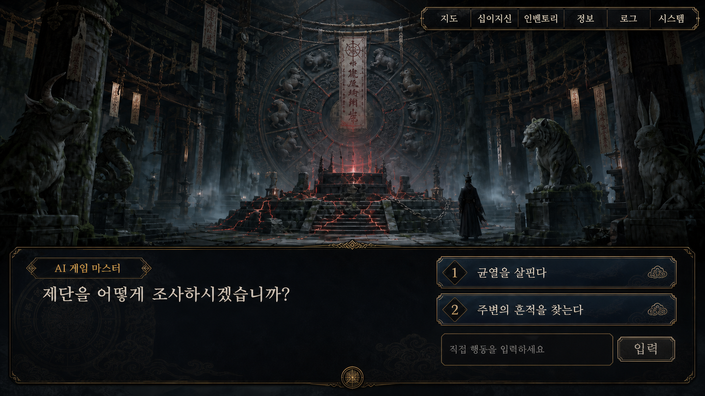

# 플레이 UI 기획서

## Metadata

- 프로젝트 ID: `chronicles-of-the-twelve-bonds`
- 문서 타입: ui
- 상태: confirmed
- 관련 문서: `workspace/projects/chronicles-of-the-twelve-bonds/design/technical/ai_gm_runtime_rules.md`
- 마지막 변경: 2026-07-16

## Summary

- PC용 `16:9`, `1920×1080`을 기준 화면으로 사용한다.
- 장면은 상단 일러스트와 하단 대화·선택 영역으로 구성한다.
- 여정 목적지는 별도의 지도 화면에서 노드로 선택한다.
- 로그와 성장·수집·저장 기능은 보조 메뉴로 분리한다.

## Details

### 화면 기준

- 기준 해상도: `1920×1080`
- 기준 화면비: `16:9`
- 다른 16:9 PC 해상도에서는 Unity UI 스케일링으로 동일한 정보 위계와 배치를 유지한다.
- 화면 상단 약 70%는 장면 일러스트, 하단 약 30%는 화자·본문·입력 영역을 기본값으로 한다.

### 장면 진행 화면

- 상단에 AI 게임 마스터가 지정한 `illustration_id`의 일러스트를 표시한다.
- 하단에 화자명, 장면 묘사 또는 대사와 `input_mode`에 맞는 상호작용 영역을 표시한다.
- 자연어 입력창은 필요한 장면에서만 자연스럽게 나타나며 별도의 안내 팝업은 사용하지 않는다.
- 선택지와 자연어 입력은 플레이어가 응답하기 전까지 확정되지 않는다.

### 장면 입력 모드

장면 진행 화면은 공통 레이아웃을 유지하고 `input_mode`에 따라 하단 상호작용 영역만 바꾼다.

| `input_mode` | 선택지 | 자연어 입력 | 진행 방식 |
|---|---:|---:|---|
| `narrative_only` | 없음 | 없음 | `계속` 버튼으로 등록된 고정 후속 결과 진행 |
| `choice_only` | 있음 | 없음 | 허용된 선택지 선택 |
| `text_only` | 없음 | 있음 | 자연어 입력 제출 |
| `choice_and_text` | 있음 | 있음 | 선택지 선택 또는 자연어 입력 제출 |

- `narrative_only`는 플레이어 행동을 대신 결정하는 모드가 아니라 묘사·대사를 확인한 뒤 고정된 다음 장면으로 넘어가는 모드다. 자동 진행하지 않고 `계속` 입력을 기다린다.
- `choice_only`는 일반 상태에서 화면 우측 하단에 선택지를 표시한다.
- `text_only`는 선택지 영역을 표시하지 않고 하단에 자연어 입력창과 제출 버튼을 넓게 표시한다.
- `choice_and_text`는 우측에 선택지를 표시하고 그 아래에 자연어 입력창을 구분해 표시한다.
- 장면 데이터 오류로 선택지가 0개가 된 `choice_only` 또는 `choice_and_text`를 `narrative_only`로 자동 대체하지 않는다. 검증 오류로 처리하고 이전 화면을 유지한다.

### 선택지 표시 방식

- 장면 데이터의 `choice_presentation`은 `standard` 또는 `emphasis`를 사용하며 누락 시 `standard`다.
- `standard`는 일반 선택으로, 기존처럼 장면 문맥 옆의 화면 우측 하단에 선택지를 표시한다.
- `emphasis`는 시나리오 저작 단계에서 중요한 분기로 표시한 `choice_only` 장면에만 사용한다. AI GM이 중요도를 임의로 바꾸지 못한다.
- `emphasis` 상태에서는 장면 일러스트를 어둡게 유지하고, 화면 중앙에 큰 제목·안내 문구·선택지 패널을 표시한다. 하단의 기존 묘사·대사는 맥락 확인용 영역으로 억제해 유지한다.
- 중요 선택은 기본 선택, 카운트다운, 자동 확정과 자연어 입력을 사용하지 않는다. 플레이어가 선택하기 전까지 상태를 변경하지 않는다.
- 중요 선택 안내 문구는 실제 결과를 과장하지 않으며, 되돌릴 수 없는 선택에만 해당 경고를 표시한다.

### 일러스트 표시 규칙

- AI는 등록된 `illustration_id`만 반환하고 Unity가 실제 에셋을 표시한다.
- 정확히 일치하는 인물 그림이 없으면 해당 캐릭터의 기본 일러스트를 사용한다.
- 화자가 없는 배경·상황 묘사에 맞는 그림이 없으면 현재 장소의 기본 일러스트를 사용한다.
- 장소 기본 일러스트를 표시할 때는 인물 일러스트를 표시하지 않는다.
- 공개 조건을 충족하지 않은 스포일러 일러스트는 선택 후보에 포함하지 않는다.

### 지도 화면

- 장면의 판정·보상·패널티 정산과 자동 저장이 끝나면 지도 화면으로 복귀한다.
- 한 화면에는 현재 추적 중인 사흉 장소 1개와 미완료 탐험 장소 최대 9개를 표시한다.
- 노드를 선택하면 장소명과 이상 현상 설명을 먼저 보여주고 이동 확인 후 장면에 진입한다.
- 노드가 사흉전인지 탐험·요괴 사건인지는 진입 전 직접 표시하지 않는다.
- 완료한 탐험 노드는 후보·보상 풀에서 제거한다. 사흉 노드는 조우할 때까지 유지한다.
- 지도에서 십이지신 편성·강화, 인벤토리와 기타 보조 메뉴에 접근한다.

### 로그 및 보조 메뉴

- `로그`: 묘사·대사, 선택·자연어 입력, 판정 결과, 획득·성장 기록을 확인한다.
- `십이지신`: 해금·강화 상태와 현재 편성을 확인하고 관리한다.
- `인벤토리`: 보상·패널티 아이템과 공개된 효과를 확인한다.
- `정보`: 수집한 십이지신 이야기와 공개된 고양이 서사를 확인한다.
- `시스템`: 자동 저장 1개, 수동 저장 3개, 불러오기와 설정을 제공한다.
- 숨겨진 카르마, 미공개 정보와 AI 내부 처리 내용은 표시하지 않는다.

### 오류 및 게임 오버 화면

- AI 응답 검증이 연속 실패하면 이전 화면을 유지하고 `다시 시도` 버튼을 표시한다.
- 형식 오류는 판정 실패, 패널티 또는 게임 오버로 취급하지 않는다.
- 게임 오버 화면에는 `최근 자동 저장 불러오기`, `수동 저장 선택`, `타이틀로 이동`을 표시한다.

### 상황별 예시 목업

- 목업은 화면 배치와 정보 위계 검토용이며 최종 아트·폰트·색상을 확정하지 않는다.
- 이후 확정 UI 예시를 추가하거나 교체할 때도 해당 상태 아래에 인라인으로 표시한다.

#### `narrative_only`

#### `choice_only` + `standard`

#### `text_only`

#### `choice_and_text`

#### `choice_only` + `emphasis`

## Gameplay / Production Notes

- 플레이어 경험: 고정 선택지만으로도 진행할 수 있고, 허용 장면에서는 자연어 역할극을 추가로 사용할 수 있다.
- 자원 흐름: 일러스트와 UI는 게임 상태를 표시하며 판정·보상 값을 직접 변경하지 않는다.
- 구현 고려: Unity가 응답 데이터와 등록 ID를 검증한 뒤 화면을 갱신한다.
- QA 고려: 해상도별 스케일링, 긴 한국어 문장, 선택지 개수 변화, 미등록 일러스트와 로그 복귀를 확인한다.

## Open Questions

- TBD: 월드맵의 형태, 지역 구성과 시각적 혼합 기준
- TBD: 실제 사용 폰트, 색상 토큰과 UI 안전 영역
- TBD: 로그 검색·필터와 세부 표시 형식
- TBD: 최초 자연어 입력 장면

## Sources

- `workspace/projects/chronicles-of-the-twelve-bonds/ideas/temporary_ideas.md`의 `IDEA-20260714-001`
- `workspace/projects/chronicles-of-the-twelve-bonds/design/assets/gameplay_ui_mockup_1920x1080_v1.png`
- `workspace/projects/chronicles-of-the-twelve-bonds/design/assets/gameplay_ui_state_narrative_only_v1.png`
- `workspace/projects/chronicles-of-the-twelve-bonds/design/assets/gameplay_ui_state_text_only_v1.png`
- `workspace/projects/chronicles-of-the-twelve-bonds/design/assets/gameplay_ui_state_choice_and_text_v1.png`
- `workspace/projects/chronicles-of-the-twelve-bonds/design/assets/gameplay_ui_state_important_choice_v1.png`
