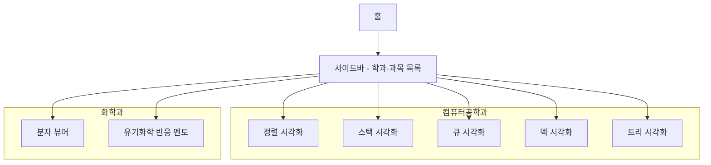
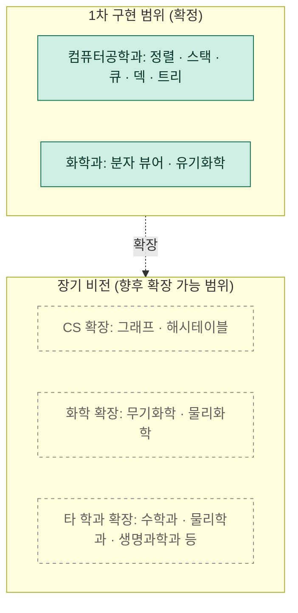

# 전공 시각화 학습 플랫폼 기획서

## 문제 정의

컴퓨터공학·화학 등 전공 수업을 듣는 대학생은, 교재의 정적인 텍스트와 그림만으로 자료구조·알고리즘·분자구조처럼 단계마다 상태가 순차적으로 변화하는 개념을 배울 때, 각 단계에서 값이 실제로 어떻게 바뀌는지 직접 확인할 수 없어 개념을 직관적으로 이해하고 오래 기억하기 어렵다.

## 사용자 시나리오

1. 학생이 강의 복습을 위해 플랫폼에 접속한다.
2. 사이드바에서 학습하려는 학과·과목(예: 컴퓨터공학과 – 정렬)을 선택한다.
3. 코드와 시각화가 동기화되어 재생되는 과정을 보며 알고리즘의 진행을 관찰한다. *(핵심 기능 A)*
4. 이해가 안 되는 구간은 한 단계씩 재생하거나 처음부터 다시 돌려본다.
5. 스택·큐·덱 같은 과목에서는 값을 직접 입력하고 Push/Pop 등을 조작하며 결과를 확인한다. *(핵심 기능 B)*
6. 특정 단계에서 궁금한 점이 생기면 화면 하단 AI Q&A 창에 바로 질문한다 — AI는 지금 멈춰있는 정확한 단계(예: 어떤 값을 비교 중인지)를 알고 답한다.

## 핵심 기능 (2개)

전공을 막론하고 학습 개념은 크게 두 갈래로 나뉜다 — **지켜봐야 이해되는 개념**(값이 정해진 규칙에 따라 순차적으로 변화하는 절차형 지식: 알고리즘, 화학 반응 메커니즘 등)과 **직접 조작해야 감이 오는 개념**(파라미터를 바꿔가며 결과 변화를 직접 겪어야 직관이 쌓이는 지식: 자료구조 연산, 분자 조립 등). 두 핵심 기능은 이 두 갈래에 각각 대응하는 재사용 가능한 엔진이다.

- **기능 A. 코드-시각화 동기화 재생** — *지켜봐야 이해되는 개념용*
  정해진 규칙에 따라 상태가 한 단계씩 바뀌는 절차를 자동 재생하며, 코드(또는 반응식) 하이라이트와 시각화를 동기화한다. 재생/한 단계/처음부터/속도 조절이라는 동일한 컨트롤 위에서, 어떤 절차형 개념이든(정렬 알고리즘이든 화학 반응 메커니즘이든) 같은 방식으로 "왜 이 상태가 됐는지"를 눈으로 따라갈 수 있다.

- **기능 B. 사용자 조작형 인터랙티브 시뮬레이터** — *직접 조작해야 감이 오는 개념용*
  사용자가 값을 입력하고 직접 조작해서 결과를 즉시 확인하며 체득한다. 정답이 하나로 정해진 절차를 지켜보는 게 아니라, 조작 가능한 대상(자료구조, 분자 등)을 자유롭게 건드려보며 규칙을 스스로 발견하는 방식이다.

두 엔진 모두 특정 학과의 지식이 아니라 **개념의 성격(절차형 vs 조작형)**에 반응하도록 설계되어, 컴퓨터공학·화학뿐 아니라 같은 성격의 개념을 가진 다른 전공으로도 그대로 확장 가능하다.

## 차별화 기능: 화면 상태를 정확히 아는 AI Q&A

시각화 학습 도구 자체는 이미 여러 경쟁 서비스가 제공하는 기술이다. 이 프로젝트의 차별점은 "시각화가 있다"가 아니라, **기능 A가 만들어내는 촘촘한 판단 과정 설명을 그대로 재활용해, 지금 화면에 정확히 무엇이 일어나고 있는지 아는 AI에게 바로 물어볼 수 있다**는 것이다.

- 기능 A는 매 단계마다 "왜 이 상태가 됐는지"를 자연어로 설명하는 문장을 이미 만들어낸다(예: 트리 삽입 중 "40과(와) 30을(를) 비교합니다 — 40 ≥ 30이므로 오른쪽으로 이동"). 이 설명은 원래 학습자에게 보여주려고 만든 것이지만, 그대로 AI에게 "지금 이 상황"을 알려주는 컨텍스트로 재사용할 수 있다.
- 그 결과 사용자가 특정 단계에서 멈춰서 "왜 오른쪽으로 가야 해?"라고 물으면, AI는 일반적인 설명이 아니라 **그 순간의 정확한 비교값과 판단 근거**를 바탕으로 답한다 — 범용 챗봇이 흉내낼 수 없는 지점이다.
- Gemini API 키는 클라이언트에 절대 노출하지 않고 **Express 백엔드**가 대신 호출한다. 이 기능은 API 장애 시에도 안내 문구만 표시될 뿐, 시각화 자체(핵심 기능 A/B)는 100% 독립적으로 정상 동작하도록 설계한다 — 핵심 기능의 안정성을 해치지 않으면서 차별점을 더하는 구조다.
- (확장 예정) 로그인하면 Q&A 기록이 서버 DB에 저장되어, 다른 기기에서 이어서 공부할 때도 이전 질문·답변을 그대로 이어볼 수 있다.

## 화면 흐름 (실제 구현 범위)

## 화면 구조 (와이어프레임)

### 전체 레이아웃
사이드바에서 학과/과목을 선택하면 콘텐츠 영역에 해당 시각화 화면이 나타나는 구조.

### 화면 템플릿 A — 자동재생형 (정렬 · 트리)
코드 하이라이트와 시각화가 동기화되어 자동으로 진행되는 화면. 재생/한 단계/처음부터/속도 조절 컨트롤을 공용으로 사용한다.

### 화면 템플릿 B — 사용자 조작형 (스택 · 큐 · 덱)
사용자가 값을 입력하고 Push/Pop 등을 직접 실행해 결과를 즉시 확인하는 화면.

## 프로토타입

위 와이어프레임을 바탕으로 순수 HTML/CSS로 만든 정적 프로토타입입니다. 저장소를 내려받아 아래 파일을 브라우저로 직접 열면 확인할 수 있습니다.

- [프로토타입 실행하기](./prototype/index.html) — 전체 레이아웃(홈)에서 시작해 정렬(템플릿 A) · 스택(템플릿 B) 화면으로 이동해볼 수 있습니다.

## 장기 비전 vs 구현 범위

이번 프로젝트는 전공별 시각화 학습 생태계라는 최종 비전 중, 재사용 가능한 두 템플릿(기능 A/B)을 먼저 검증하는 1차 단계로 컴퓨터공학과·화학과 범위에 한정해 구현한다. 아래는 확정 구현 범위와 향후 확장 가능 범위를 구분한 다이어그램이다.

### 적용 가능한 지식의 범위

두 핵심 기능은 만능이 아니다. **규칙이 명확하고 상태가 결정론적으로 변화하는 절차형·조작형 지식**(알고리즘, 화학 반응, 물리 시뮬레이션, 수학적 증명 과정 등)에 최적화되어 있으며, 역사·문학·법학·예술비평처럼 **해석과 논증이 중심인 지식**에는 이 두 템플릿이 그대로 적용되지 않는다. 이번 프로젝트가 컴퓨터공학과·화학과를 1차 범위로 택한 것은 우연이 아니라, 두 템플릿의 스윗스팟에 해당하는 전공이기 때문이며, 향후 확장도 이 카테고리 안에서 우선적으로 이뤄질 것이다.

