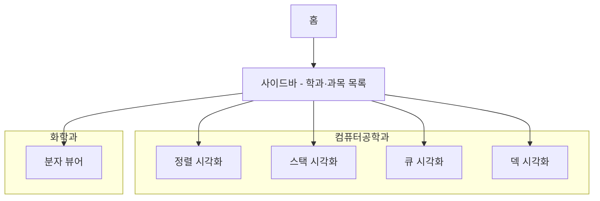
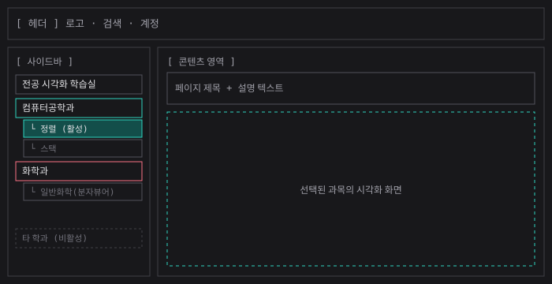
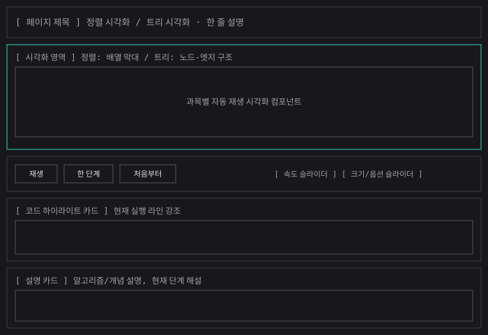
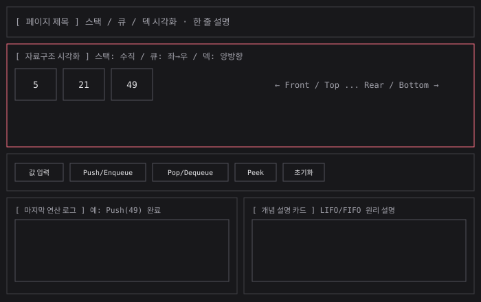
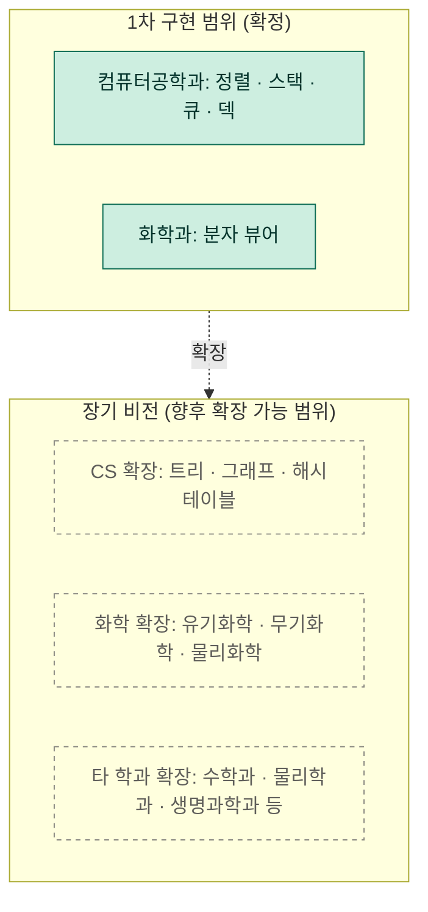

# 전공 시각화 학습 플랫폼 기획서

## 문제 정의

컴퓨터공학·화학 등 전공 수업을 듣는 대학생은, 교재의 정적인 텍스트와 그림만으로 자료구조·알고리즘·분자구조처럼 단계마다 상태가 순차적으로 변화하는 개념을 배울 때, 각 단계에서 값이 실제로 어떻게 바뀌는지 직접 확인할 수 없어 개념을 직관적으로 이해하고 오래 기억하기 어렵다.

## 사용자 시나리오

1. 학생이 강의 복습을 위해 플랫폼에 접속한다.
2. 사이드바에서 학습하려는 학과·과목(예: 컴퓨터공학과 – 정렬)을 선택한다.
3. 코드와 시각화가 동기화되어 재생되는 과정을 보며 알고리즘의 진행을 관찰한다. *(핵심 기능 A)*
4. 이해가 안 되는 구간은 한 단계씩 재생하거나 처음부터 다시 돌려본다.
5. 스택·큐·덱 같은 과목에서는 값을 직접 입력하고 Push/Pop 등을 조작하며 결과를 확인한다. *(핵심 기능 B)*

## 핵심 기능 (2개)

- **기능 A. 코드-시각화 동기화 재생**
  알고리즘이 한 줄씩 실행될 때 코드 하이라이트와 시각화가 함께 움직여, 코드만으로는 이해되지 않던 과정을 눈으로 따라가며 이해할 수 있도록 한다.

- **기능 B. 사용자 조작형 인터랙티브 시뮬레이터**
  사용자가 값을 입력하고 직접 조작(Push/Pop, 분자 조립 등)해서 결과를 즉시 확인하며 체득하도록 한다.

## 화면 흐름 (실제 구현 범위)

## 화면 구조 (와이어프레임)

### 전체 레이아웃
사이드바에서 학과/과목을 선택하면 콘텐츠 영역에 해당 시각화 화면이 나타나는 구조.

### 화면 템플릿 A — 자동재생형 (정렬 · 트리)
코드 하이라이트와 시각화가 동기화되어 자동으로 진행되는 화면. 재생/한 단계/처음부터/속도 조절 컨트롤을 공용으로 사용한다.

### 화면 템플릿 B — 사용자 조작형 (스택 · 큐 · 덱)
사용자가 값을 입력하고 Push/Pop 등을 직접 실행해 결과를 즉시 확인하는 화면.

## 장기 비전 vs 구현 범위

이번 프로젝트는 전공별 시각화 학습 생태계라는 최종 비전 중, 재사용 가능한 두 템플릿(기능 A/B)을 먼저 검증하는 1차 단계로 컴퓨터공학과·화학과 범위에 한정해 구현한다. 아래는 확정 구현 범위와 향후 확장 가능 범위를 구분한 다이어그램이다.

