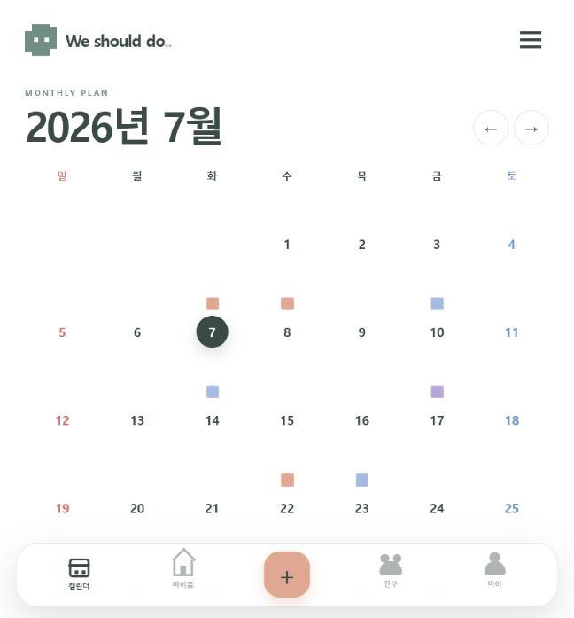
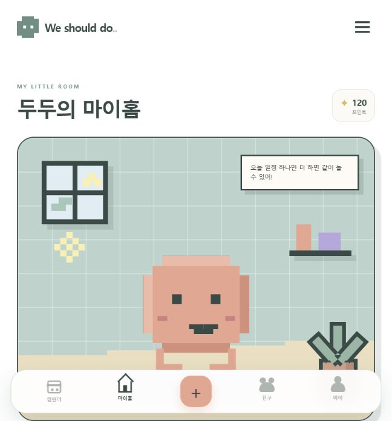
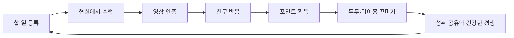
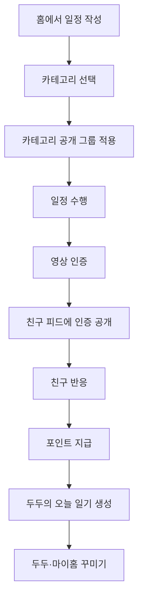

# We should do.. 서비스 기획서

- 문서 상태: 제출본
- 작성일: 2026-07-06
- 최종 수정일: 2026-07-08
- 서비스명: **We should do..**
- 캐릭터명: **두두(DODO)**

---

## 프로토타입 결과

- [프로토타입 실행 방법 확인하기](./README.md#실행-방법)
- [프로토타입 핵심 코드 확인하기](./src/components/Scheduler.tsx)

아래 화면 이미지를 통해 구현된 프로토타입 결과를 기획서에서 바로 확인할 수 있다. 실제 상호작용은 실행 방법에 따라 프로젝트를 실행한 뒤 확인한다.

### 캘린더 화면

### 두두 마이홈 화면

### 현재 구현된 범위

- 월간 캘린더와 날짜별 통합 일정 목록
- 카테고리별 일정 생성 및 친구 그룹 공개 설정
- 일정 이름·시간 수정과 삭제
- 체크박스를 이용한 완료·미완료 처리
- 두두 마이홈, 친구와 마이페이지 탭
- 도트 그래픽 기반 반응형 UI

---

## 1. 서비스 개요

### 1.1 한 줄 소개

> 친구와 할 일을 공유하고, 완료 보상으로 두두와 마이룸을 꾸미며 미루던 일까지 해내게 만드는 소셜 할 일 앱

### 1.2 서비스가 해결하려는 문제

할 일을 해야 한다는 것은 알고 있지만, 즉각적인 보상과 동기가 부족해 일을 미루게 된다. 기존 할 일 앱은 기록과 관리에 집중되어 있어 사용자가 행동을 완료하도록 만드는 지속적인 동기가 부족하다.

`We should do..`는 할 일 완료에 친구의 반응, 포인트, 두두와 마이룸의 변화를 연결한다. 현실에서 수행한 행동이 앱 안의 성장과 자기표현으로 즉시 보이도록 하여 사용자가 하기 싫은 일도 기꺼이 시작하게 만든다.

### 1.3 사용자 시나리오

지수는 미뤄 두었던 운동을 홈 캘린더에 등록하고 `운동` 카테고리를 선택한다. 운동 카테고리는 절친 그룹에 공개되어 친구들이 진행 상황을 확인할 수 있다. 운동을 마치고 영상을 인증하면 포인트와 친구 반응을 받고, 두두의 일기와 마이홈 변화로 성취를 확인한다. 친구 피드에서 서로의 인증과 두두를 구경하는 경험은 다음 할 일을 시작하는 동기가 된다.

### 1.4 핵심 기능

#### 할 일 기록과 공유

- 사용자가 할 일과 일정을 기록한다.
- 공부, 운동, 약속, 개인 등 사용자가 만든 카테고리로 분류한다.
- 카테고리별로 절친, 스터디, 가족, 커플 등 공개할 친구 그룹을 설정한다.
- 친구들은 공개된 할 일의 진행 상황과 완료 인증을 확인할 수 있다.

#### 완료 인증과 소셜 보상

- 할 일을 완료하고 짧은 영상으로 인증한다.
- 완료 보상으로 기본 포인트를 획득한다.
- 친구의 응원과 반응을 받으면 추가 포인트를 획득한다.
- 완료한 활동은 두두가 하루 일기로 정리한다.

#### 두두와 마이룸

- 포인트로 두두의 외형, 표정과 행동을 꾸민다.
- 가구, 벽지, 소품을 구매해 마이룸을 꾸민다.
- 두두를 쓰다듬거나 간식을 주는 돌보기 경험을 제공한다.
- 마이룸은 다른 사용자에게 공개할 수 있다.

#### 친구 방문과 건강한 경쟁

- 친구의 두두와 마이룸을 방문한다.
- 친구의 성취와 꾸미기 결과를 확인하고 반응을 보낸다.
- 주간 완료 기록과 꾸미기 결과를 비교하며 자연스러운 경쟁 동기를 만든다.
- 순위가 낮은 사용자를 압박하기보다 연속 달성, 성장량과 개인 기록을 함께 보여준다.

### 1.5 핵심 보상 순환

### 1.6 이름의 의미

공식 서비스 표기는 대소문자와 마침표를 포함한 `We should do..`로 사용한다. 이름은 “우리 다음에는 무엇을 할까?”라는 여운을 담으며, 앱 안에서는 다음과 같이 확장해 사용할 수 있다.

- We should study..
- We should meet..
- We should exercise..
- We should travel..
- We should rest..

### 1.7 브랜드 및 디자인 시스템

#### 한글 카피

고정된 한글 부제는 사용하지 않는다. 서비스 소개와 캠페인에서는 `미루던 일을, 두두와 함께`를 대표 카피로 사용한다.

#### 로고와 앱 아이콘

- 공식 로고는 캘린더 화면 좌측 상단의 도트 두두 심볼과 `We should do..` 워드마크 조합을 사용한다.
- 앱 아이콘과 파비콘은 워드마크 없이 도트 두두 심볼만 사용한다.
- 전체 로고는 워드마크의 가독성을 유지하기 위해 깔끔한 산세리프 형태를 사용한다.
- 로고 심볼은 어두운 단색 몸체 위에 흰 눈을 사용할 수 있으며, 앱 속 두두는 검은 점눈을 기본으로 한다.

#### 컬러 시스템

| 역할 | 색상 | HEX |
|---|---|---|
| 대표색 | 딥 세이지 | `#40514C` |
| 보조색 | 파스텔 민트 | `#9FC2B4` |
| 기본 배경 | 웜 크림 | `#FFF9F2` |
| 강조색 | 소프트 코랄 | `#F2A58D` |
| 카테고리 색상 | 파스텔 블루 | `#A9C8EC` |
| 카테고리 색상 | 라벤더 | `#C7B7E7` |
| 보상 색상 | 버터 옐로 | `#F3D78A` |
| 본문 글자 | 차콜 그린 | `#34433F` |

대표색과 본문색은 정보 전달에 사용하고, 파스텔 민트·코랄·블루·라벤더는 카테고리와 두두 배리에이션에 사용한다.

#### 폰트와 UI 스타일

- 제목, 버튼과 주요 숫자: `Galmuri11`
- 작은 영문 라벨과 시간: `GalmuriMono11`
- 긴 본문과 설명: `Pretendard`
- 4px 단위의 픽셀 그리드를 사용한다.
- 아이콘은 16px 또는 24px 크기의 도트 스타일로 제작한다.
- 그림자는 흐린 효과보다 `4px 4px` 블록 형태로 표현한다.
- 둥근 카드에 계단형 도트 모서리와 장식을 조합한다.
- 배경과 카테고리는 그라데이션보다 단색 파스텔 면을 우선 사용한다.
- 두두의 움직임은 2~4프레임의 짧은 도트 애니메이션으로 표현한다.

---

## 2. 목표 사용자

### 2.1 핵심 타깃

- 연령대: 20대
- 스마트폰으로 일정과 일상을 자주 공유하는 사용자
- 혼자 계획할 때보다 다른 사람과 함께할 때 동기부여를 얻는 사용자
- 귀여운 캐릭터, 꾸미기, 수집 요소를 좋아하는 사용자

### 2.2 주요 관계

| 관계 | 대표 사용 사례 |
|---|---|
| 친구 | 약속 공유, 운동·생활 습관 인증, 하고 싶은 일 정하기 |
| 커플 | 데이트 일정, 버킷리스트, 서로의 일상 응원 |
| 스터디 | 공부 일정, 집중 시간, 과제 및 시험 준비 인증 |
| 가족 | 가족 행사, 집안일, 병원 및 생활 일정 공유 |

### 2.3 핵심 페르소나 예시

**지수, 24세 대학생**

- 과제와 시험 일정을 캘린더에 기록하지만 자주 미룬다.
- 친구들과 공부 인증방을 운영한 경험이 있다.
- 공부를 마치고 친구에게 반응을 받으면 성취감을 느낀다.
- 캐릭터와 방 꾸미기를 좋아하지만 복잡한 게임에는 부담을 느낀다.

---

## 3. 제품 원칙

1. 일정과 할 일 관리가 항상 중심이어야 한다.
2. 게임 요소는 사용자의 현실 활동을 방해하지 않고 보상해야 한다.
3. 비교와 경쟁은 압박이 아니라 응원, 성장과 자기표현을 강화하는 방식으로 설계한다.
4. 개인 일정은 사용자가 원하는 범위에만 공개한다.
5. 짧고 부담 없는 영상 인증으로 실제 행동과 기록을 연결한다.
6. 꾸미기 아이템보다 현실의 성취가 더 가치 있게 느껴져야 한다.

---

## 4. 핵심 서비스 흐름

---

## 5. 정보 구조

| 탭 | 주요 역할 |
|---|---|
| 홈 | 캘린더 기반 개인 일정·할 일 등록, 카테고리 선택 및 공개 범위 확인 |
| 두두 | 두두 상태와 오늘 일기, 캐릭터 커스터마이징 및 마이홈 꾸미기 |
| 친구 | 친구들의 영상 인증을 피드로 확인하고 눈빛 반응과 댓글 남기기 |
| 마이페이지 | 프로필, 친구·그룹 관리, 포인트, 알림 및 개인정보 설정 |

---

## 6. 핵심 기능

### 6.1 개인 일정과 할 일

모든 일정은 개인 일정으로 생성하며, 사용자가 선택한 카테고리의 공개 설정에 따라 친구 그룹에 공유된다. 필요하면 일정별로 공개 범위를 예외 설정할 수 있다.

#### 일정 입력 항목

- 제목
- 날짜 및 시간
- 종일 일정 여부
- 장소
- 메모
- 반복 여부
- 알림 시간
- 카테고리
- 공개 범위 예외 설정
- 영상 인증 필요 여부
- 일정과 연결된 세부 할 일

#### 공개 범위

- 새 카테고리는 기본적으로 `나만 보기`로 생성한다.
- 사용자는 카테고리별로 절친, 스터디, 가족, 커플 등 공개할 그룹을 설정한다.
- 해당 카테고리에 등록한 일정은 카테고리의 공개 설정을 자동으로 따른다.
- 민감한 일정은 일정별 예외 설정으로 `나만 보기` 또는 별도의 친구 그룹을 선택할 수 있다.

### 6.2 영상 인증

사용자는 일정이나 할 일을 완료한 뒤 앱에서 5초 이상 30초 이하의 짧은 영상을 직접 촬영해 인증한다.

#### 권장 인증 흐름

1. 일정 또는 할 일에서 `완료 인증` 선택
2. 짧은 영상 촬영
3. 한 줄 설명과 공개 범위 확인
4. 인증 게시
5. 기본 포인트 지급
6. 친구 반응에 따라 보너스 포인트 지급
7. 두두의 일기 생성

#### 기획 방향

- 5초 이상 30초 이하로 제한해 짧고 가볍게 인증할 수 있도록 한다.
- 공개 전 미리보기와 공개 범위 확인 단계를 제공한다.
- 얼굴이나 주변 환경이 노출될 수 있으므로 삭제, 신고, 차단 기능을 제공한다.
- 사용자는 게시한 영상을 언제든 삭제할 수 있으며, 삭제한 인증은 친구 피드에서 즉시 숨긴다.

### 6.3 친구 반응과 보너스

일반적인 좋아요 대신 두두의 눈 모양을 활용한 `눈빛 반응`을 사용한다.

| 반응 | 의미 |
|---|---|
| 반짝이는 눈 | 멋져 |
| 하트 눈 | 좋아 |
| 불타는 눈 | 열심히 했네 |
| 눈물 눈 | 고생했어 |
| 놀란 눈 | 대단해 |
| 졸린 눈 | 나도 쉬고 싶다 |

#### 보너스 정책

- 인증 완료 기본 보상: 10포인트
- 첫 친구 반응: 3포인트
- 서로 다른 친구 3명의 반응: 추가 5포인트
- 댓글이 포함된 반응: 추가 2포인트
- 인증 한 건의 반응 보너스 상한: 15포인트
- 동일 사용자 간 반복 반응 악용 방지 정책 적용

정확한 지급량은 사용자 행동 데이터를 확인하면서 조정한다.

### 6.4 두두의 오늘 일기

영상 인증을 완료하면 캐릭터 두두가 사용자의 그날 활동을 일기로 정리한다. 이 기능은 `We should do..`의 감성적 핵심 경험으로 사용한다.

#### 대표 문구

> “오늘 주인은 40분 동안 운동했다. 나는 소파에서 응원했다.”

#### 일기 구성

- 날짜
- 오늘 완료한 일정 및 할 일
- 활동 시간 또는 횟수
- 대표 영상 썸네일
- 받은 친구 반응
- 획득 포인트
- 두두의 한 줄 감상
- 오늘의 두두 표정 또는 행동

#### 문구 예시

- “오늘 주인은 도서관에서 두 시간을 공부했다. 나는 책상 밑에서 조용히 졸았다.”
- “오늘 주인은 친구를 만났다. 나는 따라가고 싶어서 현관 앞에서 기다렸다.”
- “오늘 주인은 계획한 일을 모두 끝냈다. 나도 괜히 뿌듯해서 춤을 췄다.”
- “오늘 주인은 아주 바빴다. 그래도 물을 잘 마셨다. 내가 다 봤다.”
- “오늘은 완료한 일이 없다. 괜찮다. 우리는 내일 다시 해보면 된다.”

두두의 말투는 귀엽고 장난스럽되 사용자를 비난하거나 죄책감을 주지 않도록 한다.

#### 생성 방식

두두의 일기는 기본 템플릿에 활동 종류, 시간, 장소와 완료 결과를 조합하는 혼합형으로 생성한다. 정해진 문장 구조를 사용해 안전성을 확보하면서 활동 정보에 따라 짧은 표현 변화를 제공한다.

### 6.5 포인트

#### 획득 방법

- 일정 또는 할 일 완료
- 영상 인증
- 친구의 눈빛 반응 및 댓글
- 연속 활동
- 공동 목표 달성
- 기간 한정 이벤트 참여

#### 사용처

- 두두의 몸 색상과 무늬
- 눈동자, 눈꺼풀 및 표정
- 의상과 액세서리
- 두두의 모션
- 마이홈 가구
- 벽지, 바닥, 조명
- 창문 밖 풍경
- 시즌 한정 장식

포인트는 경쟁 우위를 구매하는 재화가 아니라 자기표현과 공간 꾸미기를 위한 재화로 사용한다.

---

## 7. 캐릭터 두두(DODO)

### 7.1 기본 콘셉트

- 저해상도 도트 그래픽으로 표현하는 몬스터 캐릭터
- 모서리가 픽셀 단위로 둥근 직사각형 실루엣
- 기본형은 2~4px 크기의 검은 점눈 두 개를 사용
- 커스터마이징 배리에이션으로 외눈 또는 눈 두 개를 제공
- 파스텔 색상의 단순하고 말랑한 몸체
- 몸통과 같은 색을 사용하는 굵은 선형 다리
- 더듬이 없이 실루엣과 점눈, 움직임으로 감정을 표현
- 색상, 무늬, 눈 형태, 의상과 장식에 따라 다양한 외형 제공

특정 브랜드 캐릭터와 혼동되지 않도록 실루엣, 눈의 구조, 색상 체계, 움직임 및 세계관을 독자적으로 설계한다.

### 7.2 세계관과 캐릭터 설정

두두는 “해야 하는데 하기 싫다”는 사용자의 미루는 마음이 뭉쳐 태어난 작은 몬스터다. 사용자가 할 일을 완료할 때마다 미루는 마음을 포인트와 성장 에너지로 바꾼다. 일을 끝내지 못한 날에도 사용자를 혼내거나 죄책감을 주지 않고, 옆에서 다음 시도를 기다린다.

두두 이외의 별도 캐릭터는 추가하지 않는다. 친구마다 보이는 캐릭터도 모두 같은 두두 종이며 색상, 눈, 의상과 마이홈으로 각자의 개성을 표현한다.

### 7.3 상황별 행동

| 사용자 상태 | 두두의 행동 |
|---|---|
| 예정된 할 일이 없음 | 마이홈에서 뒹굴기 |
| 할 일 시작 전 | 사용자를 바라보며 기다리기 |
| 마감 시간이 가까움 | 초조하게 주변을 살피기 |
| 영상 인증 완료 | 카메라를 들거나 박수치기 |
| 친구 반응 도착 | 눈이 반짝이거나 하트 모양으로 변하기 |
| 오늘 목표 모두 완료 | 춤추기 |
| 완료하지 못한 날 | 옆에 조용히 앉아 내일을 기다리기 |

### 7.4 커스터마이징 범위

- 몸 색상
- 몸 무늬
- 눈동자 형태와 색상
- 눈꺼풀 및 속눈썹
- 모자
- 안경
- 의상
- 소형 액세서리
- 감정 표현
- 대기 및 축하 모션

---

## 8. 놀이 콘텐츠

게임 요소는 별도의 긴 플레이보다 사용자의 현실 활동과 자연스럽게 연결되도록 설계한다.

### 8.1 마이홈 생활

두두가 사용자의 활동에 따라 집 안에서 다른 행동을 한다.

- 공부 완료: 책상에서 책 읽기
- 운동 완료: 운동기구 사용하기
- 요리 완료: 주방에서 요리하기
- 휴식 완료: 침대에서 자기
- 친구 약속 완료: 친구 두두가 집에 방문하기

가구는 수치 능력치보다 새로운 행동과 애니메이션을 여는 역할을 한다.

### 8.2 친구 두두 방문

친구가 일정에 반응하거나 영상을 확인하면 친구의 두두가 마이홈에 방문할 수 있다.

- 간식 놓고 가기
- 응원 메시지 남기기
- 함께 사진 찍기
- 가구 사용하기
- 짧은 캐릭터 상호작용

### 8.3 일정 추억 장면

친구들과 연결된 일정을 완료하면 참여자의 두두로 단체 장면을 자동 생성한다.

- 카페에서 이야기하는 장면
- 영화관에 모인 장면
- 시험이 끝나 함께 쓰러진 장면
- 여행지에서 사진을 찍는 장면
- 생일 파티 장면

사용자는 실제 인증 영상을 공개하지 않고 캐릭터 장면만 공유할 수도 있다.

### 8.4 위시 리스트 룰렛

친구들과 하고 싶은 일을 등록하고 두두가 다음 활동을 무작위로 정한다. 결과는 개인 일정으로 등록한 뒤 친구에게 공개하거나 초대할 수 있다.

### 8.5 집중 동행

친구와 같은 시간에 집중 타이머를 시작하면 각자의 두두가 같은 가상 공간에 앉는다. 집중 시간이 끝나면 결과를 인증하고 함께 완료한 경우 보너스를 받는다.

### 8.6 공동 홈

커플, 친구, 스터디, 가족 그룹이 함께 꾸미는 공간이다.

- 커플: 둘만의 방 또는 작은 섬
- 친구: 아지트
- 스터디: 도서관 또는 연구실
- 가족: 공동 정원

구성원들이 일정을 완료하면 공동 게이지가 채워지고 새로운 가구와 공간이 열린다.

---

## 9. 기능 도입 순서

### 9.1 초기 핵심 경험

- 개인 일정과 카테고리
- 카테고리별 공개 그룹
- 영상 완료 인증
- 친구 반응과 포인트
- 두두의 오늘 일기
- 두두·마이홈 기본 꾸미기

### 9.2 두 번째 단계

- 회원가입과 프로필 고도화
- 친구 및 그룹 관리
- 댓글과 푸시 알림
- 친구 두두 방문
- 일정 추억 장면
- 위시 리스트 룰렛
- 집중 동행
- 고급 마이홈 꾸미기

### 9.3 장기 확장

- 공동 홈
- 공동 목표와 그룹 보상
- 시즌 이벤트
- 두두 모션 및 상호작용 확장
- 일기 모아보기와 추억 앨범

---

## 10. 주요 화면

### 10.1 홈

- 월간 캘린더
- 개인 일정 표시
- 일정과 할 일 등록
- 카테고리 선택
- 카테고리별 공개 그룹 확인
- 일정 등록 및 수정

### 10.2 두두

- 두두의 현재 상태와 행동
- 두두의 오늘 일기
- 두두 커스터마이징
- 마이홈 가구 배치
- 보유 아이템과 포인트
- 친구 방문 기록

### 10.3 친구

- 친구가 공개한 영상 인증 피드
- 눈빛 반응
- 댓글
- 공개 범위 표시
- 신고 및 숨기기

### 10.4 마이페이지

- 프로필과 달성 기록
- 친구 및 그룹 관리
- 포인트 내역
- 공개 범위와 개인정보 설정
- 알림 설정

---

## 11. 알림 원칙

### 필수 알림

- 일정 시작 전
- 할 일 마감 전
- 친구가 내 일정에 반응했을 때
- 친구가 댓글을 남겼을 때
- 친구 공개 일정에 초대됐을 때
- 두두의 일기가 완성됐을 때

### 운영 원칙

- 친구 활동 알림을 묶어서 받을 수 있어야 한다.
- 야간 방해 금지 시간을 제공한다.
- 모든 알림은 종류별로 켜고 끌 수 있어야 한다.
- 불안감이나 죄책감을 유발하는 재촉 문구를 사용하지 않는다.

---

## 12. 개인정보 및 안전

- 일정 기본값은 `나만 보기`로 한다.
- 인증 영상마다 공개 대상을 확인할 수 있어야 한다.
- 사용자는 영상과 일기를 언제든 삭제할 수 있어야 한다.
- 친구 차단, 신고, 댓글 제한 기능을 제공한다.
- 정확한 위치 정보는 기본적으로 공개하지 않는다.
- 영상 저장 기간과 원본 보관 정책을 명시한다.
- 탈퇴 시 일정, 영상, 일기, 캐릭터 데이터의 삭제 정책을 제공한다.
- 친구 인증 영상은 앱 안에서만 볼 수 있으며 외부 저장과 공유를 허용하지 않는다.

---

## 13. 수익 모델

일정, 할 일, 친구 공개, 기본 인증 등 핵심 생산성 기능은 무료로 제공한다.

### 꾸미기 아이템 판매

- 두두 의상 및 액세서리
- 눈동자와 표정 세트
- 특별 모션
- 마이홈 테마와 가구
- 시즌 한정 꾸미기 패키지
- 일정 추억 장면 프레임
- 프리미엄 일기 테마

### 확장 구독

- 추가 마이홈 저장 슬롯
- 고급 일정 통계
- 일기 및 추억 앨범 확장
- 프리미엄 두두 문장과 음성
- 광고 제거

현금 결제가 일정 관리 능력이나 포인트 보상에 직접적인 우위를 주지 않도록 한다.

---

## 14. 성공 지표

### 활성화

- 가입 후 첫 일정을 등록한 사용자 비율
- 가입 후 첫 친구를 추가한 사용자 비율
- 가입 후 첫 영상 인증을 완료한 사용자 비율

### 참여

- 주간 일정 및 할 일 완료 수
- 영상 인증 전환율
- 인증당 친구 반응 수
- 일기 확인률
- 포인트 사용률
- 두두 및 마이홈 재꾸미기 비율

### 유지

- 1일, 7일, 30일 재방문율
- 친구 관계가 있는 사용자와 없는 사용자의 유지율 차이
- 주간 연속 활동 사용자 비율

핵심 지표는 `친구 반응을 받은 주간 영상 인증 완료 수`로 설정한다.

---

## 15. 핵심 경험 요약

`We should do..`의 중심은 단순히 할 일을 완료하는 것이 아니다. 사용자가 현실에서 무언가를 해내고, 그것을 짧은 영상으로 남기고, 친구의 눈빛 반응을 받은 뒤, 두두가 그날을 기억해 주는 경험이다.

> “오늘 주인은 40분 동안 운동했다. 나는 소파에서 응원했다.”

이 한 문장이 일정 관리, 친구 관계, 캐릭터 애착과 하루의 기록을 연결하는 서비스의 핵심 감성이 된다.
